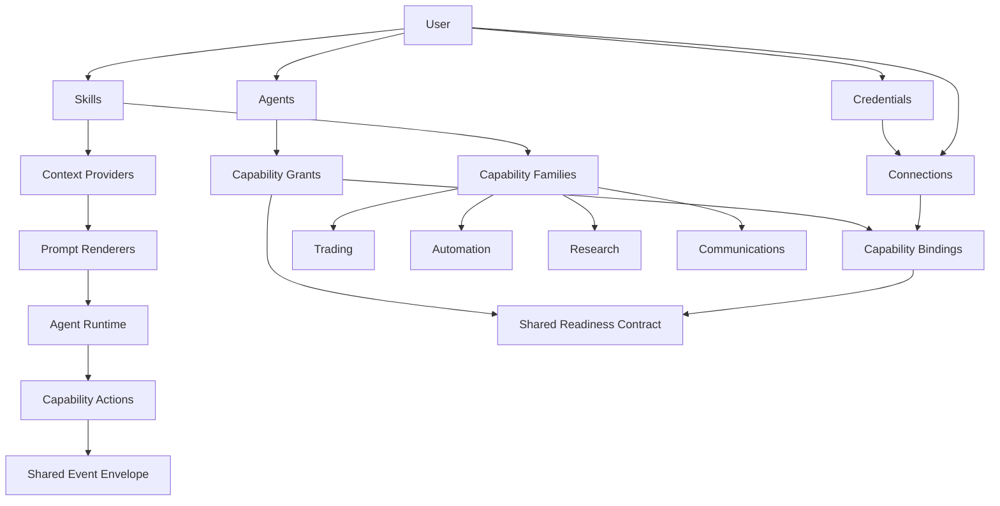
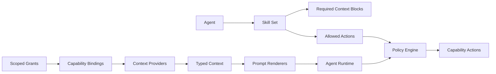

# Capability Platform API Architecture

**Date:** 2026-06-07

**Depends on:**

- [Capability API Redesign Q&A](./002-capability-api-redesign-q-and-a.md)
- [Vision](../../../vision.md)

## Goal

Define the target API and runtime architecture for OpenAIdom as an agent-first platform whose capabilities are extended by skills.

The architecture must make it easy to:

- add new capability families without reshaping the whole platform
- keep the public product surface agent-first rather than trading-first
- preserve strong operational semantics inside each capability family
- reuse credentials, connections, grants, readiness, and eventing across all capabilities

## Non-goals

- Backward compatibility with the current trading-first route model

This project is not yet live. The redesign may be a hard cut.

## Product Position

OpenAIdom is first an agentic platform. Skills give agents capability. Trading is the first deep capability family, not the permanent shape of the entire product.

This architecture therefore separates:

- platform resources that exist for all agents
- capability families that add specialized execution models
- provider-specific setup and bindings that support those capability families

## Design Principles

1. Agents are the primary product surface and the primary execution actor.
2. Skills are the explicit gateway to capability families.
3. Credentials and connections are platform resources, not capability-specific one-offs.
4. Capability families own their operational semantics, but not core platform primitives.
5. Public UX should be agent-first. Infrastructure nouns are available but not dominant.
6. Prompt wording may be provider-specific when useful; internal contracts should remain structurally normalized.
7. No backward-compatibility scaffolding is required for the redesign.

## Architecture Overview



## Layer Model

### Layer 1: Platform Core

These resources exist regardless of capability family:

- `agents`
- `skills`
- `credentials`
- `connections`
- `grants`
- `events`
- `billing`
- `admin`

### Layer 2: Capability Families

These add specialized execution semantics:

- `trading`
- `automation`
- `research`
- `communications`
- future families under the same model

Capability families live under a grouped namespace:

- `/capabilities/:family/...`

This keeps the root API clean even if the platform grows to dozens of capability families.

## Canonical Resource Model

### Platform Resources

| Resource | Meaning | Ownership |
|---|---|---|
| `agent` | The primary autonomous actor | user-owned |
| `skill` | Capability bundle: instructions, tools, required context | platform or user-authored |
| `credential` | Secret material or auth material | user-owned |
| `connection` | Usable external linkage to a provider or system | user-owned |
| `grant` | An agent's scoped authority to use a capability binding | user-owned policy record |
| `event` | Platform activity envelope | platform-generated |

### Capability Resources

| Resource | Meaning |
|---|---|
| `capability family` | Named family such as trading or automation |
| `binding` | Family-specific execution target derived from a connection |
| `action` | Explicit capability execution request |
| `state` | Current observable state for the capability and binding |
| `readiness` | Shared contract describing whether safe use is currently possible |

### Family-Specific Binding Examples

| Family | Binding example |
|---|---|
| `trading` | trading account, execution account, market access binding |
| `automation` | workspace binding, workflow workspace, app-install binding |
| `research` | datasource binding, corpus binding |
| `communications` | channel binding, outbound delivery binding |

## Ownership And Authority Model

1. User owns credentials.
2. User owns connections.
3. Capability families derive bindings from connections.
4. Agent receives explicit grants to capability-specific bindings.
5. Skills determine what capability families an agent may use.
6. Grants are scoped to capability families, not globally to the whole agent.

### Consequences

- A connection is not itself the final execution target when a richer family-specific binding exists.
- One connection may produce multiple bindings.
- Each capability family may define its own binding shape.
- An agent may have separate bindings for different capability families.

## Route Map

### Root Platform Routes

```text
/agents
/skills
/credentials
/connections
/billing
/events
/admin
```

### Capability Family Routes

```text
/capabilities
/capabilities/:family
/capabilities/:family/providers
/capabilities/:family/bindings
/capabilities/:family/policies
```

### Agent-Scoped Capability Routes

```text
/agents/:agentId/capabilities/:family
/agents/:agentId/capabilities/:family/state
/agents/:agentId/capabilities/:family/readiness
/agents/:agentId/capabilities/:family/bindings
/agents/:agentId/capabilities/:family/activity
/agents/:agentId/capabilities/:family/outcomes
/agents/:agentId/capabilities/:family/actions/:action
```

### Route Philosophy

- family-level routes expose shared catalog and management surfaces
- agent-scoped routes are the primary operational surface
- reads are resource-oriented
- execution uses explicit action endpoints

Example pattern:

```text
GET  /agents/:agentId/capabilities/trading/state
GET  /agents/:agentId/capabilities/trading/readiness
POST /agents/:agentId/capabilities/trading/actions/execute
POST /agents/:agentId/capabilities/trading/actions/pause
```

## Runtime Composition Model



### Responsibilities

| Component | Responsibility |
|---|---|
| runtime | orchestration, not domain logic |
| skills | declare tools, capability families, binding requirements, and required context |
| context providers | build typed context blocks |
| prompt renderers | present context in a useful form, including provider-specific wording when useful |
| policy engine | enforce cross-platform and family-specific constraints |

## Context Model

### Core Envelope

Shared across all agents:

- goal and constraints
- budgets and limits
- granted capabilities and bindings
- recent activity
- memory
- artifacts
- progress summary
- approval requirements

### Typed Capability Blocks

Examples:

- `tradingContext`
- `automationContext`
- `researchContext`
- `communicationsContext`

### Prompt Rule

- typed context is structurally normalized
- prompt rendering may intentionally use provider-specific terminology
- raw provider payloads should not be passed through accidentally

## Readiness Contract

All capability families share the same top-level readiness states:

- `unconfigured`
- `provisioning`
- `ready`
- `degraded`
- `revoked`

Readiness must reflect both:

- binding readiness: is the underlying infrastructure provisioned and healthy?
- agent eligibility: may this specific agent use the binding right now?

### Canonical Shape

```ts
type ReadinessState = 'unconfigured' | 'provisioning' | 'ready' | 'degraded' | 'revoked';

interface CapabilityReadiness {
  state: ReadinessState;
  bindingReadiness: ReadinessState;
  agentEligibility: 'eligible' | 'ineligible';
  effectiveReady: boolean;
  family: string;
  bindingId?: string;
  reasons: string[];
  detail?: Record<string, unknown>;
}
```

### Exposure

- binding-level readiness for detailed inspection
- aggregate readiness per capability family per agent for orchestration and UI

## Revocation And Lifecycle Rules

### Platform Baseline

- revocation disables use immediately
- revoked bindings are retained for audit by default
- readiness becomes `revoked`
- agent execution can no longer use the binding

### Family Extensions

Capability families may add cleanup behavior, for example:

- trading: cancel streams, halt live execution, release market subscriptions
- automation: disable app installs, pause webhook dispatch
- communications: stop delivery routes

## Event Model

Use one shared event envelope across the platform.

```ts
interface PlatformEventEnvelope {
  id: string;
  timestamp: string;
  actorType: 'user' | 'agent' | 'platform';
  actorId: string;
  capabilityFamily?: string;
  bindingId?: string;
  eventType: string;
  payload: Record<string, unknown>;
}
```

Examples:

- `agent.capability.readiness_changed`
- `agent.capability.binding_granted`
- `trading.order.submitted`
- `automation.workflow.triggered`

This allows one activity stream, one websocket envelope, and one audit model across the platform.

## Multi-Binding Rules

- A single connection may produce multiple bindings within a family.
- Each family may define when that is valid.
- Each agent should have an explicit default binding per family when multiple bindings are granted.
- Skills may require minimum binding properties, not just the family itself.

Example binding requirement:

- trading execution skill requires a live-capable or paper-capable trading binding
- automation publish skill requires a writable automation workspace binding

## Frontend Implications

### Primary UX

The main UI should remain agent-first:

- Agents
- Skills
- Connections
- Credentials
- Billing
- Activity
- Outcomes

### Advanced UX

Capability bindings, provider diagnostics, and infrastructure nouns should live behind advanced or secondary surfaces.

This keeps the platform accessible while preserving operational clarity for power users.

## Migration Direction From Current Model

### Current Resources To Reframe

| Current resource | Target role |
|---|---|
| `credentials` | platform credentials |
| `venue_accounts` | trading bindings derived from connections |
| `bots` | optional trading-specific managed artifacts |

### Migration Stance

- No backward compatibility routes
- No compatibility aliases
- Replace trading-first routes and UI directly
- Reshape internal models to the capability architecture rather than layering adapters on top

## Canonical Example: Trading Family

### Family-Level

```text
GET /capabilities/trading
GET /capabilities/trading/providers
GET /capabilities/trading/bindings
```

### Agent-Scoped

```text
GET  /agents/:agentId/capabilities/trading
GET  /agents/:agentId/capabilities/trading/state
GET  /agents/:agentId/capabilities/trading/readiness
GET  /agents/:agentId/capabilities/trading/bindings
GET  /agents/:agentId/capabilities/trading/activity
GET  /agents/:agentId/capabilities/trading/outcomes
POST /agents/:agentId/capabilities/trading/actions/execute
POST /agents/:agentId/capabilities/trading/actions/pause
```

### Notes

- trading stays explicit inside its own family
- provider-specific terms like Hyperliquid or Jupiter may appear in prompts and advanced views
- infrastructure nouns like venue and instrument remain available but do not define the main product frame

## Implementation Order This Architecture Implies

1. Introduce canonical platform primitives: `credentials`, `connections`, grants, shared readiness, shared events.
2. Define capability namespace and agent-scoped capability route conventions.
3. Reframe trading internals onto capability bindings and agent-scoped execution surfaces.
4. Keep `bots` as optional advanced trading constructs, not platform primitives.
5. Redesign the frontend around agents, skills, connections, and outcomes rather than trading-first navigation.

## Output Of This Document

This document is the architecture target.

The next document should be an implementation plan that translates this target into:

- DB changes
- API route changes
- worker and runtime changes
- frontend route and UX changes
- test coverage and migration sequencing