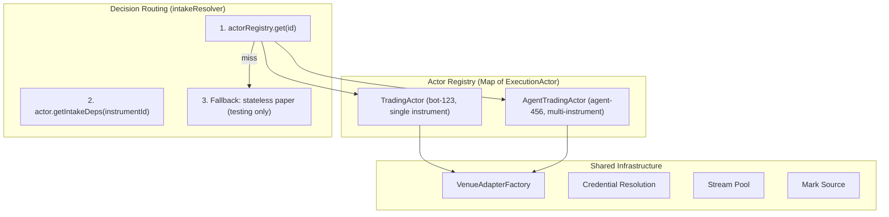

# Architectural Approach

Shadow/live execution needs long-lived resources — market data feeds, venue connections, private stream subscriptions, reconciliation loops. You can't construct those per-decision and tear them down. The bot path solves this with a persistent `TradingActor`. The agent path currently has no equivalent — it's a stateless resolver that constructs a `PaperExecutor` on the fly.

## The Architectural Gap

The system has two execution patterns:

| | Bot | Agent (direct) |
|--|-----|------|
| Lifetime | Long-lived actor | Stateless per-decision resolution |
| Instruments | Single | Multi |
| Decision source | Internal strategy loop | External (LLM tool call) |
| Venue infra | Full (adapter, stream, feed, reconciler) | None (PaperExecutor only) |

The root cause of repeated blockers: **there is no persistent execution actor for agent-direct trading**. Every fix that patches the stateless resolver will either re-discover the need for persistent resources or produce a half-working solution.

## The Sound Solution: `AgentTradingActor`

Introduce an `AgentTradingActor` — a long-lived, multi-instrument execution context that participates in the actor system.



### Key design properties:

1. **One per agent, not per instrument** — scoped to the agent's active venue account binding. Handles decisions for any instrument the agent targets.

2. **Lifecycle-aligned with agent sessions** — starts when the agent's runtime session starts (alongside the container), stops when the session ends. Registered in the actor registry under the agent's ID.

3. **Multi-instrument position tracking** — maintains a `Map<instrumentId, PositionState>` rather than a single position.

4. **Execution-mode-aware construction** — reads `agents.executionMode` and constructs the appropriate executor + supporting infrastructure:
   - `paper` → `PaperExecutor` (no venue deps)
   - `shadow` → `ShadowExecutor` + `MarketDataFeed` (needs stream pool or polling)
   - `live` → `LiveExecutor` + `OrderbookVenuePort` + private stream + reconciler

5. **Same `DecisionIntakeDeps` interface** — the `AgentDecisionHandler` doesn't change. The `intakeResolver` routing already checks the actor registry first. Once an `AgentTradingActor` is registered, it's found naturally:
   ```
   actorRegistry.get(agentId) → actor.getIntakeDeps(instrumentId)
   ```

6. **Risk limits derived from agent config** — `capital`, `dailyLossLimit`, `maxSlippageBps` flow into `RiskLimits` at construction time, not hardcoded.

### The `ExecutionActor` interface:

The shared contract for decision routing. Both actors implement it.

```typescript
export interface ExecutionActor {
  readonly isRunning: boolean;
  getIntakeDeps(instrumentId?: string): DecisionIntakeDeps | undefined;
  getDecisionContext(instrumentId?: string): DecisionContext | undefined | Promise<DecisionContext | undefined>;
  getPosition(instrumentId?: string): PositionState | undefined;
}
```

The registry becomes `Map<string, ExecutionActor>`. This is distinct from `InstanceActor` (the bot/WorkerRuntime lifecycle contract with `botId`, BullMQ-driven start/stop). Each actor keeps its own lifecycle:

- `TradingActor implements InstanceActor, ExecutionActor` — bots, managed by WorkerRuntime
- `AgentTradingActor implements ExecutionActor` — agents, managed by AgentSessionManager

`TradingActor` is not renamed — it's already unambiguous and renaming would produce churn with no clarity gain.

### What to extract as shared infrastructure:

The bot startup path in index.ts constructs venue adapters inline with credential resolution, rate limiter setup, and stream config. Both `TradingActor` and `AgentTradingActor` need this. Extract a **`VenueAdapterFactory`**:

```
VenueAdapterFactory
├── buildOrderbookAdapter(venueAccountId, venue) → { venuePort, credentials, streamConfig }
├── buildSwapAdapter(venueAccountId, venue, swapAssets) → { swapVenue, swapTokenSafety }
└── resolveCredentials(venueAccountId) → { apiKey, secret, ... } | null
```

This removes the duplication without touching `TradingActor`'s internals — it just gets its adapters from the factory instead of constructing them inline.

### What stays as-is:

- `TradingActor` — keeps its single-instrument, strategy-loop design. Gains `ExecutionActor` implementation (adds `getDecisionContext()` and `getPosition()` methods, moving inline logic from `index.ts` into the class).
- `InstanceActor` — unchanged. Stays scoped to WorkerRuntime/BullMQ lifecycle.
- `AgentIntakeResolver` — becomes the **paper-only fallback** for agents without a running execution actor (e.g., testing, agents with no binding, degraded mode).
- `AgentDecisionHandler` — unchanged. It routes through `intakeResolver`, which now finds the actor.
- The engine's `submitDecisionForExecution` — unchanged. It receives `DecisionIntakeDeps` regardless of source.

## Implementation sequence:

1. **`ExecutionActor` interface + registry widening** — define the interface, make `TradingActor` implement it (move inline `intakeResolver` logic into the class), widen `actorRegistry` type.

2. **`VenueAdapterFactory`** — extract credential resolution + adapter construction from the bot startup path. Both actors use it. One file, no behavior change to bots.

3. **`AgentTradingActor`** — new file. Multi-instrument, owns venue infra, implements `ExecutionActor`, exposes `getIntakeDeps(instrumentId)`. Construct with proper risk limits from agent config.

4. **Actor lifecycle wiring** — when `AgentSessionManager` starts an agent session, also create and register the `AgentTradingActor` (if the agent has an active trading binding). Mirror the stop path.

5. **Live gate** — route agent live-mode startup through the same `assertLiveReadiness()` check bots use.

6. **Reconciliation** — reuse the existing `Reconciler` class, run it within the `AgentTradingActor` for shadow/live modes.

## Why this is sound:

- **Flexible**: Multi-instrument from day one. Adding a new venue or execution mode is one branch in the factory.
- **Maintainable**: Clear ownership — the actor owns its infrastructure lifecycle. No shared mutable state between decisions.
- **Evolvable**: You can add features to the agent actor (trailing stops, position-level P&L tracking, per-instrument cooldowns) without touching the bot path or the engine.
- **Consistent**: Both actors participate in the same registry, same routing, same `DecisionIntakeDeps` contract.
- **No hidden blockers**: The agent execution path becomes structurally equivalent to the bot path — same infra, same lifecycle, same safety checks.