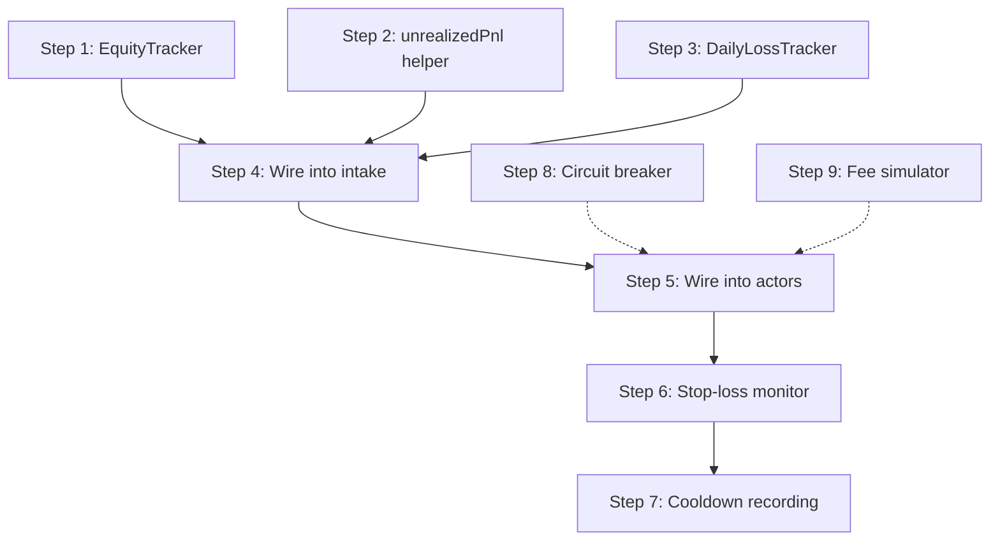

# Phase 1 — Risk Foundation

## Problem Statement

The risk gate (`checkRisk`) is wired into every decision, but the inputs that make it useful are either hardcoded to zero or never supplied:

- **Drawdown** (#7): `currentDrawdown: price('0')` — the gate never fires regardless of losses.
- **Daily loss** (#8): `dailyLoss` is never passed — the 24h loss check is dead code.
- **Equity** (#17): `equity` is the agent's static `capital` config value, never updated after fills.
- **Unrealized P&L** (#18): No mark-to-market valuation flows into risk decisions.
- **Stop-loss** (#10): No mechanism detects that a position has breached a loss threshold and forces exit.
- **Stop-loss cooldown** (#9): Nothing records when a forced exit occurs, so the cooldown check is dead code.
- **Circuit breaker** (#11): `maxConsecutiveVenueErrors` exists in config but no code reads or enforces it.
- **Simulated fees** (#12/#13): Paper and shadow fills report zero fees and paper has no slippage.

The risk gate's structure is sound — the gap is data flow. We need to compute real numbers and wire them through.

## Target State

After Phase 1:

1. Every `checkRisk` call receives **real** `currentDrawdown`, `dailyLoss`, `equity`, and `nowMs`.
2. Drawdown is tracked as peak equity minus current equity, per actor.
3. Daily loss is a rolling 24h sum of realized losses, per actor.
4. Equity is dynamically computed: `startingCapital + realizedPnl + unrealizedPnl`.
5. Unrealized P&L is computed at decision time from open positions × current mark price.
6. A **stop-loss monitor** detects when an open position's unrealized loss exceeds a threshold and emits a `go_flat` decision.
7. When a stop-loss fires, the timestamp is recorded per instrument and the cooldown gate prevents re-entry.
8. A **circuit breaker** halts an actor after N consecutive venue errors.
9. Paper/shadow fills include simulated fees and paper includes bid-ask spread slippage.

---

## Implementation Plan

### Step 1: Equity Tracker (enables #7, #8, #17, #18)

**New module:** `packages/engine/src/equity-tracker.ts`

Create an `EquityTracker` class that maintains per-actor equity state:

```typescript
interface EquityTrackerState {
  startingCapital: Price;
  realizedPnl: Price;         // cumulative from all fills
  peakEquity: Price;          // high-water mark
}

class EquityTracker {
  constructor(startingCapital: Price, initialRealizedPnl?: Price);
  
  /** Call after each fill with the fill's realized P&L delta */
  recordFill(realizedPnlDelta: Price): void;
  
  /** Compute current equity given unrealized P&L */
  currentEquity(unrealizedPnl: Price): Price;
  
  /** Compute drawdown from peak */
  currentDrawdown(unrealizedPnl: Price): Price;
  
  /** Get peak equity (updated lazily on each equity query) */
  get peakEquity(): Price;
}
```

**Behavior:**
- `currentEquity = startingCapital + realizedPnl + unrealizedPnl`
- On each call to `currentEquity()`, update `peakEquity = max(peakEquity, currentEquity)`
- `currentDrawdown = peakEquity - currentEquity` (always ≥ 0)

**Tests:** `packages/engine/src/equity-tracker.test.ts`
- Equity starts at capital
- After profitable fill, equity rises, peak updates
- After losing fill, drawdown increases
- Drawdown never negative
- Peak only moves up

---

### Step 2: Unrealized P&L helper (enables #18)

**New function** in `packages/engine/src/position-tracker.ts`:

```typescript
/** Compute unrealized P&L for a position at the given mark price */
export function unrealizedPnl(position: PositionState, markPrice: Price): Price;
```

**Logic:**
- If flat → 0
- If long → `(markPrice - entryPrice) * size`
- If short → `(entryPrice - markPrice) * size`

**For multi-instrument actors (agents):** Sum unrealized P&L across all open positions.

**Tests:** Add cases to `packages/engine/src/position-tracker.test.ts`

---

### Step 3: Daily loss tracker (enables #8)

**New module:** `packages/engine/src/daily-loss-tracker.ts`

```typescript
class DailyLossTracker {
  /** Record a realized P&L delta (negative = loss). Only losses accumulate. */
  recordFill(realizedPnlDelta: Price, timestampMs: number): void;
  
  /** Get rolling 24h loss total (positive number representing magnitude of losses) */
  rollingLoss(nowMs: number): Price;
}
```

**Behavior:**
- Maintains a ring buffer of `{ loss: Price, timestampMs: number }` entries
- `recordFill`: if `realizedPnlDelta < 0`, push `abs(delta)` with timestamp
- `rollingLoss`: sum all entries where `nowMs - timestampMs < 86_400_000`; prune expired
- This is in-memory only (survives within an actor's lifetime; on restart, rehydrate from DB fills)

**Tests:** `packages/engine/src/daily-loss-tracker.test.ts`
- Empty tracker returns 0
- Single loss records correctly
- Losses older than 24h excluded
- Profits don't count as losses

---

### Step 4: Wire trackers into decision intake (enables #7, #8, #17, #18)

**File:** `packages/engine/src/decision-intake.ts`

**Changes to `DecisionIntakeDeps`:**

```typescript
export interface DecisionIntakeDeps {
  // ... existing fields ...
  equityTracker?: EquityTracker;
  dailyLossTracker?: DailyLossTracker;
  /** All open positions for this actor (for multi-instrument unrealized P&L) */
  openPositions?: PositionState[];
}
```

**Changes to `submitDecisionForExecution`:**

1. Before `checkRisk`, compute unrealized P&L:
   ```typescript
   const unrealized = (deps.openPositions ?? [])
     .filter(p => p.side !== 'flat')
     .reduce((sum, p) => sum.plus(unrealizedPnl(p, referenceMark)), price('0'));
   ```

2. Replace the hardcoded risk snapshot:
   ```typescript
   const riskResult = checkRisk(plan, deps.riskLimits, {
     currentPosition: position.side === 'flat' ? null : position,
     openPositionCount: deps.openPositionCount ?? (position.side === 'flat' ? 0 : 1),
     currentDrawdown: deps.equityTracker
       ? deps.equityTracker.currentDrawdown(unrealized)
       : price('0'),
     referenceMark,
     equity: deps.equityTracker
       ? deps.equityTracker.currentEquity(unrealized)
       : deps.equity,
     dailyLoss: deps.dailyLossTracker?.rollingLoss(Date.now()),
     nowMs: Date.now(),
     lastStopLossExitMs: deps.lastStopLossExitMs,
   });
   ```

3. After fills are applied, update trackers:
   ```typescript
   if (deps.equityTracker) {
     const pnlDelta = updatedPosition.realizedPnl.minus(position.realizedPnl);
     deps.equityTracker.recordFill(pnlDelta);
   }
   if (deps.dailyLossTracker) {
     const pnlDelta = updatedPosition.realizedPnl.minus(position.realizedPnl);
     deps.dailyLossTracker.recordFill(pnlDelta, Date.now());
   }
   ```

**Tests:** Update `packages/engine/src/decision-intake.test.ts`
- Drawdown rejection when equity drops below peak
- Daily loss rejection when 24h losses exceed threshold
- Equity updates after fills

---

### Step 5: Wire trackers into actors

**File:** `apps/worker/src/agent-trading-actor.ts`

- Instantiate `EquityTracker` with agent's `capital` config at startup
- Instantiate `DailyLossTracker` at startup
- On rehydration: replay realized P&L from persisted positions into `EquityTracker`
- Pass both trackers + all open positions to `DecisionIntakeDeps` in `getIntakeDeps()`

**File:** `apps/worker/src/trading-actor.ts` (bot actor)

- Same pattern: instantiate trackers with bot's configured capital
- Bots are single-instrument, so `openPositions` is just `[currentPosition]`

---

### Step 6: Stop-loss monitor (enables #10)

**New module:** `packages/engine/src/stop-loss-monitor.ts`

```typescript
interface StopLossConfig {
  /** Max unrealized loss per position as % of equity (0–100). 0 = disabled. */
  maxUnrealizedLossPct: number;
}

interface StopLossCheck {
  instrument: string;
  position: PositionState;
  markPrice: Price;
  equity: Price;
}

interface StopLossResult {
  triggered: boolean;
  instrument?: string;
  unrealizedLoss?: Price;
  threshold?: Price;
}

/** Check if any position breaches the stop-loss threshold */
export function checkStopLoss(config: StopLossConfig, checks: StopLossCheck[]): StopLossResult;
```

**Integration point:** Called in the actor's scan loop (bots) or before decision execution (agents). When triggered, the actor emits a synthetic `go_flat` decision for the breached instrument.

**Tests:** `packages/engine/src/stop-loss-monitor.test.ts`
- No trigger when within threshold
- Trigger when unrealized loss exceeds threshold
- Disabled when `maxUnrealizedLossPct = 0`

---

### Step 7: Stop-loss cooldown recording (enables #9)

**Storage:** Per-instrument `Map<string, number>` on the actor (in-memory).

**When stop-loss fires:**
1. Record `lastStopLossExitMs = Date.now()` for that instrument
2. Pass it through `DecisionIntakeDeps.lastStopLossExitMs` on subsequent decisions for the same instrument

**On actor restart:** Optionally rehydrate from journal events (query last `stop_loss_exit` event per instrument). Acceptable to lose cooldown state across restarts for v1.

**Changes:**
- `DecisionIntakeDeps`: add `lastStopLossExitMs?: number`
- Actor: maintain `stopLossExits: Map<string, number>`
- On stop-loss trigger: `stopLossExits.set(instrument, Date.now())`
- On `getIntakeDeps(instrument)`: `lastStopLossExitMs: stopLossExits.get(instrument)`

---

### Step 8: Circuit breaker for venue errors (enables #11)

**New module:** `packages/engine/src/circuit-breaker.ts`

```typescript
class VenueCircuitBreaker {
  constructor(private readonly maxConsecutiveErrors: number);
  
  /** Record a successful execution — resets counter */
  recordSuccess(): void;
  
  /** Record a venue error — increments counter, returns true if tripped */
  recordError(): boolean;
  
  /** Whether the breaker is currently open (tripped) */
  get isOpen(): boolean;
  
  /** Reset the breaker (manual recovery) */
  reset(): void;
}
```

**Integration:**
- Instantiate per actor from `config.liveRollout.maxConsecutiveVenueErrors`
- After executor returns: `recordSuccess()` on ok, `recordError()` on venue error
- Before executing: if `isOpen`, skip execution with `err({ code: 'risk.circuit_breaker_open' })`
- Journal event on trip: `circuit_breaker.tripped`

**Tests:** `packages/engine/src/circuit-breaker.test.ts`
- Trips after N consecutive errors
- Resets on success
- Does not trip on non-consecutive errors

---

### Step 9: Simulated fees for paper/shadow (enables #12, #13)

**New module:** `packages/engine/src/fee-simulator.ts`

```typescript
interface FeeSimulatorConfig {
  /** Fee rate as decimal (e.g. 0.001 = 0.1%) */
  takerFeePct: number;
  makerFeePct: number;
  /** Simulated half-spread in bps for paper mode (e.g. 5 = 5bps) */
  paperSlippageBps?: number;
}

/** Compute simulated fee for a fill */
export function simulateFee(config: FeeSimulatorConfig, notional: Price): Quantity;

/** Apply simulated slippage to a paper fill price */
export function applyPaperSlippage(config: FeeSimulatorConfig, price: Price, side: 'buy' | 'sell'): Price;
```

**Changes to PaperExecutor:**
- Accept `FeeSimulatorConfig` in constructor
- `fillPrice = applyPaperSlippage(config, currentPrice, side)` 
- `fee = simulateFee(config, fillPrice * quantity)`

**Changes to ShadowExecutor:**
- Accept `FeeSimulatorConfig` in constructor
- `fee = simulateFee(config, fillPrice * quantity)` (slippage already comes from real quotes)

**Config source:** `config/default.yaml` → new `simulation` section:
```yaml
simulation:
  takerFeePct: 0.001    # 10bps
  makerFeePct: 0.0005   # 5bps
  paperSlippageBps: 5   # 5bps half-spread
```

**Tests:** `packages/engine/src/fee-simulator.test.ts`
- Fee proportional to notional
- Paper slippage moves price adversely (buy higher, sell lower)
- Zero config means zero fee/slippage

---

## Dependency Graph



Steps 1–5 are the critical path (equity → risk data flow).
Steps 6–7 depend on working equity (need mark-to-market to detect breach).
Steps 8 and 9 are independent of the equity chain and can be done in parallel.

---

## Acceptance Criteria

1. **Drawdown fires:** A test where an actor takes a losing trade that drops equity 10% below peak → next decision is rejected with `risk.max_drawdown_exceeded`.
2. **Daily loss fires:** A test where cumulative 24h losses exceed the configured % → rejection with `risk.daily_max_loss_exceeded`.
3. **Stop-loss forces exit:** A test where mark price moves adversely beyond threshold → actor emits `go_flat` → position closed.
4. **Cooldown prevents re-entry:** After stop-loss exit, a new decision for the same instrument within cooldown period → rejected with `risk.stop_loss_cooldown`.
5. **Circuit breaker halts:** 3 consecutive venue errors → actor pauses execution → journal records `circuit_breaker.tripped`.
6. **Paper fees non-zero:** Paper fills include a fee proportional to notional.
7. **Paper slippage:** Paper buy fills are above mark, sells below mark.
8. **Equity is dynamic:** After a fill that realizes profit, the equity used in the next risk check reflects the gain.

---

## Files to Create

| File | Purpose |
|------|---------|
| `packages/engine/src/equity-tracker.ts` | Equity + drawdown tracking |
| `packages/engine/src/equity-tracker.test.ts` | Unit tests |
| `packages/engine/src/daily-loss-tracker.ts` | Rolling 24h loss |
| `packages/engine/src/daily-loss-tracker.test.ts` | Unit tests |
| `packages/engine/src/stop-loss-monitor.ts` | Position-level stop-loss check |
| `packages/engine/src/stop-loss-monitor.test.ts` | Unit tests |
| `packages/engine/src/circuit-breaker.ts` | Venue error circuit breaker |
| `packages/engine/src/circuit-breaker.test.ts` | Unit tests |
| `packages/engine/src/fee-simulator.ts` | Fee + slippage simulation |
| `packages/engine/src/fee-simulator.test.ts` | Unit tests |

## Files to Modify

| File | Change |
|------|--------|
| `packages/engine/src/position-tracker.ts` | Add `unrealizedPnl()` export |
| `packages/engine/src/decision-intake.ts` | Wire trackers into risk snapshot + post-fill updates |
| `packages/engine/src/paper-executor.ts` | Accept fee config, apply slippage + fees |
| `packages/engine/src/shadow-executor.ts` | Accept fee config, apply fees |
| `apps/worker/src/agent-trading-actor.ts` | Instantiate trackers, pass to intake deps |
| `apps/worker/src/trading-actor.ts` | Same for bots |
| `config/default.yaml` | Add `simulation` section |

---

## Out of Scope

- Persisting equity/drawdown state to DB (rehydrate from fills on restart is sufficient for v1)
- Cross-actor portfolio-level risk (each actor is independent)
- UI display of equity/drawdown (observability is a Phase 4 concern)
- Swap-specific unrealized P&L (Phase 2 — requires balance-based position model)
