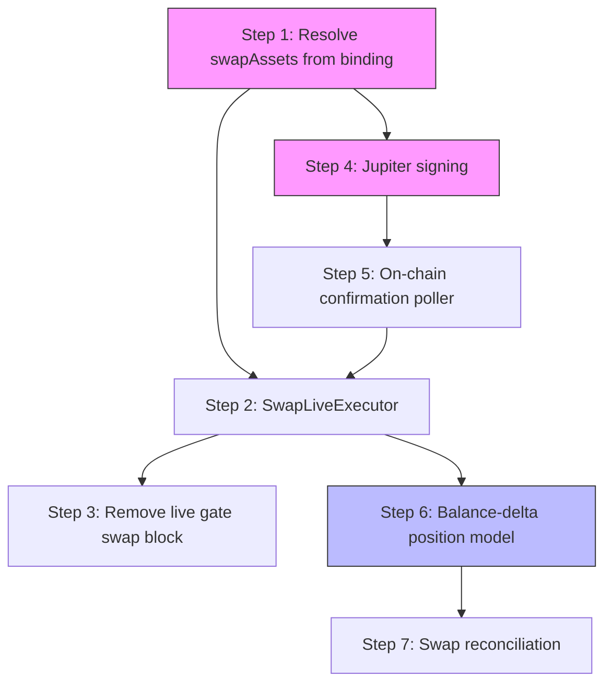

# Phase 2 — Complete Swap Execution

## Problem Statement

Swap venue execution (Jupiter, 1inch) is incomplete across all non-paper modes:

1. **Agent shadow swap crashes at startup.** `agent-trading-actor.ts` requires `swapAssets` to build the swap adapter, but for agents (multi-instrument), this metadata isn't available until the first instrument is known. The worker's `index.ts` explicitly blocks non-paper swap agents with a throw.

2. **No live swap executor exists.** `LiveExecutor` only accepts `OrderbookVenuePort` and rejects any `type: 'swap'` order. There is no `SwapLiveExecutor` that calls `SwapVenuePort.executeSwap()`.

3. **The live gate hard-blocks swap venues.** `live-gate.ts` line 60–62 throws `LiveGateError('live_rollout.swap_not_supported')` when `venueType !== 'orderbook'`. Even if a live executor existed, it would never be reached.

4. **Jupiter can't sign transactions.** `executeSwap` fetches a serialized transaction from the Jupiter API but returns `'pending-signature'` without signing or broadcasting it. 1inch is fully implemented and serves as the reference.

5. **No fill confirmation for swap venues.** `openPrivateStream()` early-returns when `this.venuePort` is undefined (always true for swaps). There's no on-chain transaction monitoring — after executing a swap, the system never confirms it landed.

6. **Swap positions have no usable model.** The position tracker uses a directional model (`long`/`short`/`flat` + `entryPrice`). Swap positions are token balance deltas. The reconciler returns empty positions for swaps, meaning position drift is undetectable.

The net effect: only paper-mode bots can trade on swap venues. Agents can't use swap venues at all (any mode), and live swap execution is completely dead code.

---

## Target State

After Phase 2:

1. Agents can start in **shadow mode** with swap venue bindings — `swapAssets` is resolved from the trading binding's metadata at startup.
2. A **SwapLiveExecutor** exists that calls `SwapVenuePort.executeSwap()`, handles async transaction confirmation, and maps receipts to fills.
3. The **live gate** permits swap venues through (gated by the `allowedVenues` config list instead of a blanket type check).
4. **Jupiter signs and broadcasts** transactions via a Solana keypair, then polls for on-chain confirmation.
5. **On-chain fill confirmation** monitors transaction status after execution — polling-based for v1 (WebSocket subscription deferred to v2).
6. A **balance-delta position model** tracks swap positions as token holdings changes, enabling reconciliation to detect drift.
7. **Swap reconciliation** compares expected token holdings (from fills) against actual on-chain balances.

**Done signal:** An agent in shadow mode on Jupiter executes a swap, receives fill confirmation from the chain, updates its position tracker via the balance-delta model, and the reconciler detects intentional drift when a manual withdrawal occurs.

---

## Implementation Plan

### Step 1: Resolve `swapAssets` from binding metadata (enables Gap #3)

**Problem:** Agent startup needs `swapAssets` (baseAsset, quoteAsset, decimals) but agents are multi-instrument — the specific asset pair isn't known at startup time.

**Solution:** Store `swapAssets` metadata on the `trading_bindings` table. When an agent's binding is a swap venue, the binding already carries the asset pair. The worker resolves it at agent startup from the binding's stored metadata.

**Changes:**

1. **`packages/db/src/schema/trading-bindings.ts`** — Ensure `metadata` JSONB column can carry `swapAssets`:
   ```typescript
   // The existing metadata column already supports arbitrary JSONB.
   // Define a typed accessor for swap metadata.
   ```

2. **`apps/worker/src/index.ts`** — Remove the throw at line 756–758 and resolve `swapAssets` from binding metadata:
   ```typescript
   // Before:
   if (venueType === 'swap' && mode !== 'paper') {
     throw new Error(`Direct-agent swap execution currently supports paper mode only...`);
   }
   
   // After:
   let swapAssets: SwapAssets | undefined;
   if (venueType === 'swap') {
     swapAssets = resolveSwapAssetsFromBinding(binding);
     if (!swapAssets) {
       throw new Error(`Swap binding ${binding.id} missing swapAssets metadata for agent ${agentId}`);
     }
   }
   ```

3. **New helper:** `apps/worker/src/resolve-swap-assets.ts`
   ```typescript
   export function resolveSwapAssetsFromBinding(binding: TradingBinding): SwapAssets | undefined;
   ```
   Reads `binding.metadata.swapAssets` (or `binding.metadata.baseAsset` + `binding.metadata.quoteAsset` + `binding.metadata.decimals`) and returns a typed `SwapAssets` object.

4. **Pass `swapAssets` to `AgentTradingActor` deps** at line 803 where the actor is created.

**Tests:**
- Agent startup succeeds with swap binding that has `swapAssets` metadata
- Agent startup fails with clear error when swap binding lacks metadata
- Paper, shadow, and live modes all resolve correctly

---

### Step 2: SwapLiveExecutor (enables Gap #1)

**New module:** `packages/engine/src/swap-live-executor.ts`

```typescript
export interface SwapLiveExecutorDeps {
  swapVenue: SwapVenuePort;
  idGen: IdGenerator;
  confirmationTimeoutMs: number;  // Max time to wait for tx confirmation
  confirmationPollIntervalMs: number;  // How often to poll for confirmation
}

export class SwapLiveExecutor implements Executor {
  constructor(private readonly deps: SwapLiveExecutorDeps) {}

  async execute(plan: ExecutionPlan, _currentPrice: Price): Promise<Result<ExecutionResult, EngineError>> {
    const orders: OrderResult[] = [];

    for (const planned of plan.orders) {
      if (planned.type !== 'swap') {
        orders.push({ ...planned, status: 'rejected', rejectionReason: 'swap_executor_only_handles_swaps' });
        continue;
      }

      // 1. Get quote
      const quoteResult = await this.deps.swapVenue.quote({
        inputAsset: planned.inputAsset,
        outputAsset: planned.outputAsset,
        inputAmount: planned.quantity,
        slippageBps: planned.slippageBps,
      });
      if (!quoteResult.ok) {
        orders.push({ ...planned, status: 'rejected', rejectionReason: quoteResult.error.message });
        continue;
      }

      // 2. Execute swap
      const execResult = await this.deps.swapVenue.executeSwap(quoteResult.data);
      if (!execResult.ok) {
        orders.push({ ...planned, status: 'rejected', rejectionReason: execResult.error.message });
        continue;
      }

      // 3. Wait for confirmation (polling-based)
      const receipt = execResult.data;
      const confirmed = await this.awaitConfirmation(receipt.executionRef);

      orders.push({
        ...planned,
        status: confirmed ? 'filled' : 'expired',
        executionRef: receipt.executionRef,
        filledQuantity: receipt.outputAmount,
        fillPrice: computeEffectivePrice(receipt.inputAmount, receipt.outputAmount),
        fee: receipt.gasUsed ? quantity(receipt.gasUsed) : quantity('0'),
        timestamp: receipt.timestamp,
      });
    }

    return ok({ planId: plan.id, orders });
  }

  private async awaitConfirmation(txRef: string): Promise<boolean> {
    // Poll SwapVenuePort for tx status until confirmed or timeout
    const deadline = Date.now() + this.deps.confirmationTimeoutMs;
    while (Date.now() < deadline) {
      const txs = await this.deps.swapVenue.fetchRecentTransactions();
      if (txs.ok && txs.data.some(tx => tx.ref === txRef && tx.status === 'confirmed')) {
        return true;
      }
      await sleep(this.deps.confirmationPollIntervalMs);
    }
    return false;
  }
}
```

**Integration into agent-trading-actor.ts:**
- When `venueType === 'swap'` and `executionMode === 'live'`:
  ```typescript
  this.executor = new SwapLiveExecutor({
    swapVenue: this.swapVenue,
    idGen: deps.idGen,
    confirmationTimeoutMs: deps.venueConfig.confirmationTimeoutMs ?? 60_000,
    confirmationPollIntervalMs: 3_000,
  });
  ```

**Tests:** `packages/engine/src/swap-live-executor.test.ts`
- Successful swap: quote → execute → confirm → filled
- Quote failure → rejected
- Execution failure → rejected
- Confirmation timeout → expired
- Non-swap order type → rejected

---

### Step 3: Remove live gate swap block (enables Gap #2)

**File:** `apps/worker/src/live-gate.ts`

Remove the blanket swap rejection:

```typescript
// Before (line 60–62):
if (input.venueType !== 'orderbook') {
  throw new LiveGateError(
    'live_rollout.swap_not_supported',
    'Live execution is only supported for orderbook venues during initial rollout',
  );
}

// After:
// Swap venue access is now controlled by the `allowedVenues` list in live rollout config.
// The venueType check is removed. If a venue is in the allowed list, it can go live.
```

The existing `allowedVenues` check already gates which venues can go live — no blanket type ban needed.

**Tests:** Update `apps/worker/src/live-gate.test.ts`
- Swap venue in `allowedVenues` → passes gate
- Swap venue NOT in `allowedVenues` → blocked by venue check (not type check)

---

### Step 4: Jupiter transaction signing (enables Gap #5/#24)

**File:** `packages/venues/src/jupiter-swap.ts`

**New dependency:** Solana Web3 (`@solana/web3.js`) — needed for `Keypair`, `Connection`, and `sendAndConfirmTransaction`.

**Changes to constructor:**
```typescript
export interface JupiterSwapConfig {
  apiUrl: string;
  walletAddress: string;
  timeoutMs: number;
  rpcUrl: string;             // NEW: Solana RPC endpoint
  privateKey?: Uint8Array;    // NEW: Keypair secret for signing (live mode)
}
```

**Changes to `executeSwap`:**
```typescript
async executeSwap(quote: SwapQuote): Promise<Result<SwapReceipt, SwapVenueError>> {
  // ... existing: fetch swap transaction from Jupiter API ...

  const data = await response.json() as { swapTransaction: string };

  // Deserialize, sign, and send the transaction
  const txBuffer = Buffer.from(data.swapTransaction, 'base64');
  const transaction = VersionedTransaction.deserialize(txBuffer);

  if (!this.keypair) {
    return err({ code: 'SWAP_SIGNING_UNAVAILABLE', message: 'No keypair configured for Jupiter live execution' });
  }

  transaction.sign([this.keypair]);

  const connection = new Connection(this.rpcUrl);
  const signature = await connection.sendTransaction(transaction, {
    skipPreflight: false,
    maxRetries: 3,
  });

  // Poll for confirmation
  const confirmation = await connection.confirmTransaction(signature, 'confirmed');
  if (confirmation.value.err) {
    return err({ code: 'SWAP_TX_FAILED', message: `Transaction failed: ${JSON.stringify(confirmation.value.err)}` });
  }

  return ok({
    executionRef: signature,
    inputAmount: quote.inputAmount,
    outputAmount: quote.expectedOutputAmount,
    timestamp: new Date().toISOString(),
  });
}
```

**Credential management:** The Solana private key is loaded from the credential store (same pattern as 1inch's EVM signer). The `JupiterSwapConfig.privateKey` is provided by the venue adapter factory, which reads from the venue account's encrypted credentials.

**Tests:** `packages/venues/src/jupiter-swap.test.ts`
- Mock `Connection` and `VersionedTransaction` — assert sign + send + confirm flow
- Error path: no keypair → returns SWAP_SIGNING_UNAVAILABLE
- Error path: transaction confirmation fails → returns SWAP_TX_FAILED
- Error path: send timeout → returns error

---

### Step 5: On-chain fill confirmation (enables Gap #25)

For v1, use a **polling-based confirmation service** rather than a persistent WebSocket subscription. This is simpler, works for both chains, and integrates naturally with the executor flow.

**New module:** `packages/venues/src/swap-confirmation-poller.ts`

```typescript
export interface SwapConfirmationPoller {
  /** Check if a transaction has been confirmed on-chain */
  checkConfirmation(txRef: string): Promise<Result<SwapConfirmationStatus, SwapVenueError>>;
}

export interface SwapConfirmationStatus {
  confirmed: boolean;
  blockNumber?: number;
  timestamp?: string;
  actualOutputAmount?: Quantity;  // Parsed from on-chain events when possible
}
```

**Per-venue implementations:**

1. **Solana (Jupiter):** `packages/venues/src/jupiter-confirmation.ts`
   - `connection.getTransaction(signature)` → check status, parse token balance changes
   - Extract actual output amount from pre/post token balances

2. **EVM (1inch):** `packages/venues/src/oneinch-confirmation.ts`
   - `provider.getTransactionReceipt(txHash)` → check status, parse Transfer events
   - Already done implicitly by `sendTransaction` returning receipt — but needed for re-checks on restart

**Integration into SwapLiveExecutor:**
- Replace inline polling in Step 2 with `SwapConfirmationPoller.checkConfirmation()`
- On actor restart, re-check any fills in `executing` state against the chain

**Integration into AgentTradingActor (replaces `openPrivateStream` for swaps):**
```typescript
// Instead of private stream, start a confirmation check loop:
private async startSwapConfirmationLoop(): Promise<void> {
  // Periodically check pending swap transactions for confirmation
  // On confirmation: update position tracker, persist fill, emit journal event
}
```

**Tests:**
- Confirmed transaction returns `{ confirmed: true }` with parsed amounts
- Unconfirmed (pending) returns `{ confirmed: false }`
- Failed transaction returns error
- Actor restart re-confirms pending fills

---

### Step 6: Balance-delta position model (enables Gap #19)

**New module:** `packages/engine/src/swap-position-tracker.ts`

Swap positions are fundamentally different from orderbook positions. Instead of tracking entry price and directional side, track **expected token holdings** derived from fills:

```typescript
export interface SwapHolding {
  asset: string;
  expectedBalance: Quantity;    // Sum of all inflows minus outflows from fills
  lastUpdatedMs: number;
}

export class SwapPositionTracker {
  private holdings = new Map<string, SwapHolding>();

  constructor(initialHoldings?: SwapHolding[]) {
    // Rehydrate from DB on restart
  }

  /** Record a swap fill — adjusts expected balances for both assets */
  recordSwapFill(fill: {
    inputAsset: string;
    inputAmount: Quantity;
    outputAsset: string;
    outputAmount: Quantity;
    timestamp: number;
  }): void {
    // Decrease expected balance for inputAsset
    // Increase expected balance for outputAsset
  }

  /** Get all expected holdings (non-zero) */
  getExpectedHoldings(): SwapHolding[] {
    return [...this.holdings.values()].filter(h => !h.expectedBalance.isZero());
  }

  /** Compute drift between expected and actual balances */
  computeDrift(actualBalances: Map<string, Quantity>): SwapDriftResult[] {
    // For each expected holding: drift = actual - expected
    // Positive drift = unexplained inflow, negative = unexplained outflow
  }
}

export interface SwapDriftResult {
  asset: string;
  expected: Quantity;
  actual: Quantity;
  drift: Quantity;      // actual - expected (can be negative)
  driftPct: number;     // abs(drift) / expected * 100
}
```

**Integration into AgentTradingActor (swap mode):**
- Instantiate `SwapPositionTracker` alongside the existing directional `PositionTracker`
- After each confirmed swap fill, call `recordSwapFill()`
- On restart, rehydrate from persisted fills in DB

**Tests:** `packages/engine/src/swap-position-tracker.test.ts`
- Empty tracker has no holdings
- After swap: input decreases, output increases
- Multiple swaps accumulate correctly
- Drift detection: positive drift (unexplained deposit)
- Drift detection: negative drift (unexplained withdrawal)
- Zero drift when balances match

---

### Step 7: Swap reconciliation with drift detection (enables Gap #27)

**File:** `packages/engine/src/reconciliation/venue-state-loaders.ts`

**Changes to `createSwapVenueStateLoader`:**

```typescript
export function createSwapVenueStateLoader(
  venue: SwapVenuePort,
  swapPositionTracker: SwapPositionTracker,
  logger: Logger,
): VenueStateLoader {
  return async (_since: Date | null): Promise<VenueState | null> => {
    const balResult = await venue.fetchBalances();
    if (!balResult.ok) {
      logger.error({ err: balResult.error }, 'Failed to fetch swap venue balances');
      return null;
    }

    // Build actual balance map from venue
    const actualBalances = new Map<string, Quantity>();
    for (const b of balResult.data.balances) {
      actualBalances.set(b.asset, quantity(b.amount.toString()));
    }

    // Compute drift against expected holdings
    const driftResults = swapPositionTracker.computeDrift(actualBalances);

    // Convert to position-like structures for the reconciler
    // A significant drift becomes a "position mismatch" alert
    const positions: VenueState['positions'] = driftResults
      .filter(d => Math.abs(d.driftPct) > DRIFT_THRESHOLD_PCT)
      .map(d => ({
        symbol: d.asset,
        side: d.drift.isPositive() ? 'unexplained_inflow' : 'unexplained_outflow',
        size: d.drift.abs(),
        driftPct: d.driftPct,
      }));

    return {
      positions,
      balances: { /* existing mapping */ },
      recentFills: [],
      openOrders: [],
    };
  };
}
```

**New reconciler logic for swap venues:**

The existing reconciler checks position drift for orderbook venues. For swap venues, it now checks **balance drift**:
- If `|actual - expected| > threshold%` → emit `reconciliation.swap_drift_detected` journal event
- If drift is negative (less balance than expected) → escalate to `reconciliation.swap_balance_deficit` (possible unauthorized withdrawal or failed fill that was assumed successful)
- If drift is positive → log as info (possible airdrop or external deposit)

**Config:** Add drift threshold to reconciliation config:
```yaml
reconciliation:
  swapDriftThresholdPct: 1.0  # Alert if balance differs by more than 1%
```

**Tests:**
- No drift → no alerts
- Small drift below threshold → ignored
- Large negative drift → deficit event emitted
- Large positive drift → inflow event emitted
- Multiple assets with mixed drift → each evaluated independently

---

## Dependency Graph



**Critical path:** Step 1 → Step 4 → Step 5 → Step 2 → Step 3 (end-to-end live swap execution)

**Parallel track:** Step 6 → Step 7 (can be built alongside Steps 4–5 since it only needs fill data, not the executor itself)

---

## Implementation Order

| Order | Step | Effort | Dependencies | Parallelizable with |
|-------|------|--------|--------------|---------------------|
| 1 | Step 1: Resolve swapAssets | S–M | None | Step 6 |
| 2 | Step 6: Balance-delta position model | M | None | Step 1, Step 4 |
| 3 | Step 4: Jupiter transaction signing | M | Step 1 (for integration test) | Step 6 |
| 4 | Step 5: On-chain confirmation poller | M | Step 4 | Step 7 |
| 5 | Step 7: Swap reconciliation | M | Step 6 | Step 5 |
| 6 | Step 2: SwapLiveExecutor | L | Step 4, Step 5 | — |
| 7 | Step 3: Remove live gate swap block | S | Step 2 | — |

---

## Acceptance Criteria

1. **Agent shadow swap starts:** An agent with a Jupiter swap binding in shadow mode starts successfully without crash. `swapAssets` is resolved from binding metadata.
2. **Live swap executes (1inch):** A bot/agent on 1inch in live mode submits a swap decision → SwapLiveExecutor quotes → executes → confirms → fill recorded.
3. **Live swap executes (Jupiter):** Same as above but Jupiter actually signs the Solana transaction and polls for on-chain confirmation.
4. **Live gate allows swap:** A swap venue listed in `allowedVenues` passes the live gate without error.
5. **Confirmation poller works:** After a swap is broadcast, the poller detects confirmation and updates the fill status from `executing` to `filled`.
6. **Balance tracking:** After a swap fill (SOL → USDC), the swap position tracker shows decreased SOL holding and increased USDC holding.
7. **Drift detection:** When on-chain balance diverges from expected (manual withdrawal), the reconciler emits `reconciliation.swap_drift_detected`.
8. **No regression:** Paper swap bots continue to work. Existing orderbook execution is unaffected.

---

## Files to Create

| File | Purpose |
|------|---------|
| `packages/engine/src/swap-live-executor.ts` | Live swap execution via SwapVenuePort |
| `packages/engine/src/swap-live-executor.test.ts` | Unit tests |
| `packages/engine/src/swap-position-tracker.ts` | Balance-delta position model for swap venues |
| `packages/engine/src/swap-position-tracker.test.ts` | Unit tests |
| `packages/venues/src/swap-confirmation-poller.ts` | Interface for on-chain confirmation checking |
| `packages/venues/src/jupiter-confirmation.ts` | Solana-specific confirmation polling |
| `packages/venues/src/jupiter-confirmation.test.ts` | Unit tests |
| `apps/worker/src/resolve-swap-assets.ts` | Helper to extract swapAssets from binding metadata |
| `apps/worker/src/resolve-swap-assets.test.ts` | Unit tests |

## Files to Modify

| File | Change |
|------|--------|
| `apps/worker/src/index.ts` | Remove swap mode throw, resolve swapAssets from binding, pass to actor |
| `apps/worker/src/agent-trading-actor.ts` | Instantiate SwapLiveExecutor for live swap, start confirmation loop instead of private stream |
| `apps/worker/src/trading-actor.ts` | Same for bot actor — SwapLiveExecutor when live+swap |
| `apps/worker/src/live-gate.ts` | Remove `venueType !== 'orderbook'` check |
| `apps/worker/src/live-gate.test.ts` | Update tests for new behavior |
| `packages/venues/src/jupiter-swap.ts` | Add Solana signing: keypair constructor, sign + send + confirm in executeSwap |
| `packages/venues/src/jupiter-swap.test.ts` | Add signing tests |
| `packages/engine/src/reconciliation/venue-state-loaders.ts` | Accept SwapPositionTracker, compute drift |
| `config/default.yaml` | Add `reconciliation.swapDriftThresholdPct` |

---

## Out of Scope

- **WebSocket-based live fill streaming** for swap venues (polling is sufficient for v1; real-time subscription is a v2 optimization)
- **Cross-chain swap routing** (Jupiter and 1inch remain chain-specific)
- **Swap-specific unrealized P&L for risk gate** (requires price oracle for arbitrary token pairs — Phase 3 or later)
- **Automatic drift resolution** (drift is detected and alerted, not auto-corrected)
- **Multi-hop/split-route swaps** (Jupiter and 1inch handle routing internally — we treat them as atomic)
- **Solana priority fees / compute budget** (use defaults for v1, can be tuned operationally)
