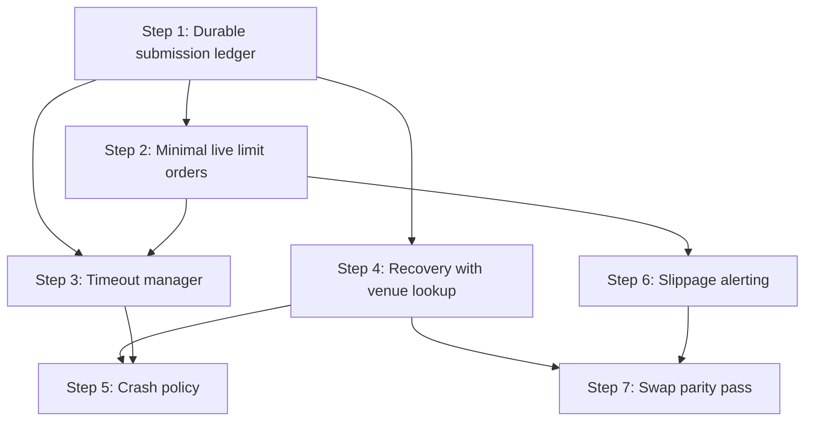

# Phase 3 — Live Execution Safety

## Problem Statement

Phase 1 fixed the risk data path. Phase 2 landed live swap execution and corrected shared-wallet semantics. The remaining production-readiness gap is the safety envelope around live execution itself.

Today, the live path still has five core problems in the backlog:

1. **Live limit orders are rejected** (#4). `LiveExecutor` only supports market orders and explicitly rejects limit orders.
2. **There is no order timeout or cancellation path** (#20). A live order can remain `executing` or `open` indefinitely if venue updates never arrive or the order simply rests too long.
3. **Live resubmission is not crash-safe** (#22). The code has deterministic `clientOrderId`s, but there is no durable write-ahead recovery path that proves whether an order was already sent before any retry.
4. **Crash behavior is unsafe or undefined** (#23). If a live actor crashes or recovery fails, the system does not yet have an explicit operator-controlled safety policy for what to do with open exposure.
5. **Slippage alerting is defined but not enforced** (#21). The journal taxonomy already includes `live.slippage_alert`, but live fills are not being checked against a decision-time reference.

In addition, the user chose to include a **limited swap-live safety parity pass** in this phase rather than leave Phase 3 purely orderbook-specific. That does not mean reopening Phase 2 execution work or forcing swap execution into the exact same lifecycle model as orderbook execution. It means the live safety mechanisms introduced here must also cover the already-landed swap live path wherever the same failure classes apply:

- pending execution timeout
- restart recovery of in-flight live work
- explicit crash policy
- execution-quality alerting

## User Decisions Locked For This Plan

These decisions were explicitly chosen and should be treated as constraints of this plan:

1. **Phase 3 scope includes a limited swap-live safety parity pass.**
2. **Live limit-order scope is minimal.**
   - submit
   - monitor
   - cancel/timeout
   - persist fills and status
   - no amend/replace or broader venue-specific limit-order product work in this phase
3. **Crash safety policy is operator-configurable.**
   - both modes must be planned:
   - auto go-flat
   - alert + manual intervention
4. **Idempotency bar is local durability plus venue lookup before retry.**
5. The broader exchange-grade limit-order management work has already been split out to:
   - `docs/features/pending/advanced-live-limit-order-management/001-plan.md`

## Target State

After Phase 3:

1. Live **market and minimal limit orders** can be executed safely on supported orderbook venues.
2. Every live order has a **durable pre-submit record** that survives crash windows, and live swaps persist recovery evidence at the earliest safe point supported by the current swap executor contract.
3. Recovery never blindly resubmits an uncertain live order or swap. It first checks durable local state, then queries the venue or chain using the strongest available lookup surface before deciding what to do.
4. Resting live limit orders have an explicit **timeout and cancellation policy**.
5. A live actor crash or fatal recovery failure follows an **operator-configurable safety policy**:
   - emergency go-flat
   - or alert and halt for manual intervention
6. Both orderbook live orders and live swaps emit **execution-quality alerts** when realized execution materially deviates from the reference price or quoted expectation.
7. Startup and restart can recover in-flight live activity without data loss, double submission, or silent abandonment.

**Done signal:** a live actor can submit a market or minimal limit order, survive a crash between persistence and venue acknowledgement without duplicate execution, recover open live work on restart, cancel stale resting orders, apply the configured crash policy, and emit slippage alerts when fills are materially worse than expected. In-flight live swaps are also recovered safely using existing confirmation and transaction evidence, with ambiguous swap states halting for operator action rather than being retried blindly.

---

## Phase Boundary

This phase is intentionally about **safety and recoverability**, not about building a rich live order-management product.

In scope:

1. minimal live limit-order support
2. timeout and cancellation for stale live work
3. durable idempotent submission and restart recovery
4. operator-configurable crash response
5. slippage and execution-quality alerting
6. swap-live parity for the same safety envelope

Out of scope:

1. amend-in-place
2. cancel-and-replace strategies beyond timeout cancellation
3. post-only or richer time-in-force surfaces
4. broader venue-specific order-management capabilities
5. new swap execution features unrelated to safety recovery
6. full unification of swap and orderbook submission lifecycle models

Those broader order-management features belong to the pending plan, not this phase.

---

## Implementation Plan

### Step 1: Durable Live Submission Ledger For Orderbook Flow (foundation for #20, #22, #23)

**Goal:** persist enough pre-submit state that restart recovery can tell what the actor intended to do before any uncertain crash window.

**Core idea:** introduce a write-ahead submission record for live orderbook work before the venue call is made.

For orderbook live orders, persist at minimum:

- plan ID
- order index
- deterministic `clientOrderId`
- venue account ID
- actor type and actor ID
- symbol
- side
- order type
- quantity
- price if limit
- submit state: `prepared | submit_attempting | venue_acknowledged | terminal`
- timestamps for each state transition

For live swaps, do not assume identical symmetry with orderbook flow in this step. Persist swap recovery evidence at the earliest safe point the current executor contract supports, which may be quote-level intent, execution ref once known, or confirmation-pending state. A full swap pre-submit ledger is a larger redesign and is out of scope for this phase.

**Likely files:**

- `packages/engine/src/live-executor.ts`
- `packages/engine/src/executor.ts`
- `packages/db/src/schema/orders.ts`
- repositories that persist and reload live orders
- actor persistence wiring in `apps/worker/src/trading-actor.ts`
- actor persistence wiring in `apps/worker/src/agent-trading-actor.ts`

**Tasks:**

1. Persist a durable order record before calling `submitOrder()` for live orderbook flow.
2. Mark the record as `submit_attempting` before the venue call.
3. Update the record to `venue_acknowledged` when acknowledgement arrives.
4. Persist swap recovery evidence at the earliest safe point supported by the current executor contract, without reopening the full Phase 2 swap execution model.
5. Ensure all transitions are idempotent and restart-readable.

**Why first:** everything else depends on having a trustworthy local record of what the actor attempted.

---

### Step 2: Minimal Live Limit-Order Support (#4)

**Goal:** stop rejecting live limit orders and support the minimal safe lifecycle needed for production-readiness.

**Behavior in this phase:**

1. submit live limit orders
2. persist them as open work
3. monitor venue updates
4. cancel them on timeout
5. record fills, partial fills, cancellations, and terminal state correctly

**Not included in this phase:**

1. amend/replace
2. post-only
3. richer TIF strategies beyond whatever minimal venue-normalized representation is needed to support cancellation and expiry safely

**Likely files:**

- `packages/engine/src/live-executor.ts`
- `packages/engine/src/live-executor.test.ts`
- domain order types if limit-order persistence needs shape updates
- worker actor order-completion handlers

**Tasks:**

1. Allow `planned.type === 'limit'` in `LiveExecutor`.
2. Submit a real limit order command to `OrderbookVenuePort`.
3. Persist the limit price and any minimal required timing attributes.
4. Return acknowledged open orders without fabricating fills.
5. Keep unsupported order shapes explicitly rejected rather than guessed.

---

### Step 3: Order Timeout And Cancellation Manager (#20)

**Goal:** no live order or live swap execution should hang forever.

For live orderbook limit orders:

1. define a configurable live order timeout
2. track the order's age from acknowledgement time or submit-attempt time
3. cancel stale resting orders through the venue adapter
4. persist terminal reason as timeout-driven cancellation when it succeeds
5. escalate explicitly when cancellation itself fails or remains ambiguous

For live market orders:

1. define a shorter acknowledgement/completion timeout window
2. treat missing completion as a recovery problem rather than silently waiting forever

For live swaps:

1. apply a confirmation timeout to pending transaction confirmation
2. classify timed-out confirmation as unresolved live work that must enter recovery flow on restart
3. never interpret timeout as permission to automatically resubmit the swap

**Likely new module:**

- `packages/engine/src/live-timeout-manager.ts`

**Likely files:**

- `apps/worker/src/trading-actor.ts`
- `apps/worker/src/agent-trading-actor.ts`
- `packages/engine/src/swap-live-executor.ts`
- confirmation poller integration files from Phase 2

**Tasks:**

1. Introduce a typed timeout policy for live work.
2. Track pending live orders and pending live swaps in actor state.
3. Cancel stale open limit orders.
4. Mark unresolved market-order completion gaps as recovery-required.
5. Mark unresolved swap confirmation gaps as recovery-required.

---

### Step 4: Crash Recovery With Venue Lookup Before Retry (#22)

**Goal:** after any uncertain crash window, the system must determine whether work already exists at the venue before retrying, and when the venue cannot provide proof either way, the system must halt and alert rather than guess.

**Recovery decision order:**

1. inspect durable local state
2. inspect persisted `clientOrderId`, venue ref, execution ref, and timestamps
3. query venue or chain for matching live work using the strongest available lookup surface
4. resume, finalize, cancel, or escalate
5. only retry when the previous attempt is proven not to exist; otherwise halt and alert

For orderbook venues, recovery should attempt lookup by:

1. `clientOrderId`
2. venue reference ID if already known
3. recent open orders and fills as fallback evidence

If the current orderbook venue APIs cannot prove absence from those surfaces, the recovery branch must stop at `ambiguous -> manual intervention required` rather than silently retry.

For swap venues, recovery should attempt lookup by:

1. persisted execution ref if known
2. recent transactions or confirmation poller surfaces
3. recent balance-impacting transaction evidence if needed for finalization

For swaps, this step is intentionally limited to safe recovery of already-started live work. It does not require a full orderbook-style pre-submit identity model.

**Likely new module:**

- `packages/engine/src/live-recovery.ts`

**Likely files:**

- `apps/worker/src/trading-actor.ts`
- `apps/worker/src/agent-trading-actor.ts`
- orderbook and swap venue ports if lookup surfaces need tightening
- repositories that load incomplete plans and orders

**Tasks:**

1. Rehydrate all incomplete live plans and pending live swaps on actor startup.
2. Build a recovery state machine for:
   - prepared but not attempted
   - submit attempting with no ack persisted
   - acknowledged but not terminal
   - partially filled
   - confirmation pending
3. Query venue state before any retry.
4. Never blind-resubmit from an ambiguous state.
5. Emit explicit recovery journal events so operators can audit every branch.

**Prerequisite note:** if current venue ports are not strong enough to support the required lookups, this step must explicitly add the minimum new lookup surfaces or narrow the guarantee to "best available evidence plus operator halt on ambiguity."

---

### Step 5: Operator-Configurable Crash Policy (#23)

**Goal:** turn crash behavior from an implicit failure mode into an explicit operator policy.

This phase must plan and implement both modes:

1. **Auto go-flat**
   - when the actor crashes fatally or recovery determines confirmed exposure is live but actor safety cannot be restored, attempt an emergency flattening action
2. **Alert + manual intervention**
   - halt the actor, emit high-severity alerts, preserve all known live state, and do not attempt automatic flattening

This step should be treated as four explicit subproblems rather than one vague "wind-down":

1. identify confirmed open exposure
2. identify and cancel open orders where applicable
3. flatten confirmed positions where policy allows it
4. halt and alert on ambiguous state even when auto go-flat is configured

**Important constraint:** swap and orderbook flows are not identical.

For orderbook venues:

1. auto go-flat means submit a best-effort closing action for known open positions
2. if order cancellation is required before flattening, that sequence must be explicit
3. this should reuse existing `go_flat` planning and execution paths where possible, not invent a second liquidation path unless the current one cannot satisfy the crash scenario

For swap venues:

1. there is no resting order to amend or cancel in the same way
2. the main safety question is open post-trade exposure plus any unresolved pending transaction
3. if execution state is ambiguous, auto resubmission is forbidden; only flatten known confirmed exposure

**Config direction:** add an operator-configured policy field under live rollout or a dedicated live-safety section, rather than hiding this behavior in code.

**Likely files:**

- `config/default.yaml`
- config schema in `packages/domain/src/config/*`
- `apps/worker/src/trading-actor.ts`
- `apps/worker/src/agent-trading-actor.ts`
- alerting policy and journal helpers

**Tasks:**

1. Add an explicit crash policy config.
2. Route fatal actor exit and unrecoverable restart states through that policy.
3. Implement best-effort go-flat behavior where configured, but only for confirmed exposure.
4. Implement high-severity alerting for both modes.
5. Persist enough evidence for operator audit after the event.

---

### Step 6: Slippage And Execution-Quality Alerting (#21)

**Goal:** compute and emit live execution-quality alerts instead of only defining the event name.

For orderbook live fills:

1. use the decision-time or plan-time reference price already available in the trading cycle context
2. compare it against actual fill price when the fill is confirmed
3. emit `live.slippage_alert` when the configured threshold is exceeded

For live swaps:

1. compare actual output or effective price against the quote or decision-time expectation
2. alert on materially adverse deviation beyond the configured threshold

**Likely files:**

- `packages/engine/src/journal.ts`
- order/fill confirmation handlers in actors
- any execution result mappers that already compute average fill price or effective price

**Tasks:**

1. Reuse or extend `computeSlippageBps()` for live fill confirmation paths.
2. Store the reference needed to compute slippage when the order or swap was initiated.
3. Emit journal events and alerts only after real completion evidence exists.
4. Cover both orderbook fills and swap confirmations.

---

### Step 7: Recovery And Safety Parity Pass For Live Swaps

**Goal:** ensure the Phase 2 live swap path is covered by the same safety guarantees added here where the current swap execution model can support them.

This is not a new swap feature phase. It is a bounded safety parity pass.

**Required parity outcomes:**

1. pending live swaps have restart-readable recovery evidence at the earliest safe point available
2. pending confirmation has a timeout and recovery path
3. restart re-checks chain state before any further action
4. ambiguous swap state never causes blind resubmission
5. crash policy applies to confirmed post-swap exposure, while ambiguous swap state halts and alerts
6. this step does not require a full rewrite of `SwapLiveExecutor` into an orderbook-style multi-state lifecycle engine

**Likely files:**

- `packages/engine/src/swap-live-executor.ts`
- `packages/venues/src/swap-confirmation-poller.ts`
- `packages/venues/src/jupiter-confirmation.ts`
- relevant actor startup recovery hooks

---

## Dependency Graph

**Critical path:** Step 1 → Step 2 → Step 3 → Step 4 → Step 5

Step 6 can begin once real completion paths are wired. Step 7 should run after the main recovery model is clear so swap parity reuses it instead of inventing a second mechanism.

---

## Acceptance Criteria

1. **Minimal live limit orders work:** a live limit order can be submitted, persisted, remain open, fill partially or fully, or be cancelled on timeout without local rejection.
2. **No hanging live work:** a stale live limit order is cancelled or escalated by policy instead of remaining open forever.
3. **Crash window safety:** if the worker crashes after persisting submit intent but before persisting venue acknowledgement, restart recovery checks the venue before any retry and halts on unresolved ambiguity.
4. **No blind duplicate submission:** ambiguous live order or live swap states never trigger unconditional resubmission.
5. **Crash policy is explicit:** the configured operator policy chooses between emergency go-flat and alert/manual intervention, and both branches are tested.
6. **Slippage alerting fires:** materially adverse live fills emit `live.slippage_alert` with real computed basis points.
7. **Swap parity:** a live swap pending confirmation at crash time is recovered through confirmation lookup and transaction evidence, not retried blindly.
8. **No regression:** existing live market-order flow and Phase 2 live swap execution continue to work under the new safety envelope.

---

## Files To Create

| File | Purpose |
|------|---------|
| `packages/engine/src/live-timeout-manager.ts` | Live timeout policy and stale-work handling |
| `packages/engine/src/live-timeout-manager.test.ts` | Unit tests |
| `packages/engine/src/live-recovery.ts` | Recovery state machine for incomplete live work |
| `packages/engine/src/live-recovery.test.ts` | Unit tests |

## Files To Modify

| File | Change |
|------|--------|
| `packages/engine/src/live-executor.ts` | Persist pre-submit state, support minimal limit orders |
| `packages/engine/src/live-executor.test.ts` | Add limit-order and durability coverage |
| `packages/engine/src/swap-live-executor.ts` | Add durable submit state and timeout/recovery hooks |
| `packages/engine/src/journal.ts` | Add or wire recovery, timeout, crash-policy, and slippage events |
| `apps/worker/src/trading-actor.ts` | Track pending live work, run recovery, apply crash policy |
| `apps/worker/src/agent-trading-actor.ts` | Same for agents |
| `packages/db/src/schema/orders.ts` | Add any durable state needed for submission and recovery |
| `packages/domain/src/config/*` | Add crash-policy and timeout config schema |
| `config/default.yaml` | Add live-safety operator config |
| `packages/domain/src/ports/*venue*.ts` | Tighten lookup surfaces needed for recovery |
| `packages/venues/src/swap-confirmation-poller.ts` | Support recovery-time confirmation checks |
| `packages/venues/src/jupiter-confirmation.ts` | Same for Jupiter confirmation lookup |

---

## Validation Plan

Focused validation should include:

1. live executor tests for market and limit submission paths
2. timeout-manager tests for stale order cancellation and escalation
3. recovery tests for crash windows before and after venue acknowledgement
4. actor restart tests for incomplete live orders and pending swaps
5. slippage-alert tests for both orderbook fills and swap confirmations
6. focused live-gate and actor startup tests if config schema changes affect startup
7. `pnpm lint`

Where practical, add targeted integration-style tests that simulate:

1. crash after local persistence, before venue acknowledgement
2. crash after venue acknowledgement, before local acknowledgement persistence
3. open limit order timing out and cancelling
4. pending live swap confirmation across restart

---

## Estimated Effort

With the tightened scope above, the orderbook core remains close to the original Phase 3 size, but the added swap parity pass still makes this larger than the original backlog row if taken in full.

The main effort drivers are:

1. durable state design for uncertain crash windows
2. recovery state machine correctness
3. actor integration for both bots and agents
4. bounded swap safety parity without reopening the full swap execution design

Practical estimate:

1. orderbook core: roughly the original ~2-week Phase 3 envelope
2. bounded swap parity pass: additional time unless it stays strictly limited to confirmation-time recovery and ambiguity handling

If stricter swap symmetry is desired, that should be moved into a separate follow-on instead of staying hidden inside this phase estimate.

The user-selected broader limit-order management work is intentionally deferred to the pending feature plan because adding amend/replace and richer venue semantics here would push this phase materially beyond that envelope.

---

## Deliberate Deferrals

The following are explicitly deferred out of this phase:

1. advanced limit-order lifecycle management such as amend/replace
2. richer venue capabilities like post-only and broad TIF support
3. strategy-level logic that dynamically reprices resting orders
4. broader exchange-grade order management UX or API surfaces

See:

- `docs/features/pending/advanced-live-limit-order-management/001-plan.md`