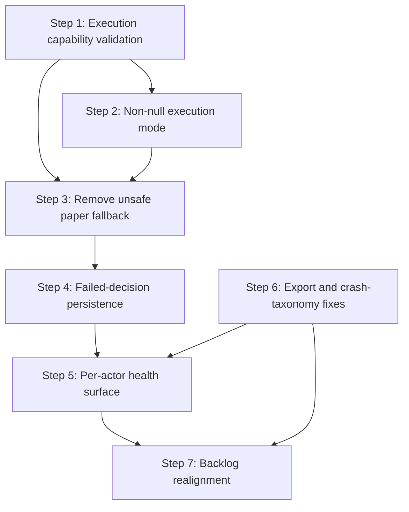

# Phase 4 — Config Validation And Operational Polish

## Problem Statement

Phase 1 established real risk inputs. Phase 2 completed swap execution and corrected shared-wallet semantics. Phase 3 hardened live execution safety. The remaining production-readiness gaps are now concentrated at the API and operational boundary:

1. **Invalid actor configurations are still accepted at write time** (#14, #15, #16). Agents and bots can still be created or updated into mode and venue combinations that the worker cannot safely execute. The worker then has to discover the mismatch later, which is the wrong boundary.
2. **The grant fallback path can still silently degrade execution semantics** (#6). `AgentIntakeResolver` hardcodes `PaperExecutor`, so a shadow or live agent that falls through the actor-registry path can execute with paper semantics instead of failing closed.
3. **Operational metadata is incomplete or misleading** (#29, #30). The export bundle drops or mis-shapes agent metadata, and the Docker runtime path still relies on weak signals when classifying container exits.
4. **There is no first-class per-actor health surface** (#31). Operators can tell whether the API is up, but not whether a specific trading actor is connected, degraded, in recovery, or safety-paused.
5. **Failed decisions are not durably surfaced as an operational artifact** (#32). A rejected or thrown decision may be logged, but there is no explicit persistence and operator-facing dead-letter trail for what failed and why.

Two backlog rows currently listed under Phase 4 need to be treated as backlog realignment work rather than new runtime feature work:

6. **Bybit public stream is already implemented** (#26). This should be closed by validating the existing implementation and correcting backlog status.
7. **Agent paper-mode reconciliation is intentionally absent** (#28). Paper mode has no venue truth to reconcile against; this should be documented as an accepted limitation rather than turned into fake reconciliation behavior.

The main theme of Phase 4 is therefore not new trading capability. It is making the system reject impossible states early, surface runtime state honestly, and leave operators with durable evidence when something goes wrong.

## Plan Constraints

These decisions are locked for this plan:

1. Invalid execution combinations must be rejected at API write time, not tolerated until worker startup.
2. Backward compatibility is not a constraint. `executionMode` may become required and non-null end-to-end.
3. Unsafe fallback behavior must fail closed. If a non-paper agent cannot be executed with its configured mode, the system must reject or halt rather than silently use paper semantics.
4. Dead-letter scope in this phase is **durable persistence plus operator visibility**, not a general automatic retry queue.
5. Per-actor health must describe runtime truth for operators, not infer health only from static DB status.
6. Gap #26 should be closed by validation and backlog correction, not by writing a second Bybit public-stream implementation.
7. Gap #28 should be closed by documentation and backlog correction unless a later phase introduces a dedicated paper-mode venue model.

## Target State

After Phase 4:

1. Agent and bot create/update flows reject unsupported `executionMode` + venue/binding combinations with explicit validation errors before any worker process attempts startup.
2. Agent `executionMode` is explicit and non-null in API, DB, and worker code. The runtime no longer defaults null to `paper`.
3. The grant fallback path for direct-agent execution never downgrades a shadow or live agent to `PaperExecutor`.
4. Agent export bundles include stable `status` and correctly serialized `createdAt` metadata.
5. Docker-managed agent exits distinguish at least three cases cleanly:
   - voluntary stop
   - startup failure / early crash
   - unexpected runtime crash
6. Operators can query health for a specific bot or agent and see current status, degradation reasons, timestamps, and any active safety or recovery conditions.
7. Failed decisions are durably recorded with enough context to explain what failed, where, and whether the failure was retryable.
8. The backlog is realigned so that #26 is marked done, #28 is explicitly documented as a deliberate limitation, and the implemented Phase 4 scope reflects the actual remaining production blockers.

**Done signal:** a user cannot create an actor in an unsupported execution state, a non-paper agent cannot silently execute via paper fallback, operators can inspect actor health and failed decisions directly, startup crashes are classified honestly, and the Phase 4 backlog no longer claims work remains for surfaces that are already implemented or intentionally out of scope.

---

## Phase Boundary

In scope:

1. execution capability validation for agents and bots
2. non-null agent `executionMode` cleanup across DB, API, and worker
3. removal of unsafe paper fallback for non-paper direct-agent execution
4. export-bundle metadata correctness
5. Docker crash-classification hardening
6. per-actor health snapshot and API surface
7. failed-decision persistence and operator visibility
8. backlog and documentation realignment for #26 and #28

Out of scope:

1. new trading features or new venue adapters
2. a full retry queue or automatic replay engine for failed decisions
3. UI dashboards for actor health
4. synthetic reconciliation for paper mode
5. rewriting the worker lifecycle around a new orchestration model

---

## Implementation Plan

### Step 1: Centralize execution-capability validation at the API boundary (#14, #15)

**Goal:** make the API reject any agent or bot state that the worker cannot execute safely.

The current validation is fragmented. Bots and agents have different request schemas, but neither path owns a single execution-capability rule set that answers the real question: given actor type, execution mode, venue type, binding metadata, and current supported runtime surfaces, is this configuration executable?

**Plan:** introduce one shared validation helper and call it from both agent and bot create/update routes.

Suggested shape:

```typescript
interface ExecutionCapabilityInput {
  actorType: 'agent' | 'bot';
  executionMode: 'paper' | 'shadow' | 'live';
  venueType: 'orderbook' | 'swap';
  bindingMetadata?: Record<string, unknown>;
}

type ExecutionCapabilityErrorCode =
  | 'execution_mode_requires_explicit_value'
  | 'paper_swap_not_supported'
  | 'swap_binding_metadata_missing'
  | 'binding_not_executable_for_mode';

function validateExecutionCapability(input: ExecutionCapabilityInput): Result<void, ExecutionCapabilityError>;
```

**Validation rules in this phase:**

1. require an explicit `executionMode` in actor creation flows
2. reject `paper + swap` combinations unless a concrete paper-swap runtime exists
3. reject swap execution that lacks required binding metadata such as `swapAssets`
4. keep worker-side assertions aligned with the same helper so API and worker cannot drift semantically

**Likely files:**

- `apps/api/src/routes/agents.ts`
- `apps/api/src/routes/bots.ts`
- `packages/domain/src/config/schema.ts` or a new domain helper module dedicated to execution-capability rules
- route tests for agents and bots

**Acceptance:** invalid execution combinations are rejected during create/update with explicit error codes and clear messages; worker startup no longer serves as the first validator.

---

### Step 2: Make agent execution mode explicit and non-null end-to-end (#16)

**Goal:** remove the nullable `executionMode` state and the worker's silent defaulting behavior.

The DB schema still allows `agents.execution_mode` to be null, and worker logic treats null as `paper`. That masks configuration mistakes and undermines Step 1.

**Plan:**

1. backfill existing null rows to an explicit mode during migration
2. make `agents.execution_mode` `NOT NULL`
3. remove nullable update semantics that allow clearing the field
4. remove all worker `?? 'paper'` fallbacks for agent execution mode
5. require all actor creation call sites and tests to pass an explicit mode

Because backward compatibility is not required, the cleanest version is to make `executionMode` explicit everywhere rather than preserve null-clearing semantics.

**Likely files:**

- `packages/db/src/schema/agents.ts`
- corresponding Drizzle migration files
- `apps/api/src/routes/agents.ts`
- `apps/worker/src/trading-actor.ts`
- `apps/worker/src/agent-trading-actor.ts`
- any repository or fixture code that constructs agents

**Acceptance:** there is no nullable execution-mode path left in API or runtime code, and worker behavior no longer depends on silent `paper` fallback.

---

### Step 3: Remove unsafe paper fallback from direct-agent intake resolution (#6)

**Goal:** ensure grant-based direct-agent execution either resolves the correct semantics or refuses to run.

`AgentIntakeResolver` currently hardcodes `new PaperExecutor(...)` regardless of the agent's configured execution mode. This is unsafe because the fallback path exists precisely when actor-runtime ownership is absent or racing. In that situation, silent downgrade to paper execution is worse than explicit failure.

**Plan:** narrow the fallback contract rather than expand runtime complexity.

Preferred behavior in this phase:

1. grant fallback remains allowed only for explicitly paper-mode agents
2. if the agent is configured for `shadow` or `live` and no running actor owns execution, the resolver returns an explicit unavailable result instead of `PaperExecutor`
3. agent decision handling propagates a truthful reason such as `execution_context_unavailable` rather than implying a normal paper execution path

This keeps the fix small and safe. Building full shadow/live direct-agent fallback outside the running actor is a larger runtime feature and is not needed for production-readiness.

**Likely files:**

- `apps/worker/src/agents/agent-intake-resolver.ts`
- `apps/worker/src/index.ts`
- `apps/worker/src/agents/agent-decision-handler.ts`
- `apps/worker/src/agents/agent-intake-resolver.test.ts`

**Acceptance:** a non-paper agent can no longer execute via grant fallback with paper semantics; the fallback path either uses real paper semantics for paper agents or fails closed.

---

### Step 4: Add durable failed-decision persistence and operator-visible failure states (#32)

**Goal:** every rejected or thrown decision leaves a durable trail that operators can inspect.

This phase should not attempt a full retry queue. The immediate requirement is evidence and visibility.

**Plan:** add a decision-failure ledger with two complementary paths:

1. **handled rejections**: persist terminal outcome metadata for decisions that were intentionally rejected or blocked by risk, validation, or runtime availability
2. **unhandled failures**: persist a dead-letter record when decision handling throws before a clean terminal outcome is recorded

Suggested persisted fields:

- actor type and actor ID
- original decision payload or normalized summary
- instrument / venue / binding context where available
- failure class and machine-readable code
- human-readable failure message
- retryability flag
- timestamps for failure and first observation
- linked decision or plan ID when available

**Integration rule:** the actor or handler that catches the error must persist the failure before returning an error to the caller or emitting an operator alert.

**Likely files:**

- `packages/engine/src/decision-intake.ts`
- `apps/worker/src/agents/agent-decision-handler.ts`
- `packages/db/src/repositories.ts`
- new DB schema and repository surface for decision failures or dead letters
- nearby engine and worker tests

**Acceptance:** a thrown or rejected decision is queryable after the fact with stable failure metadata, and operators no longer depend on logs alone to understand what was dropped.

---

### Step 5: Expose actor health as a first-class runtime surface (#31)

**Goal:** let operators inspect the health of an individual bot or agent instead of inferring it from process-level health or static DB status.

The worker already owns the live truth in memory through `actorRegistry`, but that truth is not currently exposed outside the worker process.

**Plan:** define an actor-health snapshot contract, update actors to maintain it, publish snapshots into a shared store, and expose them through the API.

Suggested snapshot shape:

```typescript
interface ActorHealthSnapshot {
  actorType: 'agent' | 'bot';
  actorId: string;
  status: 'starting' | 'healthy' | 'degraded' | 'paused' | 'recovery' | 'crashed' | 'stopped';
  reasons: string[];
  executionMode: 'paper' | 'shadow' | 'live';
  updatedAt: string;
  lastDecisionAt?: string;
  lastVenueSuccessAt?: string;
  lastVenueErrorAt?: string;
  streamState?: 'connected' | 'disconnected' | 'not_applicable';
  reconciliationState?: 'healthy' | 'degraded' | 'not_applicable';
  pendingLiveWorkCount?: number;
  lastDecisionFailureId?: string;
}
```

**Transport choice:** use a shared store such as Redis for health snapshots so the API can read current worker-owned state without coupling directly to worker memory.

**Health semantics in this phase:**

1. health snapshots are actor-owned and updated on meaningful lifecycle transitions
2. stale snapshots degrade automatically based on configured freshness thresholds
3. the endpoint returns both current status and reasons, not just a boolean
4. failed decisions from Step 4 should be linkable from the health surface

**Likely files:**

- `apps/worker/src/index.ts`
- `apps/worker/src/trading-actor.ts`
- `apps/worker/src/agent-trading-actor.ts`
- `apps/worker/src/agents/actor-state-owner.ts`
- `apps/api/src/routes/health.ts` or a new actor-health route module
- `packages/domain/src/config/schema.ts`
- `config/default.yaml`

**Acceptance:** an operator can query an actor-specific health endpoint and receive truthful runtime status, reasons, and timestamps that reflect current worker-owned state.

---

### Step 6: Fix operational metadata correctness in exports and runtime crash taxonomy (#29, #30)

**Goal:** make exported metadata and runtime-failure labeling match reality.

#### 6a. Export bundle serialization fix (#29)

The bundle export route currently omits `agent.status` and risks inconsistent timestamp serialization. This is a data-shape bug, not a trading-system design issue.

**Plan:**

1. include `status` explicitly in exported agent config and bundle payloads
2. serialize `createdAt` and other date fields as stable ISO strings at the route boundary
3. add regression coverage for both config export and bundle export shapes

**Likely files:**

- `apps/api/src/routes/exports.ts`
- export route tests

#### 6b. Docker crash classification hardening (#30)

The current container-exit handling treats `status === 'stopped'` as the main signal for a voluntary stop. That is too weak. A fast startup crash can still be misread if the manager lacks a stronger notion of intent and readiness.

**Plan:** classify exits using stronger evidence:

1. explicit stop intent recorded by the manager when it initiates a stop
2. runtime readiness or heartbeat evidence showing the container reached steady state
3. startup-crash timing thresholds from config, not magic constants

Recommended exit taxonomy:

1. `voluntary_stop`: manager initiated stop for the active session
2. `startup_failure`: container exited before ready/healthy state or within configured startup window
3. `runtime_crash`: container had reached ready state and then exited unexpectedly

This classification should drive:

1. session status updates
2. alert wording
3. actor health reasons

**Likely files:**

- `apps/worker/src/agents/docker-agent-manager.ts`
- `packages/domain/src/config/schema.ts`
- `config/default.yaml`
- Docker agent-manager tests and bug-regression coverage

**Acceptance:** exports include correct agent metadata, and quick container crashes are surfaced as startup failures or unexpected crashes rather than as voluntary stops.

---

### Step 7: Realign low-priority backlog rows with actual product reality (#26, #28)

**Goal:** close or reclassify backlog rows that should not survive into future planning as fake work.

Two corrections should land as part of Phase 4 close-out:

1. **Bybit public stream (#26):** validate the existing implementation and mark the backlog row done or remove it from production blockers.
2. **Agent paper reconciliation (#28):** document it as an accepted paper-mode limitation and move it out of the production-readiness critical path unless a future phase introduces a real paper-mode venue model.

This matters because leaving already-implemented or intentionally out-of-scope work in the active backlog distorts planning and invites redundant implementation.

**Likely files:**

- `docs/features/2026/06/14/002-production-readiness/002-backlog.md`
- if needed, a short explanatory note in the Phase 4 close-out or relevant best-practices docs

**Acceptance:** backlog status reflects actual repo truth; Phase 4 ends with a cleaner set of remaining operational gaps.

---

## Dependency Graph



**Critical path:** Step 1 → Step 2 → Step 3 → Step 4 → Step 5

Step 6 can run in parallel once the owning surfaces are isolated. Step 7 should be the close-out step because it depends on knowing what the code now truthfully supports.

---

## Acceptance Criteria

1. **Invalid state rejected early:** unsupported actor mode and venue combinations are rejected by agent and bot APIs before worker startup.
2. **No null mode path:** agent `executionMode` is explicit in DB and API, and worker code no longer defaults null to `paper`.
3. **No silent downgrade:** direct-agent fallback never executes a non-paper agent through `PaperExecutor`.
4. **Decision failures durable:** rejected and thrown decisions leave durable records with stable failure metadata.
5. **Actor health visible:** operators can query a specific actor's health and see current status plus degradation reasons.
6. **Crash labeling honest:** startup failures and runtime crashes are distinguished from voluntary stops in status updates and alerts.
7. **Export metadata correct:** agent bundle export includes `status` and correctly serialized `createdAt`.
8. **Backlog realigned:** Bybit public stream is no longer treated as missing, and paper-mode reconciliation is no longer described as a production blocker.

---

## Files To Create

| File | Purpose |
|------|---------|
| `packages/domain/src/trading/execution-capability.ts` or equivalent | Shared execution capability validator for API and worker assertions |
| tests adjacent to the chosen validator module | Validation matrix coverage |
| DB schema/repository file for decision failures or dead letters | Durable failed-decision persistence |
| actor-health route module if not folded into existing health routes | Per-actor health endpoint |

## Files To Modify

| File | Change |
|------|--------|
| `apps/api/src/routes/agents.ts` | Require explicit mode, validate execution capability on create/update |
| `apps/api/src/routes/bots.ts` | Apply the same execution capability validation for bots |
| `packages/db/src/schema/agents.ts` | Make `executionMode` non-null |
| corresponding migration files | Backfill and enforce DB constraint |
| `apps/worker/src/agents/agent-intake-resolver.ts` | Remove unsafe paper fallback for non-paper agents |
| `apps/worker/src/index.ts` | Align fallback handling and health publication wiring |
| `apps/worker/src/agents/agent-decision-handler.ts` | Persist and surface failed decisions |
| `packages/engine/src/decision-intake.ts` | Record structured terminal failure outcomes |
| `packages/db/src/repositories.ts` | Add failure and health persistence accessors as needed |
| `apps/worker/src/trading-actor.ts` | Maintain actor health state |
| `apps/worker/src/agent-trading-actor.ts` | Maintain actor health state |
| `apps/worker/src/agents/actor-state-owner.ts` | Expose actor-health lifecycle hooks |
| `apps/api/src/routes/exports.ts` | Fix `status` and timestamp serialization in exports |
| `apps/worker/src/agents/docker-agent-manager.ts` | Improve stop/crash classification |
| `packages/domain/src/config/schema.ts` | Add any config needed for crash classification and health freshness |
| `config/default.yaml` | Add documented operator config for new thresholds |
| `docs/features/2026/06/14/002-production-readiness/002-backlog.md` | Mark #26 and #28 accurately during close-out |

---

## Validation Plan

Focused validation should include:

1. agent-route tests for create/update rejection of invalid mode and venue combinations
2. bot-route tests for the same validation matrix
3. migration or repository tests proving `executionMode` is non-null after backfill
4. `agent-intake-resolver` tests proving non-paper fallback fails closed
5. decision-handling tests proving rejected and thrown decisions are durably recorded
6. actor or route tests for health snapshot publication and API retrieval
7. export-route tests for `status` and ISO timestamp fields
8. Docker agent-manager tests for voluntary stop vs startup failure vs runtime crash
9. `pnpm lint`

Where practical, add one focused end-to-end integration test that demonstrates:

1. an invalid actor configuration is rejected by the API
2. a failed decision becomes queryable through the persistence surface
3. the same failure is reflected in actor health with a degraded reason

---

## Estimated Effort

This remains roughly within the backlog's original Phase 4 envelope if the work stays bounded to validation, visibility, and close-out semantics.

The main effort drivers are:

1. choosing a clean shared validation surface used by both agents and bots
2. removing null execution-mode assumptions without leaving edge-case fallbacks behind
3. designing actor health transport between worker-owned runtime state and the API
4. adding durable failed-decision persistence without turning this into a general job queue project

Practical estimate:

1. validation and execution-mode cleanup: small to medium
2. fallback hardening: small
3. export and Docker classification fixes: small
4. per-actor health plus failed-decision visibility: medium and likely the dominant Phase 4 work

---

## Deliberate Deferrals

The following are explicitly deferred out of this phase:

1. automated retry orchestration for dead-lettered decisions
2. UI dashboards for actor health
3. paper-mode synthetic reconciliation
4. any new venue-stream work for Bybit beyond validating the implementation that already exists
5. direct-agent shadow/live execution outside the running actor lifecycle