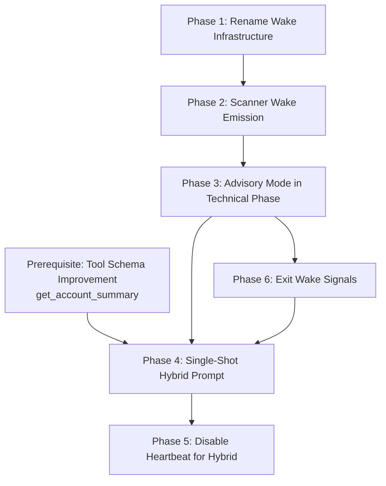

# Hybrid Agent Redesign — Implementation Plan

Date: 2026-06-22  
Prerequisite: [001-tool-schema-improvement](../001-tool-schema-improvement/001-solution-guide.md) (provides `get_account_summary` needed for capital injection in the hybrid prompt)

---

## Phase 1: Rename Wake Infrastructure

**Goal:** Generalize wake names so non-trading agents can use the same infrastructure.

### Changes

| File | Action |
|------|--------|
| `packages/domain/src/agent-protocol.ts` | Rename schemas: `AgentMarketWakePayloadSchema` → `AgentWakePayloadSchema`, `AgentMarketWakePayloadBaseSchema` → `AgentWakePayloadBaseSchema`, `AgentMarketWakeSourceSchema` → `AgentWakeSourceSchema`, types accordingly |
| `packages/domain/src/agent-protocol.ts` | Change event type string: `'agent.market.wake'` → `'agent.wake'` |
| `packages/domain/src/agent-protocol.ts` | Add `'scanner'` to the wake source enum |
| `packages/domain/src/agent-protocol.test.ts` | Update all test references |
| `apps/worker/src/agent.ts` | Update `pollWakeSignals()` to match `'agent.wake'` |
| `apps/worker/src/agents/instance-event-publisher.ts` | Rename `emitAgentMarketWake()` → `emitAgentWake()` |
| `apps/worker/src/reminder-coordinator.ts` | Update call site |
| `apps/worker/src/reminder-coordinator.test.ts` | Update mocks/assertions |
| `apps/worker/src/market-intelligence/monitor.ts` | Update call site + import |
| `apps/worker/src/market-intelligence/wake-scheduler.test.ts` | Update mocks/assertions |
| `apps/worker/src/runtime-composition.ts` | Update event type matching |
| `apps/worker/src/runtime-composition.test.ts` | Update test strings |
| `apps/worker/src/tick-gate-state.test.ts` | Update test strings |

### Validation
- `pnpm lint` passes
- `pnpm test` passes
- Grep for `agent.market.wake` returns 0 hits (excluding docs/changelogs)

---

## Phase 2: Scanner Wake Emission

**Goal:** When the technical scanner finds actionable signals, emit an `agent.wake` signal with `source: 'scanner'` to trigger an early tick.

### Changes

| File | Action |
|------|--------|
| `packages/domain/src/agent-protocol.ts` | Add `ScannerWakeContextSchema` (top signals summary, regime status) |
| `apps/worker/src/agent-trading-actor.ts` | After `runTechnicalPhase()`, if signals exist and agent has intelligence config: emit `agent.wake` via `deps.emitAgentWake(agentId, payload)` instead of (or alongside) `onTechnicalScanComplete` |
| `apps/worker/src/index.ts` | Wire `emitAgentWake` dependency into `AgentTradingActor` construction |

### Logic
```
if (phaseResult.signals.length > 0 && hasIntelligenceConfig) {
  // Advisory mode: don't submit decisions, emit wake
  await deps.emitAgentWake(agentId, {
    wakeId: crypto.randomUUID(),
    source: 'scanner',
    reason: `Scanner found ${phaseResult.signals.length} signal(s)`,
    priority: 'normal',
    eventIds: [],
    requestedAt: new Date().toISOString(),
    context: {
      signalCount: phaseResult.signals.length,
      topSymbol: phaseResult.signals[0]?.symbol,
      topConfidence: phaseResult.signals[0]?.confidence,
      regimePass: phaseResult.regimeResult?.pass ?? null,
    },
  });
}
```

### Validation
- Scanner emitting wakes → agent tick fires early (integration test)
- Scanner with no signals → no wake emitted (unit test)

---

## Phase 3: Advisory Mode in Technical Phase

**Goal:** When agent has `technical` + `intelligence` config, the scanner does NOT submit decisions directly — it only generates signals for the LLM to ratify.

### Changes

| File | Action |
|------|--------|
| `apps/worker/src/technical-phase.ts` | Accept `advisoryMode: boolean` in `TechnicalPhaseDeps`. When `true`: skip `submitDecision()` calls for entries. Store signals in result only. |
| `apps/worker/src/agent-trading-actor.ts` | Pass `advisoryMode: true` when agent has `intelligence` config |
| `apps/worker/src/technical-phase.ts` | For exits: respect `autonomousExit` config. If `false` (default), skip exit submission too — include in signals as exit advisory. |

### `autonomousExit` Config Addition

| File | Action |
|------|--------|
| `packages/domain/src/config/schema.ts` | Add `autonomousExit: z.boolean().default(false)` to `TechnicalConfigSchema` |
| `packages/domain/src/config/schema.test.ts` | Add validation tests |

### Validation
- Advisory mode: scanner finds signals → no decisions submitted, wake emitted (unit test)
- Advisory mode + autonomousExit: true → exits still submitted directly (unit test)
- Non-advisory (bot) mode: unchanged behavior (regression test)

---

## Phase 4: Single-Shot Hybrid Prompt & Runtime Submission

**Goal:** When a hybrid agent tick fires (woken by scanner), use a constrained single-shot prompt that returns structured JSON decisions. The runtime parses and submits.

### Changes

| File | Action |
|------|--------|
| `apps/worker/src/hybrid-agent-prompt.ts` (new) | Build the single-shot prompt: signal table + capital + open positions + instruction |
| `apps/worker/src/hybrid-agent-evaluator.ts` (new) | Orchestrates: build prompt → call LLM → parse JSON response → submit decisions via engine |
| `apps/worker/src/agent.ts` | In tick execution: detect hybrid mode (has `technical` + `intelligence`). If wake source is `'scanner'`, route to `hybrid-agent-evaluator` instead of normal scout/judge loop. |
| `packages/domain/src/agent-protocol.ts` | Define `HybridAgentDecisionSchema` for the LLM response format |

### Prompt Template (draft)
```
You are a trading agent. Below are pre-scored signals from your technical scanner.

Available capital: $X
Open positions: [list or "none"]
Max positions: N

## Signals (ranked by confidence)
| Symbol | Confidence | RSI | MACD | Volume | Reasons |
| ...    | ...        | ... | ...  | ...    | ...     |

## Instructions
For each signal, respond with go_long and a USD size, or skip.
Do not re-analyze indicators — trust the scanner's scores.

Respond ONLY with a JSON array:
[{"symbol":"SOL","intent":"go_long","sizeUsd":50},{"symbol":"ETH","intent":"skip"}]
```

### Response Parsing
```typescript
const ResponseSchema = z.array(z.object({
  symbol: z.string(),
  intent: z.enum(['go_long', 'skip']),
  sizeUsd: z.number().optional(),
}));
```

### Validation
- Prompt builds correctly with signal table (unit test)
- Valid JSON response → decisions submitted (unit test)
- Malformed JSON → logged error, no crash, no trades (unit test)
- Wake from non-scanner source (reminder, watch_threshold) → uses normal agent loop, not hybrid evaluator (unit test)

---

## Phase 5: Disable Regular Heartbeat for Hybrid Agents

**Goal:** Hybrid agents do not tick on `tickIntervalMs`. They only tick on wake signals.

### Changes

| File | Action |
|------|--------|
| `apps/worker/src/agent.ts` | In `scheduleNextTick()`: if agent is hybrid (has `technical` + `intelligence`) and no wake pending, do NOT schedule a timer tick. Only `pollWakeSignals()` drives ticks. |
| `apps/worker/src/agent.ts` | On startup: if hybrid, skip initial timer-based tick. Wait for first scanner wake or other wake source. |

### Safeguard
- The scanner loop still runs on `scanIntervalMs` — the agent process is not idle
- Health monitor must distinguish "hybrid agent waiting for signals" from "agent stuck" — update stale detection to respect hybrid mode

### Validation
- Hybrid agent: no tick fires without wake signal (integration test)
- Hybrid agent: scanner signal → tick fires within `minIntervalMs` (integration test)
- Non-hybrid agent: unchanged heartbeat behavior (regression test)
- Health monitor does not flag idle hybrid agent as stale (unit test)

---

## Phase 6: Exit Wake Signals (when autonomousExit = false)

**Goal:** When the scanner detects exit conditions for open positions and `autonomousExit: false`, it emits a wake signal so the LLM can decide.

### Changes

| File | Action |
|------|--------|
| `apps/worker/src/technical-phase.ts` | When `advisoryMode: true` and exit conditions detected: include exit advisories in the phase result |
| `apps/worker/src/agent-trading-actor.ts` | Emit wake with exit context when exit advisories are present |
| `apps/worker/src/hybrid-agent-prompt.ts` | Include exit advisories in the prompt (separate section: "Positions flagged for potential exit") |

### Prompt Addition
```
## Positions flagged for exit review
| Symbol | Side | Entry | Current | RSI | Reason |
| SOL    | long | $140  | $132    | 72  | confidence below threshold |

For each, respond with go_flat or hold.
```

### Response Extension
```typescript
z.object({
  symbol: z.string(),
  intent: z.enum(['go_long', 'go_flat', 'skip', 'hold']),
  sizeUsd: z.number().optional(),
})
```

---

## Implementation Order



**Phases 1–3** can start immediately (no dependency on tool schema improvement).  
**Phase 4** requires tool schema improvement (for `get_account_summary` → capital injection).  
**Phases 5–6** depend on Phase 4.

---

## Testing Strategy

| Phase | Unit Tests | Integration Tests |
|-------|-----------|-------------------|
| 1 | Schema validation, type exports | Full test suite passes (rename is mechanical) |
| 2 | Wake emission conditions, cooldown respect | Scanner → wake → early tick fires |
| 3 | Advisory mode skips submission, exit config | Scanner + intelligence → no direct trades |
| 4 | Prompt building, JSON parsing, error handling | Full flow: scanner → wake → prompt → LLM → decisions submitted |
| 5 | Timer suppression, health monitor compat | Hybrid agent silent without signals, responsive with signals |
| 6 | Exit advisory generation, prompt inclusion | Exit condition → wake → LLM decides → exit or hold |

---

## Risk & Mitigation

| Risk | Mitigation |
|------|-----------|
| LLM returns malformed JSON | Parse with Zod, log error, skip tick, retry on next wake |
| Scanner emits too many wakes (noisy market) | Existing `minIntervalMs` cooldown (15s default) prevents LLM spam |
| Hybrid agent never wakes (dead scanner) | Health monitor detects no scanner output → alerts operator |
| Capital info unavailable at prompt time | Fallback: omit capital, let LLM decide based on signals alone; log warning |
| Rename breaks external consumers | No external consumers — internal only, no backward compat needed |
