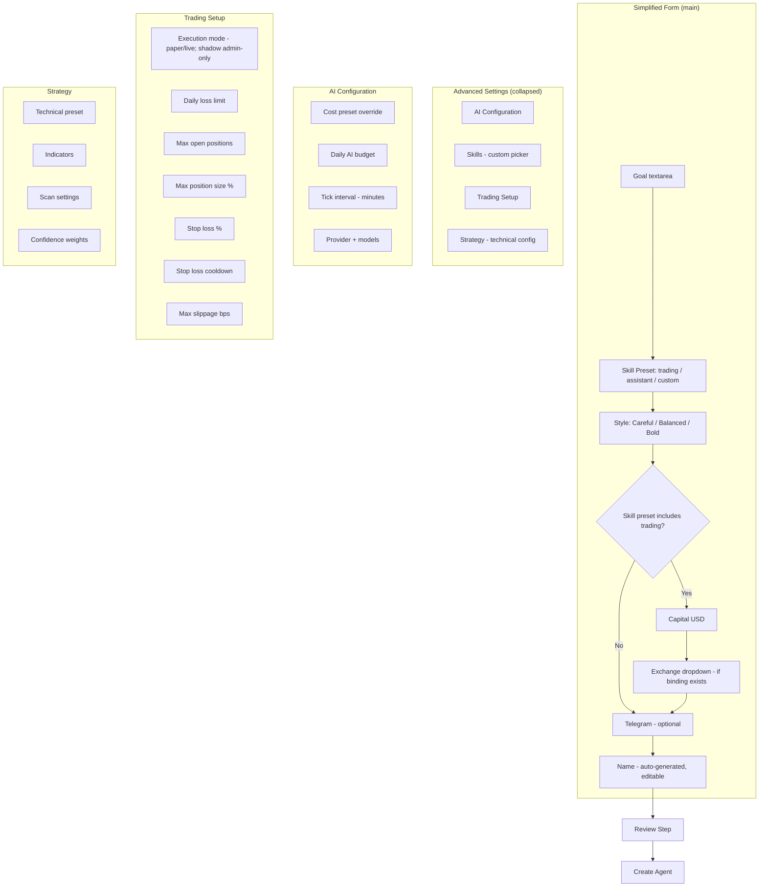
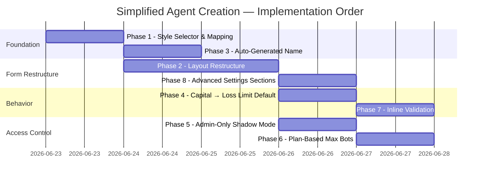

# Simplified Agent Creation — Implementation Plan

Date: 2026-06-22

## Context

The current agent creation form has 30+ fields across 8+ sections. Our vision is to bring AI-first trading (and other agent capabilities) to laymen. The form must become a minimum-friction experience while preserving full power-user access via progressive disclosure.

### Design Decisions

| # | Decision |
|---|----------|
| D1 | Remove capability mode selector from simplified view; derive mode from skill preset (trading → `both`, personal-assistant → `intelligence`) |
| D2 | Introduce a **Style** selector (`Careful` / `Balanced` / `Bold`) that maps to cost preset + risk tolerance simultaneously |
| D3 | Show only essential fields by default; group everything else under collapsible **Advanced Settings** |
| D4 | Agent name auto-generated from Style (e.g. `bold-agent-0`); shown as last editable field before submit |
| D5 | Shadow execution mode restricted to admin users |
| D6 | `dailyLossLimit` auto-defaults to 5% of `capital` when capital changes and loss limit is empty |
| D7 | Max concurrent bots determined by user's plan, not user-editable |
| D8 | Skill preset is part of the main form (immediately after goal); determines whether trading fields appear |
| D9 | LLM model selection pre-determined from cost preset; override in Advanced |
| D10 | Validate all fields on "Review" click with inline errors near affected fields |
| D11 | Advanced sections ordered: AI Configuration → Skills → Trading Setup → Strategy |
| D12 | Communication (Telegram) in the main form |

### Style → Values Mapping

| Style | Cost Preset | Tick Interval | Daily Budget | Risk Tolerance | Model Strategy |
|-------|------------|---------------|--------------|----------------|----------------|
| **Careful** | minimal | 60 min | $3/day | conservative | light for both scout & judge |
| **Balanced** | standard | 30 min | $10/day | moderate | light scout, heavy judge |
| **Bold** | premium | 15 min | $30/day | aggressive | heavy for both |

---

## Architecture



---

## Implementation Phases

### Phase 1: Style Selector Component & Mapping

**Goal:** Introduce the `StyleSelector` component and wire it to cost preset + risk tolerance values.

| File | Action |
|------|--------|
| `apps/web/src/features/agents/StyleSelector.tsx` (new) | Radio group: Careful / Balanced / Bold with descriptions. Emits `AgentStyleValue`. |
| `apps/web/src/features/agents/style-mapping.ts` (new) | Export `STYLE_CONFIG` constant mapping each style to `{ costPreset, tickIntervalMins, dailySpendBudgetUsd, riskTolerance }`. Export `resolveStyleDefaults(style)`. |
| `apps/web/src/features/agents/AgentsPage.tsx` | Add `style: AgentStyleValue` to `IntentState`. On style change: update `costPreset`, `tickIntervalMins`, `dailySpendBudgetUsd`, `riskTolerance` from mapping. |
| `apps/web/src/features/agents/agent-cadence.ts` | Update `PRESET_TICK_INTERVALS` to match new values: minimal=3600000, standard=1800000, premium=900000. |
| `apps/worker/src/cost-profile.ts` | Update `COST_PROFILE_TICK_INTERVALS` to match: minimal=3600000, standard=1800000, premium=900000. |

**Style config constant:**
```typescript
export type AgentStyleValue = 'careful' | 'balanced' | 'bold';

export const STYLE_CONFIG: Record<AgentStyleValue, {
  costPreset: 'minimal' | 'standard' | 'premium';
  tickIntervalMins: string;
  dailySpendBudgetUsd: string;
  riskTolerance: 'conservative' | 'moderate' | 'aggressive';
}> = {
  careful:  { costPreset: 'minimal',  tickIntervalMins: '60', dailySpendBudgetUsd: '3',  riskTolerance: 'conservative' },
  balanced: { costPreset: 'standard', tickIntervalMins: '30', dailySpendBudgetUsd: '10', riskTolerance: 'moderate' },
  bold:     { costPreset: 'premium',  tickIntervalMins: '15', dailySpendBudgetUsd: '30', riskTolerance: 'aggressive' },
};
```

### Phase 2: Form Layout Restructure

**Goal:** Reorganize `CreateAgentFlow` into essential fields + collapsed advanced section.

| File | Action |
|------|--------|
| `apps/web/src/features/agents/AgentsPage.tsx` | Restructure the form modal rendering order to: Goal → Skill Preset → Style → [Trading fields] → Telegram → Name → Advanced → Actions |
| `apps/web/src/features/agents/AgentsPage.tsx` | Move `CapabilitySelector` into Advanced Settings (or remove from render entirely — derive mode from skill preset) |
| `apps/web/src/features/agents/AgentsPage.tsx` | Add collapsible `<details>` or custom accordion for Advanced Settings |
| `apps/web/src/features/agents/AgentsPage.tsx` | Conditionally render Capital + Exchange only when `requiresTradingSetup` is true (skill preset = trading or custom with trading skill selected) |
| `apps/web/src/features/agents/AgentsPage.tsx` | Derive `capabilityMode` from skill selection: has trading skill + has goal → `'both'`; only goal → `'intelligence'`; only technical → `'technical'` |

**Derivation logic:**
```typescript
function deriveCapabilityMode(skillIds: string[], goal: string, hasTechnicalConfig: boolean): CapabilityMode {
  const hasTradingSkill = skillIds.includes('trading') || skillIds.includes('bot-management');
  const hasIntelligence = goal.trim().length > 0;
  if (hasTradingSkill && hasIntelligence) return 'both';
  if (hasIntelligence) return 'intelligence';
  return 'technical';
}
```

### Phase 3: Auto-Generated Name

**Goal:** Generate agent name from style + serial number. User can override.

| File | Action |
|------|--------|
| `apps/web/src/features/agents/agent-name.ts` (new) | Export `generateAgentName(style: AgentStyleValue, existingNames: string[]): string`. Pattern: `<style>-agent-<N>` where N is lowest unused serial. |
| `apps/web/src/features/agents/AgentsPage.tsx` | On mount and on style change: if name field is empty or matches a previously auto-generated pattern, regenerate. Track `nameIsAutoGenerated` boolean. |
| `apps/web/src/features/agents/AgentsPage.tsx` | Move name input below Telegram field (last field before Advanced Settings / actions) |

### Phase 4: Reactive Capital → Daily Loss Limit Default

**Goal:** When user enters capital, auto-fill daily loss limit to 5% if currently empty.

| File | Action |
|------|--------|
| `apps/web/src/features/agents/AgentsPage.tsx` | Add `useEffect` or `onChange` handler: when `intent.capital` changes and `intent.dailyLossLimit` is empty, set `dailyLossLimit` to `(parseFloat(capital) * 0.05).toFixed(2)`. Track `dailyLossLimitIsAutoSet` to avoid overwriting manual edits. |

### Phase 5: Admin-Only Shadow Mode

**Goal:** Hide shadow execution mode option for non-admin users.

| File | Action |
|------|--------|
| `apps/web/src/features/agents/AgentsPage.tsx` | Filter execution mode options: if `!user.isAdmin`, exclude `'shadow'` from dropdown options |
| `apps/api/src/routes/agents.ts` | Validate: if `executionMode === 'shadow'` and user is not admin, reject with `execution_mode.admin_only` |

### Phase 6: Plan-Based Max Bots

**Goal:** Remove max bots field from user-editable form. Derive from plan.

| File | Action |
|------|--------|
| `apps/web/src/features/agents/AgentControlsSection.tsx` | Remove `maxBots` input field. Show informational text: "Your plan allows up to N bots per agent" when bot management skill is selected. |
| `apps/web/src/features/agents/AgentsPage.tsx` | Remove `maxBots` from intent state management (no longer user-editable). Let API/worker resolve from plan. |
| `apps/api/src/routes/agents.ts` | If `maxBots` not provided in payload, resolve from user's active plan. If provided, validate ≤ plan limit. |

### Phase 7: Inline Validation on Review

**Goal:** Validate all fields when "Review" is clicked. Show errors inline near affected fields.

| File | Action |
|------|--------|
| `apps/web/src/features/agents/form-validation.ts` (new) | Export `validateCreateAgentForm(intent, constraints): ValidationResult`. Returns `{ valid: boolean, errors: Record<string, string> }`. Field-specific error messages (e.g. "Max open positions cannot exceed 10"). |
| `apps/web/src/features/agents/AgentsPage.tsx` | On "Review" click: run validation. If errors, set `formErrors` state. Render error messages below each affected field. Scroll to first error. |
| `apps/web/src/features/agents/AgentsPage.tsx` | Also validate on blur for numeric constraint fields (maxOpenPositions, capital, tickInterval). |

**Validation rules:**
- `name`: required (non-empty after trim)
- `goal`: required if intelligence mode
- `capital`: required if trading, must be positive number
- `tickIntervalMins`: if provided, ≥ 1 minute, whole number
- `maxOpenPositions`: if provided, ≤ `agentRiskDefaults.maxOpenPositions`
- `maxPositionSizePct`: if provided, 0-100
- `stopLossPct`: if provided, 0-100
- `venue`: required if technical mode active

### Phase 8: Advanced Settings Sections

**Goal:** Organize advanced settings into ordered collapsible sections.

| File | Action |
|------|--------|
| `apps/web/src/features/agents/AdvancedSettingsSection.tsx` (new) | Collapsible accordion with subsections: AI Configuration, Skills, Trading Setup, Strategy. Each section is independently expandable. |
| `apps/web/src/features/agents/AgentsPage.tsx` | Move these into `AdvancedSettingsSection`: ModelSelectionFields, cost preset dropdown, daily budget, tick interval, SkillPicker (custom mode), execution mode, TradingGuardrailsFields (excluding capital which stays in main), TechnicalConfigSection |
| `apps/web/src/features/agents/AgentControlsSection.tsx` | Extract AI-config-related fields into a standalone `AiConfigFields` component for reuse inside advanced section |

---

## Affected Files Summary

| Layer | Files |
|-------|-------|
| **New components** | `StyleSelector.tsx`, `AdvancedSettingsSection.tsx`, `form-validation.ts`, `style-mapping.ts`, `agent-name.ts` |
| **Modified components** | `AgentsPage.tsx` (major restructure), `AgentControlsSection.tsx`, `agent-cadence.ts`, `agent-payloads.ts` |
| **Backend** | `apps/api/src/routes/agents.ts` (shadow-mode guard, plan-based maxBots), `apps/worker/src/cost-profile.ts` (tick interval alignment) |
| **Docs** | `docs/tech/user-acceptance-tests.md` (new UATs for simplified flow) |
| **Unchanged** | `TechnicalConfigSection.tsx` (moves into Advanced), `SkillPicker.tsx`, `ProviderSetupForm.tsx`, `ModelSelectionFields.tsx` |

---

## Form Field Mapping (Before → After)

| Current Location | New Location | Notes |
|-----------------|--------------|-------|
| Capability selector | Removed (auto-derived) | — |
| Agent name | Main form (last field) | Auto-generated |
| Goal textarea | Main form (first field) | — |
| Skill preset | Main form (after goal) | Determines whether trading fields appear |
| Model selection | Advanced → AI Configuration | Pre-determined by Style |
| Cost preset | Merged into Style | Override in Advanced |
| Daily budget | Merged into Style | Override in Advanced |
| Tick interval | Merged into Style | Override in Advanced |
| Risk tolerance | Merged into Style | Override in Advanced |
| Capital | Main form (if trading) | — |
| Exchange/binding | Main form (if trading + has bindings) | — |
| Execution mode | Advanced → Trading Setup | Default: paper. Shadow: admin-only |
| Daily loss limit | Advanced → Trading Setup | Auto-set to 5% of capital |
| Max open positions | Advanced → Trading Setup | — |
| Max position size % | Advanced → Trading Setup | — |
| Stop loss % | Advanced → Trading Setup | — |
| Stop loss cooldown | Advanced → Trading Setup | — |
| Max slippage bps | Advanced → Trading Setup | — |
| Max bots | Removed (plan-derived) | Informational display only |
| Technical config | Advanced → Strategy | — |
| Telegram chat ID | Main form (before name) | — |
| Skill picker (custom) | Advanced → Skills | — |

---

## Testing Strategy

| Phase | Tests |
|-------|-------|
| 1 | Unit: `style-mapping.ts` returns correct config for each style. Unit: `agent-cadence.ts` new intervals produce correct cadence strings. |
| 2 | Visual: form renders correct fields for each skill preset. Unit: `deriveCapabilityMode()` returns expected mode for all input combos. |
| 3 | Unit: `generateAgentName()` increments serial correctly, handles existing names. |
| 4 | Unit: capital change triggers dailyLossLimit auto-fill. Manual edit prevents override. |
| 5 | Unit: non-admin user cannot select shadow. API rejects shadow from non-admin. |
| 6 | Unit: maxBots not in payload unless explicitly sent. API resolves from plan. |
| 7 | Unit: `validateCreateAgentForm()` catches all constraint violations with field-specific messages. |
| 8 | Visual: advanced sections collapse/expand. All fields remain functional inside accordion. |
| All | Update `docs/tech/user-acceptance-tests.md` — add/revise UATs for simplified agent creation flow (see Phase 9). |

---

### Phase 9: Update Manual UATs

**Goal:** Update `docs/tech/user-acceptance-tests.md` to cover the new simplified flow and revised behavior.

| UAT | Description |
|-----|-------------|
| **Create agent — simplified flow** | Fill only Goal, Skill Preset (trading), Style (Balanced), Capital → Review → Create succeeds. Agent has correct cost preset, tick interval, and risk tolerance derived from Style. |
| **Create non-trading agent** | Select Skill Preset = personal-assistant → Capital and Exchange fields are hidden. Style still visible and functional. |
| **Style selector applies defaults** | Select each Style (Careful/Balanced/Bold) → verify cost preset, tick interval, daily budget, and risk tolerance match mapping table. |
| **Auto-generated name** | On style change, name field updates to `<style>-agent-<N>`. Manually editing name prevents further auto-generation. |
| **Capital → daily loss limit** | Enter capital = 1000 → daily loss limit auto-fills to 50.00. Manually edit loss limit → changing capital no longer overwrites it. |
| **Shadow mode admin-only** | Non-admin user: shadow option not visible in execution mode dropdown. Admin user: shadow option available. |
| **Advanced settings toggle** | Click "Advanced Settings" → sections expand: AI Configuration, Skills, Trading Setup, Strategy. All fields editable. Collapsing hides them. |
| **Inline validation on Review** | Leave goal empty, click Review → error shown below goal field. Enter maxOpenPositions > platform limit → error shown below that field. Fix errors → Review proceeds. |
| **Max bots plan-derived** | Max bots input not visible. If bot-management skill selected, informational text shows plan limit. |
| **Override Style in Advanced** | Select Style = Careful → open Advanced → change cost preset to premium → tick interval and daily budget update. Style indicator reflects "Custom" or deselects. |
| **Review step reflects simplified fields** | Review summary shows: name, goal, style label, capital, daily loss limit, execution mode, exchange (if bound). No raw config IDs or internal field names. |

---

## Implementation Order



**Critical path:** Phase 1 → Phase 2 → Phase 8 → Phase 7

Phases 3–6 can be parallelized after Phase 2.

---

## Risks & Mitigations

| Risk | Mitigation |
|------|-----------|
| Style mapping produces suboptimal tick intervals for hybrid agents (which are event-driven) | Hybrid agents ignore `tickIntervalMs` for trading ticks (scanner-driven). The interval only applies to non-trading ticks (reminders, status). Documented in review step. |
| Users confused by auto-generated name | Name field is clearly editable, placed last so user can review/modify before submitting. Placeholder shows the generated value. |
| Removing capability selector breaks advanced users | It's still accessible in Advanced Settings (or derived automatically). No capability is removed — just the upfront choice. |
| Plan-based maxBots requires plan system to be functional | Fallback: if no plan found, use operator default from `config/default.yaml`. |
| Shadow mode restriction blocks QA testing | Admin flag check — QA accounts can be given admin role. |

---

## Non-Goals (Out of Scope)

- Auto-deriving strategy from goal text via LLM (future enhancement)
- Chat-like conversational agent creation flow (future)
- Changes to the API payload schema (form handles all mapping)
- Changes to the Review step layout (minimal — just reflects new field order)
- Mobile/responsive layout (separate ticket)

---

## Outstanding Issues

### [Phase 1] M1: `style` field omitted from API payload
The `style` value is stored in `IntentState` and drives field defaults, but the `buildCreateAgentPayload` function does not include it in the API request. The API and database have no record of which style the user chose. Deferred to Phase 2 (review step needs it).

### [Phase 1] M2: Tick interval cost-per-tick thresholds not updated
`estimateDailySpend` in `agent-cadence.ts` and `deriveCustomTickIntervalMs` in `cost-profile.ts` use hardcoded interval thresholds (1,800,000ms and 900,000ms) that may produce inaccurate estimates with the new longer intervals. Re-evaluate thresholds later.

### [Phase 1] M4-LOW: Arabic/Hindi i18n stubs
The Arabic and Hindi locale files contain English stub values for `agents.style.*` keys marked `// translation pending`. Non-blocking — will need proper translations before i18n launch.

### [Phase 2] M1 (updated): `style` field omitted from API payload
Now that Phase 2 (form layout) is done, the style field still needs to be forwarded in the API payload and displayed in the review step. Deferred to future phase.

### [Phase 2] Note: `deriveCapabilityMode` not unit tested yet
The `deriveCapabilityMode` function in `AgentsPage.tsx` works correctly but lacks dedicated unit tests. Tests are planned in the testing strategy but not yet implemented.

### [Phase 4] Hardcoded 5% ratio for loss limit auto-fill
The `0.05` ratio is hardcoded in the `useEffect`. Per AGENTS.md, operator defaults should come from config. Future: add `dailyLossLimitDefaultRatio` to `agentRiskDefaults` config and expose via API.

### [Phase 4] Unit tests not yet written
Plan specifies unit tests for capital→lossLimit auto-fill behavior. Not yet implemented.

### [Phase 3] `generateAgentName` simplified — no collision avoidance
The function was simplified to `${style}-agent-${counter}` since `existingNames` is always `[]` at the call site. If collision avoidance with existing agent names is needed later, the function will need to be extended and existing names passed from the parent.
