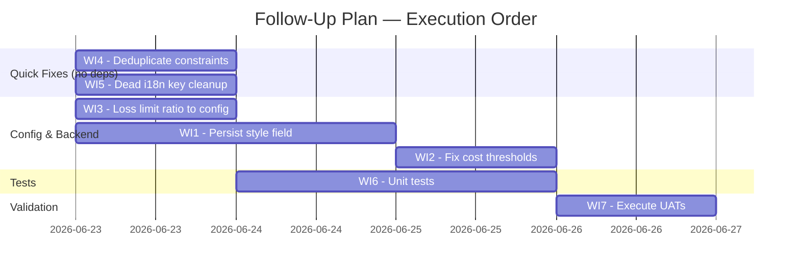

# Simplified Agent Creation — Follow-Up Implementation Plan

Date: 2026-06-23

## Summary

All 9 phases are functionally implemented. This plan closes 15 outstanding issues from [002-status.md](./002-status.md). Grouped into 7 work items ordered by priority.

---

## Work Item 1: Persist `style` Field (M1 — MEDIUM)

**Problem:** The `style` value is used to derive defaults on the frontend but is never sent to the API or stored. If the user later views or edits the agent, the original style choice is lost.

### Tasks

| # | File | Action |
|---|------|--------|
| 1.1 | `packages/db/src/schema/agents.ts` | Add `style` column: `varchar(16)` nullable (existing agents won't have one). |
| 1.2 | `packages/db/drizzle/` | Generate migration via `drizzle-kit generate`. |
| 1.3 | `apps/api/src/routes/agents.ts` | Add `style` to `CreateAgentSchema` (optional enum: `'careful' | 'balanced' | 'bold'`). Persist to DB on insert. Return in GET `/agents/:id` response. |
| 1.4 | `apps/web/src/features/agents/agent-payloads.ts` | Include `style` in `buildCreateAgentPayload()` output when present in input. |
| 1.5 | `apps/web/src/features/agents/AgentsPage.tsx` (review step) | Display the style label (e.g. "Style: Balanced") in the review summary between Name and Goal. |

### Notes

- The column is nullable — no backfill needed for existing agents.
- The style value is informational/UX only; the engine uses the derived values (costPreset, tickInterval, etc.), not the style enum.

---

## Work Item 2: Fix Cost Estimation Thresholds (M2 — MEDIUM)

**Problem:** `estimateDailySpend()` in `agent-cadence.ts` and `deriveCustomTickIntervalMs()` in both `agent-cadence.ts` and `cost-profile.ts` use hardcoded cost-per-tick heuristics ($0.003, $0.005, $0.05) that are unrealistically low for current LLM pricing. These only affect the fallback path (when no explicit daily budget is set and user provides a custom tick interval).

### Tasks

| # | File | Action |
|---|------|--------|
| 2.1 | `config/default.yaml` | Add `agentCostEstimates` section with per-preset cost-per-tick values: `{ minimal: 0.12, standard: 0.21, premium: 0.31 }`. These reflect actual avg cost per agent tick based on model usage. |
| 2.2 | `apps/api/src/routes/agents.ts` | Expose `costPerTickEstimates` in the `/agents/risk-defaults` endpoint (or a new `/agents/config` endpoint). |
| 2.3 | `apps/web/src/features/agents/agent-cadence.ts` | Replace hardcoded threshold logic with a tiered approach: `costPerTickUsd = intervalMs >= 3_600_000 ? estimates.minimal : intervalMs >= 1_800_000 ? estimates.standard : estimates.premium`. Import estimates from config or accept as param. |
| 2.4 | `apps/worker/src/cost-profile.ts` | Same fix for `deriveCustomTickIntervalMs` — use config values instead of hardcoded `0.002` / `0.01` / `0.05`. |

### Notes

- The actual cost-per-tick depends on which models are called per tick. The values above are averages based on the style mapping (minimal = light-only, premium = heavy for both scout & judge).
- If config injection into the frontend util is complex, a simpler approach is to just update the hardcoded values to realistic ones ($0.12 / $0.21 / $0.31) and add a `// from agentCostEstimates config` comment. The key improvement is accuracy, not full config-driven flexibility here.

---

## Work Item 3: Extract Hardcoded 5% Loss-Limit Ratio (LOW → config)

**Problem:** The `0.05` ratio in the capital→dailyLossLimit `useEffect` is hardcoded. Per AGENTS.md, operator defaults should come from config.

### Tasks

| # | File | Action |
|---|------|--------|
| 3.1 | `config/default.yaml` | Add `agentRiskDefaults.dailyLossLimitDefaultRatio: 0.05`. |
| 3.2 | `apps/api/src/routes/agents.ts` | Include `dailyLossLimitDefaultRatio` in `/agents/risk-defaults` response. |
| 3.3 | `apps/web/src/features/agents/AgentsPage.tsx` | Read ratio from `riskDefaultsQuery.data?.dailyLossLimitDefaultRatio ?? 0.05` in the `useEffect`. |

---

## Work Item 4: Deduplicate Validation Constraints & Fix Unused Field

**Problem:** (a) `validationConstraints` variable at line 358 and inline constraints in the Review button at line 765 are identical — drift risk. (b) `constraints.maxPositionSizePct` is declared in `ValidationConstraints` but not enforced as a platform ceiling.

### Tasks

| # | File | Action |
|---|------|--------|
| 4.1 | `apps/web/src/features/agents/AgentsPage.tsx` | Replace the inline `{ maxOpenPositions: ..., maxPositionSizePct: ..., stopLossMaxUnrealizedLossPct: ... } satisfies ValidationConstraints` in the Review button onClick with just `validationConstraints`. |
| 4.2 | `apps/web/src/features/agents/form-validation.ts` | In the `maxPositionSizePct` validation block, add ceiling enforcement: `else if (pct > constraints.maxPositionSizePct) { errors.maxPositionSizePct = \`Max position size cannot exceed ${constraints.maxPositionSizePct}%.\`; }` |

---

## Work Item 5: Dead i18n Key Cleanup

**Problem:** `agents.controls.maxBots` (without `.planDerived` suffix) is dead in all 3 locale files.

### Tasks

| # | File | Action |
|---|------|--------|
| 5.1 | `apps/web/src/app/i18n/locales/en.ts` | Remove `'agents.controls.maxBots'` key (keep `.planDerived`). |
| 5.2 | `apps/web/src/app/i18n/locales/ar.ts` | Same. |
| 5.3 | `apps/web/src/app/i18n/locales/hi.ts` | Same. |

---

## Work Item 6: Unit Tests

**Problem:** Zero unit tests for the simplified creation feature. Plan requires tests for phases 1–8.

### Tasks

| # | File | Tests |
|---|------|-------|
| 6.1 | `apps/web/src/features/agents/style-mapping.test.ts` (new) | `resolveStyleDefaults` returns correct config for each style; each style has valid costPreset, positive tickIntervalMins, positive dailySpendBudgetUsd, valid riskTolerance. |
| 6.2 | `apps/web/src/features/agents/agent-name.test.ts` (new) | `generateAgentName('careful', 0)` → `'careful-agent-0'`; increments correctly; each style produces valid prefix. |
| 6.3 | `apps/web/src/features/agents/form-validation.test.ts` (new) | Missing name → error. Missing goal in intelligence mode → error. Missing capital when trading → error. Non-numeric capital → error. tickIntervalMins < 1 → error. maxOpenPositions > constraint → error. maxPositionSizePct > constraint → error (after WI4). stopLossPct > constraint → error. All valid → `{ valid: true, errors: {} }`. |
| 6.4 | `apps/web/src/features/agents/derive-capability-mode.test.ts` (new) | Extract `deriveCapabilityMode` to its own file for testability. Test: trading skill + goal → `'both'`; goal only → `'intelligence'`; no goal + no trading skill → `'technical'`; bot-management skill + goal → `'both'`. |
| 6.5 | `apps/web/src/features/agents/agent-cadence.test.ts` (new) | `estimateDailySpend` with explicit budget returns it. With preset match returns preset budget. PRESET_TICK_INTERVALS has correct values (3600000, 1800000, 900000). |

### Notes

- For 6.4: extract `deriveCapabilityMode` from `AgentsPage.tsx` to a standalone `derive-capability-mode.ts` file (pure function, no React dependency). Update the import in AgentsPage.
- Tests use vitest (already configured in `vitest.config.ts`).

---

## Work Item 7: Execute UATs (Manual)

**Problem:** All 11 UATs (AG-S01 through AG-S11) are documented but have status `—`.

### Tasks

| # | UAT | Verification |
|---|-----|-------------|
| 7.1 | AG-S01: Create agent — simplified flow | Fill Goal + Trading preset + Balanced + Capital → Create succeeds |
| 7.2 | AG-S02: Create non-trading agent | personal-assistant preset → Capital/Exchange hidden |
| 7.3 | AG-S03: Style selector applies defaults | Each style maps to correct preset/interval/budget/tolerance |
| 7.4 | AG-S04: Auto-generated name | Style change regenerates name; manual edit stops auto-gen |
| 7.5 | AG-S05: Capital → daily loss limit | Enter 1000 → loss limit = 50.00; manual edit persists |
| 7.6 | AG-S06: Shadow mode admin-only | Non-admin can't see shadow; admin can |
| 7.7 | AG-S07: Advanced settings toggle | Sections expand/collapse with correct content |
| 7.8 | AG-S08: Inline validation on Review | Empty goal → error; fix → proceeds |
| 7.9 | AG-S09: Max bots plan-derived | No input field; info text shows plan limit |
| 7.10 | AG-S10: Override Style in Advanced | Change cost preset in advanced after selecting style |
| 7.11 | AG-S11: Review step reflects simplified fields | Summary shows name, goal, style, capital, etc. |

### Notes

- UATs 7.1–7.11 require a running dev environment (frontend + API + DB).
- Mark pass/fail in `docs/tech/user-acceptance-tests.md` after each.
- AG-S11 depends on Work Item 1 (style in review step).

---

## Deferred / Won't Fix

| Issue | Disposition |
|-------|-------------|
| **Arabic/Hindi i18n stubs (M4-LOW)** | Deferred until i18n launch. Stubs are functional (show English). |
| **`generateAgentName` no collision avoidance** | Won't fix now. The counter increments per session; same-named agents are allowed (backend uses UUID). Collision avoidance adds complexity for negligible UX benefit. |
| **Plan uses `limits.maxBots` not `maxBotsPerAgent`** | Won't fix now. The current proxy (total user bots as per-agent limit) is acceptable. A dedicated `maxBotsPerAgent` field is a schema change with no current user-facing demand. |
| **`AiConfigFields` not extracted from AgentControlsSection** | Won't fix now. Pure refactor with no user-facing benefit. Can be done in a larger component decomposition pass. |

---

## Execution Order

**Critical path:** WI1 (style persistence) → WI7 (UAT AG-S11 depends on style in review step).

WI4, WI5, WI3 are independent quick fixes that can be done in parallel.

---

## Complexity Notes

All items are straightforward. The most involved is **WI1** (persist style) because it touches DB schema + migration + API + frontend payload + review step — but each individual change is small. No item here requires architectural changes or new abstractions.

---

## Outstanding Issues

### WI4 — Deduplicate Validation Constraints & Fix Unused Field

| Severity | Issue |
|----------|-------|
| MEDIUM | API field `stopLossPct` mapped to constraint field `stopLossMaxUnrealizedLossPct` — naming mismatch creates ambiguity. Pre-existing, not introduced by this change. |
| LOW | Hardcoded magic-number fallbacks (`?? 10`, `?? 100`, `?? 100`) in `AgentsPage.tsx` validationConstraints — violate AGENTS.md policy but are loading-state placeholders. Pre-existing. |
| LOW | Unused imports `TradingBindingSummary` and `formatCapabilityFamily` in `AgentsPage.tsx`. Pre-existing, not introduced by this change. |

### WI3 — Extract Hardcoded 5% Loss-Limit Ratio to config

| Severity | Issue |
|----------|-------|
| LOW | `AgentRiskDefaultsView.dailyLossLimitDefaultRatio` field added to interface but unused by `TradingGuardrailsFields` rendering — only consumed directly from query in `AgentsPage.tsx`. |
| LOW | Triple-default layering: `0.05` appears in config YAML, Zod schema `.default()`, and frontend `?? 0.05` fallback — requires coordination across 3 places. |
| LOW | Hardcoded `0.05` fallback in `AgentsPage.tsx` duplicates schema default — extractable to shared constant but impact is minimal (only during brief query-loading window). |

### WI1 — Persist `style` Field

| Severity | Issue |
|----------|-------|
| MEDIUM | `style` is create-only — not in `UpdateAgentSchema`, `buildUpdateAgentPayload`, or `agents.update()`. User cannot change style after creation. By design per plan (informational/UX only), but worth noting as a UX limitation. |
| LOW | `Agent.style` type in `api-client.ts` is `string \| null` — could be narrowed to `'careful' \| 'balanced' \| 'bold' \| null` for better type safety. |
| LOW | Migration `0020_steady_valeria_richards.sql` lacks trailing newline (cosmetic). |
