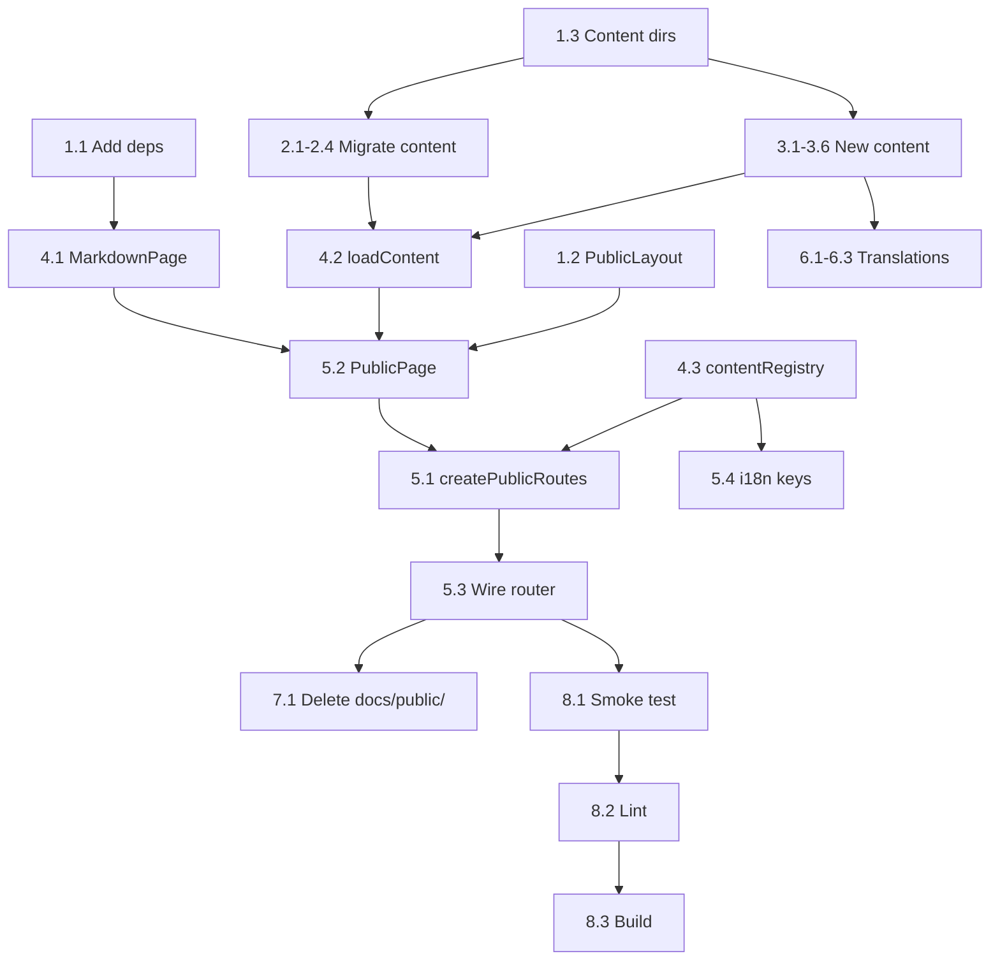

# 001 — Public Pages

**Date**: 2026-06-27
**Status**: planned
**Plan version**: 2

---

## Summary

Create public-facing pages served from the existing web app (`app.herobids.com`), replacing
content currently stored in `docs/public/`. Pages are organised into four top-level sections:
**help** and **company** (translated, `/:locale/` prefix) and **docs** and **legal**
(English-only, no locale prefix). After migration, `docs/public/` is deleted.

## Design decisions (already settled)

| Decision | Choice | Rationale |
|---|---|---|
| Host | `app.herobids.com` (existing web app) | Reuses i18n infra, single deploy, shared UI |
| Auth | None — fully public | These are marketing/support pages |
| Translated sections | `help`, `company` | Onboarding + trust content; high user-facing ROI |
| English-only sections | `docs`, `legal` | Technical reference (low translation ROI) + legal liability |
| Translated URL pattern | `/:locale/help/…` | Standard i18n prefix |
| English-only URL pattern | `/docs/…`, `/legal/…` | No prefix = honest signal of no translations |
| Content storage | Per-locale markdown files in `apps/web/src/features/public-pages/content/` | Simple, Git-versioned, easy for non-devs via PR |
| Markdown rendering | `react-markdown` + `remark-gfm` | Lightweight, standard, handles GFM tables/links |
| Docs category nesting | `docs/ai/`, `docs/messaging/telegram/` | No redundant `product/` layer |

## Target URL map

```
app.herobids.com/
├── /:locale/help/get-started          ← translate
├── /:locale/help/faqs                 ← translate (from docs/public/help/faqs.md)
├── /:locale/help/pricing              ← translate
├── /:locale/company/about-us          ← translate
├── /:locale/company/contact-us        ← translate
├── /docs/ai/agent-style               ← English-only (from docs/public/documentation/agent-style.md)
├── /docs/agents/billing-limits         ← English-only (from docs/public/documentation/agents/billing-limits.md)
├── /docs/messaging/telegram/reply-threading  ← English-only (from docs/public/documentation/telegram/)
├── /docs/messaging/telegram/slash-commands   ← English-only (from docs/public/documentation/telegram/)
├── /legal/privacy-policy               ← English-only (new)
└── /legal/user-agreement               ← English-only (new)
```

---

## Implementation Tasks

### Phase 1 — Dependencies & Scaffolding

#### 1.1 Add `react-markdown` and `remark-gfm`

- **File**: `apps/web/package.json`
- **Action**: Add `react-markdown` ^9, `remark-gfm` ^4 as dependencies
- **Depends on**: nothing
- **Validate**: `pnpm install` succeeds

#### 1.2 Create `PublicLayout` component

- **File**: `apps/web/src/features/public-pages/PublicLayout.tsx` (new)
- **Action**: Create a minimal layout wrapper for public pages — NO auth gate. Include:
  - A slim top nav with logo (link to `/`) and locale switcher (only shown for translated sections)
  - A content area with a `prose`-style container for markdown
  - A minimal footer
  - Wraps children in `I18nProvider`-compatible tree (already provided by `App.tsx`)
- **Depends on**: nothing
- **Validate**: Renders children without auth redirect

#### 1.3 Create markdown content directory

- **File**: `apps/web/src/features/public-pages/content/` (new directory tree)
- **Action**: Create the directory structure:

```
content/
  help/
    en/   get-started.md, faqs.md, pricing.md
    ar/   get-started.md, faqs.md, pricing.md
    hi/   get-started.md, faqs.md, pricing.md
  company/
    en/   about-us.md, contact-us.md
    ar/   about-us.md, contact-us.md
    hi/   about-us.md, contact-us.md
  docs/
    ai/              agent-style.md
    agents/          billing-limits.md
    messaging/telegram/  reply-threading.md, slash-commands.md
  legal/
    privacy-policy.md
    user-agreement.md
```

- **Depends on**: nothing
- **Validate**: All dirs created, empty placeholder `.md` files present

---

### Phase 2 — Content Migration (existing content)

#### 2.1 Migrate `docs/public/documentation/agent-style.md`

- **Source**: `docs/public/documentation/agent-style.md`
- **Dest**: `apps/web/src/features/public-pages/content/docs/ai/agent-style.md`
- **Action**: Copy content. Remove the link to `/help/faqs#scout-judge-escalation` (cross-section link — replace with relative anchor or plain text). Adapt any relative links.
- **Depends on**: 1.3

#### 2.2 Migrate `docs/public/documentation/telegram/*`

- **Source**: `docs/public/documentation/telegram/reply-threading.md`, `slash-commands.md`
- **Dest**: `apps/web/src/features/public-pages/content/docs/messaging/telegram/`
- **Action**: Copy both files. No content changes needed.
- **Depends on**: 1.3

#### 2.3 Migrate `docs/public/help/faqs.md`

- **Source**: `docs/public/help/faqs.md`
- **Dest**: `apps/web/src/features/public-pages/content/help/en/faqs.md`
- **Action**: Copy content as the English source. This is the canonical version for translators.
- **Depends on**: 1.3

#### 2.4 Migrate `docs/public/documentation/agents/billing-limits.md`

- **Source**: `docs/public/documentation/agents/billing-limits.md`
- **Dest**: `apps/web/src/features/public-pages/content/docs/agents/billing-limits.md`
- **Action**: Copy content. No content changes needed — the document already references the Billing page in-app and uses clear, self-contained language.
- **Depends on**: 1.3

---

### Phase 3 — Create New Content

#### 3.1 Write `help/en/get-started.md`

- **File**: `apps/web/src/features/public-pages/content/help/en/get-started.md` (new)
- **Action**: Write a getting-started guide covering:
  - What HeroBids is (1-2 sentences)
  - Sign-up flow (link account, configure first trading instance)
  - Linking Telegram
  - Running your first agent
  - Where to go next (link to `/help/faqs`, `/docs/ai/agent-style`)
- **Content scope**: ~300-500 words, beginner-friendly
- **Depends on**: 1.3

#### 3.2 Write `help/en/pricing.md`

- **File**: `apps/web/src/features/public-pages/content/help/en/pricing.md` (new)
- **Action**: Write a pricing page covering:
  - Agent runtime costs (simple, per-minute model)
  - LLM costs (how the budget works, style tiers: Careful/Balanced/Bold)
  - How to estimate monthly spend
  - No hidden fees
- **Content scope**: ~300 words, transparent
- **Depends on**: 1.3
- **Note**: The internal `docs/product/cost.md` is NOT public-facing; do NOT use its content. Write fresh public-facing pricing copy.

#### 3.3 Write `company/en/about-us.md`

- **File**: `apps/web/src/features/public-pages/content/company/en/about-us.md` (new)
- **Action**: Write an about page covering:
  - Mission / what HeroBids does
  - AI-first approach to trading
  - Team / company background (keep high-level)
- **Content scope**: ~200-300 words
- **Depends on**: 1.3

#### 3.4 Write `company/en/contact-us.md`

- **File**: `apps/web/src/features/public-pages/content/company/en/contact-us.md` (new)
- **Action**: Write a contact page:
  - Email: `admin@herobids.com` (used in Caddyfile already)
  - Telegram support channel (if exists)
  - Response time expectations
- **Content scope**: ~150 words
- **Depends on**: 1.3

#### 3.5 Write `legal/privacy-policy.md`

- **File**: `apps/web/src/features/public-pages/content/legal/privacy-policy.md` (new)
- **Action**: Write a privacy policy covering:
  - Data collected (email, Telegram chat ID, trading activity)
  - How data is used (service operation, not sold)
  - Data storage (PostgreSQL, Redis)
  - Third-party services (LLM providers, venue APIs)
  - User rights (data export, deletion)
- **Content scope**: ~500-800 words. Use clear, plain language — not dense legalese.
- **⚠️ RISK**: This is a legal document. Placeholder content is fine for dev, but **must be reviewed by legal counsel before production**. Mark the file with a comment banner: `<!-- LEGAL REVIEW REQUIRED BEFORE PRODUCTION -->`
- **Depends on**: 1.3

#### 3.6 Write `legal/user-agreement.md`

- **File**: `apps/web/src/features/public-pages/content/legal/user-agreement.md` (new)
- **Action**: Write a terms of service covering:
  - Acceptance of terms
  - Service description (algorithmic trading platform)
  - User responsibilities (own trading decisions, risks)
  - Limitation of liability
  - Termination
- **Content scope**: ~500-800 words.
- **⚠️ RISK**: Same as privacy policy — **legal review required**.
- **Depends on**: 1.3

---

### Phase 4 — Build the Render Pipeline

#### 4.1 Create `MarkdownPage` component

- **File**: `apps/web/src/features/public-pages/MarkdownPage.tsx` (new)
- **Action**: Generic component that:
  - Accepts `content: string` (raw markdown) and `title: string`
  - Renders `<PageShell>` with the markdown content via `react-markdown` + `remark-gfm`
  - Applies Tailwind `prose` classes for typography
  - Sets `document.title`
  - Handles not-found state (if content is null/empty)
- **Depends on**: 1.1
- **Validate**: Renders markdown with tables (agent-style table), code blocks, links

#### 4.2 Create content loader utility

- **File**: `apps/web/src/features/public-pages/loadContent.ts` (new)
- **Action**: 
  - `loadContent(section, page, locale?)` — uses dynamic `import()` to load `.md` files as raw strings
  - For English-only sections: `loadContent('docs', 'ai/agent-style')`
  - For translated sections: `loadContent('help', 'faqs', 'ar')`
  - Falls back to `en` if the requested locale's file doesn't exist
  - Returns `{ content: string, title: string }` or `null` if not found
  - Uses Vite's `import.meta.glob` or explicit dynamic imports
- **Depends on**: 1.3
- **Validate**: Returns correct content for valid paths, null for invalid

#### 4.3 Create the content registry (route → content mapping)

- **File**: `apps/web/src/features/public-pages/contentRegistry.ts` (new)
- **Action**: Define the mapping of URL paths to content files:

```ts
export const PUBLIC_PAGE_REGISTRY = {
  // Translated sections
  help: {
    translated: true,
    pages: {
      'get-started': { titleKey: 'public.help.getStarted' },
      'faqs':         { titleKey: 'public.help.faqs' },
      'pricing':      { titleKey: 'public.help.pricing' },
    },
  },
  company: {
    translated: true,
    pages: {
      'about-us':   { titleKey: 'public.company.aboutUs' },
      'contact-us': { titleKey: 'public.company.contactUs' },
    },
  },
  // English-only sections
  docs: {
    translated: false,
    pages: {
      'ai/agent-style':                    { title: 'Agent Style' },
      'agents/billing-limits':              { title: 'Agent Billing Limits' },
      'messaging/telegram/reply-threading':  { title: 'Telegram Reply Threading' },
      'messaging/telegram/slash-commands':   { title: 'Telegram Slash Commands' },
    },
  },
  legal: {
    translated: false,
    pages: {
      'privacy-policy':  { title: 'Privacy Policy' },
      'user-agreement':  { title: 'User Agreement' },
    },
  },
} as const;
```

- **Depends on**: nothing
- **Validate**: TypeScript compiles; registry is exhaustive

---

### Phase 5 — Routing

#### 5.1 Create route helper for public pages

- **File**: `apps/web/src/features/public-pages/createPublicRoutes.tsx` (new)
- **Action**: Function that generates route objects from the registry:

```tsx
// Generates:
//   /:locale/help/faqs        → <PublicPage section="help" page="faqs" />
//   /:locale/help/get-started → <PublicPage section="help" page="get-started" />
//   ...
//   /docs/ai/agent-style      → <PublicPage section="docs" page="ai/agent-style" />
//   /legal/privacy-policy     → <PublicPage section="legal" page="privacy-policy" />
```

- Two route patterns:
  1. `/:locale/${section}/${page}` for `translated: true`
  2. `/${section}/${page}` for `translated: false`
- Validates `:locale` against `SUPPORTED_LOCALES`; redirects unsupported locales to `en`
- **Depends on**: 4.3
- **Validate**: All routes are generated and resolvable

#### 5.2 Create `PublicPage` page component

- **File**: `apps/web/src/features/public-pages/PublicPage.tsx` (new)
- **Action**: The single page component for all public pages:
  - Reads `section` and `page` from route params (and `locale` for translated)
  - Calls `loadContent(section, page, locale)` 
  - If content found → renders `<MarkdownPage>`
  - If not found → renders a "page not available in this language" notice with fallback link to English
  - Sets `<title>` from registry
  - Wraps in `<PublicLayout>`
- **Depends on**: 4.1, 4.2, 1.2, 4.3
- **Validate**: Renders each page type correctly

#### 5.3 Wire routes into the app router

- **File**: `apps/web/src/app/router.tsx`
- **Action**: Add public page routes **outside** the `RootLayout` auth gate:

```tsx
// Add before the existing RootLayout route group:
...createPublicRoutes(),

// Existing auth-gated routes (unchanged):
{
  path: '/',
  element: <RootLayout />,
  children: [ ... ],
},
```

- **Depends on**: 5.1, 5.2
- **Validate**: Visiting `/help/faqs` without auth renders the page. `/en/help/faqs` also works.

#### 5.4 Add public page i18n message keys

- **File**: `apps/web/src/app/i18n/locales/en.ts` (and `ar.ts`, `hi.ts`)
- **Action**: Add message keys for public page titles and UI:
  - `public.help.getStarted`, `public.help.faqs`, `public.help.pricing`
  - `public.company.aboutUs`, `public.company.contactUs`
  - `public.notAvailableInLanguage`, `public.viewInEnglish`
  - `public.nav.help`, `public.nav.company`, `public.nav.docs`, `public.nav.legal`
- **Depends on**: 4.3
- **Validate**: All keys present in all 3 locale files

---

### Phase 6 — Translations (ar, hi)

#### 6.1 Create Arabic translations of help pages

- **Files**: `content/help/ar/get-started.md`, `content/help/ar/faqs.md`, `content/help/ar/pricing.md`
- **Action**: Arabic translations of the English originals.
- **⚠️ NOTE**: If human translators are not immediately available, create placeholder files with:
  ```md
  <!-- TODO: Arabic translation pending -->
  [English content as fallback]
  ```
  The `loadContent` fallback to `en` handles this gracefully.
- **Depends on**: 2.3, 3.1, 3.2

#### 6.2 Create Hindi translations of help pages

- **Files**: `content/help/hi/get-started.md`, `content/help/hi/faqs.md`, `content/help/hi/pricing.md`
- **Action**: Same as 6.1 for Hindi.
- **Depends on**: 2.3, 3.1, 3.2

#### 6.3 Create Arabic/Hindi translations of company pages

- **Files**: `content/company/ar/`, `content/company/hi/`
- **Action**: Same pattern as 6.1/6.2. Placeholder files with English fallback if translators unavailable.
- **Depends on**: 3.3, 3.4

---

### Phase 7 — Cleanup

#### 7.1 Delete `docs/public/`

- **Action**: `rm -rf docs/public/`
- **Depends on**: 2.1, 2.2, 2.3, 2.4 (all content migrated)
- **Validate**: No imports or references to `docs/public/` remain in the codebase (`grep -r "docs/public"` returns empty)

#### 7.2 Add Vite markdown raw import support

- **File**: `apps/web/src/vite-env.d.ts` or a new `.d.ts`
- **Action**: Add type declaration for `*.md` imports as `string`:

```ts
declare module '*.md' {
  const content: string;
  export default content;
}
```

- **Depends on**: 4.2 (needed for dynamic markdown imports)
- **Validate**: TypeScript compiles without errors on `import content from './file.md?raw'`

---

### Phase 8 — Verification

#### 8.1 Dev server smoke test

- **Action**: Start `pnpm dev` in `apps/web/` and manually verify:
  - `/en/help/faqs` renders the FAQ markdown
  - `/en/help/get-started` renders the getting-started guide
  - `/en/help/pricing` renders the pricing page
  - `/en/company/about-us` renders
  - `/en/company/contact-us` renders
  - `/docs/ai/agent-style` renders the agent style table
  - `/docs/agents/billing-limits` renders the billing limits docs
  - `/docs/messaging/telegram/reply-threading` renders
  - `/docs/messaging/telegram/slash-commands` renders
  - `/legal/privacy-policy` renders
  - `/legal/user-agreement` renders
  - `/ar/help/faqs` falls back to English content (until translations exist)
  - `/hi/help/faqs` falls back to English content
  - Non-existent locale like `/zz/help/faqs` redirects or 404s
  - Non-existent page like `/help/nonexistent` shows 404

#### 8.2 Lint

- **Action**: `pnpm lint`
- **Validate**: Zero errors

#### 8.3 Build

- **Action**: `pnpm build` (at root or `pnpm --filter @herobids/web build`)
- **Validate**: Production build succeeds, no warnings about missing imports

---

## Test strategy

| What | How | When |
|---|---|---|
| `loadContent` function | Unit test: valid paths return content, invalid return null, locale fallback works | Phase 4 |
| `contentRegistry` exhaustiveness | Unit test: every key in registry maps to an existing markdown file | Phase 4 |
| `PublicPage` renders | Unit test (vitest + testing-library): renders markdown content for each section | Phase 5 |
| `PublicLayout` no auth gate | Unit test: renders without SessionProvider, no redirect | Phase 1 |
| i18n message keys present | Existing `i18n-regressions.test.ts` pattern — verify all 3 locales have all public page keys | Phase 5 |
| Route generation | Unit test: `createPublicRoutes()` produces the expected number of route objects | Phase 5 |
| Smoke test all pages | Manual browser verification | Phase 8 |

---

## Risks & open questions

| Risk | Severity | Mitigation |
|---|---|---|
| Legal pages (privacy, terms) are placeholder content | **HIGH** | Banner comments in files; legal review gate before production deploy |
| Arabic/Hindi translations not ready at launch | **LOW** | English fallback via `loadContent` means pages work immediately in all locales |
| `react-markdown` bundle size | **LOW** | ~15 KB gzipped; lazy-loaded per public page route — not in app shell |
| Markdown links may break when content moves | **LOW** | Audit all relative links in migrated content (Phase 2); use `remark-gfm` for standard link syntax |
| Vite dynamic import of `.md` files with locale variables | **MEDIUM** | `import.meta.glob` supports patterns like `./content/**/*.md` — test early in Phase 4. Fallback: explicit import map per file. |
| `app.herobids.com` domain setup | **LOW** | Separate infra task (DNS A record + Caddyfile + env vars); not in this plan's scope |

---

## Out of scope

- `app.herobids.com` DNS and Caddy setup (separate infra task)
- SEO meta tags / Open Graph (follow-up)
- Search functionality for docs (follow-up)
- Content versioning or CMS integration (follow-up)
- Anchor heading links in rendered markdown (nice-to-have, follow-up)

---

## Task dependency graph



## Total new files

| File | Purpose |
|---|---|
| `apps/web/src/features/public-pages/PublicLayout.tsx` | Layout (no auth) |
| `apps/web/src/features/public-pages/MarkdownPage.tsx` | Markdown renderer |
| `apps/web/src/features/public-pages/PublicPage.tsx` | Page component |
| `apps/web/src/features/public-pages/loadContent.ts` | Content loader |
| `apps/web/src/features/public-pages/contentRegistry.ts` | Route→content mapping |
| `apps/web/src/features/public-pages/createPublicRoutes.tsx` | Route generator |
| `apps/web/src/features/public-pages/content/help/en/get-started.md` | New content |
| `apps/web/src/features/public-pages/content/help/en/faqs.md` | Migrated content |
| `apps/web/src/features/public-pages/content/help/en/pricing.md` | New content |
| `apps/web/src/features/public-pages/content/help/ar/get-started.md` | Translation |
| `apps/web/src/features/public-pages/content/help/ar/faqs.md` | Translation |
| `apps/web/src/features/public-pages/content/help/ar/pricing.md` | Translation |
| `apps/web/src/features/public-pages/content/help/hi/get-started.md` | Translation |
| `apps/web/src/features/public-pages/content/help/hi/faqs.md` | Translation |
| `apps/web/src/features/public-pages/content/help/hi/pricing.md` | Translation |
| `apps/web/src/features/public-pages/content/company/en/about-us.md` | New content |
| `apps/web/src/features/public-pages/content/company/en/contact-us.md` | New content |
| `apps/web/src/features/public-pages/content/company/ar/about-us.md` | Translation |
| `apps/web/src/features/public-pages/content/company/ar/contact-us.md` | Translation |
| `apps/web/src/features/public-pages/content/company/hi/about-us.md` | Translation |
| `apps/web/src/features/public-pages/content/company/hi/contact-us.md` | Translation |
| `apps/web/src/features/public-pages/content/docs/ai/agent-style.md` | Migrated content |
| `apps/web/src/features/public-pages/content/docs/agents/billing-limits.md` | Migrated content |
| `apps/web/src/features/public-pages/content/docs/messaging/telegram/reply-threading.md` | Migrated content |
| `apps/web/src/features/public-pages/content/docs/messaging/telegram/slash-commands.md` | Migrated content |
| `apps/web/src/features/public-pages/content/legal/privacy-policy.md` | New content |
| `apps/web/src/features/public-pages/content/legal/user-agreement.md` | New content |

## Files to modify

| File | Change |
|---|---|
| `apps/web/package.json` | Add `react-markdown`, `remark-gfm` |
| `apps/web/src/app/router.tsx` | Add public page routes outside auth gate |
| `apps/web/src/app/i18n/locales/en.ts` | Add public page message keys |
| `apps/web/src/app/i18n/locales/ar.ts` | Add public page message keys |
| `apps/web/src/app/i18n/locales/hi.ts` | Add public page message keys |
| `apps/web/src/vite-env.d.ts` | Add `*.md` module declaration |

## Files to delete

| File/Dir | Reason |
|---|---|
| `docs/public/` (entire directory) | Content migrated to web app |
