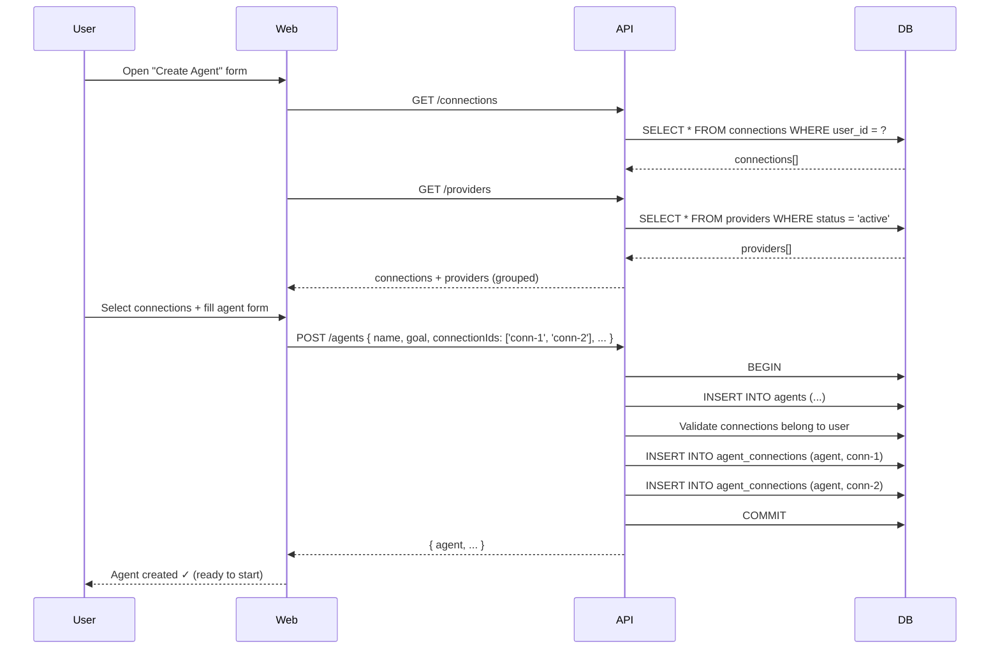

# Generalize Credentials & Agent Connection Assignment

## Goal

Simplify how agents get access to external platforms. Users create connections once, assign them to agents during creation (multi-select), and the agent can use those connections. No separate "capability grants" — a connection IS the capability. What the agent does with access is controlled by its tools.

## Prerequisites

- **002-merge-connections-bindings** — completed (single `connections` table, no `trading_bindings`)
- **003-move-venue-to-trading-setup** — completed (venue derived from connection)

## Design Decisions (Confirmed)

| Question | Answer |
|---|---|
| Grant model | **`agent_connections`** — simple join table (no `capabilityFamily`). A connection implicitly grants all capabilities the provider supports. Fine-grained access control is via `toolPolicy`. |
| Non-trading in Phase 2 | Yes — connection picker is generic (all provider types) |
| Provider registry | DB table (`providers`) |
| Multi-connection per agent | Yes — multi-select at creation |
| Provider seed data | Trading providers only (hyperliquid, jupiter, 1inch, bybit) |
| Connection without credential | No — credential required at creation (current behaviour) |
| Failure mode on create | Atomic — if any `connectionId` is invalid, reject entire `POST /agents` |

---

## Phase 1: Generalize the Credential + Connection Model

### 1.1 — Create `providers` Table

A DB table registering supported external platforms. Operator-seeded, runtime-queryable.

```sql
CREATE TABLE providers (
  id              text PRIMARY KEY,          -- e.g. 'hyperliquid', 'gmail', 'twitter'
  name            text NOT NULL,             -- display name: "Hyperliquid", "Gmail"
  category        text NOT NULL,             -- 'trading' | 'email' | 'social' | 'automation' | 'messaging'
  auth_method     text NOT NULL,             -- 'api_key' | 'oauth2' | 'private_key'
  credential_fields jsonb NOT NULL,          -- required fields: ["apiKey","secret","walletAddress"]
  capabilities    jsonb NOT NULL DEFAULT '[]', -- capability families: ["trading","read-market-data"]
  venue_type      text,                      -- for trading: 'orderbook' | 'swap' | null
  status          text NOT NULL DEFAULT 'active', -- 'active' | 'deprecated'
  meta            jsonb,                     -- OAuth endpoints, docs URL, icon URL, etc.
  created_at      timestamptz NOT NULL DEFAULT now(),
  updated_at      timestamptz NOT NULL DEFAULT now()
);
```

**Seed data:**

| id | name | category | auth_method | credential_fields | capabilities | venue_type |
|---|---|---|---|---|---|---|
| `hyperliquid` | Hyperliquid | trading | api_key | `["apiKey","secret","walletAddress"]` | `["trading"]` | orderbook |
| `jupiter` | Jupiter | trading | private_key | `["privateKey"]` | `["trading"]` | swap |
| `1inch` | 1inch | trading | private_key | `["privateKey"]` | `["trading"]` | swap |
| `bybit` | Bybit | trading | api_key | `["apiKey","secret"]` | `["trading"]` | orderbook |

Non-trading providers (gmail, twitter, zapier) will be added when their respective skill implementations land — not preemptively seeded.

### 1.2 — Rename `user_credentials.venue` → `provider`

Already planned in 002-merge. Confirm it's done. If not, execute:

- Schema: `packages/db/src/schema/user-credentials.ts` — rename column
- Domain: update any `venue` references in credential-related types
- API: `apps/api/src/routes/credentials.ts` — rename field in request/response
- Web: `apps/web/src/features/credentials/` — update forms and API types

### 1.3 — Add `connections.provider_id` FK (Optional — Soft Reference)

After Phase 0, `connections.provider` is a free-text string. Add a soft FK to `providers.id` for validation but keep it as a text field (no hard FK constraint — allows connections to exist for providers not yet in the registry during migration).

**Decision:** Validate `provider` against the `providers` table at connection-creation time in the API layer (Zod refinement), but do NOT add a database FK. This avoids migration pain and allows the providers table to be seeded/updated independently.

### 1.4 — Replace `capability_grants` with `agent_connections`

Drop `capability_grants` (and `capability_grant_audit`). Replace with a simpler join table:

```sql
CREATE TABLE agent_connections (
  id              text PRIMARY KEY,            -- UUIDv7
  agent_id        text NOT NULL REFERENCES agents(id) ON DELETE CASCADE,
  connection_id   text NOT NULL REFERENCES connections(id) ON DELETE RESTRICT,
  status          text NOT NULL DEFAULT 'active',  -- 'active' | 'revoked'
  granted_by      text NOT NULL,               -- userId of the granter
  granted_at      timestamptz NOT NULL DEFAULT now(),
  revoked_at      timestamptz,
  created_at      timestamptz NOT NULL DEFAULT now(),
  updated_at      timestamptz NOT NULL DEFAULT now()
);

CREATE INDEX idx_agent_connections_agent_id ON agent_connections(agent_id);
CREATE INDEX idx_agent_connections_connection_id ON agent_connections(connection_id);
CREATE INDEX idx_agent_connections_status ON agent_connections(status);
-- One active link per (agent, connection) pair:
CREATE UNIQUE INDEX uq_agent_connections_active
  ON agent_connections(agent_id, connection_id) WHERE status = 'active';
```

**No `capabilityFamily` column.** The capability is a property of the provider (looked up via `connections.provider → providers.capabilities`), not of the join row.

**What tool access looks like at runtime:**

1. Tool declares which provider it needs (e.g. tool `submit_decision` needs a `trading` provider)
2. Runtime: SELECT from `agent_connections` JOIN `connections` JOIN `providers` WHERE `agent_id = ?` AND `providers.capabilities @> '["trading"]'` AND `status = 'active'`
3. If found → decrypt credentials → execute
4. If not → return `{ success: false, errorCode: 'connection.missing' }`

**Readiness resolution changes:**

```ts
// Old: find capabilityGrant WHERE agentId AND capabilityFamily = 'trading'
// New: find agent_connections WHERE agentId AND status = 'active'
//      JOIN connections → providers
//      WHERE providers.capabilities includes 'trading'
```

**Audit:** `agent_connection_audit` (optional, same structure as old `capability_grant_audit` minus family):

```sql
CREATE TABLE agent_connection_audit (
  id              text PRIMARY KEY,
  agent_connection_id text NOT NULL REFERENCES agent_connections(id) ON DELETE CASCADE,
  action          text NOT NULL,               -- 'granted' | 'revoked'
  actor_type      text NOT NULL,               -- 'user' | 'agent' | 'platform'
  actor_id        text NOT NULL,
  reason          text,
  detail          jsonb,
  created_at      timestamptz NOT NULL DEFAULT now()
);
```

### 1.5 — Document Provider Capabilities

The `providers.capabilities` JSONB array encodes what a provider supports. Known values:

| Capability | Description | Providers |
|---|---|---|
| `trading` | Place orders, manage positions | hyperliquid, jupiter, 1inch, bybit |
| `email` | Send/read emails | gmail (future) |
| `social` | Post/read social media | twitter (future) |
| `automation` | Trigger external workflows | zapier, n8n (future) |
| `messaging` | Send messages via chat platforms | telegram (future) |

These are NOT stored on the join table — they're derived from the provider at query time.

### 1.6 — API: Expose Provider Registry

```
GET /providers
  → { providers: Provider[] }

GET /providers/:id
  → Provider
```

Accessible to authenticated users. Returns all `status='active'` providers. Used by the frontend to:
- Drive the credential creation form (which fields to show)
- Drive the connection picker (provider icons, names, categories)
- Derive venue/venueType from provider metadata (replaces hardcoded `VENUE_TYPE_MAP`)

### 1.7 — Frontend: Use Provider Registry

Replace hardcoded `PROVIDER_TEMPLATES` and `VENUE_TYPE_MAP` with API-driven data:

| Current | Replacement |
|---|---|
| `PROVIDER_TEMPLATES` in `credentials-templates.ts` | Fetch from `GET /providers` → `credentialFields` |
| `VENUE_TYPE_MAP` in `venue-mapping.ts` | Fetch from `GET /providers` → `venueType` |
| Hardcoded venue dropdown options | Derive from `providers.category === 'trading'` |

Cache in React Query with a long stale time (providers rarely change).

### 1.8 — Domain: Provider Type

```ts
// packages/domain/src/provider.ts
export interface Provider {
  id: string;
  name: string;
  category: 'trading' | 'email' | 'social' | 'automation' | 'messaging';
  authMethod: 'api_key' | 'oauth2' | 'private_key';
  credentialFields: string[];
  capabilities: string[];  // capability families this provider supports
  venueType: 'orderbook' | 'swap' | null;
  status: 'active' | 'deprecated';
  meta: Record<string, unknown> | null;
}
```

---

## Phase 2: Connection Assignment During Agent Creation

### 2.1 — API: Accept `connectionIds` on `POST /agents`

Extend the create-agent endpoint to accept an optional array of connection IDs:

```ts
// In the create-agent Zod schema
connectionIds: z.array(z.string()).optional(), // connections to assign to agent
```

**Backend logic (within the same transaction):**

1. Validate each `connectionId` exists, belongs to `request.userId`, and has `status='active'`
2. If any validation fails → reject entire request (atomic)
3. Create one `agent_connections` row per connection:
   - `agentId` = newly created agent
   - `connectionId` = the connection
   - `status` = `'active'`
   - `grantedBy` = `request.userId`

**Response:** Agent response unchanged. Connections are queryable via `GET /agents/:id/connections` (new) or the existing readiness endpoint (updated).

### 2.2 — API: Accept `connectionIds` on `PATCH /agents/:id`

Allow updating connections via the same mechanism:

- New connections in `connectionIds` that don't have active rows → create `agent_connections`
- Existing active rows for connections NOT in `connectionIds` → set `status='revoked'`, `revokedAt=now()`
- Already-active rows → no-op

This makes the connection list declarative — "these are the connections I want this agent to have."

### 2.3 — API: Update Readiness Resolution

The existing `GET /agents/:agentId/capabilities/readiness` endpoint changes:

```ts
// Old: query capability_grants WHERE agentId AND capabilityFamily = 'trading'
// New: query agent_connections JOIN connections JOIN providers
//      WHERE agentId AND agent_connections.status = 'active'
//      GROUP BY provider capability to determine which families are "ready"
```

The response shape stays the same (array of `CapabilityReadiness` objects per family). The difference is how "family" is determined — derived from provider metadata, not stored on the grant.

### 2.3 — Frontend: Connection Multi-Select in Agent Creation

**Location:** Trading Setup section (or a new "Connections" step for non-trading agents).

**UI behavior:**

```
┌─────────────────────────────────────────────────────────┐
│ Connections                                              │
│                                                         │
│ Select which platform connections this agent can use:   │
│                                                         │
│ ┌─ Trading ──────────────────────────────────────────┐  │
│ │ ☑ My Hyperliquid Account  (hyperliquid)           │  │
│ │ ☐ Jupiter Wallet          (jupiter)               │  │
│ └────────────────────────────────────────────────────┘  │
│                                                         │
│ [+ Create new connection]                               │
│                                                         │
│ ℹ️ Agent can start without connections. You can add     │
│   them later from the agent's Capabilities page.       │
└─────────────────────────────────────────────────────────┘
```

**Data flow:**

1. Query `GET /connections` (user's active connections)
2. Group by `provider.category` (query `GET /providers` for metadata)
3. Multi-select checkboxes
4. Selected IDs → `connectionIds` array in `buildCreateAgentPayload()`
5. If none selected → `connectionIds` omitted (agent starts without grants)

**Inline creation:** The existing "Create new connection" flow (`ProviderSetupForm`) opens as a modal/inline form. On success, the new connection appears in the list pre-selected.

### 2.4 — Frontend: Remove Separate "Bind" Step Post-Creation

Currently the flow is:
1. Create agent
2. Navigate to Capabilities page
3. Click "Bind" on a connection

After this change, connections are selected AT creation. The Capabilities page still supports bind/unbind for post-creation changes, but the primary path is creation-time selection.

**Deprecation:** Remove the post-creation redirect/prompt that says "Now bind a connection". The agent creation success screen no longer mentions this step.

### 2.5 — Frontend: "No Connections" Inline Setup

If the user has zero connections when creating an agent:

```
┌─────────────────────────────────────────────────────────┐
│ Connections                                              │
│                                                         │
│ You don't have any platform connections yet.            │
│                                                         │
│ [Set up a connection] ← opens ProviderSetupForm        │
│                                                         │
│ Or skip — you can add connections later.               │
└─────────────────────────────────────────────────────────┘
```

This is NOT blocking. The user can proceed without connections.

### 2.6 — API: Validate Provider-Execution Mode Compatibility

When `connectionIds` includes a trading provider and `executionMode` is `live`/`shadow`:
- Validate the connection has a credential (`credential_id IS NOT NULL`)
- Validate connection status is `active`

For `paper` mode: no validation — paper agents can trade without real credentials (existing behaviour).

### 2.7 — Venue Derivation from Selected Connections

When the user selects one or more trading connections, derive venue from the first trading connection's provider (same logic as 003-move-venue-to-trading-setup). If multiple trading connections with different providers are selected, use the first one for the primary venue and store all venues for multi-venue support (future).

**Rule:** The venue derivation logic in 003 stays the same. The only change is WHERE the `connectionId` comes from — instead of a separate "Where to trade" dropdown that queries connections, the connection multi-select IS the source.

### 2.8 — Merge "Where to Trade" into Connection Picker

Post-Phase 2, the "Where to trade" dropdown (from 003) becomes redundant — the connection picker already identifies the trading venue. Merge them:

- If the user selects a trading connection → venue is derived automatically (as before)
- If no trading connection selected + paper mode → show the venue fallback dropdown (existing behavior from 003)
- The "Where to trade" label becomes the header for the trading connections group

---

## File-by-File Change Summary

### Phase 1

| Layer | Action | File | What |
|---|---|---|---|
| Schema | New | `packages/db/src/schema/providers.ts` | `providers` table definition |
| Schema | New | `packages/db/src/schema/agent-connections.ts` | `agent_connections` table (replaces `capability_grants`) |
| Schema | New | `packages/db/src/schema/agent-connection-audit.ts` | Audit table |
| Schema | Delete | `packages/db/src/schema/capability-grants.ts` | Removed — replaced by `agent_connections` |
| Schema | Delete | `packages/db/src/schema/capability-grant-audit.ts` | Removed — replaced by `agent_connection_audit` |
| Schema | Edit | `packages/db/src/schema/index.ts` | Export new tables, remove old |
| Migration | New | `packages/db/drizzle/XXXX_providers_and_agent_connections.sql` | Create `providers` + seed; create `agent_connections` + audit; migrate data from `capability_grants`; drop old tables |
| Domain | New | `packages/domain/src/provider.ts` | `Provider` interface |
| Domain | Edit | `packages/domain/src/platform.ts` | Replace `CapabilityGrant` interface with `AgentConnection`; update `CapabilityReadiness` (remove `bindingId`, keep `connectionId`) |
| Domain | Edit | `packages/domain/src/index.ts` | Export provider types |
| API | New | `apps/api/src/routes/providers.ts` | `GET /providers`, `GET /providers/:id` |
| API | Edit | `apps/api/src/routes/index.ts` | Register provider routes |
| API | Edit | `apps/api/src/routes/connections.ts` | Validate `provider` against DB on create |
| API | Edit | `apps/api/src/routes/capabilities/index.ts` | Readiness resolution queries `agent_connections` + `providers` |
| API | Edit | `apps/api/src/routes/capabilities/trading.ts` | Bind/unbind creates/revokes `agent_connections` rows |
| Worker | Edit | `apps/worker/src/agents/agent-intake-resolver.ts` | Query `agent_connections` → `connections` (was `capability_grants` → `trading_bindings`) |
| Web | Edit | `apps/web/src/lib/api-client.ts` | Add `providers()` query |
| Web | Edit | `apps/web/src/features/credentials/credentials-templates.ts` | Replace hardcoded templates with provider-driven |
| Web | Edit | `apps/web/src/features/agents/venue-mapping.ts` | Replace hardcoded map with provider query |

### Phase 2

| Layer | Action | File | What |
|---|---|---|---|
| API | Edit | `apps/api/src/routes/agents.ts` | Accept `connectionIds`, create `agent_connections` in same txn |
| API | Edit | `apps/api/src/routes/agents.ts` (PATCH) | Declarative connection update |
| Web | Edit | `apps/web/src/features/agents/agent-payloads.ts` | Add `connectionIds` to `CreateAgentIntentPayloadInput` and payload builder |
| Web | New | `apps/web/src/features/agents/ConnectionPicker.tsx` | Multi-select connection picker component |
| Web | Edit | `apps/web/src/features/agents/AgentsPage.tsx` | Replace single "Where to trade" dropdown with `ConnectionPicker`; merge venue derivation |
| Web | Edit | `apps/web/src/features/agents/EditAgentModal.tsx` | Add connection editing via same picker |
| Web | Edit | `apps/web/src/features/agents/AgentCapabilityPage.tsx` | Update bind/unbind to use `agent_connections` API |
| Web | Edit | `apps/web/src/lib/api-client.ts` | Update `createAgent` to pass `connectionIds` |

---

## Migration Notes

- The `providers` table is additive — no destructive changes to existing data.
- `capability_grants` is replaced by `agent_connections`. Migration:
  1. Create `agent_connections` + `agent_connection_audit`
  2. Copy rows from `capability_grants` → `agent_connections` (drop `capabilityFamily`)
  3. Copy rows from `capability_grant_audit` → `agent_connection_audit` (drop `action` values that reference family)
  4. Drop `capability_grants` + `capability_grant_audit`
- No backward-compatibility concerns (per project policy).
- Existing agents without connections continue to work — they show `unconfigured` readiness as before.

## Testing

| Test | What |
|---|---|
| Unit: `POST /agents` with `connectionIds` | Creates agent + `agent_connections` rows in one transaction; validates connection ownership |
| Unit: `POST /agents` with invalid `connectionIds` | Returns 400, agent NOT created (atomic) |
| Unit: `POST /agents` without `connectionIds` | Works fine — agent has no connections (unconfigured) |
| Unit: `PATCH /agents/:id` with `connectionIds` | Adds new rows, revokes removed ones |
| Unit: `GET /providers` | Returns seeded providers |
| Unit: Readiness resolution | Correctly derives readiness from `agent_connections` → `connections` → `providers` |
| Integration: Full flow | Create credential → create connection → create agent with connectionIds → readiness = ready |
| Worker: `AgentIntakeResolver` | Resolves execution context via `agent_connections` → `connections` |
| Web: ConnectionPicker | Renders grouped by category; multi-select works; inline creation works |

## Sequence Diagram



## Open Items (Deferred to Phase 3+)

- Agent self-provisioning (agent requests/creates credentials via tools)
- OAuth flow support for providers that use it
- Graceful degradation: agent notifies user of missing credentials at runtime
- Multi-venue trading (agent uses multiple trading connections simultaneously)
- Provider marketplace (user-contributed provider definitions)
