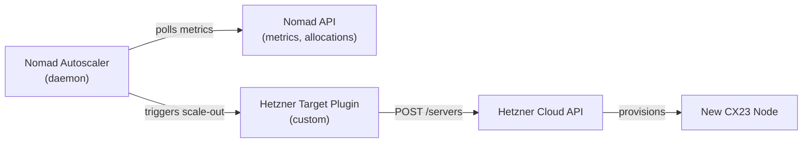
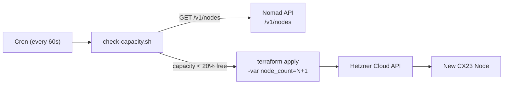
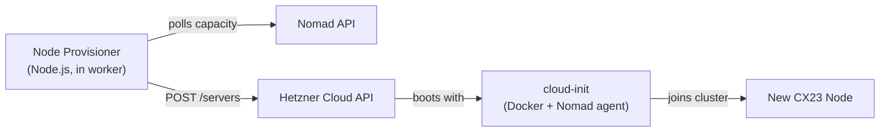
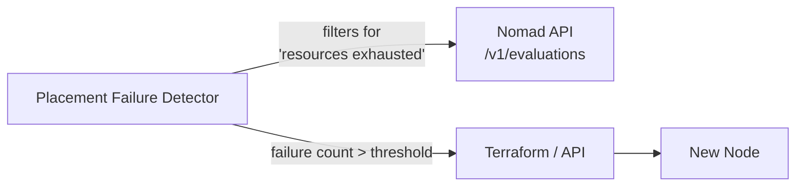
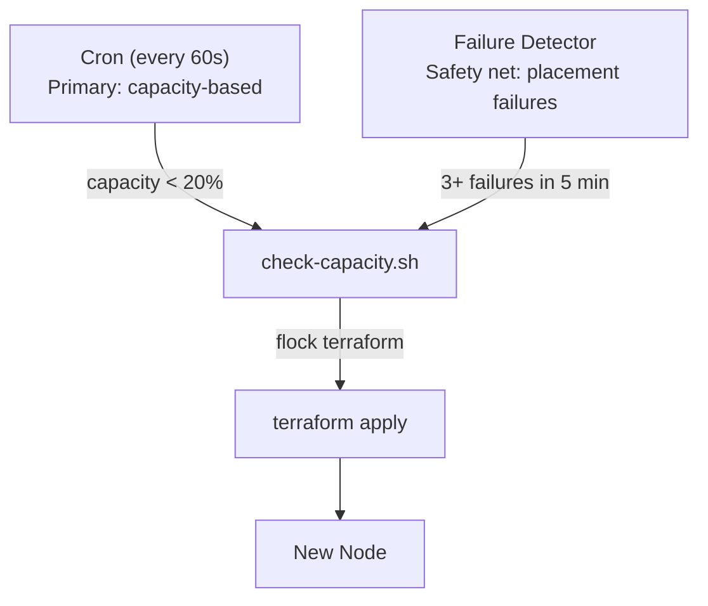

# Autoscaling Trigger Mechanism Comparison

## Status

`draft`

## Context

Feature 020 introduces Nomad-based orchestration for agent containers. As agent density fills available capacity, new Hetzner servers must be provisioned automatically. This document compares the trigger mechanisms that detect capacity exhaustion and initiate provisioning.

We evaluate four approaches:

| # | Approach | Mechanism |
|---|----------|-----------|
| 1 | Nomad Autoscaler | Nomad's built-in horizontal cluster autoscaling |
| 2 | Cron + Terraform | External script checks utilization → `terraform apply` |
| 3 | Hetzner API Direct | Custom provisioner calls Hetzner API + cloud-init |
| 4 | Node Problem Detector | Watch for "cannot place" scheduling failures |

## Constraints

- **Provider**: Hetzner Cloud (no native autoscaling groups, no managed K8s)
- **Provisioning time**: ~2–5 minutes from API call to Nomad-ready node (cloud-init installs Docker + Nomad)
- **Cost sensitivity**: Near-zero orchestration overhead; avoid per-node licensing
- **Operator simplicity**: One person must be able to understand and debug the scaling path
- **Failure mode**: Over-provisioning is cheap (€8–15/mo per idle CX23). Under-provisioning blocks agent creation — the worse failure.

## Decision Factors

Each approach is evaluated across these dimensions:

| Factor | Weight | Description |
|--------|--------|-------------|
| **Reactivity** | High | How quickly does it detect capacity pressure and provision? |
| **Placement accuracy** | High | Does it provision the right amount of capacity, or oscillate? |
| **Operational simplicity** | High | Can one person debug why a node did/didn't provision? |
| **Failure resilience** | Medium | What happens if the scaler itself fails? |
| **Cost** | High | What are the licensing, infra, and maintenance costs? |
| **Pre-warming** | Medium | Can nodes be pre-provisioned before demand hits? |
| **Hetzner integration** | Medium | How cleanly does it work with Hetzner's API limitations? |
| **Testability** | Medium | Can we safely test scaling logic in staging? |

---

## Approach 1: Nomad Autoscaler

### How it works

Nomad Autoscaler is a separate daemon (single binary, Apache 2.0) that reads policies from Nomad jobs or task groups, evaluates them against cluster metrics, and triggers scaling actions via plugins.



The autoscaler evaluates policies like:

```hcl
check "cpu_allocated_percentage" {
  source = "nomad-apm"
  query  = "cpu_allocated_percentage"

  strategy "target-value" {
    target = 70
  }
}
```

### Built-in plugins

- **APM** (Application Performance Monitoring): Prometheus, Datadog, or Nomad's own metrics endpoint
- **Strategy**: `target-value` (keep metric near target), `pass-through` (pass value directly), `threshold` (trigger above/below X)
- **Target**: `aws-asg`, `azure-vmss`, `gcp-mig` — cloud-native autoscaling groups

### Custom plugin required

Hetzner has no cloud-native autoscaling group. We must write a **custom target plugin** (Go binary implementing the `Target` interface) that:

1. Receives a scale-out directive from the autoscaler (desired count)
2. Calls Hetzner Cloud API to create a server with cloud-init
3. Cloud-init installs Docker + Nomad agent, joins the cluster
4. Reports back the new node count

Effort estimate: ~1–2 weeks for a production-quality plugin.

### Evaluation

| Factor | Assessment |
|--------|------------|
| **Reactivity** | ⭐⭐⭐⭐⭐ Excellent. Polls Nomad metrics every 10s by default. Detects pressure immediately. |
| **Placement accuracy** | ⭐⭐⭐⭐ Good. `target-value` strategy dampens oscillation. Can set cooldown periods. |
| **Operational simplicity** | ⭐⭐ Low. Custom Go plugin required. Autoscaler is a separate binary to deploy, monitor, and debug. Policy language (HCL) is another thing to learn. |
| **Failure resilience** | ⭐⭐⭐ Medium. If the autoscaler daemon crashes, scaling stops. Needs its own monitoring + restart. |
| **Cost** | ⭐⭐⭐⭐⭐ Zero licensing. Runs on the control plane server. ~1-2 weeks dev time for Hetzner plugin. |
| **Pre-warming** | ⭐⭐⭐⭐ Yes. Can set target above actual usage to keep spare capacity. |
| **Hetzner integration** | ⭐⭐ Requires custom plugin. Hetzner API is well-documented but the autoscaler's target plugin interface expects cloud-native patterns (ASGs, instance templates). Mapping Hetzner concepts onto it is awkward. |
| **Testability** | ⭐⭐ Hard. Can't easily dry-run the full loop without creating real servers. Can test the plugin in isolation. |

### Verdict

The Nomad-native approach, but the custom plugin burden is significant for a team of this size. Best suited when you already have Go expertise and expect to stay on Nomad long-term.

---

## Approach 2: Cron + Terraform

### How it works

A script (shell or Node.js) runs on a cron schedule (e.g., every 60s). It queries Nomad's API for cluster utilization. If capacity is below a threshold, it runs `terraform apply` with an incremented node count.



The Terraform configuration manages a `count` of agent nodes:

```hcl
resource "hcloud_server" "agent_nodes" {
  count       = var.agent_node_count
  name        = "herobids-agent-${count.index}"
  server_type = var.agent_server_type
  location    = var.location
  image       = "ubuntu-24.04"
  user_data   = templatefile("${path.module}/cloud-init-nomad-agent.yaml", {
    nomad_server_addr = var.nomad_server_addr
    consul_addr       = var.consul_addr
  })
}
```

The script increments `agent_node_count` in `terraform.tfvars` and applies.

### Avoided: Terraform state contention

If the cron script and human operators both run `terraform apply`, they can race on the state file. Mitigations:

- Use **Terraform Cloud/Enterprise** with state locking (costs money — defeats the purpose)
- Use an **S3/DynamoDB backend** for state locking (no S3 on Hetzner; would need a separate provider)
- Use a **lock file** (`flock`) so only one `terraform apply` runs at a time — simple, zero-cost
- **Accept the risk**: the window is narrow (60s cron, ~10s apply) and the failure mode is a 409 conflict that retries next cycle

### Evaluation

| Factor | Assessment |
|--------|------------|
| **Reactivity** | ⭐⭐⭐ Good. 60s cron interval + ~2-5 min provisioning = 3-6 min from pressure to capacity. Acceptable for agent workload (agents aren't latency-sensitive on startup). |
| **Placement accuracy** | ⭐⭐⭐ Good. Can implement hysteresis: scale up at <20% free, scale down at >50% free (with cooldown). Simple threshold logic is predictable. |
| **Operational simplicity** | ⭐⭐⭐⭐⭐ Excellent. Shell script + Terraform — tools the team already knows. Debugging is `cat /var/log/herobids-autoscale.log`. No new languages, no new binaries. |
| **Failure resilience** | ⭐⭐⭐⭐ Good. Cron ensures the script keeps running. If it fails, it retries next cycle. `flock` prevents parallel applies. Alert on consecutive failures. |
| **Cost** | ⭐⭐⭐⭐⭐ Zero. Uses existing Terraform state and scripts. No new services. |
| **Pre-warming** | ⭐⭐⭐⭐ Yes. Maintain a `min_agent_nodes` floor above actual demand. |
| **Hetzner integration** | ⭐⭐⭐⭐⭐ Already built. Terraform + cloud-init is the existing provisioning path. |
| **Testability** | ⭐⭐⭐⭐⭐ Excellent. Run the script with `--dry-run` flag. Point staging at its own Terraform state. Fully isolated testing. |

### Downside: Scale-in complexity

Terraform `count` makes scale-in dangerous. Removing a node from the middle of the list shifts indices, potentially destroying the wrong server. Mitigations:

- Use `for_each` with a set of node IDs instead of `count`
- Or: never scale in via Terraform — use a separate drain-and-destroy script that calls `terraform state rm` after Nomad drains the node
- Or: accept that agent nodes are cattle, not pets — destroying and recreating a node is fine as long as Nomad drains allocations first

### Verdict

The simplest, cheapest, most debuggable option. Uses tools the team already operates. The main risk (state contention) is easily mitigated with `flock`. Scale-in requires care but is a solvable problem.

---

## Approach 3: Hetzner API Direct (Custom Provisioner)

### How it works

A custom Node.js provisioner (co-located with the worker) calls the Hetzner Cloud API directly to create servers. It bypasses Terraform entirely — cloud-init handles all bootstrapping.



The provisioner:
1. Queries Nomad API for cluster resource utilization
2. Computes desired node count
3. Creates/deletes servers via Hetzner API
4. Tracks provisioned node IDs in a lightweight state store (Redis or a local JSON file)

### Evaluation

| Factor | Assessment |
|--------|------------|
| **Reactivity** | ⭐⭐⭐⭐⭐ Excellent. In-process polling, no external cron or binary. Can react in real-time. |
| **Placement accuracy** | ⭐⭐⭐⭐ Good. Full control over the scaling algorithm. Can implement sophisticated hysteresis. |
| **Operational simplicity** | ⭐⭐ Low. Adds a new Node.js service to operate. Yet another thing that can break. State tracking is custom code — bugs here could orphan servers (running, costing money, not in the cluster). |
| **Failure resilience** | ⭐⭐ Low. If the provisioner crashes mid-provision, we could have a server that was created but never tracked — a cost leak. Needs careful idempotency design. |
| **Cost** | ⭐⭐⭐ Zero licensing. ~1 week dev time. But: cost of orphaned servers if the provisioner has bugs. |
| **Pre-warming** | ⭐⭐⭐⭐⭐ Yes. Full control. |
| **Hetzner integration** | ⭐⭐⭐⭐ Good. Hetzner API is straightforward REST. No Terraform abstraction layer. |
| **Testability** | ⭐⭐⭐ Medium. Can mock Hetzner API. Harder to test the full cloud-init → join cluster flow without real servers. |

### Verdict

Gives the most control but at the highest operational risk for a small team. Terraform already provides state tracking, drift detection, and a destroy path — reimplementing these is unnecessary work. Only worth it if Terraform's apply latency (~10-30s) becomes a bottleneck, which it won't at this scale.

---

## Approach 4: Node Problem Detector (Scheduling Failure Watch)

### How it works

Instead of monitoring resource metrics, this approach watches for **failed placements** — Nomad evaluations that return "no nodes available" or "resources exhausted." Each failure is a signal to provision a new node.



This is the "reactive" extreme — only provision when a job literally cannot be placed, rather than trying to predict capacity needs.

### Evaluation

| Factor | Assessment |
|--------|------------|
| **Reactivity** | ⭐⭐ Poor. The agent creation already failed by the time we detect it. The user experiences an error ("no capacity available, retrying..."). We provision, then retry — adding 2-5 minutes of latency to agent startup. |
| **Placement accuracy** | ⭐⭐ Poor. Always one step behind. During a burst of agent creation, every failed placement triggers a scale-up, causing oscillation (provision 1 node → 10 agents fill it → still not enough → provision another → ...). |
| **Operational simplicity** | ⭐⭐⭐⭐ Good. The detection logic is simple: count failed placements in a sliding window. No utilization math, no threshold tuning. |
| **Failure resilience** | ⭐⭐⭐ Medium. If the detector misses a failure event, it underscales. |
| **Cost** | ⭐⭐⭐⭐⭐ Zero. Simple polling loop. |
| **Pre-warming** | ⭐ Zero. Can't pre-warm — only reacts after failure. |
| **Hetzner integration** | N/A — this is a detection strategy, not a provisioning strategy. Pairs with Approach 2 or 3 for the actual provisioning step. |
| **Testability** | ⭐⭐⭐⭐ Good. Can inject synthetic placement failures. |

### Verdict

Too reactive for a good user experience. Useful as a **safety net** (last-resort scaling when the primary mechanism missed something), but should not be the primary trigger.

---

## Approach 5: Hybrid (Cron + Terraform with Failure-Detector Safety Net)

### How it works

Combine Approach 2 (cron + Terraform) as the primary scaling mechanism with Approach 4 (placement failure detection) as a safety net.



### Why this works

- The cron path handles steady growth predictably — capacity scales ahead of demand
- The failure detector catches unexpected spikes (e.g., a marketing launch brings 200 new users in 5 minutes)
- Both trigger the same provisioning path (Terraform), so no duplication
- The failure detector can also fire a platform alert so operators know something unusual happened

### Evaluation

| Factor | Assessment |
|--------|------------|
| **Reactivity** | ⭐⭐⭐⭐ Good. Normal path is proactive (60s polling). Safety net catches edge cases. |
| **Placement accuracy** | ⭐⭐⭐⭐ Good. Primary path uses thresholds with hysteresis. Safety net only fires rarely. |
| **Operational simplicity** | ⭐⭐⭐⭐ Good. Same tools as Approach 2, plus one extra monitoring script. |
| **Failure resilience** | ⭐⭐⭐⭐⭐ Excellent. Two independent detection paths. If cron fails, the safety net catches it. If both fail, platform alert fires. |
| **Cost** | ⭐⭐⭐⭐⭐ Zero. |
| **Hetzner integration** | ⭐⭐⭐⭐⭐ Same as Approach 2. |
| **Testability** | ⭐⭐⭐⭐⭐ Same as Approach 2. |

### Verdict

Best balance of simplicity, cost, and resilience. Approaches 2 alone, plus a lightweight placement-failure watcher as insurance.

---

## Summary Comparison

| | Nomad Autoscaler | Cron + Terraform | Hetzner API Direct | Failure Detector | **Hybrid (Rec)** |
|---|---|---|---|---|---|
| **Reactivity** | ⭐⭐⭐⭐⭐ | ⭐⭐⭐ | ⭐⭐⭐⭐⭐ | ⭐⭐ | ⭐⭐⭐⭐ |
| **Placement accuracy** | ⭐⭐⭐⭐ | ⭐⭐⭐ | ⭐⭐⭐⭐ | ⭐⭐ | ⭐⭐⭐⭐ |
| **Operational simplicity** | ⭐⭐ | ⭐⭐⭐⭐⭐ | ⭐⭐ | ⭐⭐⭐⭐ | ⭐⭐⭐⭐ |
| **Failure resilience** | ⭐⭐⭐ | ⭐⭐⭐⭐ | ⭐⭐ | ⭐⭐⭐ | ⭐⭐⭐⭐⭐ |
| **Cost** | ⭐⭐⭐⭐⭐ | ⭐⭐⭐⭐⭐ | ⭐⭐⭐ | ⭐⭐⭐⭐⭐ | ⭐⭐⭐⭐⭐ |
| **Pre-warming** | ⭐⭐⭐⭐ | ⭐⭐⭐⭐ | ⭐⭐⭐⭐⭐ | ⭐ | ⭐⭐⭐⭐ |
| **Hetzner integration** | ⭐⭐ | ⭐⭐⭐⭐⭐ | ⭐⭐⭐⭐ | N/A | ⭐⭐⭐⭐⭐ |
| **Testability** | ⭐⭐ | ⭐⭐⭐⭐⭐ | ⭐⭐⭐ | ⭐⭐⭐⭐ | ⭐⭐⭐⭐⭐ |
| **Dev effort** | ~2 weeks | ~2 days | ~1 week | ~1 day | ~3 days |

## Recommendation

**Approach 5: Hybrid (Cron + Terraform with Failure-Detector Safety Net).**

Rationale:

1. **Uses existing tools** — Terraform, cloud-init, shell scripts. No new binaries, no new languages.
2. **Near-zero dev effort** — the cron path is ~2 days. The failure detector is ~1 day.
3. **Zero licensing cost** — everything runs on the control plane server.
4. **Debuggable** — logs are shell output. State is Terraform state. No black boxes.
5. **Two independent detection paths** — if one fails, the other catches it.
6. **Migration path** — if we later need Nomad Autoscaler (e.g., for more sophisticated policies), we swap the trigger while keeping the same Terraform provisioning path. The cron script is a thin shim that can be replaced.

### What we defer

- **Scale-in**: We do not implement automatic scale-down in this feature. Agent nodes are cheap (€8–15/mo). Manual scale-in via `terraform apply -var agent_node_count=N-1` is acceptable initially. Automatic scale-in can be added later with a drain-then-destroy workflow.
- **Nomad Autoscaler custom plugin**: Not needed now. Revisit if scaling patterns require more sophisticated policies than threshold-based.

## Open Questions

1. **Terraform state locking**: Use `flock` (simple) or set up an HTTP backend (more robust)? Leaning toward `flock` for simplicity — the failure mode is a skipped cycle, not corruption.
2. **Scale-in policy**: Defer entirely, or implement a basic nightly scale-in (cron at 3 AM reduces to `min_agent_nodes`)?
3. **Alerting**: What platform alert should fire on consecutive scaling failures? (e.g., 3 failed cycles in a row → alert)
