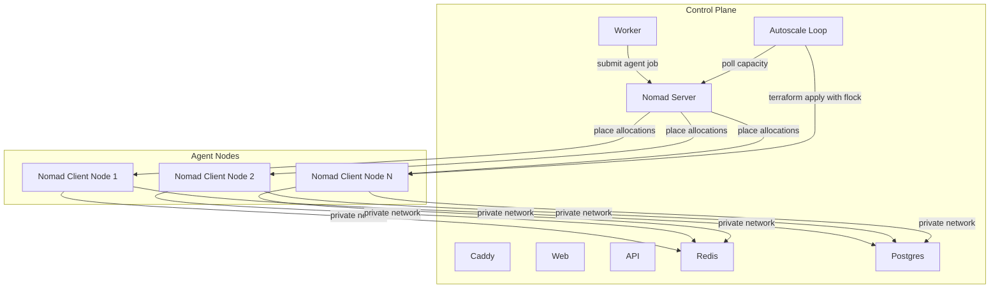

# Orchestration Implementation Plan

## Status

`draft`

## Phase Status

| Phase | Status |
|-------|--------|
| Phase 1 - Orchestration contract | DONE |
| Phase 2 - Cluster topology & infra | DONE |
| Phase 3 - Shared service connectivity | PENDING |
| Phase 4 - Nomad runtime adapter | PENDING |
| Phase 5 - Per-tier resource profiles | PENDING |
| Phase 6 - Autoscale-out with flock+Terraform | PENDING |
| Phase 7 - Safety net & nightly scale-in | PENDING |
| Phase 8 - Admin alerting & visibility | PENDING |
| Phase 9 - Rollout & validate end-to-end | PENDING |

## Depends On

This feature starts only after `docs/features/2026/07/08/003-staging-environment-setup/001-plan.md` is implemented.

Feature docs/features/2026/07/08/003-staging-environment-setup/001-plan.md gives HeroBids two explicit environments with separate control-plane servers, domains, secrets, and deploy flows. Feature 020 builds on that split and adds independent agent-orchestration clusters for staging and production.

## Problem

HeroBids currently launches agent runtimes as local Docker containers from the worker through `docker-proxy`. That model works on a single host, but it does not scale to the intended agent-as-a-service workload where each user-created agent is an isolated container.

After feature docs/features/2026/07/08/003-staging-environment-setup/001-plan.md, staging and production will each have their own dedicated control-plane server running Docker Compose. That is necessary, but not sufficient. The remaining gaps are:

1. agent placement is still single-host and tied to the worker's local Docker daemon
2. agent containers assume local-network access to Redis and Postgres instead of cluster-wide private-network access
3. there is no scheduler that can place agent containers across multiple disposable nodes
4. there is no automatic node provisioning when agent capacity fills up
5. the current agent runtime implementation is too Docker-transport-specific for a clean Nomad/ECS/Kubernetes migration path

Without orchestration, HeroBids cannot support hundreds to low-thousands of concurrent agent containers at low operating cost.

## Goals

1. orchestrate agent containers, not the API, worker, web, Caddy, Postgres, or Redis services
2. support independent staging and production orchestration clusters, each attached to its own control plane from feature docs/features/2026/07/08/003-staging-environment-setup/001-plan.md
3. adopt Nomad as the first orchestrator with a design that preserves a future move to ECS or Kubernetes
4. keep control-plane services on Docker Compose and keep agent nodes stateless, disposable, and Nomad-only
5. move from worker-local Docker placement to Model C: worker-owned lifecycle logic with a scheduler-specific runtime adapter
6. support soft-overcommit scheduling for low-cost density while keeping hard per-agent memory ceilings
7. make resource profiles configurable per tier, with an initial flat default of `512 MB` hard limit and lower scheduling reservations where appropriate
8. connect agent nodes to central Redis and Postgres over a private network so multi-node agent communication still works
9. implement low-cost autoscaling using the selected hybrid trigger model: cron plus Terraform as the primary path, with placement-failure detection as a safety net
10. implement a basic scale-in policy rather than deferring it entirely
11. notify the default admin by email when repeated scaling failures occur

## Non-Goals

1. do not orchestrate the API, worker, web, Caddy, Postgres, or Redis services in this feature
2. do not redesign the control plane into Kubernetes, ECS, or a full HA multi-region platform
3. do not implement autoscaler plugins for Nomad Autoscaler
4. do not introduce managed cloud Postgres or Redis in this feature, though the design must remain compatible with that move later
5. do not optimize for millions of concurrent agents yet; this phase targets roughly `200` to `2000+` agents before a future platform transition
6. do not add aggressive automatic scale-down that can interrupt active agent workloads
7. do not mix this feature with unrelated UI, auth, billing, or live-rollout tasks

## Decisions Already Made

1. **orchestrator**: Nomad
2. **runtime model**: Model C
   - keep HeroBids lifecycle logic in the worker
   - replace local Docker placement with a scheduler-specific adapter
3. **control plane**: dedicated Compose-based server per environment
4. **agent plane**: Nomad-only disposable worker nodes per environment
5. **shared services**: agents connect to central Redis and Postgres over the private network
6. **resource strategy**: soft overcommit with configurable per-tier limits
7. **autoscaling trigger**: hybrid
   - primary: cron plus Terraform capacity checks
   - safety net: placement-failure detection
8. **state locking**: `flock` around the provisioning path
9. **scale-in**: basic nightly scale-in down to a configured floor, without interrupting active allocations
10. **alerting**: email the default admin on consecutive scaling failures

## Current State Summary

Today the codebase and infra are still centered on single-host agent execution:

1. `apps/worker/src/agents/docker-agent-manager.ts` launches agent runtimes through the local Docker API via `docker-proxy`
2. `apps/worker/src/agents/agent-runtime-launcher.ts` hides `docker` vs `stub`, but not a scheduler-oriented runtime backend
3. agent crash detection depends on Docker event streaming from the local daemon
4. agent reconciliation assumes the worker can enumerate local containers directly
5. agent runtime containers reach Redis and Postgres through local-container networking assumptions
6. Hetzner infra currently provisions single servers and does not define an agent-node pool, private cluster topology, or Nomad bootstrap
7. deploy scripts are Compose-oriented and do not yet distinguish control-plane provisioning from agent-node provisioning
8. there is no capacity monitor, no autoscale loop, no node drain workflow, and no scaling alerting

## Design Principles

1. separate **control plane** and **agent plane** cleanly
2. preserve existing agent lifecycle behavior where possible, and swap only the placement transport first
3. keep scheduler integration behind a narrow runtime port so Nomad can later be replaced by ECS or Kubernetes adapters
4. treat agent nodes as cattle, not pets: stateless, replaceable, and safe to recreate
5. keep all thresholds configurable: reservations, hard limits, cooldowns, scale-up thresholds, scale-down floor, and alert thresholds
6. prefer simple operator workflows over feature-rich control planes when they conflict
7. fail loudly when scheduling or provisioning breaks; silent underscaling is unacceptable
8. staging and production must remain fully isolated, including Nomad clusters, private networks, Terraform state, and alerting context
9. nightly scale-in must be conservative: never evict active agents just to hit a floor

## Proposed End State

After this feature lands, each environment looks like this:

Operationally:

1. the worker creates agent runtime jobs through a Nomad-backed runtime adapter
2. Nomad schedules each agent container onto any eligible node in the environment's cluster
3. agents communicate with central Redis and Postgres over the private network, not local Compose networking
4. the autoscale loop grows the node pool when free capacity drops below thresholds
5. a nightly scale-in routine drains idle nodes back toward `min_agent_nodes`
6. repeated scaling failures send email to the default admin

## Implementation Plan

### Phase 1 - Define the orchestration contract **[DONE]**

#### Goal

Introduce the architectural boundary that separates HeroBids agent lifecycle logic from the underlying scheduler.

#### Files

- `apps/worker/src/agents/agent-runtime-launcher.ts`
- `apps/worker/src/agents/docker-agent-manager.ts`
- new runtime port and adapter files under `apps/worker/src/agents/`
- configuration schemas and runtime config wiring

#### Tasks

1. define a scheduler-neutral runtime port for agent placement operations such as:
   - launch runtime
   - stop runtime
   - inspect runtime status
   - reconcile desired vs actual runtimes
   - subscribe or poll for runtime termination
2. move Docker-specific transport logic behind the port so the current local-Docker path becomes one adapter instead of the only implementation
3. preserve existing HeroBids lifecycle responsibilities in shared logic:
   - env var and config injection
   - session and status bookkeeping
   - crash classification
   - orphan cleanup and reconciliation semantics
4. define the first Nomad-oriented adapter interface without implementing the full cluster yet
5. ensure the runtime contract is explicit about fields that must remain configurable per tier:
   - memory hard limit
   - memory reservation
   - CPU reservation / shares
   - process limit
   - temp storage limit

#### Expected Result

The codebase can support more than one runtime backend without duplicating lifecycle logic, and Nomad becomes an additive adapter rather than a rewrite of the whole agent runtime flow.

#### Validation

1. existing Docker-backed behavior still passes targeted tests
2. the new port is narrow enough that a Nomad adapter can implement it without leaking Docker assumptions

### Phase 2 - Define cluster topology and Hetzner infrastructure split **[DONE]**

#### Goal

Provision explicit Nomad infrastructure for agent nodes while keeping the control plane on Compose.

#### Files

- `infra/hetzner/main.tf`
- `infra/hetzner/variables.tf`
- `infra/hetzner/outputs.tf`
- `infra/hetzner/cloud-init.yaml`
- new Nomad-specific cloud-init templates and tfvars conventions
- `infra/hetzner/README.md`
- deploy/provision scripts under `infra/hetzner/scripts/`

#### Tasks

1. extend the environment contract from feature docs/features/2026/07/08/003-staging-environment-setup/001-plan.md so each environment owns:
   - one control-plane stack
   - one Nomad cluster
   - one private network for control plane and agent nodes
   - separate Terraform state and tfvars
2. choose the initial Nomad topology for this phase:
   - Nomad server on the control-plane host
   - Nomad client on every agent node
   - no HA Nomad quorum yet
3. add Hetzner private-network resources and attach both control-plane host and agent nodes
4. create cloud-init templates for Nomad client nodes that:
   - install Docker and Nomad
   - join the environment's Nomad cluster
   - expose only required ports on the private network
   - register correct labels and metadata for scheduling
5. parameterize agent-node pool inputs:
   - node count floor
   - node count ceiling
   - server type
   - location
   - bootstrap tokens / join addresses
6. keep staging and production fully isolated, with no shared Nomad control plane or node pool

#### Expected Result

Each environment can provision a control plane plus a separate pool of disposable Nomad client nodes on a private network.

#### Validation

1. `terraform plan` for staging and production shows environment-specific control-plane and agent-node resources
2. a provisioned agent node joins the correct Nomad cluster automatically
3. agent nodes can reach Redis and Postgres over private networking only

### Phase 3 - Make shared service connectivity cluster-safe **[PENDING]**

#### Goal

Replace single-host networking assumptions so agent containers can run anywhere in the environment cluster.

#### Files

- worker config wiring for Redis, Postgres, and Nomad connectivity
- agent runtime env injection code
- environment docs and secrets conventions

#### Tasks

1. ensure Redis and Postgres are reachable via stable private-network addresses or DNS names, not local Compose container names that only work on one host
2. update agent runtime env injection so spawned runtimes receive cluster-safe connection settings
3. keep the shared-service contract flexible enough to swap later to managed cloud Redis/Postgres without changing agent-node bootstrap logic
4. validate that agent-to-control-plane communication does not rely on Docker bridge naming or local Unix sockets
5. document which secrets and endpoints are control-plane-only vs safe to pass into agent runtimes

#### Expected Result

Agents scheduled on any node can still use Redis, Postgres, and required control-plane integration points without local-host coupling.

#### Validation

1. a test agent scheduled on a remote node can connect successfully to Redis and Postgres
2. no remaining runtime path requires the agent to be on the same host as the worker

### Phase 4 - Implement the Nomad runtime adapter **[PENDING]**

#### Goal

Make the worker submit and manage agent containers through Nomad instead of the local Docker daemon.

#### Files

- new Nomad runtime adapter files under `apps/worker/src/agents/`
- `apps/worker/src/agents/agent-runtime-launcher.ts`
- worker config and startup wiring
- any domain types needed for the runtime contract

#### Tasks

1. implement a Nomad adapter that translates the scheduler-neutral runtime contract into Nomad job submissions
2. create a job template for one isolated agent runtime allocation per agent
3. map current runtime limits and metadata into Nomad job constraints and Docker task config:
   - image
   - env vars
   - memory reservation
   - memory hard limit
   - CPU reservation
   - labels / metadata
4. replace Docker event-stream dependence with Nomad allocation-state polling or event consumption for crash detection
5. update reconciliation so desired active agents are compared against Nomad allocations rather than local containers
6. preserve current crash semantics as closely as possible:
   - voluntary stop
   - startup failure
   - runtime crash
7. keep the existing Docker adapter available for local development and incremental rollout until the Nomad path is proven

#### Expected Result

The worker can launch, stop, reconcile, and classify agent runtimes through Nomad while preserving existing HeroBids behavior.

#### Validation

1. one agent can be launched to Nomad and reach steady state
2. stopping an agent updates status correctly and does not misclassify the stop as a crash
3. a forced runtime exit on a client node is detected and classified correctly

### Phase 5 - Configure per-tier resource profiles and scheduling policy **[PENDING]**

#### Goal

Express the initial resource strategy in config, not hardcoded logic.

#### Files

- `config/default.yaml`
- environment overlays if needed
- config schema files
- worker runtime config resolution

#### Tasks

1. add operator config for per-tier resource profiles, including at minimum:
   - scheduling memory reservation
   - hard memory limit
   - CPU reservation
   - max processes
   - temp storage
2. set the initial defaults to the chosen soft-overcommit model:
   - free / pro hard limit starts at `512 MB`
   - scheduling reservation can be lower, for example `256 MB`
   - enterprise profiles may use `512 MB`, `2 GB`, or `4 GB` equivalents with tighter reservation rules
3. make the autoscale math use configured reservations, not observed averages alone
4. document clearly that operator config controls platform ceilings while future plan-specific product behavior can evolve separately

#### Expected Result

Agent density, tier behavior, and autoscale thresholds are config-driven and adjustable without redesigning the runtime.

#### Validation

1. changing tier resource config changes submitted Nomad job reservations without code edits
2. invalid resource profiles fail fast at startup

### Phase 6 - Implement autoscale-out with `flock`-guarded Terraform **[PENDING]**

#### Goal

Add the selected low-cost scale-out path.

#### Files

- new autoscaling scripts under `infra/hetzner/scripts/`
- Terraform files for agent-node count / identity management
- control-plane cron configuration or systemd timer units
- infra docs

#### Tasks

1. implement a capacity-check script that polls Nomad and computes free cluster headroom using configured reservations
2. define conservative scale-up thresholds and cooldowns, for example:
   - scale out when free allocatable memory or allocatable agent slots drops below a configured threshold
   - do not scale out again until cooldown expires unless the safety net fires
3. wrap the Terraform path with `flock` so only one provisioning action runs at a time
4. structure Terraform-managed agent nodes to support safe add/remove operations without accidental mid-list destruction
5. store autoscale settings in config or tfvars rather than shell literals:
   - `min_agent_nodes`
   - `max_agent_nodes`
   - `scale_out_cooldown_ms`
   - thresholds for free capacity
6. install the scale-out loop on the control-plane host for both staging and production

#### Expected Result

The system provisions more agent nodes automatically before the cluster fully exhausts capacity, using only Nomad API polling plus Terraform.

#### Validation

1. a low-capacity staging cluster provisions an extra node automatically when thresholds are crossed
2. concurrent trigger attempts serialize correctly through `flock`
3. repeated cron runs do not create duplicate or conflicting Terraform operations

### Phase 7 - Implement placement-failure safety net and nightly scale-in **[PENDING]**

#### Goal

Complete the hybrid scaling model with reactive protection and a conservative basic scale-down path.

#### Files

- autoscaling scripts / timers
- Nomad drain helpers
- alerting integration points
- infra docs

#### Tasks

1. implement a placement-failure watcher that detects repeated Nomad evaluation failures caused by exhausted resources
2. wire the watcher to trigger the same `flock`-guarded provisioning path used by the normal scale-out loop
3. implement a nightly scale-in routine that runs at a configured time, initially `3 AM` per environment
4. make scale-in conservative:
   - never kill active agent allocations to reach the floor
   - mark candidate nodes ineligible for new placements
   - drain only nodes that are idle or become empty within the drain window
   - stop draining when `min_agent_nodes` is reached
5. keep scale-in optional and configurable so staging can exercise it safely
6. ensure scale-in uses the same source of truth as scale-out for current node inventory

#### Expected Result

The platform scales up proactively, catches surprise under-capacity reactively, and scales down basic excess capacity nightly without interrupting active agents.

#### Validation

1. simulated placement failures trigger the safety-net path
2. nightly scale-in removes only eligible idle nodes
3. active workloads survive the nightly scale-in run unchanged

### Phase 8 - Add admin alerting and operator visibility **[PENDING]**

#### Goal

Make scaling failures visible quickly enough for manual intervention.

#### Files

- alerting / email integration points
- autoscaling scripts or service units
- operator docs

#### Tasks

1. define scaling-failure alert thresholds, for example:
   - three consecutive scale-loop failures
   - repeated failed safety-net attempts
   - failure to join a newly provisioned node within a timeout window
2. send an email to the default admin when thresholds are crossed
3. include actionable context in the alert:
   - environment
   - reason for failure
   - current node count
   - recent Nomad capacity snapshot
   - last Terraform / provisioning error
4. optionally send a recovery email when the autoscaler resumes normal operation after a failure streak
5. document where operators inspect logs and how they force manual recovery

#### Expected Result

Scaling failures are no longer silent and the default admin has enough context to investigate quickly.

#### Validation

1. a forced failure in staging sends one alert email to the default admin
2. repeat failures do not spam unbounded email volume
3. recovery behavior is predictable and documented

### Phase 9 - Roll out by environment and validate end-to-end **[PENDING]**

#### Goal

Land the orchestration stack safely with staging-first validation before production adoption.

#### Files

- staging and production runbooks
- infra docs
- test reports / rollout notes

#### Tasks

1. deploy the full orchestration flow to staging first
2. validate all critical flows in staging:
   - agent launch through Nomad
   - agent stop
   - crash detection
   - reconciliation after worker restart
   - scale-out under synthetic pressure
   - nightly scale-in behavior
   - alert email delivery
3. document manual fallback procedures if Nomad or the autoscale loop is unhealthy
4. roll production only after staging passes the full validation checklist
5. keep a controlled rollback path to the previous local-Docker runtime mode until production confidence is established

#### Expected Result

Staging and production each have an independently validated Nomad-based agent orchestration stack attached to their Compose-based control plane.

#### Validation

1. staging passes the full acceptance checklist
2. production rollout has an explicit rollback procedure and operator runbook

## Acceptance Criteria

This feature is complete when all of the following are true:

1. staging and production each have an independent Nomad cluster for agent runtimes
2. the worker launches agent runtimes through a Nomad adapter rather than a local-Docker-only path in the production orchestration mode
3. control-plane services remain on Compose and agent nodes remain stateless and disposable
4. agents on any node can reach central Redis and Postgres over the private network
5. per-tier resource reservations and hard limits are configuration-driven
6. the hybrid autoscale path works:
   - proactive cron plus Terraform scale-out
   - placement-failure safety net
   - `flock`-guarded provisioning
7. a basic nightly scale-in reduces idle capacity toward `min_agent_nodes` without interrupting active agents
8. repeated scaling failures trigger an email to the default admin
9. staging passes end-to-end orchestration validation before production rollout

## Risks and Watchpoints

1. **single Nomad server per environment** is acceptable initially but remains a control-plane SPOF
2. **cluster-safe connectivity** is easy to get wrong if any runtime path still depends on local Docker naming
3. **soft overcommit** can increase density cheaply, but badly tuned reservations may produce more OOM churn than expected
4. **scale-in** is the most operationally risky part of the selected approach and must remain conservative
5. **Terraform node identity design** must avoid accidental destruction of the wrong client during scale-in
6. **email alerting** is only useful if the default admin email path is already real and monitored after feature docs/features/2026/07/08/003-staging-environment-setup/001-plan.md

## Outstanding Issues

### [Phase 1] Termination listener double-registration (MEDIUM)
- Both `DockerRuntimeAdapter` constructor and `AgentRuntimeLauncher` constructor register termination listeners on the same `DockerAgentManager`. Any `onTermination()` subscriber would receive duplicate events per container death.
- **Impact:** None currently — no production code calls `.onTermination()` yet. Must be fixed before Phase 4 when Nomad subscription code starts using it.
- **Fix:** Remove the duplicate listener registration from the launcher. The adapter already bridges its own events.
- **Files:** `apps/worker/src/agents/agent-runtime-launcher.ts`, `apps/worker/src/agents/docker-runtime-adapter.ts`

### [Phase 1] `||` operator in resource fallback treats `0` as falsy (LOW)
- `this.defaultResources.memoryLimitMb || 512` silently falls back to hardcoded default if operator configures a resource to `0`. For `maxWallClockMs`, `0` means "unlimited" but `0 || undefined` loses that semantic.
- **Impact:** None currently — no operator config uses `0` for the main resources, and `maxWallClockMs` is not consumed by any adapter yet.
- **Fix:** Use `??` consistently: `this.defaultResources.memoryLimitMb ?? 512`.
- **File:** `apps/worker/src/agents/agent-runtime-launcher.ts`

### [Phase 2] Private network UFW rules only open Nomad ports, not Redis/Postgres (MEDIUM)
- `cloud-init.yaml` opens ports 4646–4648 (Nomad) from private subnet but does NOT open 6379 (Redis) or 5432 (Postgres). Agent nodes can't reach shared services yet.
- **Impact:** Non-blocking for Phase 2. Phase 3 is explicitly designed to address this. No agents run on agent nodes until Phase 4.
- **Fix:** Add Redis/Postgres UFW rules in Phase 3.

### [Phase 2] Competing tfvars templates (LOW)
- Three tfvars templates exist: `terraform.tfvars.example`, `staging.tfvars.example`, `production.tfvars.example`. May confuse new operators.
- **Fix:** Add note directing to per-environment templates, or deprecate legacy template.

### [Phase 2] Client cloud-init missing nomad_version format comment (LOW)
- Control-plane `cloud-init.yaml` documents that `nomad_version` must not include the Debian revision suffix. Client template uses same pattern but lacks the comment.
- **Fix:** Add the same note to `cloud-init-nomad-client.yaml` variable block.

## Follow-Up Work Explicitly Deferred

1. HA Nomad quorum per environment
2. orchestrating platform services instead of only agent runtimes
3. richer autoscaling policies using Nomad Autoscaler or external metrics systems
4. migration to managed Redis / Postgres providers
5. scheduler adapters for ECS or Kubernetes
6. higher-scale redesign for tens of thousands or millions of concurrent runtimes