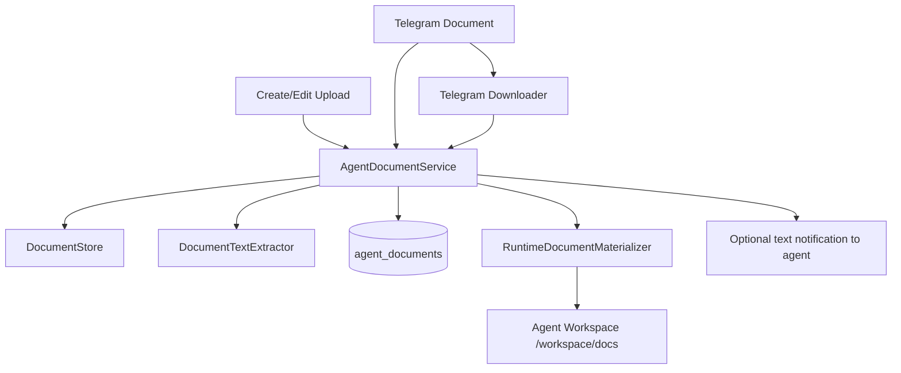

# Plan: Documents For Agents

**Status:** Done  
**Created:** 2026-07-13  
**Feature ID:** 001-documents-for-agents

## Problem

Agents currently cannot accept uploaded documents in any supported way.

- During create/edit, there is no document upload path.
- Via Telegram, non-text attachments are silently dropped.
- The runtime is text-first and workspace-file based.
- The current container model gives each agent an isolated `/workspace`, but that workspace is ephemeral and not directly writable from the API process.

We want a practical v1 that lets agents accept documents from two sources:

1. control-plane upload during agent create/edit
2. Telegram document messages

This must be designed for long-term evolution:

- local storage first
- storage hidden behind an abstraction
- no forced lock-in to local disk
- no multimodal LLM work in v1

## Scope

### In scope

- Upload documents for agents from the web create/edit flow
- Accept Telegram document attachments for running agents
- Support text documents, PDF, and Word documents
- Store originals plus extracted text when extraction is available
- Materialize documents into the agent workspace so existing file tools can read them
- Clean workspace copies up when the agent container shuts down
- Introduce storage and materialization abstractions for future backends

### Out of scope

- Images, voice, video, or general multimodal chat
- LLM provider message-format changes for image blocks
- Durable, cross-session document memory for chat sessions
- Marketplace/discovery semantics for documents
- Generic user file storage unrelated to agents

## Product Decisions

### D1: v1 is text-first, not multimodal

Documents are converted into files the agent can access through the existing workspace file tools.

V1 does **not** change:

- `ConversationMessage.content: string`
- `LlmMessage.content: string`
- scout/judge prompt transport

Instead, the system places files in the workspace and, when needed, injects a normal text message telling the agent what was added and where.

### D2: One ingestion pipeline for both web upload and Telegram

Both sources must flow through the same internal pipeline:

1. validate file
2. store original
3. extract text if supported
4. persist document metadata
5. materialize into runtime workspace
6. optionally notify the agent with a text message

The source channel changes, but the document domain model does not.

### D3: Support text, PDF, and Word documents in v1

Initial accepted formats:

- plain text (`text/plain`)
- markdown / text-like docs
- PDF (`application/pdf`)
- Word documents (`.docx`, and `.doc` only if the chosen extractor supports it reliably)

V1 should explicitly reject unsupported types with a clear error.

### D4: Introduce a document-storage abstraction now

Do not couple the feature to raw disk paths.

Introduce a small storage boundary oriented around documents, not generic filesystem utilities.

Recommended interfaces:

- `DocumentStore`
- `DocumentTextExtractor`
- `RuntimeDocumentMaterializer`
- `AgentDocumentService`

The extraction layer should be shared with existing web/document-reading features.
In particular, PDF extraction for agent uploads and Telegram documents should use
the same underlying implementation as the `read_document` web-access tool so the
platform does not end up with two different PDF parsers and two different quality levels.

### D5: Runtime consumes workspace copies, not object-store handles

The runtime already knows how to work with workspace files.

Therefore, v1 should materialize documents into the agent workspace under a dedicated folder such as:

```text
docs/
  original/
  extracted/
```

The agent reads those files through existing tools like `read_file` and `list_files`.

### D6: Control-plane uploads are staged assets, not immutable agent config

Documents added during create/edit are **not** part of immutable agent config.

They are runtime-scoped assets that are:

- attached to the agent
- staged until the next runtime starts, if the agent is not currently running
- materialized into the live workspace immediately, if the agent is running
- removed from the workspace when the runtime ends

This avoids pretending that uploads are durable recipe/config state.

### D7: Create flow remains one user action, even if implementation becomes two-step

The UI may let the user pick documents before clicking create, but implementation should be:

1. create agent first
2. upload selected documents to the new agent ID

This avoids pre-agent staging complexity and keeps the current create API intact.

### D8: Telegram document support targets documents, not general media

For Telegram in v1:

- support `message.document`
- optionally support text caption alongside the document
- do not support photos, videos, voice notes, or arbitrary media yet

### D9: PDF and Word documents should produce extracted text companions

For PDF and Word documents, the system should:

- keep the original file
- produce extracted text when possible
- materialize both into the workspace

The agent should primarily read the extracted text file, while the original remains available for reference.

## Current Constraints In The Codebase

### 1. Runtime workspace is ephemeral and container-local

The current runtime uses `AGENT_WORKSPACE_ROOT=/workspace` inside the container, and workspace tools operate against that root.

Relevant files:

- `apps/worker/src/tools/workspace.ts`
- `apps/worker/src/tools/filesystem.ts`
- `apps/worker/src/agents/docker-agent-manager.ts`

There is currently no shared volume mount and no existing document-copy path into the live container.

### 2. Telegram webhook is text-only today

The current webhook ignores non-text messages, as documented in:

- `docs/features/pending/025-agent-message-document-handling/000-notes.md`

### 3. Message/LLM pipeline is text-only

This is acceptable for v1 because we are not doing multimodal messaging. We will only inject text references to uploaded files.

### 4. Web-access PDF reading currently uses a lightweight inline extractor

The current `read_document` tool in the worker supports PDF by using a minimal
inline text-extraction helper. That is useful as a stopgap, but it should not
remain a separate long-term parsing path once agent document support lands.

V1 for this feature should move PDF extraction behind a shared extractor module or
service that both of these flows use:

- agent document ingest
- Telegram document ingest
- web-access `read_document`

## Proposed Architecture



## Domain Model

### New document metadata table

Add `agent_documents` to persist document metadata independent of the workspace copy.

Suggested fields:

```ts
agent_documents {
  id: text pk,
  agentId: text not null,
  userId: text not null,
  source: 'control_plane' | 'telegram',
  sourceRef: text | null,              // telegram message/document ref if present
  originalFilename: text not null,
  mimeType: text not null,
  sizeBytes: integer not null,
  originalStoreKey: text not null,
  extractedTextStoreKey: text | null,
  extractionStatus: 'not_needed' | 'ready' | 'failed',
  lifecycleState: 'staged' | 'materialized' | 'deleted' | 'failed',
  materializedSessionId: text | null,
  captionOrPrompt: text | null,
  createdAt: timestamptz not null,
  updatedAt: timestamptz not null,
  deletedAt: timestamptz | null
}
```

Notes:

- `staged` means uploaded and accepted, but not yet copied into a live workspace.
- `materialized` means copied into a specific runtime workspace.
- `deleted` is soft-state for audit/debugging; the physical store object may already be gone.

## Abstractions

### 1. `DocumentStore`

Purpose: persist original files and extracted text blobs.

Suggested interface:

```ts
interface DocumentStore {
  put(params: {
    keyHint: string;
    contentType: string;
    body: Buffer;
  }): Promise<{ storeKey: string; sizeBytes: number }>;

  getMetadata(storeKey: string): Promise<{ contentType: string; sizeBytes: number }>;
  read(storeKey: string): Promise<Buffer>;
  delete(storeKey: string): Promise<void>;
}
```

Initial implementation:

- `LocalDocumentStore`

Future implementations:

- `S3DocumentStore`
- `CloudWithFallbackDocumentStore`

### 2. `DocumentTextExtractor`

Purpose: normalize supported files into extracted UTF-8 text.

This should be treated as a shared platform service, not a documents-for-agents-only helper.
The same extractor implementations should be reusable by:

- control-plane agent document upload
- Telegram document ingest
- web/document reading tools in the runtime

Suggested strategy split:

- `PlainTextExtractor`
- `PdfTextExtractor`
- `WordTextExtractor`

Rules:

- plain text: passthrough
- PDF: extract text server-side
- Word: extract text server-side
- if extraction fails, keep original and mark `extractionStatus='failed'`

Implementation rule:

- do not keep a separate ad-hoc PDF extraction path inside `read_document`
- move PDF extraction behind the shared `PdfTextExtractor` abstraction and have `read_document` call it

### 3. `RuntimeDocumentMaterializer`

Purpose: copy staged documents into the runtime workspace.

Suggested interface:

```ts
interface RuntimeDocumentMaterializer {
  materialize(params: {
    agentId: string;
    sessionId: string;
    files: Array<{
      relativePath: string;
      body: Buffer;
    }>;
  }): Promise<void>;

  cleanup(params: {
    agentId: string;
    sessionId: string;
  }): Promise<void>;
}
```

Implementations:

- `DockerRuntimeDocumentMaterializer`
  - uses Docker copy/archive APIs to place files into `/workspace/docs/...`
- `StubRuntimeDocumentMaterializer`
  - writes directly into the local stub workspace root

This abstraction is required because the current API process cannot simply write into a running container's workspace.

### 4. `AgentDocumentService`

Purpose: orchestrate validation, storage, extraction, metadata persistence, and materialization.

Responsibilities:

- validate upload type and size
- persist original via `DocumentStore`
- extract text via `DocumentTextExtractor`
- write `agent_documents` row
- materialize into live runtime if available
- otherwise leave staged for next startup
- delete metadata/store objects on explicit removal

## File Placement In Workspace

Use predictable paths:

```text
docs/original/<document-id>-<sanitized-name>
docs/extracted/<document-id>.txt
```

Examples:

```text
docs/original/abc123-quarterly-report.pdf
docs/extracted/abc123.txt
docs/original/def456-notes.docx
docs/extracted/def456.txt
```

The agent should be told to prefer the extracted `.txt` file when present.

## API Plan

### Phase 1: Agent document metadata + upload endpoints

Add routes:

- `POST /agents/:id/documents`
- `GET /agents/:id/documents`
- `DELETE /agents/:id/documents/:documentId`

Recommended behavior:

#### `POST /agents/:id/documents`

- multipart upload or constrained raw-body upload
- validates MIME type and size
- stores original file
- extracts text if possible
- creates `agent_documents` row
- if agent is running, materializes immediately into current workspace
- otherwise leaves row in `staged`

Response shape should include:

- document id
- filename
- mime type
- size
- extraction status
- lifecycle state
- materialized workspace paths if available

#### `GET /agents/:id/documents`

Returns attached documents and their current state.

#### `DELETE /agents/:id/documents/:documentId`

- deletes document metadata
- deletes store blobs
- if the document is materialized in a live runtime, remove it from workspace as best effort

### Phase 2: Create flow wiring

Keep the user interaction as a single create flow, but implement as:

1. create agent
2. upload selected documents to `/agents/:id/documents`

If upload fails after agent creation:

- keep the agent
- show partial-failure UI
- allow retry from the new agent detail/edit flow

### Phase 3: Edit flow wiring

Edit flow should:

- list current staged/materialized documents
- upload new ones
- remove existing ones

If the agent is running, uploads should materialize immediately.

Important product rule:

- create/edit uploads do **not** automatically wake or message the agent in v1
- they only make documents available

If the user wants action immediately, they can message the agent separately.

## Worker / Runtime Plan

### Phase 4: Materialize staged documents on startup

Before the first tick, the launch path should:

1. query staged documents for the agent
2. load original/extracted blobs from `DocumentStore`
3. materialize them into `/workspace/docs/...`
4. mark rows as `materialized` with the current `sessionId`

Suggested integration point:

- session launch path near runtime startup, not inside the scout/judge loop

This ensures the first tick already sees workspace files.

### Phase 5: Cleanup on runtime shutdown

On runtime/container shutdown:

- cleanup workspace copies
- mark associated `agent_documents` rows as deleted or staged-cleared according to the selected retention policy

For v1, use runtime-scoped cleanup:

- workspace copies are always deleted
- staged store objects associated with that runtime upload are also deleted unless explicitly kept for pending next-start use

Implementation note:

- container deletion may already wipe `/workspace`, but we still need metadata/state cleanup outside the container

### Phase 6: Live runtime document updates

If a user uploads a document while the agent is already running:

1. API stores the file and metadata
2. worker/session layer materializes it into the live runtime workspace using `RuntimeDocumentMaterializer`
3. document row becomes `materialized`

No scout/judge protocol change is needed.

## Telegram Plan

### Phase 7: Telegram document ingest

Extend the webhook to parse `message.document` and optional caption text.

Flow:

1. validate Telegram webhook payload
2. resolve target agent using current reply/name-routing logic
3. download the Telegram file immediately
4. ingest through `AgentDocumentService`
5. materialize into live workspace
6. publish a normal text user message to the agent describing the added files

Suggested generated message:

```text
User sent document `quarterly-report.pdf`.
Original saved at `docs/original/abc123-quarterly-report.pdf`.
Extracted text saved at `docs/extracted/abc123.txt`.
Caption: "Please summarize this".
```

### Phase 8: Running-agent rule for Telegram

Telegram document ingest should follow current message semantics:

- target running agents only in v1
- if the agent is stopped/crashed, reject the document and notify the user through Telegram if feasible

Do not silently accept and drop.

## Extraction Strategy

### Text documents

- store original
- extracted text = original content

### PDF

- store original `.pdf`
- extract text server-side into `.txt`
- do not render pages to images in v1

Important consistency rule:

- the same PDF extraction implementation should be used for uploaded PDFs and the `read_document` tool
- if we later replace the PDF parser/library, both paths should improve together

### Word documents

- store original `.docx` or `.doc`
- extract text server-side into `.txt`
- if legacy `.doc` extraction is unreliable with the chosen library, reject `.doc` explicitly rather than pretending success

## Limits And Safety

### File size

Introduce conservative v1 limits, for example:

- 10 MiB max upload size per file
- smaller cap for Telegram if needed

### Text extraction ceiling

Because `read_file` currently caps reads at 1 MiB, extracted text should be bounded.

Recommended v1 rule:

- truncate extracted text to a safe upper bound compatible with current tools
- record truncation metadata in the document row

### Validation

- sanitize filenames
- do not trust browser-provided MIME type alone
- inspect extension and/or content where practical
- reject executables and archives in v1

## UI Plan

### Create form

- add document picker
- show selected files before submit
- after agent creation, upload files sequentially or in small batches
- show upload progress and partial-failure state

### Edit form / detail page

- show current documents and states: staged, materialized, extraction failed
- allow delete/retry

### Agent UX copy

The UI should clearly state that documents are runtime-scoped in v1.

Suggested copy:

- "Documents are available to the current agent runtime and may be removed when the runtime stops."

## Testing Plan

### API

- upload accepted text/PDF/Word docs
- reject unsupported MIME types
- reject oversize uploads
- list documents
- delete documents
- partial upload failure handling

### Worker / runtime

- staged docs materialize before first tick
- materializer writes into stub workspace
- live upload materializes into running runtime
- shutdown cleanup updates metadata/state

### Telegram

- document payloads no longer drop silently
- document download failure surfaces correctly
- caption becomes part of generated text message
- stopped agent behavior is explicit

### Extraction

- plain text passthrough
- PDF text extraction success/failure
- Word extraction success/failure
- truncation behavior for oversized extracted text

## Rollout Order

1. [DONE] Add `agent_documents` schema and repository methods
2. [DONE] Add `DocumentStore`, `DocumentTextExtractor`, `AgentDocumentService`
3. [DONE] Refactor PDF extraction into a shared implementation also usable by `read_document` (PdfTextExtractor created as shared module in Item 2; read_document wiring deferred to Item 10)
4. [DONE] Add `RuntimeDocumentMaterializer` abstractions
5. [DONE] Implement web upload endpoints
6. [DONE] Wire create/edit UI → see [002-ui-plan.md](./002-ui-plan.md)
7. [DONE] Materialize staged docs on runtime start
8. [DONE] Add live-runtime materialization path
9. [DONE] Extend Telegram webhook for documents
10. [DONE] Switch `read_document` to the shared extractor path
11. [DONE] Add cleanup and observability

## Risks

1. **Legacy `.doc` extraction may be unreliable.** If so, reject it clearly and keep `.docx` first-class.
2. **No shared volume exists today.** Live runtime materialization needs explicit Docker-copy support or equivalent.
3. **Ephemeral lifecycle may surprise users.** UI copy must be explicit.
4. **Large extracted text can exceed current file-tool limits.** Truncation rules must be explicit.
5. **Partial create success is possible.** Agent may be created even if document upload fails.
6. **Divergent parser behavior is a product risk.** If upload extraction and `read_document` use different PDF parsers, the same file may yield different results depending on entry path.

## Outstanding Issues

### Item 1: `agent_documents` schema and repository

**MEDIUM**
- Missing unit tests for `AgentDocumentsRepository`: create, getById (soft-delete filtering), listByAgent (lifecycle filtering, soft-delete filtering), update (mutable-only), delete (lifecycleState transition, idempotency), hardDelete.

**LOW**
- `update()` can modify soft-deleted records without clearing `deletedAt`. Service layer should enforce lifecycle state-machine.
- No pagination on `listByAgent`. Acceptable for v1.
- No index on `lifecycle_state`. Could add `(agent_id, lifecycle_state)`.
- `listByAgent` single-value `inArray` usage — style nit.

### Item 2: DocumentStore, DocumentTextExtractor, AgentDocumentService

**MEDIUM**
- (`document-text-extractors.ts`): `as unknown as PdfParseV2` bypasses TypeScript strict checks. Should validate with Zod or define full interface.
- (`agent-document-service.ts`): `UploadDocumentResult.extractionStatus` and `.lifecycleState` typed as `string` instead of literal union types from `@herobids/db`.
- (`local-document-store.ts`): Dead `catch` block in `delete()` — `Promise.allSettled` never rejects.

**LOW**
- Hardcoded limits (`MAX_UPLOAD_BYTES`, `ALLOWED_UPLOAD_MIME_TYPES`) should move to operator config. TODO comments added.

### Item 4: RuntimeDocumentMaterializer

**LOW**
- Stub materializer missing path-traversal guard (Docker impl has it). Stub mode is dev-only, low risk.
- Missing unit tests for `tar-utils`, stub-materializer, docker-materializer.

### Item 5: Web upload endpoints + `packages/documents/`

**MEDIUM**
- `getDocuments` and `deleteDocument` in `AgentDocumentService` lack try/catch for DB errors — violate "Public APIs never throw" rule.
- Hardcoded constants (`MAX_UPLOAD_BYTES`, `ALLOWED_UPLOAD_MIME_TYPES`, etc.) with deferred config migration.
- Truncation metadata (`truncated`, `truncatedAtBytes`) not persisted to DB row. Schema needs new columns.
- Worker doesn't list `@herobids/documents` as dependency yet.

### Items 7–8: Materialization paths

**MEDIUM**
- `materializeStagedDocuments` return type claims `Result<void, unknown>` but has no try/catch — if `repo.listByAgent` throws, exception propagates.
- Theoretical race: handle added to `this.runtimes` before `materializeStagedDocuments`, creating a narrow window where the 30s refresh could concurrently materialize the same staged docs.
- Extracted text blob read failure silently swallowed (no warning log) in upload path.

**LOW**
- `materializeStagedDocuments` uses `repo.update()` in a loop without a transaction — partial state on crash is benign (re-materialization is idempotent).

### Cross-cutting

**MEDIUM**
- Missing unit and integration tests across all new modules (repositories, services, extractors, materializers, API routes).
- `AgentDocumentService.getDocuments()` returns bare array instead of `Result` — inconsistent with `uploadDocument`/`deleteDocument`.

## Recommendation

Implement a text-first v1 with:

- `DocumentStore` abstraction
- local storage backend first
- server-side PDF/Word text extraction
- runtime workspace materialization
- shared ingestion pipeline for web upload and Telegram documents
- no multimodal LLM changes

This delivers practical document support now while preserving a clean path to future durable storage and richer messaging.