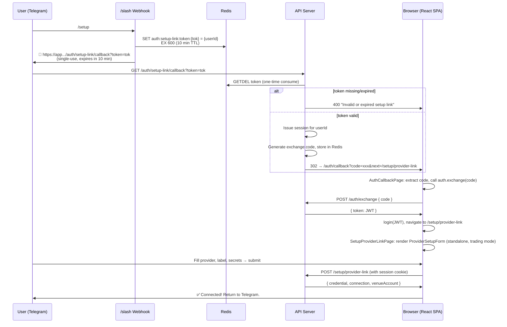

# Basic Telegram Agent Slash Commands

## Status

`draft`

## Purpose

Add a small, explicit Telegram command surface for agent discovery, status checks, and basic lifecycle control without bypassing the existing ownership and lifecycle rules already enforced by the API.

## Scope

### In scope

1. Add a Telegram command router on top of the existing webhook path in `apps/api/src/routes/agent-interactivity.ts`.
2. Preserve the existing `/to` message-routing behavior.
3. Add basic read commands for help, listing, and status.
4. Add basic lifecycle commands for start, pause, resume, and stop.
5. Extract the current lifecycle mutations from `apps/api/src/routes/agents.ts` into a shared backend service/helper so Telegram and HTTP use the same logic.
6. Register supported Telegram commands with the Telegram Bot API so they show up in the client command picker.
7. Add focused tests for parsing, authorization/ownership, lifecycle transitions, and user-facing responses.
8. Add user-facing documentation for command syntax and limits.

### Out of scope

1. Bot lifecycle commands.
2. Inline-button confirmation flows.
3. Rich Telegram menus, custom keyboards, or conversational state machines.
4. Multi-step command sessions.
5. Per-agent Telegram bot identities.
6. Full natural-language agent control through Telegram beyond the existing `/to` flow.

## Problem Statement

Telegram already works as a message transport for agents, but it does not yet expose a minimal operational command set for the owning user. The main missing piece is not transport; it is command routing and safe reuse of agent lifecycle logic, which today lives directly inside HTTP route handlers.

The current shape creates three implementation constraints:

1. `/to` already occupies the existing command parser and must keep working.
2. Agent lifecycle rules already exist and should not be reimplemented separately in the Telegram webhook.
3. Telegram `/start` is already part of the account-binding flow, so a lifecycle `/start` command needs explicit handling to avoid breaking onboarding.

## Commands Planned

### Help

1. `/help` — list all commands with short descriptions
2. `/help <command>` — detailed help for a specific command (accepts `/help start` and `/help /start`)

### Discovery & Read-Only

3. `/agents` — list all caller-owned agents with status
4. `/status [agent name]` — compact summary of all agents, or detail for one
5. `/info <agent name>` — full agent detail: status, execution mode, capital, skills, risk limits, style, strategy, last session
6. `/skills [agent name]` — list skills assigned to an agent (or all available if no target)
7. `/log <agent name>` — recent activity/decisions for an agent (last 5 entries)
8. `/connections [agent name]` — list user-owned active connections, or connections assigned to an agent

### Lifecycle

9. `/start <agent name>` — start a stopped agent
10. `/pause <agent name>` — pause an active or starting agent
11. `/resume <agent name>` — resume a paused agent
12. `/stop <agent name>` — stop a running agent
13. `/restart <agent name>` — convenience: stop, wait, start (stops immediately, starts when status settles)

### Configuration (agent must be stopped)

14. `/mode <agent name> [test|live]` — show or set execution mode (test = simulated, no real money; also accepts `paper`/`shadow` as aliases for test)
15. `/connect <agent name> [connection-id|label]` — grant a connection by ID or label; if no ID/label is given, generate a one-time setup link to create a connection in the browser
16. `/disconnect <agent name> <connection-id|label>` — revoke a connection from an agent by ID or label

### Messaging (existing)

17. `/to <agent name> <message>` — send a message to an agent

## Command Semantics

### Help

1. `/help`
   Returns the supported command list grouped by category, with short usage examples.
2. `/help <command>`
   Returns detailed usage for a specific command. Accepts both `/help start` and `/help /start`.
   Unknown command names fall back to the general help listing.

### Discovery & Read-Only

3. `/agents`
   Returns all caller-owned agents with current status, one per line.
4. `/status`
   Returns a compact summary of all caller-owned agents, including lightweight details such as last session state and pause reason when available.
5. `/status <agent name>`
   Returns status for the matching agent name, using case-insensitive exact matching and quoted-name support for spaces.
6. `/info <agent name>`
   Returns a compact detail block for one agent:
   - status, execution mode, capital (if trading agent)
   - daily loss limit, max drawdown, max position size, stop loss
   - style, strategy preset (if set)
   - assigned skills (names, not IDs)
   - last session state, pause reason
   - connection count
7. `/skills`
   Lists all skills available to the user (entitled + published free), with names and IDs.
8. `/skills <agent name>`
   Lists skills currently assigned to the named agent, one per line.
9. `/log <agent name>`
   Returns the 5 most recent activity entries for the agent (decisions, messages, errors).
10. `/connections`
    Lists the user's active connections with provider, label, and truncated ID.
11. `/connections <agent name>`
    Lists connections currently assigned to the named agent.

### Lifecycle

12. `/start <agent name>`
    Starts the matching agent(s) using the same validation and state transition rules as `POST /agents/:id/start`.
    If multiple caller-owned agents share the same case-insensitive exact name, all matching agents are started.
13. `/pause <agent name>`
    Pauses an active or starting agent using the same rules as `POST /agents/:id/pause`.
14. `/resume <agent name>`
    Resumes a paused agent using the same rules as `POST /agents/:id/resume`.
15. `/stop <agent name>`
    Stops a non-stopped agent immediately using the same rules as `POST /agents/:id/stop`.
16. `/restart <agent name>`
    Convenience command that stops the agent immediately then polls briefly for `stopped` status before issuing start.
    If the agent doesn't settle to `stopped` within the poll window, responds with instructions to retry.
    Uses the same underlying lifecycle service — no new state transitions.

### Configuration (agent must be stopped)

18. `/mode <agent name>`
    Shows the current execution mode for an agent. For non-trading agents, reports "not applicable".
19. `/mode <agent name> <test|live|paper|shadow>`
   Sets the execution mode. Validates that the agent has trading skills and rejects if the agent is not stopped.
20. `/connect <agent name>` (no third argument)
   Requires the agent to be stopped. If the user has no active connections, or as a convenience,
   generates a one-time auto-expiring link that opens the "Connect AI agent to external platform"
   form in the browser. Same flow as the former `/setup` — see
   [Appendix A](#appendix-a-setup-link-flow--full-design).
    If the user already has active connections, lists them with truncated IDs and labels so they
    can copy a specific one for the `/connect <agent> <id>` form.
21. `/connect <agent name> <connection-id|label>`
    Grants an active user-owned connection to the named agent by inserting an `agent_connections` row.
    Accepts both the raw connection ID (UUID) and the connection label (case-insensitive exact or
    unique prefix match). Rejects if the label matches multiple connections (ambiguity) — in that
    case lists the matches and asks the user to use an ID instead.
    Rejects if the agent is not stopped, the connection doesn't exist, doesn't belong to the user,
    or is not active. Idempotent: if already granted and active, returns success without changes.
22. `/disconnect <agent name> <connection-id|label>`
    Revokes an active agent-to-connection grant. Accepts both ID and label (same matching rules
    as `/connect`). Rejects if the agent is not stopped.
    Idempotent: if already revoked or never granted, returns success.

### `/start` compatibility rule

To avoid breaking Telegram onboarding, the first slice should treat exact `/start` with no agent argument as onboarding/help, not as a lifecycle action. Lifecycle start only runs when the command includes an agent target, for example `/start Momentum`.

## Target UX

Examples:

```text
/help
/help start
/help /start
/agents
/status
/status "DCA Bot"
/info Momentum
/skills
/skills Momentum
/log Momentum
/connections
/connections Momentum
/mode Momentum
/mode Momentum live
/connect Momentum conn_abc123
/disconnect Momentum conn_abc123
/connect Momentum
/connect Momentum conn_abc123
/connect Momentum "Hyperliquid Main"
/disconnect Momentum "Hyperliquid Main"
/start Momentum
/pause Momentum
/resume Momentum
/stop "DCA Bot"
/restart Momentum
/to Momentum what's the market looking like?
```

Example responses:

```text
Available commands:

Help:
/help [command] - show all commands or help for one

Discovery:
/agents - list your agents
/status [agent] - agent status overview
/info <agent> - full agent details
/skills [agent] - list available or assigned skills
/log <agent> - recent activity (last 5)
/connections [agent] - list connections

Lifecycle:
/start <agent> - start a stopped agent
/pause <agent> - pause a running agent
/resume <agent> - resume a paused agent
/stop <agent> - stop an agent
/restart <agent> - stop then start an agent

Config (agent must be stopped):
/mode <agent> [mode] - show/set execution mode
/connect <agent> [id|label] - grant or setup a connection
/disconnect <agent> <id|label> - revoke a connection

Messaging:
/to <agent> <msg> - send a message
```

```text
/help start

/start <agent name>
Starts a stopped agent. The agent must be in 'stopped' status.
Example: /start Momentum
Uses the same rules as the web app — validates model selection,
capital, and risk limits before starting.
```

```text
Momentum: active
DCA Bot: paused
Swing Trader: stopped
```

```text
Started Momentum.
```

```text
Cannot resume Momentum because it is not paused. Current status: active.
```

```text
/info Momentum

Momentum
Status: active
Mode: test (simulated trading — no real funds)
Capital: $5,000.00
Daily loss limit: $250.00
Max drawdown: 15%
Style: balanced
Strategy: momentum
Skills: market-overview, sentiment-v2, trade-execute
Connections: 1 (Hyperliquid)
Last session: started 2h ago, 14 decisions, 3 fills
```

```text
/skills
Available skills:
market-overview (skill_mo_001)
sentiment-v2 (skill_sv_002)
trade-execute (skill_te_003)
bot-management (skill_bm_004)
```

```text
/skills Momentum
Momentum skills:
market-overview
sentiment-v2
```

```text
/log Momentum
[14:02] DECISION: go_long SOL size=1.2 @ $142.30
[13:47] DECISION: go_flat BTC — closed position, PnL +$18.40
[13:30] USER: what's your read on SOL?
[13:15] DECISION: go_long BTC size=0.01 @ $87,200
[12:58] SYSTEM: market snapshot — SOL $141.80, BTC $87,100
```

```text
/mode Momentum
Momentum execution mode: test
```

```text
/mode Momentum live
Cannot change execution mode: Momentum is active. Stop the agent first.
```

```text
/mode Momentum live
Momentum execution mode set to live.
```

```text
/connect Momentum conn_abc123
Connection granted to Momentum.
```

```text
/disconnect Momentum conn_abc123
Connection revoked from Momentum.
```

```text
/restart Momentum
Stopping Momentum... stopped.
Starting Momentum... started.
```

```text
/restart Momentum
Stopping Momentum... still stopping. Check /status and try /start when ready.
```

```text
/connect Momentum
🔗 Open this link to connect a platform for Momentum:
https://app.openaidom.com/auth/setup-link/callback?token=abc123...

This link logs you in automatically and opens the connection form.
Expires in 10 minutes — do not share this link.

After creating the connection, use:
/connect Momentum <connection-id>
```

```text
/connect Momentum
You have these active connections:
  conn_abc123 — Hyperliquid Main
  conn_def456 — Bybit Trading

Use /connect Momentum <id> or /connect Momentum "label" to pick one.
To create a new connection, use /connections to see the full list
or open the web app.
```

```text
/connect Momentum conn_abc123
Connection granted to Momentum.
```

```text
/connect Momentum "Hyperliquid Main"
Connection granted to Momentum.
```

```text
/connect Momentum "Main"
Multiple connections match "Main":
  conn_abc123 — Hyperliquid Main
  conn_xyz789 — Jupiter Main
Use the connection ID instead: /connect Momentum conn_abc123
```

```text
/disconnect Momentum "Hyperliquid Main"
Connection revoked from Momentum.
```

On the browser side (setup link), the user is auto-logged-in and sees the existing
"Connect AI agent to external platform" form (the `ProviderSetupForm` component),
pre-configured for trading providers only.

## Design Constraints

1. No self-HTTP calls from the webhook handler back into the API.
2. Ownership must be enforced exactly as it is for the existing HTTP routes.
3. Telegram commands must remain idempotent where the HTTP endpoints are idempotent.
4. User-visible responses should be short, deterministic, and safe to retry.
5. Unknown commands should reply with help rather than failing silently.
6. `/to` reply-threading and plain-message routing must keep working unchanged.
7. `/connect`, `/disconnect`, and `/mode` (set) require the target agent to be in `stopped` status, consistent with the HTTP API's PUT/PATCH constraint. The read-only forms (`/mode <agent>` without a mode and `/connections <agent>`) work regardless of agent status.
8. `/restart` is a convenience only — it must not introduce new state transitions or bypass existing lifecycle validation. If stop hasn't settled, the command surfaces the current status and instructs the user to retry.
9. `/connect <agent>` (with or without an id) rejects running agents and instructs the user to stop the agent before changing its connections. The setup link is part of the stopped-agent `/connect` flow, not a running-agent exception.

## Implementation Approach

### Slice 1 — Introduce a generic Telegram command router

#### Goal

Separate slash-command detection from the current `/to` parser so the webhook can dispatch multiple explicit commands cleanly.

#### Tasks

1. Add a command router that detects all planned commands:
   - `/help`, `/help <cmd>`
   - `/agents`
   - `/status`, `/status <agent>`
   - `/info <agent>`
   - `/skills`, `/skills <agent>`
   - `/log <agent>`
   - `/connections`, `/connections <agent>`
   - `/start <agent>`
   - `/pause <agent>`, `/resume <agent>`, `/stop <agent>`
   - `/restart <agent>`
   - `/mode <agent>`, `/mode <agent> <test|live>` (also accepts `paper`/`shadow` as aliases for test)
   - `/connect <agent>`, `/connect <agent> <connection-id|label>`, `/disconnect <agent> <connection-id|label>`
   - `/to` (delegated to existing parser)
2. Keep `/to` delegated to the existing parser and routing logic.
3. Add a small shared argument parser for command targets with support for:
   - case-insensitive command names
   - quoted agent names
   - exact name matching after normalization
4. Make exact bare `/start` return onboarding/help text when no target argument is present.
5. Support `/help <command>` — resolve command names with or without leading `/`.

#### Exit criteria

1. The webhook distinguishes command messages from plain text deterministically.
2. Existing `/to` behavior and reply-threading behavior still pass unchanged tests.
3. Unknown slash commands get a short help response.
4. `/help /start` and `/help start` return the same detailed help text.

### Slice 2 — Extract shared agent lifecycle & config service

#### Goal

Move lifecycle state transitions and agent config mutations out of the route handlers so both HTTP routes and the Telegram webhook can call one implementation.

#### Tasks

1. Extract shared functions or a service from `apps/api/src/routes/agents.ts` for:
   - startAgent
   - pauseAgent
   - resumeAgent
   - stopAgent
2. Extract shared functions for connection assignment:
   - grantConnection(agentId, connectionId, userId) — insert/activate agent_connections row, with ownership and status validation
   - revokeConnection(agentId, connectionId, userId) — mark agent_connections row as revoked
   - listAgentConnections(agentId) — return currently assigned connections
3. Keep the current DB transaction behavior and result shapes aligned with existing route semantics.
4. Return typed results instead of throwing.
5. Update the HTTP routes to call the shared service.

#### Exit criteria

1. The HTTP agent lifecycle routes still behave exactly as they do today.
2. The HTTP agent update route's connectionIds sync still behaves exactly as it does today.
3. The Telegram webhook can call the same shared implementation directly.
4. No duplicated lifecycle or connection-assignment mutation logic remains in the webhook handler.

### Slice 3 — Add read commands (discovery, help, details)

#### Goal

Provide safe, high-signal commands that let users discover their agents and see current state before any lifecycle changes.

#### Tasks

1. Implement `/help` and `/help <command>` with nested help support.
2. Implement `/agents`.
3. Implement `/status` with two forms:
   - no target: summarize all caller-owned agents
   - one target: show one agent's status
4. Implement `/info <agent>` — compact detail block showing status, execution mode, capital, risk limits, style, strategy, skills, connections count, last session state.
5. Implement `/skills` with two forms:
   - no target: list all skills available to the user (entitled + published free)
   - `<agent>`: list skills assigned to the named agent
6. Implement `/log <agent>` — last 5 activity entries (decisions, messages, errors).
7. Implement `/connections` with two forms:
   - no target: list user's active connections (provider, label, truncated ID)
   - `<agent>`: list connections assigned to the named agent
8. Reuse the same agent ownership scope as the existing routes.
9. Format output as short plain text lines suitable for Telegram.

#### Exit criteria

1. A bound user can list agents, statuses, info, skills, logs, and connections from Telegram.
2. An unbound chat does not gain any visibility into agents.
3. Quoted agent names with spaces work for all commands.
4. `/help <command>` returns detailed help for each command.

### Slice 3.5 — Setup link flow (one-time auto-login link for connection form)

#### Goal

Let users create connections securely via a browser link generated from Telegram, without ever sending secrets through chat. The link auto-authenticates — no separate login required.

#### Architecture

The setup link flow clones the existing **login-link (magic link) pattern** already in production at `GET /auth/login-link/callback`. The pattern is:

1. A one-time token is stored in Redis with a TTL.
2. A public callback route consumes the token via `GETDEL`, issues a session, and redirects through the exchange-code flow.
3. The frontend callback page (`AuthCallbackPage`) exchanges the code for a JWT and logs the user in.

For setup links, the only differences are: (a) the token payload carries `{ userId }` instead of `{ email, username }`, so no user resolution is needed, and (b) after auth the user lands on a standalone setup form instead of the dashboard.

#### Tasks

**A. Telegram webhook: `/connect <agent>` (no id) handler**

In `processWebhookUpdate` in `apps/api/src/routes/agent-interactivity.ts`:

1. Detect `/connect <agent>` with no third argument.
2. Verify the chat is bound to a user (`chatId → userId` lookup).
3. Resolve the agent by name (case-insensitive, quoted-name support).
4. Confirm the target agent is stopped before proceeding.
5. Query the user's active connections. Two paths:
   - **No active connections:** Generate the setup link (steps 6–8 below).
   - **Has active connections:** List them with truncated IDs and labels so the user can pick one for the `/connect <agent> <id>` form.
6. Generate a 32-byte random token (`crypto.randomBytes(32).toString('base64url')`).
7. Store in Redis:
   ```
   SET auth:setup-link:token:{token} = JSON.stringify({ userId })
   EX 600  (10-minute TTL, configurable via auth config)
   ```
8. Build the callback URL:
   ```
   {publicBaseUrl}/auth/setup-link/callback?token={token}
   ```
9. Respond with a short Telegram message containing the link, expiry warning, a "do not share" note, and a reminder to use `/connect <agent> <id>` after creating the connection.

**B. API: `GET /auth/setup-link/callback?token=xxx` (public, no auth)**

New route in `apps/api/src/routes/auth.ts`, cloned from the existing `GET /auth/login-link/callback`:

1. Consume the token via `redis.getdel('auth:setup-link:token:{token}')`.
2. If missing/expired → 400 `"Invalid or expired setup link"`.
3. Parse the payload: `{ userId }`.
4. Issue a session for `userId` via `issueSession(config, db, userId)`.
5. Generate an exchange code (UUID), store in Redis: `auth:code:{code} → sessionToken` with `EX exchangeCodeTtlSecs`.
6. Redirect to:
   ```
   {frontendOrigin}/auth/callback?code={code}&next=/setup/provider-link
   ```
   The `?next=` param tells `AuthCallbackPage` where to redirect after successful login.

**C. Frontend: `GET /setup/provider-link` (public, no auth)**

New component `apps/web/src/features/setup/SetupProviderLinkPage.tsx`:

1. **Phase 1 — Exchange:** Extract `code` from URL search params. Call `auth.exchange(code)` → login via `SessionProvider`. On success, transition to Phase 2. On error, show "link expired" message with a link back to Telegram.
2. **Phase 2 — Form:** Render the existing `ProviderSetupForm` in **standalone mode** (see task D), configured with `defaultCapability='trading'` so it shows only trading providers.
3. **Phase 3 — Done:** On `onSuccess`, show a success message: "Connected! Return to Telegram and use /connections to see your new connection, then /connect <agent> <id> to assign it."

**D. ProviderSetupForm: standalone rendering mode**

Add a `standalone?: boolean` prop to `ProviderSetupForm` in `apps/web/src/features/setup/ProviderSetupForm.tsx`:

- When `standalone=true`, render the form content inside a page wrapper (centered card with a title) instead of the `<Modal>` wrapper.
- The form's internal logic (provider selection, secret entry, `setupApi.providerLink()` mutation) remains **unchanged**.
- The `onClose` callback in standalone mode navigates back or shows a "close" message.

**E. Router: register the new public route**

In `apps/web/src/app/router.tsx`, add inside the public routes section (outside `<RootLayout>`):
```tsx
{ path: '/setup/provider-link', element: <SetupProviderLinkPage /> }
```

Also add `AuthCallbackPage` support for the `?next=` param so it redirects to the specified path after login instead of always going to `/agents`. This is a small change: after `login(token)`, read `next` from URL search params and `navigate(next, { replace: true })`.

**F. API: mark new route as public**

In `apps/api/src/plugins/auth.ts`, add `'/auth/setup-link/callback'` to `isPublicRoute()`.

#### Why this is low-complexity

| What we need | Already exists | Reuse |
|---|---|---|
| Token lifecycle (create, store with TTL, consume once) | `auth:login-link:token:{token}` pattern in `auth.ts` | Clone with different Redis prefix |
| Exchange code → session → redirect | `GET /auth/login-link/callback` (~40 lines) | Clone, remove email/user-resolution logic |
| Frontend exchange-code handler | `AuthCallbackPage` (82 lines) | Already works, add `?next=` support |
| Provider connection form | `ProviderSetupForm` + `POST /setup/provider-link` | Zero API changes, add `standalone` prop to component |
| Telegram user identity | `users.telegramChatId` lookup in webhook | Already working |

#### Exit criteria

1. `/connect <agent>` (no id) returns a valid one-time link when the user has no active connections, or lists their connections when they do, but only when the target agent is stopped.
2. Opening the link auto-authenticates the user and shows the connection form.
3. The form successfully creates a credential + connection + venue account.
4. Reusing an expired or already-consumed link shows a clear error.
5. The link is single-use (second open fails).
6. No secrets are ever transmitted through Telegram.

### Slice 4 — Add lifecycle commands

#### Goal

Expose minimal agent control from Telegram using the same rules already enforced by the HTTP API.

#### Tasks

1. Implement `/start <agent>`.
2. Implement `/pause <agent>`.
3. Implement `/resume <agent>`.
4. Implement `/stop <agent>`.
5. Implement `/restart <agent>` — convenience: calls stop, polls for `stopped` status (up to a short window, e.g. 3 attempts at 2s intervals), then calls start. If status hasn't settled, responds with current status and instructions.
6. Map service results to compact Telegram replies, for example:
   - started
   - paused
   - resumed
   - stopped
   - not found
   - invalid current status
   - model selection incomplete
7. Keep commands case-insensitive and agent lookup scoped to the owning user.

#### Exit criteria

1. Telegram lifecycle commands produce the same state transitions as the HTTP routes.
2. Repeating an idempotent command returns a stable response.
3. Ownership violations never leak whether another user's agent exists.
4. `/restart` successfully stops-then-starts when the agent settles quickly, and gives clear guidance when it doesn't.

### Slice 5 — Add config commands (execution mode, connections)

#### Goal

Allow users to view and modify agent execution mode and connection grants from Telegram, enforcing the same stopped-agent constraint as the HTTP API.

#### Tasks

1. Implement `/mode <agent>` — read-only: show current execution mode (or "not applicable" for non-trading agents).
2. Implement `/mode <agent> <test|live>` — mutate: update execution mode (accepts `paper`/`shadow` as aliases for `test`).
   - Validate the agent has trading skills (reuse `resolveExecutionModeForSkills`).
   - Reject if agent is not `stopped` with a clear message.
3. Implement `/connect <agent> <connection-id|label>` — grant a connection.
   - Resolve the connection: try exact ID match first, then case-insensitive label match.
     Labels support exact match and unique prefix match. If ambiguous, list matches.
   - Validate the connection exists, belongs to the user, and is `active`.
   - Reject if agent is not `stopped`.
   - Idempotent: if already granted and active, return success.
4. Implement `/disconnect <agent> <connection-id|label>` — revoke a connection.
   - Same ID/label resolution as `/connect`.
   - Reject if agent is not `stopped`.
   - Idempotent: if already revoked or never existed, return success.
5. Map service results to compact Telegram replies.

#### Exit criteria

1. `/mode` correctly shows and sets execution mode.
2. `/connect` and `/disconnect` correctly grant and revoke connection assignments.
3. All config commands reject non-stopped agents with a clear message.
4. Connection ownership and status validation matches the HTTP API exactly.
5. `/connect` and `/disconnect` resolve connections by both ID and label.

### Slice 6 — Register Telegram bot commands

#### Goal

Expose the supported slash commands through the Telegram command picker.

#### Tasks

1. Extend `TelegramClient` with a `setMyCommands` method.
2. Register the command list at startup when Telegram is configured.
3. Keep startup non-fatal if Telegram registration fails, but log loudly.

#### Exit criteria

1. Telegram shows the supported commands in the bot UI.
2. Startup logs clearly indicate success or failure.

### Slice 7 — Documentation and tests

#### Goal

Lock behavior down with focused coverage and publish the operator/user contract.

#### Tasks

1. Add parser tests for slash command detection, quoted target parsing, and `/help <command>` routing.
2. Add webhook tests for:
   - unbound chat behavior
   - `/help` and `/help <command>`
   - `/agents`
   - `/status` and `/status <agent>`
   - `/info <agent>`
   - `/skills` and `/skills <agent>`
   - `/log <agent>`
   - `/connections` and `/connections <agent>`
   - `/start <agent>`
   - `/pause <agent>`, `/resume <agent>`, `/stop <agent>`
   - `/restart <agent>` (happy path and slow-stop path)
   - `/mode <agent>` and `/mode <agent> <mode>` (read, set, stopped-only rejection)
   - `/connect <agent> <id>` and `/disconnect <agent> <id>` (happy path, stopped-only rejection, ownership, idempotency)
   - unknown command handling
   - exact `/start` onboarding behavior
3. Add route-level tests to prove the refactor into a shared lifecycle service does not change HTTP behavior.
4. Add user-facing documentation for Telegram commands.
5. Update the public-site documentation records under `apps/web/src/features/public-pages/`, especially the existing Telegram slash-commands page and any linked getting-started or messaging pages that reference the command set.

#### Exit criteria

1. Existing `/to` tests still pass.
2. New command coverage exists for both happy paths and state-conflict paths.
3. The user documentation matches the implemented command set across both the app docs and the public-site records.
4. Connection and mode config tests cover the stopped-agent constraint.

## Files Expected To Change

### API

1. `apps/api/src/routes/agent-interactivity.ts`
2. `apps/api/src/routes/telegram-command-parser.ts` or a new more general Telegram command parser/router module
3. `apps/api/src/routes/telegram-command-parser.test.ts`
4. `apps/api/src/routes/agent-interactivity.test.ts`
5. `apps/api/src/routes/agents.ts`
6. `apps/api/src/__tests__/functional/helpers.ts` if shared boot wiring changes are needed

### Shared service/helper

1. `apps/api/src/services/agent-lifecycle-service.ts` — lifecycle mutations (start, pause, resume, stop)
2. `apps/api/src/services/agent-config-service.ts` — connection grant/revoke, execution mode update

### Worker / Telegram client

1. `apps/worker/src/alerting/telegram-client.ts`
2. `apps/worker/src/alerting/alert-dispatcher.test.ts`
3. `apps/worker/src/index.ts` if command registration is wired there rather than API startup

### Setup link flow (Slice 3.5)

1. `apps/api/src/routes/auth.ts` — new `GET /auth/setup-link/callback` route
2. `apps/api/src/plugins/auth.ts` — add new route to `isPublicRoute()`
3. `apps/web/src/features/setup/SetupProviderLinkPage.tsx` — new public page
4. `apps/web/src/features/setup/ProviderSetupForm.tsx` — add `standalone` prop
5. `apps/web/src/features/auth/AuthCallbackPage.tsx` — add `?next=` redirect support
6. `apps/web/src/app/router.tsx` — register `/setup/provider-link` public route

### Documentation

1. `docs/public/documentation/telegram/slash-commands.md` or the current public Telegram documentation location
2. `apps/web/src/features/public-pages/content/en/docs/messaging/telegram/slash-commands.md`
3. Any linked public records in `apps/web/src/features/public-pages/content/en/` that summarize Telegram setup or command behavior, such as getting-started or messaging index pages

## Risks

1. Overloading `/start` may create user confusion if onboarding and lifecycle semantics are not kept distinct.
2. Refactoring lifecycle logic out of routes can accidentally change HTTP behavior if result mapping is not preserved exactly.
3. Telegram command retries can duplicate requests if responses are not idempotent and compact.
4. Long agent lists can exceed comfortable Telegram message length if `/agents` or `/skills` output is not kept concise.
5. `/restart` polling introduces timing sensitivity — if the stop takes longer than the poll window, the user sees an ambiguous "still stopping" message and must manually retry. The poll window should be documented as best-effort.
6. `/info` could leak risk-limit details to Telegram chat logs. This is acceptable because the chat is already authenticated as the agent owner, and the same data is visible in the web UI.

## Open Questions

All open questions are resolved:

1. Exact bare `/start` remains onboarding/help; lifecycle start is only `/start <agent>`.
2. `/start <agent>` starts every matching caller-owned agent if duplicate names exist.
3. `/status` includes lightweight details such as last session state and pause reason when available.
4. `/stop` executes immediately.
5. Telegram lifecycle control remains agent-only in this slice.
6. `/agents` includes all caller-owned agents, including stopped ones.
7. `/connect`, `/disconnect`, and `/mode` (set) require the agent to be stopped. This includes `/connect <agent>` with no id or label; read-only forms still work regardless of status.
8. `/help <command>` accepts both `/help start` and `/help /start`.
9. `/info <agent>` shows capital only for trading agents (those with `executionMode` set).
10. `/restart` polls briefly for `stopped` status (3 attempts, 2s intervals) before issuing start; if unsettled, surfaces status and tells user to retry.
11. `/skills` (no target) lists all skills available to the user, not all skills on the platform.
12. `/log <agent>` returns the 5 most recent activity entries, not a paginated view.
13. `/mode` uses the exact command name `/mode` — no alias (`/execmode`) is needed.
14. `/connect <agent>` (no id) generates a trading-specific setup link when the user has no active connections, or lists their active connections when they do. The setup link form auto-selects the first available trading provider and limits the provider list to `autoCreatesTradingConnection` providers.
15. Setup links expire in 10 minutes (same TTL as login links: `loginLinkTtlSecs` from auth config). The value is configurable.
16. Setup links are single-use. A second open shows an "invalid or expired" error.
17. `/connect` and `/disconnect` accept both connection IDs (UUIDs) and connection labels. Label matching is case-insensitive exact or unique prefix match. Ambiguous labels list the matches and ask the user to use an ID.

---

## Appendix A: Setup Link Flow — Full Design

> **For the implementer:** This appendix captures every design decision, existing code to reuse, and exact files to touch. You should not need to rediscover any of this.

### Problem

Users need to create connections (credentials + connections + venue accounts) to let agents trade. Doing this via Telegram chat is insecure — secrets (API keys, private keys) would be transmitted in plaintext and stored in chat history. Instead, Telegram generates a one-time browser link that auto-authenticates the user and opens the existing connection form. No secrets ever touch Telegram.

### Architecture Diagram



### Key Design Decisions

| Decision | Rationale | Reference |
|---|---|---|
| **Clone login-link pattern, don't invent new auth** | The `GET /auth/login-link/callback` flow is in production and handles token→session→exchange-code→redirect safely. Clone it with `{ userId }` payload instead of `{ email, username }`. | `apps/api/src/routes/auth.ts` lines ~180–230 (`createAndStoreLoginLinkToken`, `consumeLoginLinkToken`, `makeLoginLinkUrl`) and lines ~411–450 (`GET /auth/login-link/callback`) |
| **Token stored in Redis, not JWT** | Single-use via `GETDEL`. No key material leaves the server. TTL enforces expiry server-side — no client clock dependency. | Existing Redis keys: `auth:login-link:token:{token}` |
| **Trading-specific form, not general connections** | The Telegram context is "connect a venue for my agent to trade on." The form auto-selects the first trading provider and limits to `autoCreatesTradingConnection` providers. | `ProviderSetupForm` already supports `defaultCapability='trading'` prop |
| **No new API surface for setup mutations** | The existing `POST /setup/provider-link` endpoint handles credential + connection + venue account creation in one transaction. Zero changes needed. | `apps/api/src/routes/setup.ts` |
| **10-minute TTL, same config source as login links** | Reuse `loginLinkTtlSecs` from `AuthConfig` (default 600s). Consistent with the existing magic-link expiry. | `packages/domain/src/config/schema.ts` → `AuthConfigSchema.loginLinkTtlSecs` |
| **Single-use token** | `GETDEL` in Redis ensures one-time consumption. A second click gets "invalid or expired." | Already the pattern for `auth:login-link:token:{token}` |

### Existing Code to Reuse (by file)

#### API — `apps/api/src/routes/auth.ts`

These are the **exact functions** the setup-link callback should clone:

| Existing function | Lines (approx) | What it does | How to adapt |
|---|---|---|---|
| `createAndStoreLoginLinkToken(email, username?)` | ~187–196 | Generates 32-byte token, stores `{ email, username? }` in Redis with `EX loginLinkTtlSecs` | Clone as `createAndStoreSetupLinkToken(userId)`, store `{ userId }` |
| `consumeLoginLinkToken(token)` | ~198–206 | `redis.getdel('auth:login-link:token:{token}')`, parses JSON | Clone as `consumeSetupLinkToken(token)`, use key `auth:setup-link:token:{token}` |
| `makeLoginLinkUrl(token)` | ~181–185 | Builds `{publicBaseUrl}/auth/login-link/callback?token={token}` | Clone as `makeSetupLinkUrl(token)`, build `{publicBaseUrl}/auth/setup-link/callback?token={token}` |
| `GET /auth/login-link/callback` | ~411–450 | Consumes token → resolves/creates user → issues session → stores exchange code → redirects to `/auth/callback?code=xxx` | Clone, remove email→user resolution (userId is in token payload), add `&next=/setup/provider-link` to redirect |

#### Frontend — `apps/web/src/features/auth/AuthCallbackPage.tsx`

| Existing behavior | Lines | What it does | How to adapt |
|---|---|---|---|
| Extracts `code` from URL | ~27 | `url.searchParams.get('code')` | No change — also extract `next = url.searchParams.get('next')` |
| Exchanges code for JWT | ~33 | `auth.exchange(code).then(...)` | No change |
| Logs in and navigates | ~34 | `login(token).then(() => navigate('/agents'))` | Change to `login(token).then(() => navigate(next ?? '/agents'))` |

#### Frontend — `apps/web/src/features/setup/ProviderSetupForm.tsx`

| Existing behavior | What to change |
|---|---|
| Renders inside `<Modal>` with `onClose`, `onSuccess` props | Add `standalone?: boolean` prop. When `true`, wrap content in a page-level container (not Modal). The form fields, validation, and `setupApi.providerLink()` mutation are unchanged. |
| Already supports `defaultCapability='trading'` | No change — `SetupProviderLinkPage` passes this prop. |
| `onClose` dismisses the modal | In standalone mode, `onClose` could show a "close tab" message since there's no parent page to return to. |

#### Frontend — `apps/web/src/app/router.tsx`

| Existing behavior | What to add |
|---|---|
| Public routes before `<RootLayout>`: `/`, `/login`, `/auth/callback`, `...createPublicRoutes()` | Add `{ path: '/setup/provider-link', element: <SetupProviderLinkPage /> }` in the public section |

#### API — `apps/api/src/plugins/auth.ts`

| Existing behavior | What to add |
|---|---|
| `isPublicRoute()` returns `true` for `/auth/login-link/callback` and other public paths | Add `'/auth/setup-link/callback'` to the list |

### New Files to Create

| File | Purpose | Lines (est.) |
|---|---|---|
| `apps/web/src/features/setup/SetupProviderLinkPage.tsx` | Public page: exchange code → login → render `ProviderSetupForm` in standalone trading mode → success message | ~100 |

### Files to Modify (summary)

| File | Change | Lines (est.) |
|---|---|---|
| `apps/api/src/routes/agent-interactivity.ts` | Add `/setup` command handler in `processWebhookUpdate` — token generation, Redis store, link response | +30 |
| `apps/api/src/routes/auth.ts` | Add `GET /auth/setup-link/callback` route + `createAndStoreSetupLinkToken` / `consumeSetupLinkToken` / `makeSetupLinkUrl` helpers | +50 |
| `apps/api/src/plugins/auth.ts` | Add `'/auth/setup-link/callback'` to `isPublicRoute()` | +1 |
| `apps/web/src/features/setup/ProviderSetupForm.tsx` | Add `standalone` prop, conditional wrapper | +15 |
| `apps/web/src/features/auth/AuthCallbackPage.tsx` | Add `?next=` param support for post-login redirect | +5 |
| `apps/web/src/app/router.tsx` | Register `/setup/provider-link` public route | +3 |
| **Total** | | **~200 lines** |

### Security Properties

| Property | Mechanism |
|---|---|
| **One-time use** | `redis.getdel()` — atomic get-and-delete, token consumed on first read |
| **Auto-expiring** | Redis `EX 600` — 10-minute TTL enforced server-side |
| **No login required** | The link IS the login — same trust model as existing magic links |
| **No secrets in Telegram** | Secrets are entered in the browser form (`POST /setup/provider-link`), never pass through Telegram |
| **Link sharing protection** | Single-use token; if a malicious actor intercepts it, the legitimate user gets "invalid/expired" and requests a new one |
| **CSRF protection** | Exchange-code pattern (`/auth/callback?code=xxx`) — code is server-side in Redis, not guessable |
| **No new attack surface** | The flow clones the existing, tested login-link callback pattern; no novel auth mechanisms introduced |

1. Slice 1 — Command router (all command detection, including new ones)
2. Slice 2 — Extract shared lifecycle & config service (including connection assignment helpers)
3. Slice 3 — Read commands (help, agents, status, info, skills, log, connections)
4. Slice 3.5 — Setup link flow (auto-login link for connection form)
5. Slice 4 — Lifecycle commands (start, pause, resume, stop, restart)
6. Slice 5 — Config commands (mode, connect, disconnect)
7. Slice 7 — Documentation and tests
8. Slice 6 — Register Telegram bot commands

This order keeps the risky refactor local, validates read-only commands before destructive ones, builds the setup link flow early so it's available when users need connections for `/connect`, adds config commands after lifecycle is stable, and leaves Telegram command registration as the final integration step rather than a blocker.