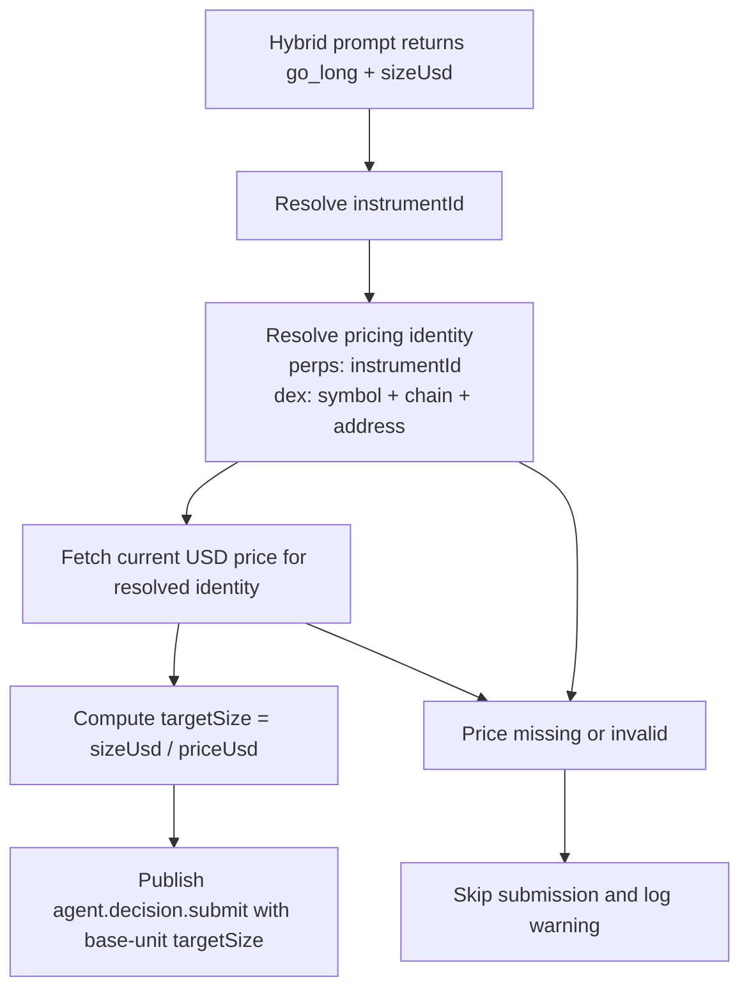

# 002 — Hybrid USD-to-Base Size Conversion Before Decision Submission

**Status:** Planned  
**Created:** 2026-07-17  
**Depends on:** [002-hybrid-agent-redesign](../../06/22/002-hybrid-agent-redesign/001-plan.md) (implemented)

## Problem

The hybrid evaluator prompt and response schema intentionally use `sizeUsd` as a
high-level sizing input:

```json
[{"instrumentId":"SOL-PERP","intent":"go_long","sizeUsd":50}]
```

That is correct for the LLM layer, but the execution intake contract does not
accept dollar-denominated size. `agent.decision.submit.targetSize` is defined as
base units:

- `$50` of ETH at `$2500` must become `0.02`
- not `50`

Today the hybrid callback in `apps/worker/src/agent.ts` forwards `sizeUsd`
directly into `targetSize`. That makes the runtime interpret a dollar amount as
asset quantity, which can inflate position size by orders of magnitude and
causes risk-gate rejections or worse if limits are permissive.

## Goals

- Keep the hybrid LLM contract in USD.
- Keep the shared `submit_decision` / `agent.decision.submit` contract in base units.
- Convert exactly once, at the hybrid runtime boundary, before the decision is published.
- Fail closed when price data is unavailable or invalid.
- Fully support spot/DEX sizing from the start using exact chain/address identity where available.
- Add focused tests for the conversion path and preserve all existing protocol contracts.

## Non-Goals

- Do not change the general `submit_decision` tool schema.
- Do not widen `DecisionSubmitPayloadSchema` to support both USD and base-unit sizing.
- Do not change scout/judge trading flows.
- Do not introduce venue-minimum or lot-size rounding policy in the hybrid layer; downstream execution still owns final validation.

## Decisions

| Decision | Choice | Rationale |
|---|---|---|
| LLM sizing unit | Keep `sizeUsd` | The hybrid prompt already frames sizing in dollars and that is easier for the model to reason about. |
| Engine submission unit | Keep `targetSize` in base units | This is already the contract used by the trading tools, protocol schema, and execution path. |
| Conversion point | Hybrid runtime callback before `publishToInbound` | Fixes the current bug with the smallest blast radius and avoids changing shared message schemas. |
| Price source | Reuse the agent runtime `priceService`, including identity-aware resolution for DEX assets. This is a deliberate, accepted exception to `docs/tech/architecture/market-data.md` principle 1 ("trade sizing must use venue-native marks... not a generic price service") — see rationale below. | The runtime already constructs this dependency and it exposes both direct pricing and chain/address-aware resolution. A true venue-native/execution quote isn't available pre-submission for DEX in this system (it only exists at swap-execution time), and the existing scout/judge tool path already sizes off `priceService` via `get_price` for the same reason — holding the hybrid path to a stricter, unmet-elsewhere standard would be inconsistent rather than safer. The emitted `targetSize` is a target quantity; downstream execution still re-quotes at fill time regardless of how it was sized. |
| DEX support scope | Include spot/DEX chain-address resolution in v1 | Avoids fixing perps now and reopening the design when hybrid support expands beyond perp instruments. |
| Failure mode | Skip submission and log a structured warning | Loud failure is safer than silently guessing quantity or submitting a malformed size. |
| Numeric handling | Use `Decimal` for USD ÷ price conversion, rendered via `.toFixed()` (never `.toString()`) | Avoids float drift; `.toFixed()` guarantees a plain decimal string that matches `DecisionSubmitPayloadSchema`'s regex, whereas `.toString()` can emit scientific notation (e.g. `1e-9`) for extreme price ratios and would fail validation downstream. |

## Design

### Contract split

There are two distinct contracts and both should remain explicit:

1. **Hybrid decision contract:** `sizeUsd`
2. **Execution submission contract:** `targetSize` in base units

The bug is not that the hybrid evaluator uses USD. The bug is that the runtime
currently skips the translation step between those two contracts.

### Proposed flow



### Conversion rules

For hybrid `go_long` decisions only:

```ts
// SIZE_DECIMAL_PLACES = 18 — generous enough that no reasonable sizeUsd/priceUsd
// ratio loses significant digits. This is not a venue lot-size or token-decimals
// value; downstream execution still owns final rounding to whatever precision
// the venue/token actually supports (see Non-Goals).
const SIZE_DECIMAL_PLACES = 18;
targetSize = Decimal(sizeUsd).div(priceUsd).toFixed(SIZE_DECIMAL_PLACES)
```

Rules:
- `sizeUsd` must be finite and `> 0`
- `priceUsd` must be finite and `> 0`
- the resolved price result's `stale` flag must not be `true` (see Price lookup)
- computed `targetSize` must be finite and `> 0`
- if any check fails, do not publish a decision
- use `.toFixed()`, not `.toString()` — `decimal.js` switches to exponential
  notation (e.g. `1e-9`) outside its default exponent bounds, which would
  violate `DecisionSubmitPayloadSchema.targetSize`'s `/^\d+(\.\d+)?$/` regex
  for a high-priced instrument combined with a small `sizeUsd`
- construct values via the existing `price()` / `quantity()` helpers in
  `packages/domain/src/values/money.ts` rather than raw `new Decimal(...)`,
  consistent with the branded-type convention in AGENTS.md

`go_flat` remains unchanged and continues to submit `targetSize: '0'`.
`skip` and `hold` still do not publish any decision.

### Placement

Add a small helper dedicated to the hybrid path instead of embedding pricing and
decimal math inline inside the tick loop. Suggested shape:

```ts
async function resolveHybridTargetSize(params: {
  instrumentId: string;
  sizeUsd: number;
  priceService: PriceService;
  pricingIdentity: {
    kind: 'perps' | 'dex';
    symbol: string;
    chain?: string;
    address?: string;
  };
}): Promise<{ ok: true; targetSize: string; priceUsd: number; source?: string; resolvedSymbol?: string; resolvedChain?: string; resolvedAddress?: string } | { ok: false; code: string; message: string }>;
```

Responsibilities:
- fetch a current USD price for the instrument
- resolve exact pricing identity for DEX assets
- convert quote-denominated size into base units
- return structured failure details for logs/tests

Non-responsibilities:
- publishing inbound messages
- risk-gate logic
- venue step-size rounding
- intent validation already owned by the evaluator/schema

### Identity preservation for DEX assets

Perp sizing can usually reprice directly from `instrumentId`. DEX sizing cannot
safely rely on bare symbol strings because the runtime already has explicit
cross-chain collision concerns (`USDC` on Solana vs `USDC` on Ethereum) and
same-symbol fakes on the same network.

That means the hybrid path must preserve a **pricing identity** from the scan
layer into the submission layer:

```ts
type HybridPricingIdentity = {
  kind: 'perps' | 'dex';
  symbol: string;
  chain?: string;
  address?: string;
};
```

Rules:
- Perps may use `kind: 'perps'` with `instrumentId`/symbol-based repricing.
- DEX assets must carry `chain` and should carry `address` whenever the scanner
  has a resolved token identity.
- If a DEX signal reaches the hybrid callback without enough identity to price
  safely, skip submission rather than repricing by ambiguous ticker.

**Threading identity to the callback:** `runHybridEvaluator`'s `submitDecision`
callback signature is currently `(instrumentId, intent, sizeUsd) => Promise<void>`
and does not carry pricing identity. `resolveDecisionInstrumentId()` inside
`hybrid-agent-evaluator.ts` already matches a decision back to a scan signal —
widen `submitDecision` to also pass the resolved `HybridPricingIdentity` derived
at that same match site, rather than having `agent.ts` re-derive the match
independently. Two separate lookups against `scan.signals` for the same
decision is a drift risk (e.g. symbol-vs-instrumentId precedence diverging
between the two call sites).

### Price lookup

There is only one call, not two paths: `priceService.resolvePriceTarget(symbol,
chain, address?)` (`packages/market-data/src/price-service.ts`) already branches
internally on `chain`. When `chain === 'hyperliquid'` it tries the Hyperliquid
execution/asset-context mark first, then oracle, then cache; for every other
chain it goes straight to the oracle (DexScreener), then cache. `getPrice()` is
just a projection of the same function. There is no separate "mark/execution
lookup path" to find elsewhere in the codebase for perps — call
`resolvePriceTarget` for both cases:

- **Perps:** `resolvePriceTarget(symbol, 'hyperliquid')` — pass the literal
  string `'hyperliquid'` as `chain`, not the instrument's own identity field.
- **Spot/DEX:** `resolvePriceTarget(symbol, chain, address?)` using the
  chain/address preserved from the scan signal, anchoring to the exact resolved
  identity rather than an ambiguous ticker.

**Reject `stale: true` results.** `resolvePriceTarget` can return a cached,
stale price as a last resort (see its cache-fallback branch). Treat
`data.stale === true` as a failed lookup for hybrid sizing purposes — do not
size a new position off a stale reference price. This is stricter than the
general non-goal about price drift (see Risks) but is a cheap, explicit guard
against compounding staleness with the runtime-price-vs-fill-price drift that's
already accepted for v1.

If the current `TechnicalScanState` signal objects do not carry enough identity
for DEX repricing, extend the scan output to preserve it alongside each signal
before the hybrid evaluator sees it.

**Note on `priceService`'s scope:** the module docstring states it is
"deliberately NOT used for actual trade sizing or swap execution," and
`docs/tech/architecture/market-data.md` principle 1 says live trade sizing
"must use venue-native marks or the latest executable quote, not a generic
price service." **Decision: use it anyway, as an accepted v1 exception** (see
the "Price source" row in Decisions above and the corresponding Risks row).
The `stale: true` rejection above is the mitigation for this exception — it
keeps the hybrid path off cached/degraded prices even though it can't fully
match a true execution-quote guarantee.

### Logging and metadata

When conversion succeeds, include diagnostic metadata on the published decision:

```ts
metadata: {
  trigger: 'hybrid_evaluator',
  source: 'scanner',
  hybridSizeUsd: sizeUsd,
  hybridReferencePriceUsd: priceUsd,
  hybridPriceSource: source,
  hybridResolvedChain: resolvedChain,
  hybridResolvedAddress: resolvedAddress,
}
```

This keeps the execution contract unchanged while leaving an auditable record of
how the base-unit size was derived.

When conversion fails, log at `warn` with:
- `instrumentId`
- `sizeUsd`
- failure code
- error/source details when available

## Implementation

### Files changed

| File | Action |
|---|---|
| `apps/worker/src/agent.ts` | Replace direct `sizeUsd -> targetSize` forwarding with conversion-aware hybrid submission logic |
| `apps/worker/src/hybrid-decision-sizing.ts` (new) | Add focused helper for price lookup + USD/base-unit conversion |
| `apps/worker/src/hybrid-decision-sizing.test.ts` (new) | Add unit tests for successful conversion and failure modes |
| `apps/worker/src/runtime-composition.ts` | Extend hybrid scan state/types to preserve pricing identity needed for DEX repricing |
| `apps/worker/src/complete-technical-scan.ts` | Persist the additional pricing identity on the scan state passed to the hybrid evaluator |
| `packages/strategy/src/scan-engine.ts` or nearest owning scan type | Extend signal shape or attach sidecar metadata so DEX signals can retain chain/address identity |
| `apps/worker/src/hybrid-agent-evaluator.ts` | Widen the `submitDecision` callback type to pass the resolved `HybridPricingIdentity` alongside `instrumentId`/`intent`/`sizeUsd`, derived at the same match site as `resolveDecisionInstrumentId()` |
| `apps/worker/src/hybrid-agent-evaluator.test.ts` | Update existing `submitDecision` mock call sites for the new signature; add a regression test proving hybrid `go_long` decisions carry pricing identity through to the callback |

### Step 1 — Preserve pricing identity through the hybrid path

Ensure each hybrid-entry signal has enough information for safe repricing:

- perps: exact venue instrument identity
- DEX: symbol + chain + address when available

Implementation options:

- extend `ScoredSignal` with optional pricing metadata, or
- add a sidecar identity map on `TechnicalScanState` keyed by `instrumentId`

Preferred direction: keep the prompt simple and preserve identity in runtime
state rather than asking the LLM to reason about chain/address fields.

### Step 2 — Isolate hybrid sizing conversion

Create `hybrid-decision-sizing.ts` with a pure-ish helper around `priceService`:

- validate `sizeUsd`
- resolve/fetch price using perp or DEX identity rules
- validate `priceUsd`
- divide using `Decimal`
- return decimal-string base quantity

Representative cases:

```ts
$50 at $2500   -> 0.02
$100 at $100   -> 1
$25 at $0.50   -> 50
```

Representative failures:

- missing `priceService`
- price lookup not found
- DEX signal missing required chain/address identity
- stale/invalid/non-positive price
- zero or negative `sizeUsd`
- computed zero/non-finite target size

### Step 3 — Wire the hybrid callback in `agent.ts`

Update the `submitDecision` callback passed to `runHybridEvaluator`:

- for `go_long`, call the helper first, using the `HybridPricingIdentity` passed
  in by the evaluator (see "Threading identity to the callback" above) — do not
  re-resolve the signal match independently in `agent.ts`
- publish only the converted `targetSize`
- attach conversion metadata
- if conversion fails, throw or return a structured error so the evaluator records `submit_failed(...)`

`agent.ts` has no existing unit-test harness (it runs only as a process
entrypoint and nothing imports it directly). Keep this callback as thin,
obviously-correct glue — all branching logic (validation, price lookup,
conversion, failure codes) belongs in `hybrid-decision-sizing.ts`, which is the
actual unit under test. Do not rely on testing the `agent.ts` wiring itself.

Keep current behavior for:
- `go_flat` -> publish `targetSize: '0'`
- `skip` / `hold` -> no publish (already handled in evaluator)

### Step 4 — Preserve existing protocol contracts

Do **not** modify:

- `HybridAgentDecisionSchema` (`sizeUsd` stays)
- `DecisionSubmitPayloadSchema` (`targetSize` stays required and base-unit-denominated)
- `submit_decision` tool docs and prompt guidance

This keeps the fix local to the hybrid runtime boundary and avoids a wider
schema migration through broker, handler, tests, and other producers.

### Step 5 — Add regression coverage

Unit coverage should include:

1. `resolveHybridTargetSize()` converts USD to base size with exact decimal-string output.
2. Non-positive `sizeUsd` is rejected.
3. Missing or invalid price lookup is rejected.
4. DEX repricing uses exact chain/address identity when available.
5. Ambiguous DEX ticker-only signals are rejected instead of repriced unsafely.
6. `go_flat` still publishes `targetSize: '0'`.

Item "`agent.ts` hybrid callback publishes converted base units, not raw USD" is
not independently unit-testable today — `agent.ts` has no test file and is not
imported anywhere in the test suite. Treat that behavior as covered
transitively by (1) the `hybrid-decision-sizing.ts` unit tests and (2) manual/
integration verification (e.g. an agent trade test run), not as a standalone
unit test to write.

Keep tests narrow. No end-to-end trading test is required for the initial fix if
the helper behavior is covered.

## Validation

After implementation:

1. Run the new unit tests for the hybrid sizing helper and hybrid evaluator slice.
2. Run the relevant worker test slice covering hybrid evaluator behavior, including DEX identity cases.
3. Run `pnpm lint` as the final repo-required validation.

Suggested commands:

```bash
pnpm --filter @herobids/worker test -- hybrid-decision-sizing
pnpm --filter @herobids/worker test -- hybrid-agent-evaluator
pnpm lint
```

## Risks

| Risk | Impact | Mitigation |
|---|---|---|
| DEX signal lacks stable identity metadata | Hybrid entries skipped | Make pricing identity preservation an explicit implementation step and fail closed when absent |
| Price lookup chain/instrument mismatch | Hybrid entries skipped or mispriced | Use resolver-capable chain/address lookup for DEX assets and add exact-identity tests |
| Runtime price differs slightly from later intake mark | Minor quantity drift | Accept for v1; downstream risk and venue validation remain authoritative |
| Silent fallback to raw USD | Severe oversizing regression | No fallback path; conversion failure must block publish |
| DEX identity plumbing (Step 1) touches shared `ScoredSignal`/scan-engine types in `packages/strategy`, consumed outside the hybrid path too | Wider blast radius than the "smallest blast radius" rationale implies | Scope Step 1 as an additive optional field only; add a regression test in the scout/judge scan path confirming existing consumers are unaffected |
| A unit-correct `sizeUsd` can still be economically unsound (e.g. an oversized notional relative to available capital) | Correct base-unit conversion of a bad USD decision still produces a bad trade | Out of scope for this fix by design (units, not sizing policy) — but confirm the existing risk gate enforces available-capital/notional caps for agent decisions independent of this change |
| **Accepted exception:** `priceService` documents itself as "deliberately NOT used for actual trade sizing or swap execution" (`packages/market-data/src/price-service.ts`), and `docs/tech/architecture/market-data.md` principle 1 says trade sizing "must use venue-native marks or the latest executable quote, not a generic price service." This plan uses `priceService` for exactly that. | Sizing off a non-execution price source may drift further from fill price than the architecture doc intends | **Decided: Option A.** Accepted as a bounded v1 exception — `targetSize` is a target quantity, not a guaranteed notional, and downstream execution still re-quotes at fill time. A true venue-native/executable-quote source isn't available pre-submission for DEX anyway, and the scout/judge tool path already sizes off `priceService` via `get_price`, so this doesn't lower the bar relative to the rest of the system. Mitigated by rejecting `stale: true` results (see Price lookup) so the exception doesn't also compound with cached/degraded data. |

## Rollout Notes

- This is a behavior fix, not a contract migration.
- Existing hybrid prompts and saved examples remain valid.
- Existing tool-based agents remain unaffected because `submit_decision` stays base-unit-only.
