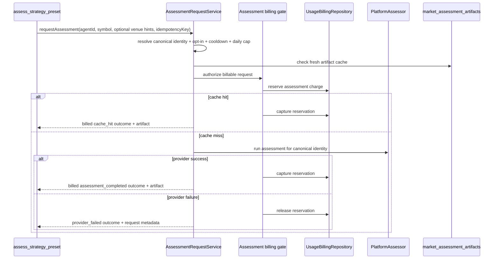

# Implementation Plan: Authoritative Assessment Request, Cache, And Billing Service

**Status:** Draft - rewritten after implementation review
**Depends on:** [008-real-evidence-and-scorecards.md](./008-real-evidence-and-scorecards.md) and [009-llm-preset-ranking.md](./009-llm-preset-ranking.md)
**Companion:** [012-tool-context-wiring.md](./012-tool-context-wiring.md)
**Purpose:** Make every public assessment request use one durable, billing-gated, cross-worker-safe service boundary.

## Authoritative Plan

This section supersedes the archived billing draft below and fully absorbs the former non-billing request-service plan `011`. Implement only this section.

### Invariants

- Every billable assessment request, including cache reuse and batch requests, passes through `AssessmentRequestService`.
- Tools do not directly read an artifact and claim an assessment was billed, invoke `PlatformAssessor`, reserve credit, or implement a private cache/cooldown rule.
- `market_assessment_runs` are shared provider executions. They must not store a single requesting `agentId`; requester, owner, cooldown, daily-cap, billing, and idempotency state belong to request attempts.
- One canonical identity has at most one non-expired cross-worker provider lease at a time. Separate requesting agents may join its result while retaining separate request and billing records.
- One active artifact per identity is maintained transactionally. A replacement supersedes the old active artifact before insertion; an expired row left `active` must never violate the partial unique index.
- Provider work starts only after request intent and billing reservation are durable. A provider failure releases, rather than captures, the request reservation.

### Service Boundary And Tool Transport

Create one typed `AssessmentRequestPort` with `requestAssessment` and bounded `requestBatchAssessment` operations. The port returns a request ID, canonical identity when resolved, cache disposition, artifact/run reference, billing outcome, and structured blocked/failure reason.

`assess_strategy_preset` is the thin adapter over this port (single-instrument via `requestAssessment`, multi-instrument via `requestBatchAssessment`). `change_strategy_preset` reads an exact artifact only and never invokes the port implicitly.

The service is worker-owned because it composes billing, provider access, durable leases, and the platform assessor. Before implementation, trace whether agent tools execute in the worker process or a separate runtime process, then bind the same typed port through the existing request/reply infrastructure or a new explicit worker RPC adapter. Do not solve this boundary by giving tools a second direct-DB/provider implementation. The chosen adapter must preserve request IDs, caller agent ID, idempotency keys, structured errors, and tool timeout/cancellation semantics.

### Request Attempt Persistence

Add `market_assessment_requests` as the authoritative requester and billing ledger. It records every attempted request, including blocked attempts, but a canonical identity is nullable for `identity_unresolved` rows.

Required fields include:

- request ID, agent ID, owner user ID, billing account/period/rate-card IDs;
- sanitized raw request snapshot and nullable canonical identity snapshot/columns;
- idempotency key, request-group key, attempt number, retry-of request ID;
- status: `identity_unresolved`, `opt_in_blocked`, `cooldown_blocked`, `daily_cap_blocked`, `billing_blocked`, `in_progress`, `awaiting_shared_run`, `cache_hit`, `assessment_completed`, or `provider_failed`;
- quoted reservation amount, reservation/capture/release ledger IDs, usage-event ID, failure code/message;
- linked shared run and artifact IDs; requested/completed timestamps.

Use a unique `(request_group_key, attempt_number)` constraint and a partial unique in-flight group constraint. A successful cache/completed request with the same group returns its recorded outcome without a new reservation. A provider-failed request may create a new attempt using the same idempotency key; every attempt is auditable.

Do not add `agentId` to `market_assessment_runs`. Link each request attempt to the shared run it created or joined.

### Cross-Worker Identity Lease And Artifact Replacement

Use Postgres, not an in-memory map, as the cross-worker source of truth. Add a lease table or an equivalent independently constrained lease record keyed by canonical identity. It must contain holder ID, associated run ID, acquired/heartbeat/expiry timestamps, and enforce one live holder per identity.

Lease behavior:

1. Acquire or join in a transaction after reservation.
2. A joining request is linked to the existing run and waits or observes its durable result; it does not invoke a second provider call.
3. The holder persists the `market_assessment_runs` intent before calling evidence/LLM providers and refreshes its lease if needed.
4. On completion or terminal failure, atomically finalize all linked request attempts and release the lease.
5. On restart, a reconciler finds expired leases and incomplete runs, marks them deterministically recoverable/failed, releases linked reservations according to settlement policy, and permits a new holder.

When an assessment completes, lock any active artifact for the identity, mark it `superseded` (or another non-active terminal status), insert the replacement artifact, finalize the run, and settle linked requests in one bounded transaction. Cache lookup must use the same identity predicates, `status = active`, and `expiresAt > now` policy everywhere.

### Authoritative Request Flow

An inexpensive preliminary cache lookup is allowed for routing only. The authoritative check occurs after durable intent/reservation so a cache hit is still charged and races cannot start duplicate work.

1. Parse tool input and resolve the canonical identity through the single identity boundary.
2. Persist `identity_unresolved` and return if resolution fails. Do not bill or call a provider.
3. Resolve `agentId -> userId`, load the current agent config, call `resolveAssessmentConfig`, and enforce opt-in/mode, cooldown, and rolling daily cap from request records.
4. Resolve or return the existing idempotent request group outcome.
5. Resolve the assessment rate-card meter, quote it once, persist the request intent, and reserve credit synchronously in the same transaction.
6. Recheck fresh artifact state. On cache hit, capture the reservation and finalize exactly this requester attempt as `cache_hit`.
7. Acquire or join the canonical identity lease. A joiner waits for the shared run outcome, then captures or releases its own reservation under the same outcome policy.
8. The holder executes `PlatformAssessor`, which follows `008` and `009`. On success, replace the artifact transactionally and capture each successful joined request. On failure, persist failure and release each linked reservation.
9. Return the durable request outcome. Never convert an ordinary cache miss into `not available`; it is a billed run or a structured blocked/failure result.

### Billing And Settlement

Extend the existing usage-billing stack. Add one rate-card meter, `assessment.request`, with quantity `1` and unit `request`. It is the single commercial price for a completed assessment and cache reuse. Do not add an `assessmentPrice` parallel to the rate card.

Add synchronous repository operations with transaction-level idempotency:

- quote the active rate-card meter and freeze its amount on the request;
- reserve only when account state and available credit permit it;
- capture a reservation by creating one usage event and one usage-charge ledger entry;
- release a reservation with a reservation-release ledger entry and no usage event.

Hard-limited and suspended accounts block. Soft-limited accounts may proceed if reservation succeeds. `availableMicrousd = balanceMicrousd - reservedMicrousd` must cover the frozen quote before reserving.

| Final request outcome | Reservation | Capture | Release | Counts toward daily cap |
|---|---|---|---|---|
| `identity_unresolved`, `opt_in_blocked`, `cooldown_blocked`, `daily_cap_blocked`, `billing_blocked` | No | No | No | No |
| `cache_hit`, `assessment_completed` | Yes | Yes | No | Yes |
| `provider_failed` after provider work began | Yes | No | Yes | Yes |

Daily-cap counting queries requests that successfully reserved credit in the rolling configured window. It is not inferred from usage events because released provider failures still count.

### Required Files

| Surface | Change |
|---|---|
| `apps/worker/src/market-intelligence/assessment-request-service.ts` | Replace all stubs and in-memory-only idempotency/lease logic with the authoritative flow. |
| Worker composition and tool transport | Construct one service and expose one typed request port to tools. |
| Assessment tools | Remove direct artifact/cache/billing paths; delegate through the port. |
| `packages/db/src/schema` | Add request attempts and identity lease persistence with indexes/constraints. |
| `packages/db/src/usage-billing-repository.ts` | Add atomic quote/reserve/capture/release operations. |
| Config/rate-card seed | Add the assessment meter without a duplicate platform-assessor price. |
| Reconciliation runtime | Recover expired leases and unfinished requests/runs. |

### Tests And Completion Bar

Unit and integration tests must prove:

- opt-in, unrecognised-mode, cooldown, daily-cap, identity, and billable-owner outcomes;
- cache hits charge exactly once and never call the provider;
- a fresh run persists intent before provider work and captures exactly once;
- provider failure releases rather than captures and counts toward the daily cap;
- successful idempotent retries do not reserve/capture twice, while failed retries create a fresh attempt;
- concurrent requests from separate worker processes create one provider run/active artifact but retain distinct request attempts and billings;
- stale lease recovery cannot double-capture or leave reservations stuck;
- expired active artifacts are superseded safely before replacement;
- every single and batch public assessment tool delegates to the same port.

Generate the Drizzle migration, verify its journal entry, and run the end-to-end billing scenario in [006-followup-plan.md](./006-followup-plan.md). This plan is complete only when C3 and C4 have executable proof.

## Archived Draft - Do Not Implement

---

## 0. How To Use This Document

Use this plan for the billing slice only.

- `005` remains the authoritative feature checklist.
- `006` remains the authoritative closure plan for the wake-delivery and end-to-end runtime gaps.
- `007` defines the missing billing architecture, persistence, request semantics, and proof needed to make the assessment request path truly billable and production-safe.

This plan is intentionally narrow. It does **not** replace the separate follow-ups for:

- removing remaining legacy segment-key types and tests,
- correcting stale tool metadata outside the billing-facing tool descriptions,
- or closing the broader `assessment_review` proof gaps in `006`.

---

## 1. Billing Decisions Fixed For This Follow-up

These choices are now fixed for the billing slice and should be treated as plan inputs, not open design space.

| ID | Decision | Why it matters |
|---|---|---|
| B1 | **Assessment billing extends the existing usage-billing stack.** Do not build a parallel assessment-only billing subsystem. | Reuses billing accounts, billing periods, rate cards, ledger semantics, spend-state enforcement, top-up behavior, and reporting. |
| B2 | **Provider failure after reservation releases the reservation and does not charge the user.** | Matches the selected settlement policy and prevents users from paying for a failed assessor/provider attempt. |
| B3 | **`maxReviewRequestsPerDay` counts every request that successfully reserves credit, including requests that later end in `provider_failed`, over a rolling 24-hour window (see R7).** | Daily cap is a cost-control mechanism, not only a successful-charge counter. Failed attempts still consume scarce provider/budget capacity. |
| B4 | **A retry after `provider_failed` creates a fresh request lifecycle, even when the caller reuses the same idempotency key.** | This resolves the current conflict between `005` wording and the domain billing contract. The idempotency key remains stable for successful/in-flight dedupe, but a failed released attempt may be retried as a new attempt. |
| B5 | **Soft-limited accounts do not block assessment requests. Hard-limited and suspended accounts do.** | Aligns assessment billing with existing runtime billing semantics: soft cap warns, hard cap blocks. |
| B6 | **Billing price is sourced from a rate-card meter, not a hard-coded assessment price literal.** Use one dedicated meter key for assessments. | Keeps the billing source of truth in the existing rate-card system and avoids price drift between config and actual charging. |

---

## 1a. Review Decisions (2026-07-19)

The following implementation decisions were resolved during design review and are now fixed inputs. They close ambiguities that would otherwise surface during implementation.

| ID | Decision | Rationale |
|---|---|---|
| R1 | **The `billing_usage_events.idempotency_key` for a settled capture is the per-attempt `market_assessment_requests.id`, never the caller-supplied idempotency key.** | The usage-event table enforces a global `UNIQUE(idempotency_key)`. Keying the event on the caller key would let a later attempt in the same request group silently `ON CONFLICT DO NOTHING` and under-charge. The per-attempt request id is unique per billable attempt. |
| R2 | **In-flight de-dup authority is the DB partial-unique index on `request_group_key WHERE status = 'in_progress'`. A concurrent second attempt for the same identity fails fast with `request_in_flight`; it does not block, poll, or "join".** | Cross-process "join the same lease" cannot be done with an in-memory map and does not justify a poll/notify subsystem (KISS). Fail-fast is safe and never double-bills. The in-memory lease map remains only a same-process optimization. |
| R3 | **Batch requests bill per instrument.** Each accepted instrument independently reserves/captures/releases and independently counts toward the daily cap. Instruments truncated by `maxInstrumentsPerRequest` are never billed. Partial failure is allowed. | `requestBatchAssessment` already fans out serially into `requestAssessment`; per-instrument billing falls out of the existing shape with no new abstraction. |
| R4 | **Billable-context resolution reuses the existing `UsageBillingRepository` path** (`getOrCreateBillingAccountForUser` → `ensureActiveRateCard` → `getOrCreateOpenPeriod` → `getSpendState`) exactly as `UsageBillingService.ensureAccount()` does. No new `getOrCreateBillableContextForUser` resolver. | Avoids a parallel account/period/plan/cap resolution path that could diverge from runtime billing. `planId`, caps, and included credit come from the same worker billing config already wired into `UsageBillingService`. |
| R5 | **Capture reuses the same rating + spend-state recomputation as `recordAndRateUsageBatch`.** | One rating/spend-state code path prevents assessment charges from diverging from runtime-usage charges. |
| R6 | **Reservation is serialized with `SELECT … FOR UPDATE` on the period row** inside the reservation transaction, then the `available = balance − reserved ≥ quoted` check, then the mutation. | Prevents two concurrent same-account reservations from both reading stale `reserved_microusd` and over-committing. |
| R7 | **Daily cap uses a rolling 24-hour window** measured from `requested_at`, not a calendar-UTC day. | Stronger abuse control (no midnight-reset burst) and directly supported by the `agent_id + requested_at` index. |
| R8 | **Hard-limited → `billing.limit_exceeded` unconditionally in this slice. No `billing.top_up_required` branch.** | Removes the only deferred branch. Top-up user-action cues are a separate UX concern and must not fork the billing gate now. |
| R9 | **Request lineage is modelled solely by `request_group_key + attempt_number`. The `retry_of_request_id` column is dropped.** | Two lineage mechanisms invite drift; the group key + attempt number is sufficient and already indexed. |
| R10 | **Canonical identity columns are authoritative for lookups/indexes; `identity_snapshot` JSON is audit-only** and is never read by query paths. | Prevents accidental reliance on denormalized JSON for correctness. |
| R11 | **Venue inference is out of scope for this billing slice.** The tool keeps the current explicit `venueFamily` requirement and returns a disambiguation error when absent. | The billing slice must not introduce new inference behavior; venue inference is a separate ergonomics follow-up. |
| R12 | **The billed unit stays per-request (flat price), but the assessment's real LLM token cost is tracked internally for observability.** Each assessment run aggregates its token usage and records an estimated LLM cost on the request row — this figure never charges the user; it exists solely to set and tune the flat `assessment.request` price from real data. | Keeps predictable, pre-authorizable, quotable pricing and billable cache hits (per-request), while giving the operator real cost data to calibrate the flat price and margin. Reuses the existing LLM pricing path. |
| R13 | **Seeded `assessment.request` price: `priceMicrousd = 50000` ($0.05).** The meter key, seed plumbing, and `perUnit: 1` are wired; the price is fixed at $0.05 per request and tunable from R12 observability data. | Conservative estimate ~2× standard-tier raw LLM cost at current model pricing; covers premium tier near break-even. Daily cap of 4 requests = $0.20/day. |
| R14 | **Default `maxReviewRequestsPerDay = 4`**, rolling 24h window. Schema default is explicit; operators may override. | Prevents unbounded spend. At $0.05/request, 4/day = $0.20/day = ~$6/month — trivial for paid users. Combined with R13 this gives a clear cost envelope. |

---

## 2. Billing Completion Bar

The billing slice is not complete until all of the following are true.

1. `assess_strategy_preset` always routes through the request service.
2. The request service performs synchronous billing enforcement before any provider work starts.
3. Cache hits are billed through the same billing stack as fresh runs.
4. `provider_failed` requests release reserved credit and do not capture a charge.
5. Daily request cap counting is enforced from persisted request records, not inferred indirectly from successful usage charges.
6. The worker can resolve the billable owner and billing account for an assessment request from the requesting agent.
7. Assessment billing is represented in both the billing ledger and a first-class assessment request audit trail.
8. The rate card supports a dedicated assessment meter.
9. Executable tests prove reservation, capture, release, retry, cache-hit billing, and tool integration behavior.

If any one of those is missing, billing for the feature remains incomplete.

---

## 3. Current Billing Gaps

Each gap below maps to a concrete owner surface.

| Gap ID | Missing behavior | Owner files |
|---|---|---|
| BG1 | `AssessmentRequestService` still stubs opt-in validation, cooldown, cache lookup, billing authorization, and daily-cap enforcement. | `apps/worker/src/market-intelligence/assessment-request-service.ts` |
| BG2 | `assess_strategy_preset` bypasses the request service and directly reads artifacts, so no authoritative billing gate exists. | `apps/worker/src/tools/assess-strategy-preset.ts` |
| BG3 | The existing billing stack has usage-event charging, but no synchronous assessment reservation/capture/release helper. | `packages/db/src/usage-billing-repository.ts` |
| BG4 | There is no first-class persisted assessment-request lifecycle to support request IDs, daily-cap counting, retry history, or billing audit. | `packages/db/src/schema/*`, new schema file required |
| BG5 | The usage-billing config and rate-card seed path do not currently support an assessment-specific meter key. | `packages/domain/src/config/schema.ts`, `packages/db/src/schema/billing-usage-events.ts`, `packages/db/src/schema/billing-rate-card-items.ts` |
| BG6 | The tool/runtime path does not yet expose a stable billing-owner resolution contract for assessment requests. | `apps/worker/src/tools/assess-strategy-preset.ts`, `apps/worker/src/agent.ts`, `apps/worker/src/market-intelligence/assessment-request-service.ts` |
| BG7 | There is no billing-proof test suite for reservation/capture/release, capped retries, or service-tool integration. | worker tests + db repository tests |

---

## 4. Authoritative Billing Architecture

The request path should become:



### 4.1 One billing source of truth

Assessment requests must reuse the existing commercial billing model:

- billing account
- open billing period
- active rate card
- ledger entries
- spend-state evaluation
- usage event reporting

Do not introduce a second pricing source in `platformAssessor` config. The operator chooses the charge by configuring the assessment meter in usage billing rate cards.

### 4.2 One authoritative request ledger

Because `provider_failed` counts toward the daily cap but does **not** settle a charge, usage events alone are insufficient. A first-class assessment-request table is required to record:

- request lifecycle
- reservation outcome
- retry chain
- daily-cap eligibility
- artifact/run linkage
- request ID returned to the tool

---

## 5. Persistence Model

### 5.1 New table: `market_assessment_requests`

Add a first-class table to track every assessment request attempt.

Minimum fields:

- `id`
- `agent_id`
- `user_id`
- `billing_account_id`
- `billing_period_id`
- canonical identity columns:
  - `instrument_kind`
  - `venue_family`
  - `style_tier`
  - `symbol`
  - `network`
  - `address`
- `identity_snapshot` — audit-only JSON; never read by query/lookup paths (R10). Canonical identity columns above are authoritative.
- `idempotency_key`
- `attempt_number`
- `request_group_key` — a deterministic string derived from `(agent_id, instrument_kind, venue_family, style_tier, symbol|network+address, idempotency_key)`
- `status`:
  - `in_progress`
  - `cache_hit`
  - `assessment_completed`
  - `provider_failed`
  - `billing_blocked`
  - `cooldown_blocked`
  - `identity_unresolved`

> `request_in_flight` (R2) is a transient rejection returned when the `in_progress` partial-unique index blocks a concurrent duplicate. It does **not** create a request row and is never a stored status.
- `billing_outcome`
- `reservation_amount_microusd`
- `reservation_ledger_entry_id`
- `capture_usage_event_id` nullable
- `capture_ledger_entry_id` nullable
- `release_ledger_entry_id` nullable
- `assessment_run_id` nullable
- `assessment_artifact_id` nullable
- cost-observability columns (R12) — informational only, never used to compute the user charge:
  - `estimated_llm_cost_microusd` nullable
  - `llm_input_tokens` nullable
  - `llm_output_tokens` nullable
  - `llm_reasoning_tokens` nullable
  - `llm_call_count` nullable
- `failure_code` nullable
- `failure_message` nullable
- `requested_at`
- `completed_at` nullable
- `created_at`

> Lineage is modelled by `request_group_key + attempt_number` alone (R9). There is no `retry_of_request_id` column.

Required indexes/constraints:

- identity lookup index
- `agent_id + requested_at` index
- `request_group_key + attempt_number` unique index
- partial unique index on `request_group_key` where `status = 'in_progress'` so only one active in-flight attempt exists per request group at a time

### 5.2 Billing tables: extend, do not fork

Reuse existing billing tables rather than creating assessment-specific billing tables.

Required extensions:

- `billing_usage_events.meter_key` must support the assessment meter key.
- `billing_usage_events.source_type` must support `assessment_request`.
- The settled capture event's `idempotency_key` is the per-attempt `market_assessment_requests.id`, never the caller idempotency key (R1). This keeps the existing global `UNIQUE(idempotency_key)` constraint safe under retries.
- `billing_rate_card_items` remains the commercial pricing source; no schema rewrite required beyond comment/documentation alignment.
- `billing_ledger_entries` already supports `reservation` and `reservation_release` entry types; implement code paths that actually use them.

### 5.3 Request rows and usage events have distinct purposes

Persist both, for different reasons:

- `market_assessment_requests` is the authoritative request and daily-cap ledger.
- `billing_usage_events` is the authoritative commercial usage event only for settled charges.

Rules:

- `cache_hit` and `assessment_completed` create usage events and settled usage-charge ledger entries.
- `provider_failed` creates **no** settled usage event, but does create request + reservation + release audit.
- `billing_blocked`, `cooldown_blocked`, and `identity_unresolved` create request rows but no reservation and no usage event.

---

## 6. Metering And Pricing Model

### 6.1 Add one dedicated meter

Use one fixed commercial meter for assessment requests:

```text
meterKey = assessment.request
quantity = 1
unit = request
```

The charge is identical for:

- billed cache hits
- billed fresh completed runs

### 6.2 Config changes

Update `UsageBillingConfigSchema.defaultRateCardItems` so the meter-key enum includes `assessment.request`.

This plan makes default seeding explicit: local, test, and staging environments that rely on the default rate-card seed must add a seeded `assessment.request` item. Do not leave the new meter schema-only.

Required owner files:

- `packages/domain/src/config/schema.ts`
- `packages/db/src/schema/billing-usage-events.ts`
- `packages/db/src/usage-billing-repository.ts` — widen the `DefaultRateCardSeedItem` meter-key union and add a seeded `assessment.request` item with `priceMicrousd: 50000`, `perUnit: 1` (fixed per-request meter, so `quantity = 1` yields exactly $0.05).
- any tests that validate allowed seeded meter keys

### 6.3 Freeze price at reservation time

The request service must compute the charge amount once, at reservation time, from the active rate card and then persist that amount onto the request row.

Do not recompute the amount at capture time. Otherwise a rate-card change between reservation and settlement could charge a different amount than the one originally authorized.

Persist at minimum:

- `reservation_amount_microusd`
- `rate_card_id`
- enough metadata to explain how the amount was derived

### 6.4 Internal token cost-tracking (observability, not billing)

The user is charged the flat `assessment.request` price (R12). Separately, the request service records the assessment run's **actual** LLM token usage and an estimated cost so the operator can calibrate that flat price against real cost.

Rules:

- The tracked cost is **never** used to compute the user charge. The settled `usage_charge` remains the flat quoted amount from §6.3.
- The estimate reuses the existing LLM pricing path (`llm_pricing_snapshots` + the `llm.*` meter rates) that already prices the agent runtime loop — do not introduce a second pricing source.
- Aggregate usage across **all** LLM calls in a single assessment run (a run may issue multiple calls up to `maxLlmCallsPerCycle`).
- Persist the aggregate onto the request row via the R12 observability columns: `estimated_llm_cost_microusd`, `llm_input_tokens`, `llm_output_tokens`, `llm_reasoning_tokens`, `llm_call_count`.
- Cache hits perform no LLM work, so their observability columns are zero/null while the flat charge still settles — this is expected and is exactly the signal that distinguishes cache margin from fresh-run margin.
- `provider_failed` runs may still have consumed input tokens; record whatever usage was reported so failed-attempt cost is visible even though no charge settles.

Plumbing required:

- `PlatformAssessor.deps.callLlm` currently returns only a string and discards usage. Extend it to also surface token usage (provider, model, input/output/reasoning tokens) so the assessor can aggregate it. This is the single new plumbing change; it does not alter the billed unit.
- The assessor returns the aggregated usage alongside its artifact result; the request service writes it to the request row at capture (or release) time.

---

## 7. Spend-State And Billing Gate Semantics

### 7.1 Hard blockers

Assessment requests must return `billing_blocked` before any provider work when either of the following is true:

- billing account status is `hard_limited`
- billing account status is `suspended`

Authoritative error-code mapping:

- `billing.limit_exceeded` for `hard_limited` (unconditional — no `billing.top_up_required` branch in this slice, R8)
- `billing.account_suspended` for `suspended`
- `billing.insufficient_credit` when the account is active but reservation eligibility fails on available credit/cap grounds

### 7.2 Soft limit behavior

`soft_limited` does **not** block the request.

The request may continue if reservation succeeds. This preserves the platform-wide billing semantic that soft caps notify but do not silently alter runtime behavior.

### 7.3 Reservation insufficiency

If the account is otherwise active but cannot reserve the assessment charge under current period balance / cap rules, return `billing_blocked` with a stable machine-readable reason and do not invoke the assessor.

For this plan, reservation eligibility is explicit:

- compute `availableMicrousd = balanceMicrousd - reservedMicrousd`
- reservation is allowed only when `availableMicrousd >= quotedChargeMicrousd`
- if that inequality fails, return `billing_blocked` with error code `billing.insufficient_credit`

Do not infer assessment reservation eligibility from post-charge spend-state recomputation alone.

---

## 8. Reservation, Capture, And Release Flow

### 8.1 Repository helpers to add

Extend `UsageBillingRepository` with synchronous helpers dedicated to fixed-price assessment requests.

Minimum helper set:

1. Reuse the existing billable-context path — do **not** add a new resolver (R4).
   - resolve account/rate-card/period via `getOrCreateBillingAccountForUser` → `ensureActiveRateCard` → `getOrCreateOpenPeriod`, exactly as `UsageBillingService.ensureAccount()` does
   - `planId`, caps, and included credit come from the worker billing config already wired into `UsageBillingService`

2. `quoteMeterCharge(rateCardId, meterKey, quantity, provider?, model?)`
   - resolves the exact microusd charge without mutating state

3. `reserveCharge(input)`
   - locks the open period row with `SELECT … FOR UPDATE` before reading balances (R6)
   - creates a `reservation` ledger entry
   - increments `billing_periods.reserved_microusd`
   - blocks on hard-limited/suspended/insufficient funds conditions
   - returns reservation identifiers and quoted amount
  - enforces `balanceMicrousd - reservedMicrousd >= quotedChargeMicrousd` before mutating state

4. `captureReservedAssessmentCharge(input)`
   - creates the `billing_usage_events` row for `assessment.request`, keyed on the request id (R1)
   - creates the `usage_charge` ledger entry
   - decrements `reserved_microusd`
   - updates period totals and account spend state atomically, reusing the same rating + spend-state recomputation as `recordAndRateUsageBatch` (R5)

5. `releaseReservedCharge(input)`
   - creates a `reservation_release` ledger entry
   - decrements `reserved_microusd`
   - leaves `usage_charge_microusd` unchanged

### 8.2 Transaction rules

Required transactional rules:

- reservation must succeed or fail atomically with request-row creation/update for billable attempts
- capture must be atomic with usage-event insertion and period/account recomputation
- release must be atomic with request-row transition to `provider_failed`
- duplicate retries must not double-reserve or double-capture

### 8.3 Settlement policy implementation

Implement `AssessmentSettlementPolicy` concretely and validate it with `validateSettlementPolicy()`.

The fixed behavior for this plan is:

| Outcome | Reserve? | Capture charge? | Release reservation? | Counts toward daily cap? |
|---|---|---|---|---|
| `request_in_flight` (rejection, no row) | No | No | No | No |
| `identity_unresolved` | No | No | No | No |
| `cooldown_blocked` | No | No | No | No |
| `billing_blocked` | No | No | No | No |
| `cache_hit` | Yes | Yes | No | Yes |
| `assessment_completed` | Yes | Yes | No | Yes |
| `provider_failed` | Yes | No | Yes | Yes |

---

## 9. Request-Service Rewrite

### 9.1 Replace stubs with authoritative enforcement

`AssessmentRequestService` must own the full billable flow.

Required rewrite steps:

1. Resolve canonical identity.
2. Resolve agent owner `userId` from the requesting `agentId`.
3. Resolve the agent's effective assessment config via `resolveAssessmentConfig()`.
4. Validate opt-in and mode.
5. Enforce cooldown and `maxReviewRequestsPerDay`.
6. Re-check fresh artifact cache.
7. Create or join the correct request-group state for the provided idempotency key.
8. Reserve credit synchronously.
9. Return billed cache-hit artifact when cache is fresh.
10. On cache miss, acquire the per-identity in-flight slot by inserting the `in_progress` request row; the partial-unique index on `request_group_key WHERE status = 'in_progress'` is the authority. A concurrent second attempt that hits this constraint returns `request_in_flight` and does **not** block, poll, or join (R2). The in-memory lease map is a same-process optimization only.
11. Persist run intent before provider work.
12. Invoke `PlatformAssessor`.
13. Capture or release reservation according to outcome, and record the aggregated LLM token usage / estimated cost onto the request row for observability (R12, §6.4).
14. Return canonical identity, request ID, billing outcome, artifact ID if any, and retry metadata.

### 9.2 Owner resolution

Do **not** block this slice on a `ToolContext` redesign.

For the billing follow-up, the request service may resolve the billable owner by querying the agent row via `agentId -> agents.userId` using the existing DB connection.

This keeps the billing plan grounded in the current runtime shape:

- `ToolContext` already carries `agentId`
- the worker already has DB access
- the agent row already stores `userId`

If later tooling needs broader billing-aware context, that can be a separate ergonomics follow-up.

### 9.3 Daily cap enforcement

Daily cap counting must query `market_assessment_requests`, not `billing_usage_events`.

Count request attempts that reached successful reservation within the current rolling 24h window, including:

- `cache_hit`
- `assessment_completed`
- `provider_failed`

Do not count:

- `identity_unresolved`
- `cooldown_blocked`
- `billing_blocked`

### 9.4 Retry semantics

The current checklist wording should be narrowed for the billing implementation.

Authoritative retry behavior for this plan:

- concurrent attempt for same `(agent, canonical identity)` while one is `in_progress` -> return `request_in_flight` (fail-fast, R2); do not block or join
- `cache_hit` or `assessment_completed` -> return the original outcome, do not re-bill
- `provider_failed` -> create a fresh attempt row, reserve again, and run a new request lifecycle
- `billing_blocked`, `cooldown_blocked`, `identity_unresolved` -> allow a fresh attempt because the caller may have corrected the cause or time may have advanced

To support this cleanly, model retries as **attempts within a request group**, not as one immutable row per idempotency key.

### 9.5 Batch billing

`requestBatchAssessment` already fans out serially into `requestAssessment`, so billing is per instrument (R3):

- each accepted instrument independently reserves, captures or releases, and writes its own request row
- each billable attempt counts toward the daily cap independently
- instruments truncated by `maxInstrumentsPerRequest` are never billed and never reserve
- partial failure is allowed: one instrument's `provider_failed` does not roll back another instrument's settled capture
- there is no batch-level reservation or all-or-nothing settlement

---

## 10. Tool Integration

### 10.1 `assess_strategy_preset`

This tool must become a thin adapter over `AssessmentRequestService`.

Required changes:

- remove direct artifact-table billing logic from the tool
- keep symbol-first input (single or multi-instrument, up to `platformAssessor.maxInstrumentsPerRequest`)
- keep the current explicit `venueFamily` requirement; venue inference is out of scope for this billing slice (R11). When `venueFamily` is absent, return the existing disambiguation error — do not guess.
- always return request-service outcomes per instrument, including:
  - `requestId`
  - `canonicalIdentity`
  - `billingOutcome`
  - `assessmentArtifactId` when available
  - `cacheDisposition`
  - `assessedAt`
  - `expiresAt`
  - retry guidance

### 10.2 Tool metadata

Update the tool description and category semantics so they clearly state:

- the tool can incur a charge
- cache hits are billed
- retries after `provider_failed` create a new billable attempt lifecycle

This update belongs in both:

- `apps/worker/src/tools/assess-strategy-preset.ts`
- `packages/domain/src/tools.ts`

### 10.3 Other transition tools

`change_strategy_preset` is not the primary billing surface, but it must honor the billing plan indirectly:

- never trigger a new assessment implicitly
- require the exact artifact returned by the billed request path

---

## 11. Config And Schema Surfaces To Update

### 11.1 Billing config

Update usage-billing config surfaces so assessment billing can be configured and seeded through the existing rate-card path.

Required files:

- `packages/domain/src/config/schema.ts`
- `apps/worker/src/config.ts` if env mapping needs to expose additional billing config
- `config/default.yaml` when the environment relies on the seeded default rate card; include an explicit `assessment.request` seed entry (`priceMicrousd: 50000`, `perUnit: 1`) rather than requiring operators to discover the new meter manually
- `packages/domain/src/config/schema.ts` — set the `maxReviewRequestsPerDay` Zod default to `4` (was `optional()` with no default)

### 11.2 Assessment config

Do not add a second price field to `platformAssessor` if the rate-card meter is authoritative.

At most, add a billing-facing reference such as:

- `assessmentMeterKey: assessment.request`

Only if that reference is needed to avoid duplicating string literals across worker code. Avoid parallel `assessmentPrice` config when the price already lives in the rate card.

### 11.3 Drizzle migration

Add a migration that includes:

- new `market_assessment_requests` table (including the R12 cost-observability columns)
- any comment/enum-supporting changes needed for `assessment.request` and `assessment_request`
- supporting indexes/constraints for request-group lookup and in-flight uniqueness

---

## 12. Test Plan And Proof Requirements

Billing completion requires executable proof, not only code review.

> Test seam: `PlatformAssessor` is constructor-injected into `AssessmentRequestService`, so a stub assessor with a fault flag provides deterministic `provider_failed` for the release/retry/daily-cap tests (L2).

### 12.1 Domain tests

Add tests for `AssessmentSettlementPolicy` and `validateSettlementPolicy()`:

- all six outcomes handled exhaustively
- `provider_failed` releases and does not settle
- successful outcomes settle and do not release

### 12.2 Repository tests

Add `UsageBillingRepository` tests for:

1. quoting `assessment.request`
2. reserving charge for an active account
3. blocking reservation for `hard_limited`
4. blocking reservation for `suspended`
5. allowing reservation for `soft_limited`
6. capturing a reservation creates one usage event and one `usage_charge`
7. releasing a reservation leaves `usage_charge_microusd` unchanged
8. duplicate capture does not double-charge
9. duplicate release does not corrupt `reserved_microusd`

### 12.3 Request-service tests

Add dedicated tests for `AssessmentRequestService` covering:

1. `identity_unresolved` path
2. `cooldown_blocked` path
3. `billing_blocked` path from hard-limited account
4. billed cache hit
5. billed fresh completion
6. `provider_failed` releases reservation
7. daily cap counts `provider_failed` after reservation
8. same idempotency key returns same successful cached/completed outcome
9. same idempotency key after `provider_failed` creates a fresh attempt
10. a second concurrent attempt for the same identity is rejected with `request_in_flight` and does not double-reserve or double-bill
11. a fresh completion records aggregated LLM token usage and a non-zero `estimated_llm_cost_microusd` on the request row while the settled charge equals the flat quoted amount (R12)
12. a cache hit settles the flat charge while its observability cost columns remain zero/null (R12)

### 12.4 Tool tests

Add `assess_strategy_preset` tests proving:

1. the tool calls `AssessmentRequestService` rather than reading artifacts directly for billing behavior
2. tool output includes `requestId` and `billingOutcome`
3. tool surfaces billable cache hits correctly
4. tool returns blocked outcomes without starting provider work
5. missing `venueFamily` returns the disambiguation error without starting provider work or billing (R11)

### 12.5 End-to-end billing acceptance scenario

The billing slice is only complete when this scenario passes:

1. Seed an opted-in agent owned by a user with an active billing account and an open billing period.
2. Trigger an `assessment_review` wake and have the agent call `assess_strategy_preset`.
3. Verify a request row is written.
4. Verify reservation is recorded before provider work starts.
5. On cache hit, verify one settled usage event is recorded and no provider run occurs.
6. On cache miss success, verify one reservation and one captured usage event are recorded and an artifact is returned.
7. On provider failure, verify the reservation is released, no settled usage charge is recorded, and the request still counts toward the daily cap.
8. Retry the same failed request with the same idempotency key and verify a new attempt row is created.
9. Exhaust `maxReviewRequestsPerDay` and verify the next request is blocked before provider work.

---

## 13. Implementation Order

Implement billing in this order.

1. Add the billing meter and schema/config support.
2. Add `market_assessment_requests` persistence.
3. Add synchronous reservation/capture/release helpers to `UsageBillingRepository`.
4. Implement and test the concrete settlement policy.
5. Rewrite `AssessmentRequestService` to use the billing gate and request table.
6. Rewrite `assess_strategy_preset` to use the request service.
7. Extend `PlatformAssessor.deps.callLlm` to surface token usage and aggregate it per run; record the estimate on the request row (R12, §6.4).
8. Add service and tool integration tests.
9. Run targeted validation, then broader `pnpm lint` and `pnpm build`.

This order is required because the request service cannot be made authoritative until the billing primitives and request persistence exist.

---

## 14. Risks To Watch

### 14.1 Double-charge risk

If reservation/capture idempotency is wrong, cache-hit retries and concurrent requests can double-charge users.

Mitigation:

- request-group persistence
- explicit reservation/capture/release identifiers
- repository-level idempotency tests

### 14.2 Price drift risk

If capture recomputes price instead of reusing the reserved amount, rate-card changes can charge a different amount than the one originally authorized.

Mitigation:

- persist quoted amount on the request row at reservation time
- capture from persisted amount

### 14.3 Daily-cap undercount risk

If the cap is inferred from settled charges only, `provider_failed` attempts will not count and users can brute-force repeated expensive failed attempts.

Mitigation:

- cap counts reserved attempts from `market_assessment_requests`

### 14.4 Ownership-resolution risk

If the request service cannot reliably map `agentId -> userId`, billing may charge the wrong account or fail to charge at all.

Mitigation:

- resolve owner from the authoritative agent row inside the worker
- test missing-agent and mismatched-owner failure paths

---

## 15. Out Of Scope For This Plan

This plan does not by itself close:

- the remaining legacy segment-key removal work
- stale non-billing tool descriptions outside the assessment request path
- the `006` end-to-end wake-path proof gaps unrelated to billing

Those remain required for full feature completion, but they should not block the billing design from being specified cleanly here.

---

## 16. Open Questions / Blockers

All billing-architecture questions raised in review are resolved in §1a (R1–R11).

The billing-policy decisions required for this follow-up were resolved before drafting:

- extend the existing usage-billing stack
- release reservation and do not charge on `provider_failed`
- count reserved `provider_failed` attempts toward the daily cap
- allow a fresh retry lifecycle after `provider_failed`, even with the same idempotency key

### 16.1 Resolved commercial decisions

| Question | Answer |
|---|---|
| Seeded `assessment.request` `priceMicrousd` | **50000** ($0.05). See §6.2. |
| Default `maxReviewRequestsPerDay` | **4** (rolling 24h). Schema default is explicit; operators may override. |

### 16.2 Open commercial decision

- **Whether a soft-limited account surfaces a user-facing warning through the tool result.** Soft limit does not block (B5); whether to add a warning field to the tool output is a UX decision left open.
