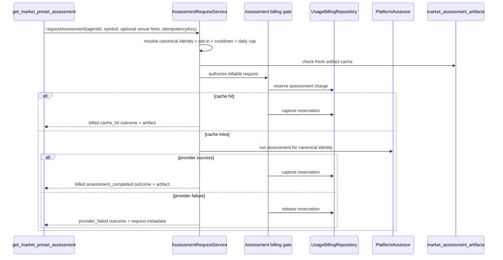

# Follow-up Plan: Assessment Billing Completion

**Status:** Draft — dedicated billing follow-up plan
**Follows:** [005-implementation-checklist-per-symbol-on-demand.md](./005-implementation-checklist-per-symbol-on-demand.md) and [006-followup-plan.md](./006-followup-plan.md)
**Purpose:** Fully implement the billing-gated on-demand assessment path without reopening the separate legacy-identity, tool-metadata, or non-billing wake-delivery follow-ups.

---

## 0. How To Use This Document

Use this plan for the billing slice only.

- `005` remains the authoritative feature checklist.
- `006` remains the authoritative closure plan for the wake-delivery and end-to-end runtime gaps.
- `007` defines the missing billing architecture, persistence, request semantics, and proof needed to make the assessment request path truly billable and production-safe.

This plan is intentionally narrow. It does **not** replace the separate follow-ups for:

- removing remaining legacy segment-key types and tests,
- correcting stale tool metadata outside the billing-facing tool descriptions,
- or closing the broader `assessment_review` proof gaps in `006`.

---

## 1. Billing Decisions Fixed For This Follow-up

These choices are now fixed for the billing slice and should be treated as plan inputs, not open design space.

| ID | Decision | Why it matters |
|---|---|---|
| B1 | **Assessment billing extends the existing usage-billing stack.** Do not build a parallel assessment-only billing subsystem. | Reuses billing accounts, billing periods, rate cards, ledger semantics, spend-state enforcement, top-up behavior, and reporting. |
| B2 | **Provider failure after reservation releases the reservation and does not charge the user.** | Matches the selected settlement policy and prevents users from paying for a failed assessor/provider attempt. |
| B3 | **`maxReviewRequestsPerDay` counts every request that successfully reserves credit, including requests that later end in `provider_failed`.** | Daily cap is a cost-control mechanism, not only a successful-charge counter. Failed attempts still consume scarce provider/budget capacity. |
| B4 | **A retry after `provider_failed` creates a fresh request lifecycle, even when the caller reuses the same idempotency key.** | This resolves the current conflict between `005` wording and the domain billing contract. The idempotency key remains stable for successful/in-flight dedupe, but a failed released attempt may be retried as a new attempt. |
| B5 | **Soft-limited accounts do not block assessment requests. Hard-limited and suspended accounts do.** | Aligns assessment billing with existing runtime billing semantics: soft cap warns, hard cap blocks. |
| B6 | **Billing price is sourced from a rate-card meter, not a hard-coded assessment price literal.** Use one dedicated meter key for assessments. | Keeps the billing source of truth in the existing rate-card system and avoids price drift between config and actual charging. |

---

## 2. Billing Completion Bar

The billing slice is not complete until all of the following are true.

1. `get_market_preset_assessment` always routes through the request service.
2. The request service performs synchronous billing enforcement before any provider work starts.
3. Cache hits are billed through the same billing stack as fresh runs.
4. `provider_failed` requests release reserved credit and do not capture a charge.
5. Daily request cap counting is enforced from persisted request records, not inferred indirectly from successful usage charges.
6. The worker can resolve the billable owner and billing account for an assessment request from the requesting agent.
7. Assessment billing is represented in both the billing ledger and a first-class assessment request audit trail.
8. The rate card supports a dedicated assessment meter.
9. Executable tests prove reservation, capture, release, retry, cache-hit billing, and tool integration behavior.

If any one of those is missing, billing for the feature remains incomplete.

---

## 3. Current Billing Gaps

Each gap below maps to a concrete owner surface.

| Gap ID | Missing behavior | Owner files |
|---|---|---|
| BG1 | `AssessmentRequestService` still stubs opt-in validation, cooldown, cache lookup, billing authorization, and daily-cap enforcement. | `apps/worker/src/market-intelligence/assessment-request-service.ts` |
| BG2 | `get_market_preset_assessment` bypasses the request service and directly reads artifacts, so no authoritative billing gate exists. | `apps/worker/src/tools/get-market-preset-assessment.ts` |
| BG3 | The existing billing stack has usage-event charging, but no synchronous assessment reservation/capture/release helper. | `packages/db/src/usage-billing-repository.ts` |
| BG4 | There is no first-class persisted assessment-request lifecycle to support request IDs, daily-cap counting, retry history, or billing audit. | `packages/db/src/schema/*`, new schema file required |
| BG5 | The usage-billing config and rate-card seed path do not currently support an assessment-specific meter key. | `packages/domain/src/config/schema.ts`, `packages/db/src/schema/billing-usage-events.ts`, `packages/db/src/schema/billing-rate-card-items.ts` |
| BG6 | The tool/runtime path does not yet expose a stable billing-owner resolution contract for assessment requests. | `apps/worker/src/tools/get-market-preset-assessment.ts`, `apps/worker/src/agent.ts`, `apps/worker/src/market-intelligence/assessment-request-service.ts` |
| BG7 | There is no billing-proof test suite for reservation/capture/release, capped retries, or service-tool integration. | worker tests + db repository tests |

---

## 4. Authoritative Billing Architecture

The request path should become:



### 4.1 One billing source of truth

Assessment requests must reuse the existing commercial billing model:

- billing account
- open billing period
- active rate card
- ledger entries
- spend-state evaluation
- usage event reporting

Do not introduce a second pricing source in `platformAssessor` config. The operator chooses the charge by configuring the assessment meter in usage billing rate cards.

### 4.2 One authoritative request ledger

Because `provider_failed` counts toward the daily cap but does **not** settle a charge, usage events alone are insufficient. A first-class assessment-request table is required to record:

- request lifecycle
- reservation outcome
- retry chain
- daily-cap eligibility
- artifact/run linkage
- request ID returned to the tool

---

## 5. Persistence Model

### 5.1 New table: `market_assessment_requests`

Add a first-class table to track every assessment request attempt.

Minimum fields:

- `id`
- `agent_id`
- `user_id`
- `billing_account_id`
- `billing_period_id`
- canonical identity columns:
  - `instrument_kind`
  - `venue_family`
  - `style_tier`
  - `symbol`
  - `network`
  - `address`
- `identity_snapshot`
- `idempotency_key`
- `attempt_number`
- `request_group_key` — a deterministic string derived from `(agent_id, instrument_kind, venue_family, style_tier, symbol|network+address, idempotency_key)`
- `status`:
  - `in_progress`
  - `cache_hit`
  - `assessment_completed`
  - `provider_failed`
  - `billing_blocked`
  - `cooldown_blocked`
  - `identity_unresolved`
- `billing_outcome`
- `reservation_amount_microusd`
- `reservation_ledger_entry_id`
- `capture_usage_event_id` nullable
- `capture_ledger_entry_id` nullable
- `release_ledger_entry_id` nullable
- `assessment_run_id` nullable
- `assessment_artifact_id` nullable
- `failure_code` nullable
- `failure_message` nullable
- `requested_at`
- `completed_at` nullable
- `retry_of_request_id` nullable
- `created_at`

Required indexes/constraints:

- identity lookup index
- `agent_id + requested_at` index
- `request_group_key + attempt_number` unique index
- partial unique index on `request_group_key` where `status = 'in_progress'` so only one active in-flight attempt exists per request group at a time

### 5.2 Billing tables: extend, do not fork

Reuse existing billing tables rather than creating assessment-specific billing tables.

Required extensions:

- `billing_usage_events.meter_key` must support the assessment meter key.
- `billing_usage_events.source_type` must support `assessment_request`.
- `billing_rate_card_items` remains the commercial pricing source; no schema rewrite required beyond comment/documentation alignment.
- `billing_ledger_entries` already supports `reservation` and `reservation_release` entry types; implement code paths that actually use them.

### 5.3 Request rows and usage events have distinct purposes

Persist both, for different reasons:

- `market_assessment_requests` is the authoritative request and daily-cap ledger.
- `billing_usage_events` is the authoritative commercial usage event only for settled charges.

Rules:

- `cache_hit` and `assessment_completed` create usage events and settled usage-charge ledger entries.
- `provider_failed` creates **no** settled usage event, but does create request + reservation + release audit.
- `billing_blocked`, `cooldown_blocked`, and `identity_unresolved` create request rows but no reservation and no usage event.

---

## 6. Metering And Pricing Model

### 6.1 Add one dedicated meter

Use one fixed commercial meter for assessment requests:

```text
meterKey = assessment.request
quantity = 1
unit = request
```

The charge is identical for:

- billed cache hits
- billed fresh completed runs

### 6.2 Config changes

Update `UsageBillingConfigSchema.defaultRateCardItems` so the meter-key enum includes `assessment.request`.

This plan makes default seeding explicit: local, test, and staging environments that rely on the default rate-card seed must add a seeded `assessment.request` item. Do not leave the new meter schema-only.

Required owner files:

- `packages/domain/src/config/schema.ts`
- `packages/db/src/schema/billing-usage-events.ts`
- any tests that validate allowed seeded meter keys

### 6.3 Freeze price at reservation time

The request service must compute the charge amount once, at reservation time, from the active rate card and then persist that amount onto the request row.

Do not recompute the amount at capture time. Otherwise a rate-card change between reservation and settlement could charge a different amount than the one originally authorized.

Persist at minimum:

- `reservation_amount_microusd`
- `rate_card_id`
- enough metadata to explain how the amount was derived

---

## 7. Spend-State And Billing Gate Semantics

### 7.1 Hard blockers

Assessment requests must return `billing_blocked` before any provider work when either of the following is true:

- billing account status is `hard_limited`
- billing account status is `suspended`

Authoritative error-code mapping:

- `billing.limit_exceeded` for `hard_limited`
- `billing.account_suspended` for `suspended`
- `billing.insufficient_credit` when the account is active but reservation eligibility fails on available credit/cap grounds
- `billing.top_up_required` may be surfaced instead of `billing.limit_exceeded` only when the account is hard-blocked, top-ups are enabled, and product requirements explicitly want the stronger user-action cue; tests must pin whichever branch is chosen by the implementation

### 7.2 Soft limit behavior

`soft_limited` does **not** block the request.

The request may continue if reservation succeeds. This preserves the platform-wide billing semantic that soft caps notify but do not silently alter runtime behavior.

### 7.3 Reservation insufficiency

If the account is otherwise active but cannot reserve the assessment charge under current period balance / cap rules, return `billing_blocked` with a stable machine-readable reason and do not invoke the assessor.

For this plan, reservation eligibility is explicit:

- compute `availableMicrousd = balanceMicrousd - reservedMicrousd`
- reservation is allowed only when `availableMicrousd >= quotedChargeMicrousd`
- if that inequality fails, return `billing_blocked` with error code `billing.insufficient_credit`

Do not infer assessment reservation eligibility from post-charge spend-state recomputation alone.

---

## 8. Reservation, Capture, And Release Flow

### 8.1 Repository helpers to add

Extend `UsageBillingRepository` with synchronous helpers dedicated to fixed-price assessment requests.

Minimum helper set:

1. `getOrCreateBillableContextForUser(userId, planId)`
   - resolves billing account, active rate card, and open billing period

2. `quoteMeterCharge(rateCardId, meterKey, quantity, provider?, model?)`
   - resolves the exact microusd charge without mutating state

3. `reserveCharge(input)`
   - creates a `reservation` ledger entry
   - increments `billing_periods.reserved_microusd`
   - blocks on hard-limited/suspended/insufficient funds conditions
   - returns reservation identifiers and quoted amount
  - enforces `balanceMicrousd - reservedMicrousd >= quotedChargeMicrousd` before mutating state

4. `captureReservedAssessmentCharge(input)`
   - creates the `billing_usage_events` row for `assessment.request`
   - creates the `usage_charge` ledger entry
   - decrements `reserved_microusd`
   - updates period totals and account spend state atomically

5. `releaseReservedCharge(input)`
   - creates a `reservation_release` ledger entry
   - decrements `reserved_microusd`
   - leaves `usage_charge_microusd` unchanged

### 8.2 Transaction rules

Required transactional rules:

- reservation must succeed or fail atomically with request-row creation/update for billable attempts
- capture must be atomic with usage-event insertion and period/account recomputation
- release must be atomic with request-row transition to `provider_failed`
- duplicate retries must not double-reserve or double-capture

### 8.3 Settlement policy implementation

Implement `AssessmentSettlementPolicy` concretely and validate it with `validateSettlementPolicy()`.

The fixed behavior for this plan is:

| Outcome | Reserve? | Capture charge? | Release reservation? | Counts toward daily cap? |
|---|---|---|---|---|
| `identity_unresolved` | No | No | No | No |
| `cooldown_blocked` | No | No | No | No |
| `billing_blocked` | No | No | No | No |
| `cache_hit` | Yes | Yes | No | Yes |
| `assessment_completed` | Yes | Yes | No | Yes |
| `provider_failed` | Yes | No | Yes | Yes |

---

## 9. Request-Service Rewrite

### 9.1 Replace stubs with authoritative enforcement

`AssessmentRequestService` must own the full billable flow.

Required rewrite steps:

1. Resolve canonical identity.
2. Resolve agent owner `userId` from the requesting `agentId`.
3. Resolve the agent's effective assessment config via `resolveAssessmentConfig()`.
4. Validate opt-in and mode.
5. Enforce cooldown and `maxReviewRequestsPerDay`.
6. Re-check fresh artifact cache.
7. Create or join the correct request-group state for the provided idempotency key.
8. Reserve credit synchronously.
9. Return billed cache-hit artifact when cache is fresh.
10. On cache miss, acquire or join the per-identity in-flight lease.
11. Persist run intent before provider work.
12. Invoke `PlatformAssessor`.
13. Capture or release reservation according to outcome.
14. Return canonical identity, request ID, billing outcome, artifact ID if any, and retry metadata.

### 9.2 Owner resolution

Do **not** block this slice on a `ToolContext` redesign.

For the billing follow-up, the request service may resolve the billable owner by querying the agent row via `agentId -> agents.userId` using the existing DB connection.

This keeps the billing plan grounded in the current runtime shape:

- `ToolContext` already carries `agentId`
- the worker already has DB access
- the agent row already stores `userId`

If later tooling needs broader billing-aware context, that can be a separate ergonomics follow-up.

### 9.3 Daily cap enforcement

Daily cap counting must query `market_assessment_requests`, not `billing_usage_events`.

Count request attempts that reached successful reservation within the current rolling 24h window, including:

- `cache_hit`
- `assessment_completed`
- `provider_failed`

Do not count:

- `identity_unresolved`
- `cooldown_blocked`
- `billing_blocked`

### 9.4 Retry semantics

The current checklist wording should be narrowed for the billing implementation.

Authoritative retry behavior for this plan:

- in-flight request for same `(agent, canonical identity, idempotency key)` -> return the original in-flight request handle or joined outcome
- `cache_hit` or `assessment_completed` -> return the original outcome, do not re-bill
- `provider_failed` -> create a fresh attempt row, reserve again, and run a new request lifecycle
- `billing_blocked`, `cooldown_blocked`, `identity_unresolved` -> allow a fresh attempt because the caller may have corrected the cause or time may have advanced

To support this cleanly, model retries as **attempts within a request group**, not as one immutable row per idempotency key.

---

## 10. Tool Integration

### 10.1 `get_market_preset_assessment`

This tool must become a thin adapter over `AssessmentRequestService`.

Required changes:

- remove direct artifact-table billing logic from the tool
- keep symbol-first input
- infer venue context where possible from current agent/runtime state; only require explicit disambiguation when inference is ambiguous
- always return request-service outcomes, including:
  - `requestId`
  - `canonicalIdentity`
  - `billingOutcome`
  - `assessmentArtifactId` when available
  - `cacheDisposition`
  - `assessedAt`
  - `expiresAt`
  - retry guidance

### 10.2 Tool metadata

Update the tool description and category semantics so they clearly state:

- the tool can incur a charge
- cache hits are billed
- retries after `provider_failed` create a new billable attempt lifecycle

This update belongs in both:

- `apps/worker/src/tools/get-market-preset-assessment.ts`
- `packages/domain/src/tools.ts`

### 10.3 Other transition tools

`recommend_preset_transition` and `apply_preset_transition` are not the primary billing surface, but they must honor the billing plan indirectly:

- never trigger a new assessment implicitly
- require the exact artifact returned by the billed request path or a fresh already-existing artifact resolved without billing

---

## 11. Config And Schema Surfaces To Update

### 11.1 Billing config

Update usage-billing config surfaces so assessment billing can be configured and seeded through the existing rate-card path.

Required files:

- `packages/domain/src/config/schema.ts`
- `apps/worker/src/config.ts` if env mapping needs to expose additional billing config
- `config/default.yaml` when the environment relies on the seeded default rate card; include an explicit `assessment.request` seed entry rather than requiring operators to discover the new meter manually

### 11.2 Assessment config

Do not add a second price field to `platformAssessor` if the rate-card meter is authoritative.

At most, add a billing-facing reference such as:

- `assessmentMeterKey: assessment.request`

Only if that reference is needed to avoid duplicating string literals across worker code. Avoid parallel `assessmentPrice` config when the price already lives in the rate card.

### 11.3 Drizzle migration

Add a migration that includes:

- new `market_assessment_requests` table
- any comment/enum-supporting changes needed for `assessment.request` and `assessment_request`
- supporting indexes/constraints for request-group lookup and in-flight uniqueness

---

## 12. Test Plan And Proof Requirements

Billing completion requires executable proof, not only code review.

### 12.1 Domain tests

Add tests for `AssessmentSettlementPolicy` and `validateSettlementPolicy()`:

- all six outcomes handled exhaustively
- `provider_failed` releases and does not settle
- successful outcomes settle and do not release

### 12.2 Repository tests

Add `UsageBillingRepository` tests for:

1. quoting `assessment.request`
2. reserving charge for an active account
3. blocking reservation for `hard_limited`
4. blocking reservation for `suspended`
5. allowing reservation for `soft_limited`
6. capturing a reservation creates one usage event and one `usage_charge`
7. releasing a reservation leaves `usage_charge_microusd` unchanged
8. duplicate capture does not double-charge
9. duplicate release does not corrupt `reserved_microusd`

### 12.3 Request-service tests

Add dedicated tests for `AssessmentRequestService` covering:

1. `identity_unresolved` path
2. `cooldown_blocked` path
3. `billing_blocked` path from hard-limited account
4. billed cache hit
5. billed fresh completion
6. `provider_failed` releases reservation
7. daily cap counts `provider_failed` after reservation
8. same idempotency key returns same successful cached/completed outcome
9. same idempotency key after `provider_failed` creates a fresh attempt
10. concurrent requests for same identity join the same in-flight lease

### 12.4 Tool tests

Add `get_market_preset_assessment` tests proving:

1. the tool calls `AssessmentRequestService` rather than reading artifacts directly for billing behavior
2. tool output includes `requestId` and `billingOutcome`
3. tool surfaces billable cache hits correctly
4. tool returns blocked outcomes without starting provider work
5. ambiguous symbol resolution requests disambiguation instead of silently guessing

### 12.5 End-to-end billing acceptance scenario

The billing slice is only complete when this scenario passes:

1. Seed an opted-in agent owned by a user with an active billing account and an open billing period.
2. Trigger an `assessment_review` wake and have the agent call `get_market_preset_assessment`.
3. Verify a request row is written.
4. Verify reservation is recorded before provider work starts.
5. On cache hit, verify one settled usage event is recorded and no provider run occurs.
6. On cache miss success, verify one reservation and one captured usage event are recorded and an artifact is returned.
7. On provider failure, verify the reservation is released, no settled usage charge is recorded, and the request still counts toward the daily cap.
8. Retry the same failed request with the same idempotency key and verify a new attempt row is created.
9. Exhaust `maxReviewRequestsPerDay` and verify the next request is blocked before provider work.

---

## 13. Implementation Order

Implement billing in this order.

1. Add the billing meter and schema/config support.
2. Add `market_assessment_requests` persistence.
3. Add synchronous reservation/capture/release helpers to `UsageBillingRepository`.
4. Implement and test the concrete settlement policy.
5. Rewrite `AssessmentRequestService` to use the billing gate and request table.
6. Rewrite `get_market_preset_assessment` to use the request service.
7. Add service and tool integration tests.
8. Run targeted validation, then broader `pnpm lint` and `pnpm build`.

This order is required because the request service cannot be made authoritative until the billing primitives and request persistence exist.

---

## 14. Risks To Watch

### 14.1 Double-charge risk

If reservation/capture idempotency is wrong, cache-hit retries and concurrent requests can double-charge users.

Mitigation:

- request-group persistence
- explicit reservation/capture/release identifiers
- repository-level idempotency tests

### 14.2 Price drift risk

If capture recomputes price instead of reusing the reserved amount, rate-card changes can charge a different amount than the one originally authorized.

Mitigation:

- persist quoted amount on the request row at reservation time
- capture from persisted amount

### 14.3 Daily-cap undercount risk

If the cap is inferred from settled charges only, `provider_failed` attempts will not count and users can brute-force repeated expensive failed attempts.

Mitigation:

- cap counts reserved attempts from `market_assessment_requests`

### 14.4 Ownership-resolution risk

If the request service cannot reliably map `agentId -> userId`, billing may charge the wrong account or fail to charge at all.

Mitigation:

- resolve owner from the authoritative agent row inside the worker
- test missing-agent and mismatched-owner failure paths

---

## 15. Out Of Scope For This Plan

This plan does not by itself close:

- the remaining legacy segment-key removal work
- stale non-billing tool descriptions outside the assessment request path
- the `006` end-to-end wake-path proof gaps unrelated to billing

Those remain required for full feature completion, but they should not block the billing design from being specified cleanly here.

---

## 16. Open Questions / Blockers

None at plan time.

The billing-policy decisions required for this follow-up were resolved before drafting:

- extend the existing usage-billing stack
- release reservation and do not charge on `provider_failed`
- count reserved `provider_failed` attempts toward the daily cap
- allow a fresh retry lifecycle after `provider_failed`, even with the same idempotency key
