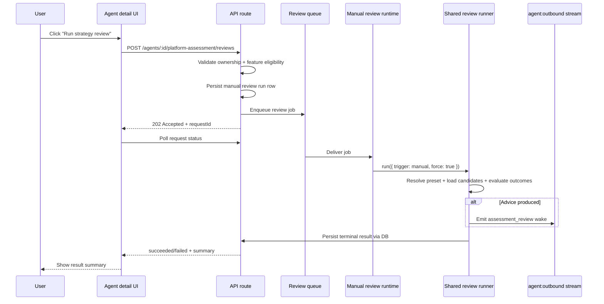

# Implementation Plan: Frontend-Triggered Forced Strategy Review

**Status:** Draft  
**Date:** 2026-07-20  
**Purpose:** Add a dedicated frontend control that lets a user trigger a strategy review on demand, end to end, without expanding the existing evaluation feature and without adding Telegram command support.

## 0. Scope

This plan covers the full user-triggered path for a forced strategy review:

1. frontend control on the agent detail surface;
2. API routes, validation, and request lifecycle;
3. worker execution and wake emission;
4. durable persistence for request state and auditability;
5. focused testing and UAT updates.

This plan does **not** cover:

- Telegram slash commands;
- expanding the existing evaluation report with more review-related detail;
- redesigning the periodic scheduled review feature;
- changing the billable assessment request flow (`assess_strategy_preset`);
- fixing all existing review-scheduler lifecycle gaps unrelated to the manual trigger.

## 1. Problem Statement

The product already has two adjacent but different capabilities:

1. a **scheduled deterministic review pre-check** driven by the worker-side `ReviewScheduler`; and
2. a **historical evaluation** feature in the frontend/API that summarizes prior behavior.

What is missing is a direct operator control to say: run the deterministic review now.

Today:

1. the agent detail page already renders an `Evaluations` card and already supports a user-triggered evaluation run;
2. the agent form already allows `platformAssessment.enabled` + `reviewIntervalMs` configuration for the current scanner-gated/hybrid flow;
3. the worker already knows how to compute review advice and emit the `assessment_review` wake;
4. the worker review scheduler is **process-local** and its public method is still **due-gated**;
5. there is no API route, no worker control plane, and no durable user-request lifecycle for a manual review.

The missing feature is therefore not “more analysis.” It is a **new operational trigger path**.

## 2. Current Code-Checked Baseline

The following current-state facts are load-bearing for this plan.

### 2.1 Frontend

1. The agent detail page already renders the `Evaluations` card via [apps/web/src/features/agents/AgentDetailPage.tsx](/Users/chinomso.ikwuagwu/dev_ai/herobids/apps/web/src/features/agents/AgentDetailPage.tsx).
2. The existing evaluation CTA lives in [apps/web/src/features/agents/AgentEvaluations.tsx](/Users/chinomso.ikwuagwu/dev_ai/herobids/apps/web/src/features/agents/AgentEvaluations.tsx).
3. The agent form already exposes periodic strategy assessment config for `hybrid + scanner_gated` agents in [apps/web/src/features/agents/AgentFormBody.tsx](/Users/chinomso.ikwuagwu/dev_ai/herobids/apps/web/src/features/agents/AgentFormBody.tsx).

### 2.2 API

1. Existing user-triggered evaluations are registered in [apps/api/src/routes/agent-evaluations.ts](/Users/chinomso.ikwuagwu/dev_ai/herobids/apps/api/src/routes/agent-evaluations.ts).
2. API bootstrapping already registers evaluation routes in [apps/api/src/index.ts](/Users/chinomso.ikwuagwu/dev_ai/herobids/apps/api/src/index.ts).
3. There is currently **no** API route for a forced review and no API-side access to the worker’s review scheduler map.

### 2.3 Worker

1. The worker instantiates `reviewSchedulers` as an in-memory `Map<string, ReviewScheduler>` inside [apps/worker/src/index.ts](/Users/chinomso.ikwuagwu/dev_ai/herobids/apps/worker/src/index.ts).
2. The scheduler lifecycle is already wired in two places: the boot-time `listActiveAgents()` loop and the worker session lifecycle hooks (`onSessionActive` / `onSessionStopped`).
3. `ReviewScheduler.runReviewCheck()` in [apps/worker/src/market-intelligence/review-scheduler.ts](/Users/chinomso.ikwuagwu/dev_ai/herobids/apps/worker/src/market-intelligence/review-scheduler.ts) still calls `isReviewDue()` first, so it is **not** a true force path today.
4. Review advice wake delivery already uses the canonical `agent.wake` stream through [apps/worker/src/agents/instance-event-publisher.ts](/Users/chinomso.ikwuagwu/dev_ai/herobids/apps/worker/src/agents/instance-event-publisher.ts).
5. There is still no clear documented reconciliation path for mid-session config changes that would newly opt an already-running agent into platform assessment without a fresh `onSessionActive` transition.

### 2.4 Persistence

1. Scheduled review checks are stored in [packages/db/src/schema/agent-assessment-review-checks.ts](/Users/chinomso.ikwuagwu/dev_ai/herobids/packages/db/src/schema/agent-assessment-review-checks.ts).
2. Per-candidate advice outcomes are stored in [packages/db/src/schema/review-advice.ts](/Users/chinomso.ikwuagwu/dev_ai/herobids/packages/db/src/schema/review-advice.ts).
3. Billable platform assessment requests are stored separately in [packages/db/src/schema/market-assessment-requests.ts](/Users/chinomso.ikwuagwu/dev_ai/herobids/packages/db/src/schema/market-assessment-requests.ts).

## 3. Product Contract For This Feature

This plan adopts the following contract.

1. The user-triggered control is **separate** from the existing evaluation feature.
2. The control triggers the **deterministic review pre-check only**. It does not directly request a billed assessment and does not directly apply a preset transition.
3. The forced path must reuse the same downstream wake and advice semantics as the scheduled path.
4. The forced path bypasses the **review interval due gate only**. It must not silently introduce a second ruleset for candidate staleness, canonical identity, fresh artifact suppression, or ordinary advice persistence.
5. The feature must work across API and worker process boundaries. The API must not depend on direct in-process access to the worker-local scheduler map.
6. The user must get a durable request/result state that survives network retries and page refreshes.
7. The existing evaluation flow remains unchanged.
8. The manual trigger is an **active-agent operational action**. It is not an offline report generator for stopped agents.
9. The manual trigger must continue to respect **identity cooldown and fresh-artifact suppression**. The only bypass in this feature is the due-interval gate.
10. For v1, “active” means both: the persisted agent row has `agents.status = 'active'`, and there is a current runtime session in `running` status for that agent.

## 4. Proposed User Experience

### 4.1 UI placement

Add the new control to the existing `Evaluations` card on the agent detail page.

Rationale:

1. the card already holds user-triggered operational analysis actions;
2. it avoids adding a second “analysis-like” surface elsewhere on the page;
3. it keeps the force-review action visually separate from agent configuration.

### 4.2 User flow



### 4.3 UI states

The frontend should support these user-visible states:

1. **Available**: button enabled, no in-flight manual review.
2. **Unavailable**: button hidden or disabled with a reason.
3. **Pending**: request accepted, polling status.
4. **Succeeded with advice**: show advice count + outcome summary.
5. **Succeeded without advice**: show “no advice” or “no candidate” as a valid terminal result.
6. **Failed**: show human-readable error.

The UI must not represent “no advice” as a failure.

For the first slice, the UI only needs to show the **latest** manual-review request/result state. Durable backend history is still required for auditability and future expansion.

## 5. Proposed Architecture

### 5.1 Introduce a dedicated manual-review run model

Add a new durable run/request table, for example `agent_assessment_review_runs`, distinct from:

1. `agent_assessment_review_checks` — the actual executed pre-check facts; and
2. `review_advice` — the per-candidate outcomes.

Recommended row shape:

- `id`
- `agentId`
- `requestedByUserId`
- `status`: `queued | running | succeeded | failed`
- `trigger`: `manual_frontend`
- `requestedAt`
- `startedAt`
- `completedAt`
- `checkId` nullable FK to `agent_assessment_review_checks`
- `resultSummary` JSON: `hasAdvice`, `advisedCount`, `outcomeCounts`, `nextEligibleAt`, `checkOutcome`
- `errorCode`, `errorMessage`

Why a dedicated table is worth it:

1. it gives the frontend a pollable status model;
2. it avoids overloading the scheduled-check table with API request lifecycle concerns;
3. it produces a durable audit trail for manual operator actions.

### 5.2 Extract a reusable review runner from `ReviewScheduler`

Do **not** make the API or runtime call the worker’s `reviewSchedulers` map directly.

Instead, extract the one-shot review execution logic into a reusable worker-side service, for example:

- `AssessmentReviewRunner`
- or `ReviewCheckExecutor`

Recommended shape:

```ts
run(params: {
  agentId: string;
  trigger: 'scheduled' | 'manual';
  force: boolean;
}): Promise<Result<ReviewCheckOutcome>>
```

Behavior:

1. `scheduled + force:false` preserves the current due-gated behavior.
2. `manual + force:true` skips only the due check.
3. both paths reuse the same pre-check, persistence, and wake emission logic.

This extraction is the key architectural move in the plan.

### 5.3 Add a dedicated worker queue/runtime

Add a new control-plane queue for manual review requests, analogous to the existing evaluation/backtest queue patterns.

Recommended pieces:

1. queue constant and job type in shared DB/domain package;
2. API enqueues jobs onto that queue;
3. worker starts a new runtime/consumer;
4. runtime loads the run row, marks `running`, executes the shared review runner with `force:true`, then persists terminal status.

This avoids cross-process assumptions and fits the current deployment topology.

### 5.4 Add API routes separate from evaluations

Create a dedicated route module, for example `agent-platform-assessment-reviews.ts`, and register it from [apps/api/src/index.ts](/Users/chinomso.ikwuagwu/dev_ai/herobids/apps/api/src/index.ts).

Recommended endpoints:

1. `POST /agents/:id/platform-assessment/reviews`
   - validates ownership;
   - validates the feature is eligible enough to attempt;
   - creates a manual review run row;
   - enqueues a job;
   - returns `202 { requestId }`.

2. `GET /agents/:id/platform-assessment/reviews/:requestId`
   - returns run status and terminal summary.

3. `GET /agents/:id/platform-assessment/reviews/eligibility`
   - returns `canTrigger` and a human-readable reason when unavailable.

The eligibility endpoint keeps the UI simple and avoids duplicating business rules in the client.

This route is part of the recommended design, not an optional stretch. Availability depends on server-owned facts that the frontend should not infer.

### 5.5 Keep the evaluation feature separate

Do not route the new control through [apps/api/src/routes/agent-evaluations.ts](/Users/chinomso.ikwuagwu/dev_ai/herobids/apps/api/src/routes/agent-evaluations.ts).

Reasons:

1. evaluation is historical analysis of completed sessions;
2. force review is a live operational action that can create new advice and a wake;
3. mixing them would blur audit semantics and lead to confusing UI copy.

## 6. Detailed Work By Layer

### 6.1 Database and shared contracts

Add:

1. a new schema file for manual review runs;
2. repository helpers to create, mark running, mark succeeded, mark failed, and fetch run status;
3. shared TypeScript types for run status and result payload.

Do **not** extend `agent_assessment_review_checks` with a `trigger_source` marker in v1. The dedicated manual-review run table is the audit boundary for manual vs scheduled initiation in this slice.

### 6.2 Worker runtime

Refactor [apps/worker/src/market-intelligence/review-scheduler.ts](/Users/chinomso.ikwuagwu/dev_ai/herobids/apps/worker/src/market-intelligence/review-scheduler.ts):

1. move the actual pre-check execution into a reusable runner/service;
2. keep `ReviewScheduler` responsible for timer cadence only;
3. preserve the current advice emission format (`scannerKind: 'assessment_review'`);
4. add a manual-review runtime that executes queued jobs through the shared runner.

The new runtime should live alongside existing queue-backed runtimes and start from [apps/worker/src/index.ts](/Users/chinomso.ikwuagwu/dev_ai/herobids/apps/worker/src/index.ts).

### 6.3 API

Create a new route module and register it from the API bootstrap.

Validation rules should include:

1. agent ownership;
2. one active manual review run per agent at a time;
3. operator-level feature enabled;
4. agent-level `platformAssessment.enabled === true`;
5. `agents.status === 'active'`;
6. a current runtime session exists for the agent in `running` status (same semantics as `AgentRepository.getActiveSession()`);
7. any future state constraints added after this plan.

The API should return structured failure reasons instead of generic 500s.

### 6.4 Frontend

Update [apps/web/src/features/agents/AgentEvaluations.tsx](/Users/chinomso.ikwuagwu/dev_ai/herobids/apps/web/src/features/agents/AgentEvaluations.tsx) to add:

1. a second CTA, e.g. `Run Strategy Review`;
2. a query for manual-review eligibility;
3. a mutation for starting the run;
4. polling for the request status until terminal;
5. a compact result summary block for the latest request only.

Add i18n strings in the locale bundles and focused component tests.

The frontend must not reuse evaluation text such as “Run Evaluation” or “No evaluations yet” for this feature.

Visibility should be driven by the feature's real source of truth: `platformAssessment.enabled` plus the API eligibility response. The client should not re-derive availability from the current `scanner_gated` form rule.

Do **not** add a visible manual-review history list in the first slice. Persist backend history, but render only the latest request/result state.

### 6.5 Documentation

Update [docs/tech/user-acceptance-tests.md](/Users/chinomso.ikwuagwu/dev_ai/herobids/docs/tech/user-acceptance-tests.md) with a dedicated forced-strategy-review subsection.

No changes are required to the evaluation appendix docs for this feature.

## 7. Eligibility And Result Semantics

The implementation should treat these as fixed v1 defaults.

### 7.1 Recommended eligibility contract

`canTrigger = true` when all are true:

1. operator `platformAssessor.enabled` is true;
2. agent `platformAssessment.enabled` is true;
3. there is no in-flight manual review request for the agent;
4. the persisted agent row has `status = 'active'`;
5. the agent has a current runtime session in `running` status.

If any of the above are false, the API should return `canTrigger = false` with a machine-readable reason and a user-facing explanation.

### 7.2 Recommended result contract

Successful terminal results should include enough data for the UI to explain the outcome:

- `hasAdvice`
- `advisedCount`
- `outcomeCounts`
- `checkOutcome`
- `checkedAt`
- `nextEligibleAt`
- `checkId`

This lets the UI distinguish:

1. no candidate;
2. no advice;
3. advice emitted;
4. operational failure.

## 8. Testing Plan

### 8.1 Database / repository

Add tests for:

1. manual run creation;
2. active-run dedupe;
3. terminal state persistence;
4. optional check linkage.

### 8.2 Worker

Add tests that prove:

1. the manual path bypasses only the due gate;
2. candidate suppression rules still behave normally;
3. advice emission still produces the canonical `assessment_review` wake;
4. a no-advice outcome is terminal success, not failure;
5. queue job processing updates the manual run row correctly.

### 8.3 API

Add route tests for:

1. ownership enforcement;
2. operator-disabled rejection;
3. agent opt-out rejection;
4. active-run conflict;
5. enqueue success;
6. status fetch success and 404s.

### 8.4 Frontend

Add component tests for:

1. control visibility/disabled states;
2. pending state while the request is running;
3. success rendering for `hasAdvice=true`;
4. success rendering for `hasAdvice=false`;
5. failure rendering;
6. coexistence with the existing evaluation CTA.

## 9. UAT Coverage

This plan updates [docs/tech/user-acceptance-tests.md](/Users/chinomso.ikwuagwu/dev_ai/herobids/docs/tech/user-acceptance-tests.md) to add manual coverage for:

1. visibility of the control for eligible agents;
2. unavailable state for ineligible agents;
3. happy-path trigger and pending UI;
4. terminal no-advice outcome;
5. proof that the action does not create a general evaluation run.

## 10. Risks And Adjacent Gaps

1. **A narrower scheduler lifecycle gap remains.** Review schedulers are already started at boot and on session activation, but this plan does not fix mid-session config changes that would newly opt an already-running agent into platform assessment without another `onSessionActive` transition.
2. **Manual trigger may often return no advice.** If the agent has no recent persisted scanner candidates, the feature is working correctly even though the result may look like a no-op.
3. **Cross-surface wording must stay precise.** “Evaluation” and “strategy review” are different actions and must remain distinct in UI copy, route names, and logs.
4. **Frontend visibility and runtime semantics are not perfectly aligned today.** The create/edit form currently exposes periodic strategy assessment only for the scanner-gated hybrid path, but this feature should key off `platformAssessment.enabled` and server eligibility rather than mirroring that UI rule.
5. **No internal override path is planned in v1.** Testing or operator-only bypasses for cooldown and fresh-artifact suppression are explicitly out of scope for this slice and should not leak into the user-facing design.

## 11. Completion Bar

This plan is complete when all of the following are true:

1. a user can click a dedicated frontend control to start a forced strategy review;
2. the API persists and returns a durable request lifecycle;
3. the worker executes the review via a shared runner with `force:true` and without depending on the scheduler map;
4. the result is visible in the frontend as pending/succeeded/failed with meaningful terminal detail;
5. the existing evaluation feature is unchanged;
6. [docs/tech/user-acceptance-tests.md](/Users/chinomso.ikwuagwu/dev_ai/herobids/docs/tech/user-acceptance-tests.md) includes manual coverage for the new control.

## 12. Open Questions

None for v1 scope. The previously open scope choices are now fixed in this plan:

1. no trigger marker on review-check rows in v1;
2. latest-result only in the UI;
3. no internal override path yet.