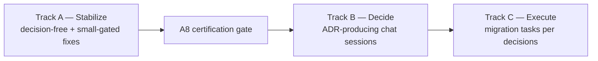

# Epic: Trading Extraction Completion — Stabilize, Decide, Execute

- **Date:** 2026-09-18
- **Status:** DRAFT ROADMAP — plans only. **No implementation is authorized by this document.** Every task below is drafted or draftable; decision-gated tasks carry a `Decision required` block and block only *implementation*, never planning.
- **Scope:** Complete the herobids→traderton trading extraction to its stable, decided end-state: (A) pin the current state, (B) settle the open ownership questions, (C) execute whatever the decisions require.
- **Evidence base:** `docs/tech/trading/audits/2026/09/001-herobids-trading-logic-ownership-audit.md` (the audit; §-references below point into it). Companion fixes already shipped: herobids `c7294d98` / traderton `6cb07d6` (bug-reports 2026/09/17 #001, phases 1–3).
- **Conventions:** Decisions reached in chat land as ADRs in `docs/tech/architecture/adrs/` and are linked here. Traderton-side tasks are executed in the traderton repo; this epic tracks them by pointer, with a thin mirror entry in traderton's own docs per its conventions (copy-never-author: traderton-side changes are made in traderton).

## How this epic is organized

**Ground rule:** Track A proceeds (when implementation is authorized) without waiting for Track B, except where a task explicitly carries a `Decision required` block. Track C is not drafted until its parent decision (B1–B5) is recorded.

---

## Track A — Stabilize the current state

Goal: make the shipped extraction artifacts defect-free and the surface honest, so the "current state" is a certified baseline before any further migration.

| Task | Title | Repo | State | Plan |
|---|---|---|---|---|
| **A1** | Ensure-cache fast path trusts a possibly-stopped actor (crash → permanent `instance_not_running`) | traderton | plan drafted | `plans/A1-ensure-cache-crash-recovery.md` |
| **A2** | Concurrent-reconstruction race in the agent-direct actor ensure | traderton | plan drafted (folded into A1's report + plan) | `plans/A1-ensure-cache-crash-recovery.md` §A2 |
| **A3** | Boundary cannot serve `get_risk_limits` / `adjust_risk_limits` / `get_account_summary` (platform-ops context gap) — **Decision required** (small) | both | plan drafted with options | `plans/A3-boundary-risk-account-context.md` |
| **A4** | Resolver ports unwired: `getDefaultOwnerMode`/`getDefaultVenueAccountId` → agent actors always start at a `paper` ceiling | traderton | plan drafted | `plans/A4-wire-resolver-default-ports.md` |
| **A5** | Dormant/remnant deletion sweep (audit §6) | herobids | plan drafted | `plans/A5-dormant-remnant-sweep.md` |
| **A6** | Transitional fallback posture (local-Redis `list_watches`, `resolve_watch`/`resolve_task`, exit-price reconstruction, in-process `get_risk_limits` fallback) — **Decision required** (small, per item) | herobids | plan drafted with options | `plans/A6-fallback-posture.md` |
| **A8** | **Certification gate** — full cross-stack trade test + agent eval loop; defines "current state pinned" | both | plan drafted | `plans/A8-stabilization-certification-gate.md` |

*A7 (Gmail OAuth return) is pre-existing, non-trading UX debt — filed separately as `docs/bug-reports/2026/09/18/001-gmail-oauth-return-lands-on-agents-list-not-create-form.md` and intentionally OUT of this epic's scope.*

Order within Track A: A1(+A2) → A3 → A4 → A5 → A6, with A8 run last as the gate. A3's small decision (options pre-loaded in its plan) should be settled in chat before its implementation.

---

## Track B — Decide (chat-driven; each session produces an ADR)

The audit's §8 questions, sequenced for maximal unblocking. Each B-item links the audit evidence rows it governs. UX framing (agent-property vs capability-config presentation of capital/risk) is folded into **B1** — it is the user-facing shadow of the stored-state question.

| Decision | Question (short form) | Evidence | Prereq |
|---|---|---|---|
| **B1** | Stored trading state: where do `capital` / `riskPosture` / `riskOverrides` / `executionDefaults` live? Options: (i) keep agent-owned + payload echo (status quo); (ii) traderton-owned trading profile per (owner, actor, venueAccount), configured via boundary from herobids' UI (provision-via-boundary precedent); (iii) hybrid. Includes the payload-echo trust question and the UX framing choice. | audit §3.2 rows (agents.*), §7-S2, §7-S13, §8-Q1 | — |
| **B2** | Duplicated authority: `agentRiskDefaults` (17 fields), strategy-preset catalogs, risk-contract math, watch/scan/gate type layers — single-source vs continued parity duplication? | audit §3.1, §3.3, §5.3 | B1 (partially — the risk-contract answer depends on where risk state lives) |
| **B3** | LLM-surface placement: base-skill trading tools for every agent; hybrid evaluator + sizing policy; preset assessment — platform brain vs trading-adjacent? Should non-trading agents carry trading read tools at all? | audit §5.2 (esp. item 4), §7-S1, §8-Q4 | independent |
| **B4** | Assessments/wakes/bot-lifecycle edges: platform-only assessment subsystem carrying trading identity (`market_assessment_*`, `agent_preset_*`, scan candidates, blueprints trading payloads) — keep platform or re-home? | audit §3.2, §7-S15 | B3 (partially) |
| **B5** | Residual boundary-semantics gaps: ungated wake-context cards, admin "Total Bots" ghost, wallet custody copy, daily-loss % vs USD framing, parallel create/update codepaths. | audit §7-S5/7/8/9/12, §4.1 | independent (mostly cosmetic/consistency) |

Recommendation on sequence: **B1 → B2 → B3 → B4 → B5**, but B3/B5 can interleave anywhere; B1 unblocks the most.

---

## Track C — Execute the decided migration

Empty by design. Tasks are drafted only after their parent B-decision is recorded as an ADR. Expected shape (to be confirmed by decisions):

- If B1 lands on traderton-owned profiles: a traderton feature slice (profile store + config boundary tool + actor-ensure consumption) and a herobids migration slice (UI write-through, payload-echo retirement, `get_account_summary` enrichment) — likely 2–4 tasks.
- If B2 lands on single-sourcing: config-authority relocation tasks per accepted ADR.
- B3/B4/B5 outcomes may add small herobids-only or traderton-only tasks.

---

## Task index (plans)

Plans live in `plans/` and are numbered to match their task. Each plan follows the repo's proposal style: context → evidence refs → options (if gated) → recommended approach → step list → tests/verification → risks. Plans are updated as decisions land; superseded plans are marked, not deleted.

- `plans/A1-ensure-cache-crash-recovery.md` — A1 + A2
- `plans/A3-boundary-risk-account-context.md`
- `plans/A4-wire-resolver-default-ports.md`
- `plans/A5-dormant-remnant-sweep.md`
- `plans/A6-fallback-posture.md`
- `plans/A8-stabilization-certification-gate.md`

**Decision briefs** live in `decisions/` — one per B-item, each with options + recommendation pre-loaded so the chat sessions resolve fast. When a decision is reached in chat, its brief gains a **Decision** section and is mirrored (or summarized+linked) as an ADR in `docs/tech/architecture/adrs/`:

- `decisions/B1-stored-trading-state.md` — blocks A3-shape, A6-4, A4-source, B2, Track C
- `decisions/B2-duplicated-authority.md` — partially B1-linked
- `decisions/B3-llm-surface-placement.md` — independent
- `decisions/B4-assessment-wake-blueprint-edges.md` — prereq B3
- `decisions/B5-consistency-sweep.md` — mostly independent

**Contingent Track-C plans** (drafted against the recommended B1=(ii); activate only on their parent decisions — see each plan's status line):

- `plans/C1-trading-profile-slice.md` — traderton profile store + config tool + ensure/risk-read source swap + herobids write-through/backfill/echo-retirement (incl. B5-2 consolidation as prereq)
- `plans/C2-config-single-sourcing.md` — C2.3 parity-drift scripts (decision-free, Track-A-eligible standalone); C2.1/C2.2 contingent on B1=(ii)

## Discussion order (chat sessions)

1. **B1** — unlocks the most (A3 shape, A6-4, A4 source, B2, C-track).
2. **A3's small option** — formally confirm Option 1-1b (build source-agnostic), now informed by B1.
3. **A6's four fallbacks** — per-item confirm/override.
4. **B3** → **B4** (B4 prereq is B3's assessment-stays).
5. **B2** — mostly collapses once B1 lands.
6. **B5** — approve the batched sweep (proposes new Track-A item A9).

---

## Open process questions (for the user)

1. ~~OAuth scope~~ — resolved: excluded, filed as its own bug report.
2. Sequencing during execution: finish Track A before opening Track B, or interleave? (Does not block planning.)
3. Placement of this epic: currently `herobids/docs/features/2026/09/18/001-…` (versioned, convention-consistent; root `hero-trade/docs` is NOT a git repo so a root placement would be unversioned unless mirrored). Confirm or override.

**Drafting status (2026-09-18): COMPLETE.** All Track-A plans, all five B-decision briefs (options + recommendations pre-loaded), and the contingent C-plans (C1 profile slice, C2 config single-sourcing) are drafted. Nothing is implemented; contingency gates hold until the parent decisions are recorded. Discussion order above; B1 first.
