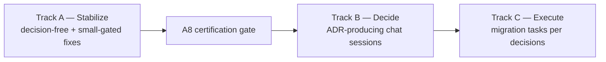

# Epic: Trading Extraction Completion — Stabilize, Decide, Execute

- **Date:** 2026-09-18
- **Status:** ACTIVE ROADMAP — Track A and A8 are user-confirmed complete (2026-09-19). B1, B2, B3, B5-item-2, and B6 are ratified. Independent-review corrections are incorporated into C1a and C1–C5, their governing contracts, the UAT checklist, and the execution ledger. **No plan or ADR authorizes implementation by itself.**
- **Scope:** Complete the herobids→traderton trading extraction to its stable, decided end-state: (A) pin the current state, (B) settle the open ownership questions, (C) execute whatever the decisions require.
- **Evidence base:** `docs/tech/trading/audits/2026/09/001-herobids-trading-logic-ownership-audit.md` (the audit; §-references below point into it). Companion fixes already shipped: herobids `c7294d98` / traderton `6cb07d6` (bug-reports 2026/09/17 #001, phases 1–3).
- **Conventions:** Decisions reached in chat land as ADRs in `docs/tech/architecture/adrs/` and are linked here. Traderton-side tasks are executed in the traderton repo; this epic tracks them by pointer, with a thin mirror entry in traderton's own docs per its conventions (copy-never-author: traderton-side changes are made in traderton).

## How this epic is organized

**Ground rules:** A Track-C item requires its parent decision, its stated prerequisites, and a completed independent plan review before implementation. B4 and the remaining B5/A9 batch are still open. This is a **clean-slate** migration: no backward compatibility, backfill, or dual-run requirement exists; data may be wiped and reseeded when a plan calls for it. Focused commits and changelog updates are allowed; do **not** merge herobids into `main` yet.

---

## Track A — Stabilize the current state

Goal: make the shipped extraction artifacts defect-free and the surface honest, so the "current state" is a certified baseline before any further migration.

| Task | Title | Repo | State | Plan |
|---|---|---|---|---|
| **A1** | Ensure-cache fast path trusts a possibly-stopped actor (crash → permanent `instance_not_running`) | traderton | completed (user-confirmed 2026-09-19) | `plans/A1-ensure-cache-crash-recovery.md` |
| **A2** | Concurrent-reconstruction race in the agent-direct actor ensure | traderton | completed (user-confirmed 2026-09-19) | `plans/A1-ensure-cache-crash-recovery.md` §A2 |
| **A3** | Boundary cannot serve `get_risk_limits` / `adjust_risk_limits` / `get_account_summary` (platform-ops context gap) | both | completed (user-confirmed 2026-09-19) | `plans/A3-boundary-risk-account-context.md` |
| **A4** | Resolver ports unwired: `getDefaultOwnerMode`/`getDefaultVenueAccountId` → agent actors always start at a `paper` ceiling | traderton | completed (user-confirmed 2026-09-19) | `plans/A4-wire-resolver-default-ports.md` |
| **A5** | Dormant/remnant deletion sweep (audit §6) | herobids | completed (user-confirmed 2026-09-19) | `plans/A5-dormant-remnant-sweep.md` |
| **A6** | Transitional fallback posture (local-Redis `list_watches`, `resolve_watch`/`resolve_task`, exit-price reconstruction, in-process `get_risk_limits` fallback) | herobids | completed (user-confirmed 2026-09-19) | `plans/A6-fallback-posture.md` |
| **A8** | **Certification gate** — full cross-stack trade test + agent eval loop; defines "current state pinned" | both | completed (user-confirmed 2026-09-19) | `plans/A8-stabilization-certification-gate.md` |

*A7 (Gmail OAuth return) is pre-existing, non-trading UX debt — filed separately as `docs/bug-reports/2026/09/18/001-gmail-oauth-return-lands-on-agents-list-not-create-form.md` and intentionally OUT of this epic's scope.*

Track A is complete. Its A8 certification is the baseline for the Track-C work below.

---

## Track B — Decide (chat-driven; each session produces an ADR)

The audit's §8 questions, sequenced for maximal unblocking. Each B-item links the audit evidence rows it governs. UX framing (agent-property vs capability-config presentation of capital/risk) is folded into **B1** — it is the user-facing shadow of the stored-state question.

| Decision | Question (short form) | Evidence | Prereq |
|---|---|---|---|
| **B1** ✅ | Stored trading state: traderton-owned profile, eager-at-bind, no payload echo. [ADR 010](../../../../tech/architecture/adrs/2026/09/010-traderton-owned-trading-profile.md) | audit §3.2 rows, §7-S2, §7-S13, §8-Q1 | — |
| **B2** ✅ | Split authority: traderton owns enforcement defaults/risk math; parity-check intentional mirrors. [ADR 011](../../../../tech/architecture/adrs/2026/09/011-split-trading-authority-by-responsibility.md) | audit §3.1, §3.3, §5.3 | B1 |
| **B3** ✅ | Capability-scoped LLM surface: tool exposure narrows; non-enforcing reasoning stays platform-side. [ADR 012](../../../../tech/architecture/adrs/2026/09/012-capability-scoped-llm-surface.md) | audit §5.2, §7-S1, §8-Q4 | — |
| **B4** | Assessments/wakes/bot-lifecycle edges: platform-only assessment subsystem carrying trading identity (`market_assessment_*`, `agent_preset_*`, scan candidates, blueprints trading payloads) — keep platform or re-home? | audit §3.2, §7-S15 | B3 (partially) |
| **B5** ◐ | Consistency sweep: item 2 is ratified as the shared write-path prerequisite ([ADR 013](../../../../tech/architecture/adrs/2026/09/013-consolidate-trading-profile-write-paths.md)); the proposed A9 batch remains open. | audit §7-S5/7/8/9/12, §4.1 | independent |
| **B6** ✅ | Capability-agnostic frontend presentation: generic agent surfaces; capability → connection details and feeds. [ADR 014](../../../../tech/architecture/adrs/2026/09/014-capability-agnostic-frontend-presentation.md) | frontend inspection, capability readiness contract | B1 |

Remaining decisions: **B4**, then the remaining B5/A9 batch if desired.

---

## Track C — Execute the decided migration

The approved execution plans are ready for independent review before implementation.

| Task | Title | State | Prereq |
|---|---|---|---|
| **C1a** | Consolidate trading-profile normalization, selection, and reconciliation planning | review-corrected; pending implementation authorization | ADR 013 |
| **C1** | Traderton-owned profile store, selected-binding execution, boundary tools, write-through, and payload-echo deletion | review corrections incorporated | ADRs 010/013; write-path consolidation |
| **C2** | Risk-default authority swap, risk-math retirement, and parity-drift scripts | review-corrected; pending implementation authorization | ADRs 010/011; C1 for C2.1/C2.2 |
| **C3** | Capability-agnostic frontend in visual then profile-backed phases | review-corrected; pending implementation authorization | ADR 014; C1 for C3b |
| **C4** | Capability-scoped trading tool exposure | review-corrected; pending implementation authorization | ADR 012 |
| **C5** | Final two-repository certification plus A8 rerun | review-corrected; pending implementation authorization | all decided feature work complete |

B4 and the remaining B5 outcomes may add further Track-C work after their decisions are recorded.

### Historical Expected Shape (Superseded)

- If B1 lands on traderton-owned profiles: a traderton feature slice (profile store + config boundary tool + actor-ensure consumption) and a herobids migration slice (UI write-through, payload-echo retirement, `get_account_summary` enrichment) — likely 2–4 tasks.
- If B2 lands on single-sourcing: config-authority relocation tasks per accepted ADR.
- B3/B4/B5 outcomes may add small herobids-only or traderton-only tasks.

---

## Task index (plans)

Plans live in `plans/` and are numbered to match their task. Each plan follows the repo's proposal style: context → evidence refs → options (if gated) → recommended approach → step list → tests/verification → risks. Plans are updated as decisions land; superseded plans are marked, not deleted.

- `plans/A1-ensure-cache-crash-recovery.md` — A1 + A2
- `plans/A3-boundary-risk-account-context.md`
- `plans/A4-wire-resolver-default-ports.md`
- `plans/A5-dormant-remnant-sweep.md`
- `plans/A6-fallback-posture.md`
- `plans/A8-stabilization-certification-gate.md`

**Decision briefs** live in `decisions/`; ratified briefs are mirrored as ADRs in `docs/tech/architecture/adrs/`:

- `decisions/B1-stored-trading-state.md` — ratified as ADR 010
- `decisions/B2-duplicated-authority.md` — ratified as ADR 011
- `decisions/B3-llm-surface-placement.md` — ratified as ADR 012
- `decisions/B4-assessment-wake-blueprint-edges.md` — open; B3 prerequisite satisfied
- `decisions/B5-consistency-sweep.md` — item 2 ratified as ADR 013; A9 batch open
- `decisions/B6-capability-agnostic-frontend.md` — ratified as ADR 014

**Prepared Track-C plans:**

- `plans/C1-trading-profile-slice.md`
- `plans/C1a-profile-write-path-consolidation.md`
- `plans/C2-config-single-sourcing.md`
- `plans/C3-capability-agnostic-frontend.md`
- `plans/C4-capability-scoped-tool-exposure.md`
- `plans/C5-final-certification-gate.md`
- `reviews/2026-09-19-independent-plan-review-brief.md`
- `EXECUTION_LEDGER.md` — per-batch status, SHA, validation, and blocker record

## Discussion order (chat sessions)

1. **Independent review remediation** — corrections are incorporated; use `EXECUTION_LEDGER.md` to record implementation only after authorization.
2. **B4** — settle assessment, wake, and blueprint identity data.
3. **B5/A9** — decide the remaining consistency batch separately from its already-ratified write-path prerequisite.
4. **Implementation** — C1a (ADR 013 consolidation) → C1, with C3a/C4 eligible in parallel once review findings are dispositioned → C2 and C3b after C1 → C5 after every decided feature plan is complete.

---

## Open process questions (for the user)

1. B4 outcome.
2. Independent-review findings and their disposition.
3. Whether to approve the remaining B5/A9 consistency batch.

**Planning status (2026-09-19): CURRENT.** Track A is user-confirmed complete; independent-review corrections are incorporated. B4 and the remaining B5/A9 batch are open. Implementation waits on authorization, each plan's listed prerequisites, and execution-ledger evidence.
