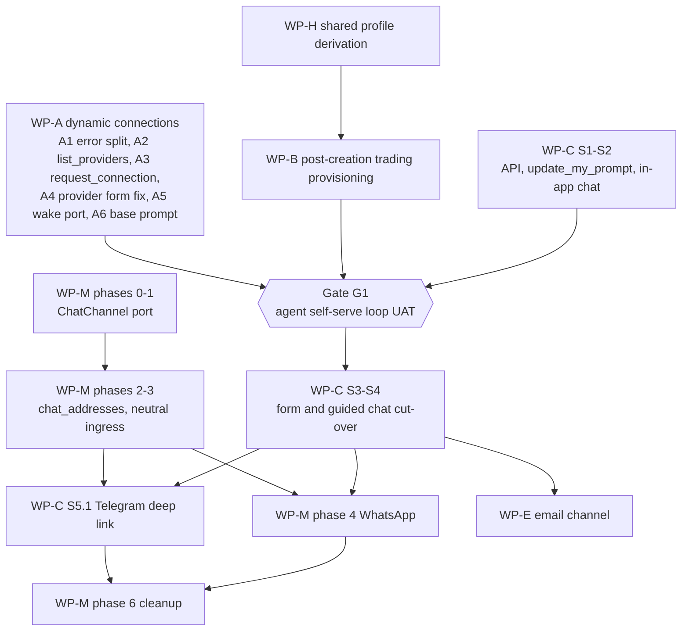

# Epic: Agent Onboarding Through Conversation

**Status:** draft
**Created:** 2026-10-10

> **Implementing agent: start at [IMPLEMENTATION.md](./IMPLEMENTATION.md).** It is the single entry point — objective, rules, settled decisions, decision framework, execution order, and audit loop. This roadmap is the reference for the vision, dependency graph, waves, gates, and the cross-document review (F1–F21).

## Vision

A user creates an agent with a name and a way to talk to it. After that the agent does the rest: it adds its own skills, discovers what it can connect to, sends the user a link when it needs a connection, is woken when the connection exists, and sets its own goal. The create flows (form and guided chat) shrink accordingly, and trading disappears from creation because it is one capability the agent can acquire like any other.

## Documents in this epic

| ID | Document | State | Role |
|---|---|---|---|
| WP-A | [003-dynamic-connections/001-plan.md](../003-dynamic-connections/001-plan.md) (discovery: [000-discovery.md](../003-dynamic-connections/000-discovery.md)) | draft | Agents discover providers, request connections by link, are woken on completion |
| WP-H | [004-shared-profile-derivation/001-plan.md](../004-shared-profile-derivation/001-plan.md) (analysis: [000-analysis.md](../004-shared-profile-derivation/000-analysis.md)) | draft | One shared trading-profile derivation for all write paths |
| WP-B | [005-post-creation-trading-provisioning/001-plan.md](../005-post-creation-trading-provisioning/001-plan.md) | draft, checks done | Trading provisioning for an agent that becomes trading-capable after creation (ask once, defaults or specifics, test mode only) |
| WP-M | [007-multi-provider-chat-messaging/](../007-multi-provider-chat-messaging/000-README.md) (`900-implementation-plan.md`) | draft, phased | Provider-neutral chat, WhatsApp, SMS, channel address model |
| WP-C | [006-simplified-agent-creation/001-plan.md](../006-simplified-agent-creation/001-plan.md) | draft | Simplified form and guided chat, auto-start, in-app conversation, `update_my_prompt` |
| WP-E | none yet | **missing** | Email as a conversational channel (inbound) |
| ref | [002-blank-slate-agents/001-plan.md](../../../../pending/002-blank-slate-agents/001-plan.md) | partly superseded | Source of `update_my_prompt` and the first-run guidance idea; rest superseded (see findings) |
| ref | [003-agent-chat-sessions/000-notes.md](../../../../pending/003-agent-chat-sessions/000-notes.md) | contemplation | Conflicts with the agent-centric model (see findings) |

## Dependency graph

## Order of execution

**Wave 1 (parallel, no cross-dependencies)**
- WP-A: A1 (split `precondition.not_ready` into `connection.missing` / `connection.provisioning`), A2 (`list_providers`), and the A3 design for the worker-to-API token mint.
- WP-H: shared profile derivation. Needed first because WP-B and the cut-over both write trading profiles.
- WP-M phases 0-1: registry amendment and the `ChatChannel` port (behaviour-preserving refactor).
- WP-C S0: prerequisite checks (name uniqueness, blank-agent idle cost, billing gates).

**Wave 2 (parallel)**
- WP-A: A3 `request_connection` with catalog validation, A4 `?provider=` handling in the setup form, A5 wake on connection resolved or expired, A6 base-prompt guidance.
- WP-B: design and implement provisioning of capital, execution mode and risk defaults from operator config when a blank agent becomes trading-capable (paper first, user-configured limits stay immutable).
- WP-C S1-S2: optional name, auto-start, first-turn guidance, `update_my_prompt`, in-app conversation. These are additive and do not change the current create flows.

**Gate G1: agent self-serve loop (blocks the cut-over)**

With the **old** create flows still in place, create a blank agent through the API and verify end to end: converse, `add_skills`, `connection.missing`, `list_providers`, `request_connection`, link completed or expired, agent woken, trade in test mode, agent persists its own goal. Record the result in the epic folder.

**Wave 3: cut-over**
- WP-C S3 (simplified form) and S4 (simplified guided chat), shipping together, with landing/help copy updates.

**Wave 4: channels (independent increments)**
- WP-M phases 2-3, then WP-C S5.1 Telegram deep-link binding, then WhatsApp (WP-M phase 4, external Meta prerequisites start earlier because they are long-lead).
- WP-E email channel design, then implementation.

**Wave 5: cleanup**
- WP-M phase 6 contract migration; remove dead create-flow code; archive superseded docs.

Off the critical path: WP-M phase 5 (SMS) is in the messaging plan but not in the product channel list for creation.

## Cross-document review (2026-10-10)

All pending docs relevant to this epic were read against the code. Severity: HIGH blocks correctness or sequencing, MEDIUM would cause rework, LOW is housekeeping.

| # | Sev | Documents | Finding | Resolution |
|---|---|---|---|---|
| F1 | LOW | blank-slate 001-plan | Doc ticks "name optional in API", `agentDefaults` and server-side blank prompt as implemented. Reality: the **frontend** fills the defaults (generated name, capital `'1000'`), so the form really can be submitted empty; the API schema still requires `name`, and there is no server-side `agentDefaults` block. Matters only for non-UI callers and for any plan that assumes server-side defaults. | Prerequisites corrected in the blank-slate doc. Server-side optional name is low priority in WP-C. |
| F2 | HIGH | blank-slate, WP-C premise | Plans assume users can "open chat" with a new agent. No web UI sends messages (`POST /agents/:id/message` is unused by the web app), agents are created `stopped`, and a stopped agent returns 409. Telegram (manual chat-id paste) is the only channel. | WP-C S1-S2 adds auto-start and an in-app conversation. |
| F3 | HIGH | discovery (design B) | `request_connection` is a worker tool that would "reuse `setup-link-token-service.ts`", which lives in `apps/api`. The worker cannot import it. The tool must also be registered in `KNOWN_AGENT_TOOL_NAMES` and `TOOL_CATALOG` or worker startup fails (`assertToolCatalogMatchesRegistry`); the discovery doc mentions only `BASE_SKILL.requiredTools`. | Note added to discovery; WP-A A3 must define worker-to-API minting (inbound message to broker, or API call) and catalog registration. |
| F4 | HIGH | discovery (wake design) | `ConnectionsRepository` in `packages/db` would call `emitAgentWake`. `InstanceEventPublisher` lives in `apps/worker`; connection writes happen in `apps/api`; `db` may not depend on apps. The publisher is just a Redis XADD wrapper. | Note added to discovery; WP-A A5 must introduce a domain port with an API-side Redis implementation (or move the publisher to a shared package). |
| F5 | MEDIUM | discovery (D, `?provider=`) | Claims the form "already supports `?provider=`". `initialProviderId` exists, but the Trading option group renders only when `defaultCapability === 'trading'` (or the constant is true when undefined). `?provider=hyperliquid` without a capability would preselect an option that is not rendered. | Note added to discovery; WP-A A4 must render the requested trading provider explicitly. |
| F6 | HIGH | WP-C, blank-slate, discovery | A blank agent that adds the trading skill and a connection has no defined path to a usable trading setup. Verified: test mode needs a venue account; grant creates an all-null profile that traderton cannot run (no execution mode); no server-side default capital exists; grant requires a stopped agent. | WP-B plan written with the checks recorded; gate G1 covers it. |
| F7 | MEDIUM | WP-H vs WP-C | Harmonize assumes three create/update paths derive profiles. After WP-C, create paths derive none, and the new dynamic path (skill add, connection grant) becomes the real fourth path. Doing WP-H after WP-B would harden the wrong shape. | WP-H scheduled in Wave 1 before WP-B; its scope should be restated to include the dynamic path. |
| F8 | MEDIUM | messaging 020/060 vs user's channel list and discovery | The product list is WhatsApp, Telegram, email. Messaging docs define Telegram/WhatsApp/SMS reply-only chat and treat email as send-only (connection-backed `gmail`). Conversational email is not in any doc. Messaging 020 says chat providers have no user `connection` row, but the vision speaks of "a connection to WhatsApp/Telegram/email" and the discovery wake/link design is keyed to `connections`. | WP-C decision D1 separates channel binding from connections; WP-E added; link-and-wake design (A3/A5) should be generic enough for a channel bind (wake `source: 'connection'` vs a channel reason). |
| F9 | MEDIUM | messaging 060 vs code | Doc says "today: paste your Telegram chat id". Correct. But Telegram `/start` is both a slash command (`/start <agent>` starts an agent) and the deep-link payload command, so deep-link binding collides with `handleStart`. | Called out in WP-C risk R-2 and S5.1. |
| F10 | MEDIUM | 003 chat-sessions vs vision | 003 makes chat sessions the product with hidden backing agents and the agents list showing trading agents only. The vision makes every agent conversational and the agent list the main surface. Both cannot hold. | WP-C D3 chooses a minimal in-app conversation on the agent itself; note added to 003 marking it as conflicting until a decision. |
| F11 | MEDIUM | blank-slate | `manage_my_skills` is superseded by shipped `list_skills`/`add_skills`/`remove_skills`/`search_skills`; `isDefaultPrompt` is redundant with shipped `isBlankAgentGoal` and `EMPTY_JOB_DEFAULT_TEXT`; non-goal "agents self-provisioning connections" is reversed by WP-A; non-goal "removing the full create form" is reversed by WP-C. Only `update_my_prompt`, prompt journal and first-run guidance remain. | Blank-slate doc annotated. `update_my_prompt` moved into WP-C S1. |
| F12 | LOW | WP-C S0 | Checked: blank-goal agents do not burn tokens when idle. The context-hash gate (`skipUnchangedTicks`, default true) skips unchanged scheduled ticks; only the first tick, wakes and every 10th tick run the LLM. | Resolved, no change. |
| F13 | LOW | WP-C S0 | Checked: no unique index on agent names, but Telegram handles duplicates with an "ambiguous" reply. | Generate names with a collision retry; no schema change. |
| F21 | RESOLVED | WP-A | Resolution of F3, F4 and F19: worker-to-platform actions use the existing brokered-capability pattern (as `add_skills`), the request record in Redis is the shared contract so the worker never touches session code, the API redeem endpoint issues the session, and the API wakes the agent through a domain port backed by the same Redis XADD. The `ConnectionsRepository` refactor is dropped in favour of one completion hook at the two user-facing connection write paths. | WP-A A3-A5 |
| F20 | LOW | WP-C S0 | Earlier claim that new free users cannot start an agent was wrong: accounts with no billing period may spend and the free plan allows a $1 overdraft (`hardCapCents: -100`). Remaining point: when spend is blocked the LLM cannot run, so the user message must be platform-originated (existing billing notification and activity text), and the create flow must show the same message if auto-start is blocked. Minor: the config comment on the free plan says "block when balance <= $0" but the value is -100. | Handled in WP-C S0; fix the config comment. |
| F14 | LOW | pending/ folder | `generic-connection-form-trading-inference` and `trading-wording-cleanup` are marked done but still in `pending/`; `075-additional-trading-skills.md` is a folder name with an `.md` suffix; blank-slate has a duplicated "Much has been implemented" header in two files. | Housekeeping: move done plans to their dated folders; not changed here. |
| F15 | LOW | messaging 900 | Targets "at least two providers" (WhatsApp, SMS) while the product creation list has WhatsApp only. SMS compliance (A2P) is long-lead and not on this epic's critical path. | Marked off the critical path. |
| F16 | LOW | all new env vars | Messaging and any new channel config adds env vars; AGENTS.md requires `.example` twins in the same change. | Added as a gate in each channel work item. |
| F17 | MEDIUM | WP-C S4, discovery | Guided-chat trading is already off by default (`chat.guidedSetup.tradingEnabled=false`; trading preset classification is refused and trading skills are filtered out). So WP-C S4 is mostly deleting dead branches, not changing behaviour, and the discovery doc's premise that trading must still be removed from the guided chat is partly already true. | WP-C S4 reworded. |
| F18 | MEDIUM | discovery, WP-B | The stopped-agent requirement for connection grants is policy, not a runtime limit (the worker already hot-reloads connections; decision and risk reads fetch the venue account fresh). The link flow (WP-A) needs a running-agent grant path or the agent must be stopped while waiting. | WP-B defines a dedicated running-agent grant path used by the link completion and `set_trading_setup`. |
| F19 | MEDIUM | WP-A A3, WP-B B4 | Both need the worker to trigger API-side actions (mint a link, create a generated connection, grant). One mechanism should serve both, otherwise two patterns appear. | Decide once in WP-A A3; WP-B reuses it. |

## Gates and definition of done

- **G1** (before cut-over): the self-serve loop UAT described above passes on the old flows, in test mode, including link expiry handled by the agent.
- **Cut-over done**: form and guided chat contain no trading references; both call one shared create core; `pnpm lint`, `pnpm test`, `scripts/shell/tests/run-all-tests.sh --e2e` pass; public content and docs index regenerated.
- **Channels done**: each channel passes its own round-trip test, has `.example` twins, i18n keys, and appears in the create form only when `available` and healthy.

## Open decisions (need the owner)

1. ~~Email semantics~~ Decided 2026-10-10: email behaves like Telegram/WhatsApp (messages to the user's address). Inbound replies remain WP-E.
2. ~~In-app conversation~~ Decided 2026-10-10: accepted; external channel optional but strongly recommended. The `chat_sessions` idea (F10) is rejected in favour of a minimal in-app conversation (WP-C D3).
3. ~~WP-B approach~~ Decided 2026-10-10: ask once; defaults path and specifics path share one tool; test mode only; live only through go-live. Details in the WP-B plan.
4. ~~Whether guided chat survives after the cut-over~~ Decided 2026-10-10: keep guided chat. It is more evolvable than a form, and even if similar to the form it is not obviously so to the user. It can grow non-trading steps later — e.g. ask for an objective and have the agent add skills and connections based on it. (WP-C R-5.)
5. ~~Fate of the `chat_sessions` idea (F10), and Telegram deep link (lookup-first) vs `/link <code>`~~ Resolved in WP-C: `chat_sessions` rejected (D3); Telegram deep link is lookup-first with `/link <code>` as fallback (R-2).
