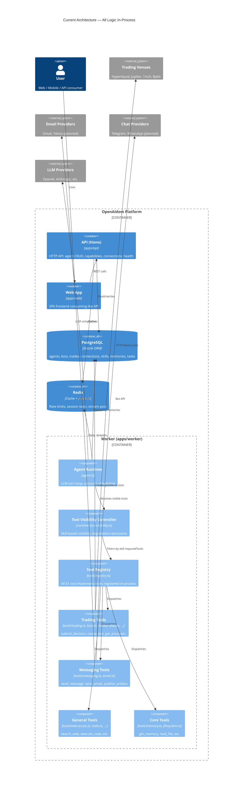

# Current Architecture

Component boundary diagram showing the current monolithic structure where all
tool execution, trading logic, messaging, and visibility decisions live
in-process within the worker.

## Container Diagram

## Key Observations

1. **Everything is in-process.** Trading tools, messaging tools, and the agent
   runtime share a single Node.js process. A venue timeout or email provider
   failure can degrade the entire worker.

2. **Visibility is skill-only.** The `RuntimeToolVisibilityController` filters
   by skill `requiredTools` and dependency degradation. There is no ownership
   check, no capability activation check, and no service health check.

3. **No formal tool ownership.** Tools are grouped by source file (trading.ts,
   bots.ts, etc.) but no metadata says "this tool belongs to crypto-trading."
   The `TOOL_CATALOG` has categories but categories are display labels, not
   architectural boundaries.

4. **The API capability routes are informational only.** They surface readiness
   and connection state, but tool execution bypasses them entirely.

5. **The domain package is passive.** `packages/domain/` exports types, tool
   names, and skill definitions but has no capability registry, no ownership
   manifest, and no contract types.
