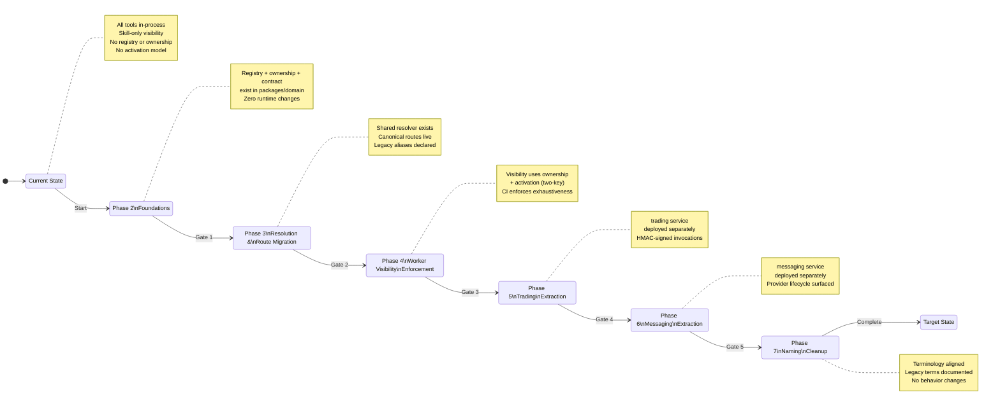
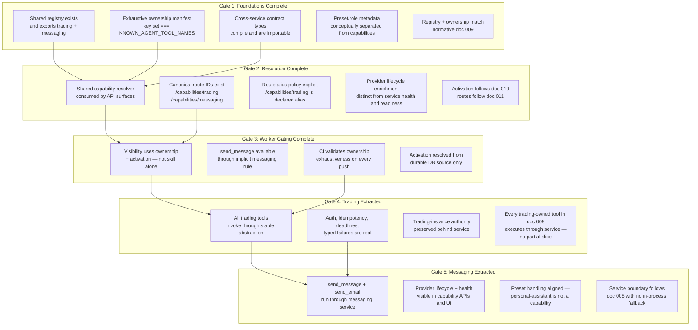

# Phase Transitions

The six implementation phases as a gated progression. Each gate has explicit
acceptance criteria that must be verified before the next phase begins.

## Gate Progression

## Gate Criteria Detail

## What Exists At Each Phase

| Phase | packages/domain | apps/worker | apps/api | apps/trading | apps/messaging | DB |
|-------|----------------|-------------|----------|--------------------|-----------------|----|
| Current | tools.ts, skills.ts | All tools in-process, skill visibility | /capabilities/trading (hardcoded) | - | - | No activation table |
| After Phase 2 | + registry, ownership, contract | Unchanged | Unchanged | - | - | Unchanged |
| After Phase 3 | Unchanged | Unchanged | + canonical routes, resolver, aliases | - | - | + agent_capability_activations |
| After Phase 4 | Unchanged | Visibility predicate uses ownership + activation | Unchanged | - | - | Unchanged |
| After Phase 5 | Unchanged | Invocation client for trading tools | Unchanged | Deployed, handling all trading tools | - | + capability_tool_invocations |
| After Phase 6 | Unchanged | Invocation client for messaging tools | Unchanged | Unchanged | Deployed, handling messaging tools | Unchanged |
| After Phase 7 | Terminology cleanup | Comment/name cleanup | Unchanged | Unchanged | Unchanged | Unchanged |

## Risk At Each Transition

| Transition | Risk level | Primary risk | Mitigation |
|------------|-----------|--------------|------------|
| Current → Phase 2 | Low | Manifest drift from actual tool names | CI test: ownership keys === KNOWN_AGENT_TOOL_NAMES |
| Phase 2 → Phase 3 | Low-Medium | Route migration breaks web client | Strangler-fig: canonical + alias, move callers, then remove |
| Phase 3 → Phase 4 | Medium | Visibility change hides tools from live agents | Data migration enables activation for existing trading agents |
| Phase 4 → Phase 5 | High | Network boundary introduces latency, failure modes | Shadow period: run both paths, compare results, switch after match |
| Phase 5 → Phase 6 | Medium | Messaging implicit rules are subtle | Explicit test for send_message without activation row |
| Phase 6 → Phase 7 | Low | Rename breaks internal references | Grep-verified terminology inventory, no behavior changes |

## Timeline Shape

```mermaid
gantt
  title Phase Duration Estimate (Relative)
  dateFormat X
  axisFormat %s

  section Metadata
    Phase 2 — Foundations         :p2, 0, 1
    Phase 3 — Resolution & Routes :p3, 1, 3

  section Behavior
    Phase 4 — Worker Gating       :p4, 3, 5

  section Extraction
    Phase 5 — Trading             :crit, p5, 5, 9
    Phase 6 — Messaging           :p6, 9, 12

  section Cleanup
    Phase 7 — Naming              :p7, 12, 13
```

Phase 5 is the critical path. It introduces the first real network boundary,
requires idempotency verification under load, and touches every trading tool.
Plan accordingly.
