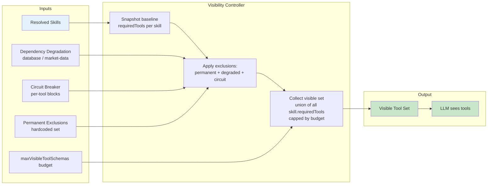
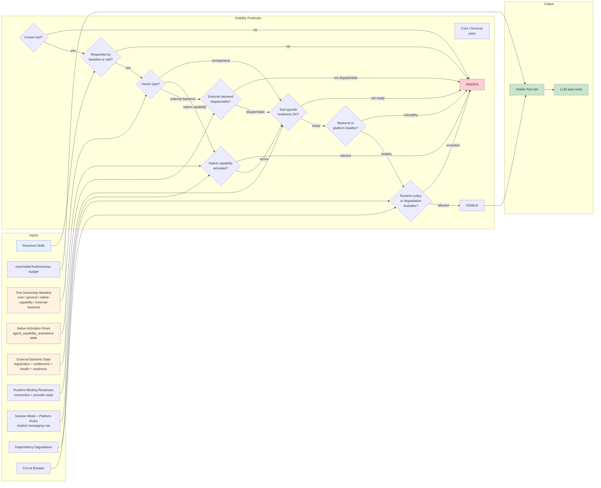

# Tool Visibility Flow

How a tool becomes visible to the LLM — current state vs. target state.

## Current State: Skill-Only Visibility

### What's missing

- No ownership check — any skill can expose any tool
- No capability activation check — a trading skill exposes trading tools
  even if the trading external backend is not registered or dispatchable
- No backend health check — tools appear visible even if the backing
  external backend is unreachable
- No readiness check at visibility time — readiness is checked at call
  time only, so the LLM may attempt tools it cannot use

---

## Target State: Ownership + Activation + Backend Dispatchability Visibility Predicate

### The two-key model

Neither key alone is sufficient. Native capabilities and external backends use
different owner-state checks:

| Condition | Visible? |
|-----------|----------|
| Skill requests tool + native capability active + ready + healthy | Yes |
| Skill requests tool + native capability NOT active | No |
| Skill requests tool + external backend dispatchable + ready + healthy | Yes |
| Skill requests tool + external backend NOT dispatchable | No |
| Owner state satisfied + tool NOT requested by any skill | No |
| Owner state satisfied + skill requests + backend unhealthy | No |

### Special cases

- **`send_message`** — native messaging-owned but implicitly active through the
  platform-inbox rule. Does not require an explicit activation row.
- **`send_email`** — requires explicit native messaging activation AND a ready
  email binding (connection + provider).
- **External trading tools** — do not use native activation rows. They require
  external-backend registration, entitlement, health, and readiness.
- **Core/general tools** — skip the native activation, external-backend
  dispatchability, and service health checks. They execute in-process in Agent
  Core.

---

## Comparison Summary

| Aspect | Current | Target |
|--------|---------|--------|
| Inputs to visibility | Skills + degradation + circuit | Skills + ownership + native activation + external-backend dispatchability + readiness + health + policy |
| Ownership awareness | None | Exhaustive manifest, CI-enforced |
| Native activation gating | None | Durable DB row per agent per native capability |
| External backend gating | None | Registration + entitlement + health + readiness |
| Service health gating | None | Per-external-backend /health/ready; native capabilities use platform health |
| Implicit rules | None | Platform-inbox rule for send_message |
| Failure mode | Tool visible but call fails at runtime | Tool hidden if it cannot succeed |
| Where logic lives | `runtime-tool-visibility.ts` | Shared visibility predicate consuming domain types |
