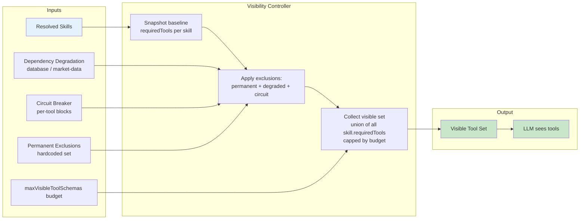
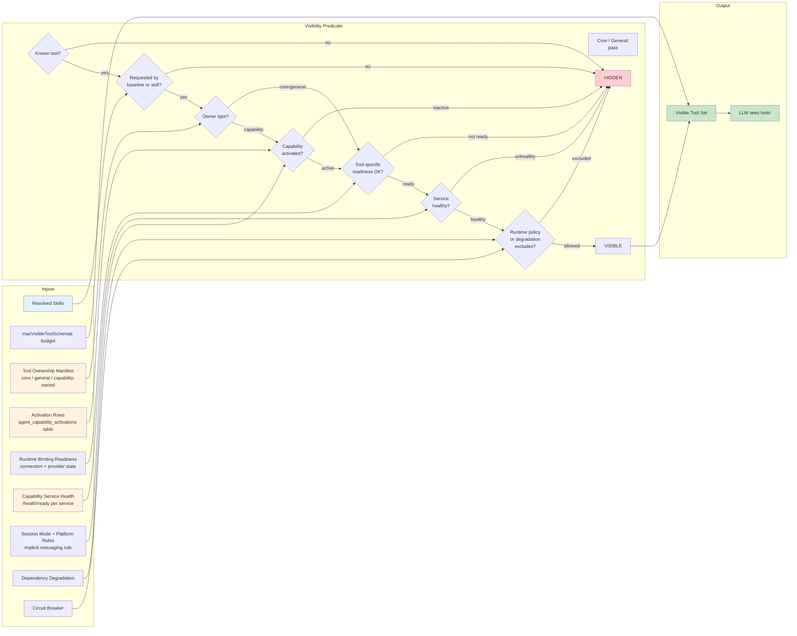

# Tool Visibility Flow

How a tool becomes visible to the LLM — current state vs. target state.

## Current State: Skill-Only Visibility

### What's missing

- No ownership check — any skill can expose any tool
- No capability activation check — a trading skill exposes trading tools
  even if trading is not activated for the agent
- No service health check — tools appear visible even if the backing
  service is unreachable
- No readiness check at visibility time — readiness is checked at call
  time only, so the LLM may attempt tools it cannot use

---

## Target State: Ownership + Activation Visibility Predicate

### The two-key model

Neither key alone is sufficient:

| Condition | Visible? |
|-----------|----------|
| Skill requests tool + capability active + ready + healthy | Yes |
| Skill requests tool + capability NOT active | No |
| Capability active + tool NOT requested by any skill | No |
| Capability active + skill requests + service unhealthy | No |

### Special cases

- **`send_message`** — messaging-owned but implicitly active through the
  platform-inbox rule. Does not require an explicit activation row.
- **`send_email`** — requires explicit messaging activation AND a ready
  email binding (connection + provider).
- **Core/general tools** — skip the capability activation and service health
  checks. They execute in-process in Agent Core.

---

## Comparison Summary

| Aspect | Current | Target |
|--------|---------|--------|
| Inputs to visibility | Skills + degradation + circuit | Skills + ownership + activation + readiness + health + policy |
| Ownership awareness | None | Exhaustive manifest, CI-enforced |
| Activation gating | None | Durable DB row per agent per capability |
| Service health gating | None | Per-capability /health/ready |
| Implicit rules | None | Platform-inbox rule for send_message |
| Failure mode | Tool visible but call fails at runtime | Tool hidden if it cannot succeed |
| Where logic lives | `runtime-tool-visibility.ts` | Shared visibility predicate consuming domain types |
