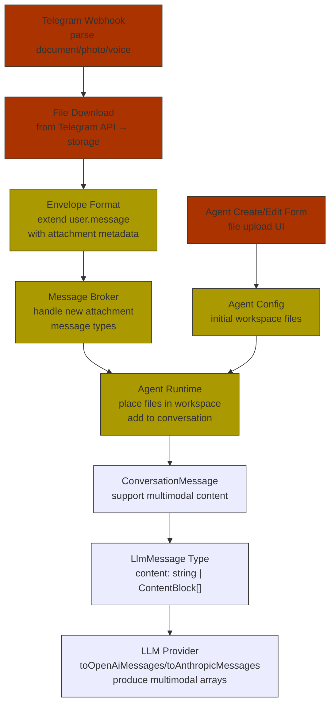

# Agent message document handling and current Telegram integration

## What Happens Today?

**Short answer: Nothing.** If you send a photo, PDF, document, or any non-text attachment via Telegram to an agent, the message is **silently dropped**.

Here's the chain and where it breaks:

### 1. Telegram Webhook (`apps/api/src/routes/agent-interactivity.ts:764-770`)
```ts
const message = parsed.data.message;
if (!message.text || message.text.trim().length === 0) {
  return reply.status(200).send({ ok: true }); // ← silently drops photos/docs/etc.
}
```
The webhook schema (`TelegramWebhookUpdateSchema`, line 36) only parses `message.text` and `message.reply_to_message`. It doesn't even look at `message.document`, `message.photo`, `message.video`, or `message.voice`.

### 2. Envelope Construction (`buildEnvelope`, line 617)
The envelope only carries `payload: { message: messageText }` — a plain string. No concept of attachments.

### 3. The Message Schema (`SendMessageSchema`, line 28)
```ts
const SendMessageSchema = z.object({
  message: z.string().min(1).max(4000),
});
```
The API for direct agent messaging (`POST /agents/:id/message`) also only accepts text.

### 4. Conversation History (`apps/worker/src/agent.ts:1745`)
```ts
interface ConversationMessage {
  role: 'system' | 'user' | 'assistant';
  content: string; // ← string only, no multimodal support
}
```

### 5. LLM Provider (`packages/llm/src/llm-provider.ts:44`)
```ts
export type LlmMessage =
  | { role: 'system' | 'user'; content: string }
  | { role: 'assistant'; content: string; toolCalls?: LlmToolCall[] }
  | { role: 'tool'; content: string; ... };
```
The `toOpenAiMessages()` and `toAnthropicMessages()` functions (lines 403, 447) produce `{ role, content: string }` — no `content` arrays with `image_url` or `image` blocks. The entire pipeline is text-only from end to end.

---

## What Would Need to Change?

Here's the full dependency chain for this feature:



---

## Effort Estimate

| Layer | Work Items | Complexity |
|---|---|---|
| **Telegram webhook** | Parse `document`, `photo`, `video`, `voice`; download files via `getFile` API; store to workspace or S3-compatible storage | **Medium** — straightforward Telegram API work |
| **Envelope + broker** | Extend `user.message` envelope schema; pass attachment metadata through Redis Streams; broker validation | **Small-Medium** — schema changes, backward compat |
| **Agent runtime** | Place downloaded files in the agent's workspace filesystem so `read_file` works; inject attachment context into the user message text (descriptive fallback for non-vision models) | **Medium** — workspace plumbing |
| **Conversation + LLM types** | Change `ConversationMessage.content` and `LlmMessage.content` from `string` to `string | ContentBlock[]`; update all consumers (~15+ call sites across agent.ts, structured-tool-loop.ts, runtime-composition.ts) | **Large** — touches the core type used everywhere; needs careful refactoring |
| **LLM provider** | Update `toOpenAiMessages()` to emit `[{ type: "image_url", image_url: { url: "..." } }]` blocks; update `toAnthropicMessages()` to emit `[{ type: "image", source: ... }]` blocks; model policy awareness (vision-capable model selection) | **Medium** — wire format is well-documented for both providers |
| **Agent create/edit form** | File upload UI component; API endpoint for uploading initial workspace files; store in workspace on agent first boot | **Medium** — frontend + backend |
| **Model policy** | Extend `modelPolicy` to express vision-capability requirements; ensure cost presets account for image token costs (images consume hundreds to thousands of tokens each) | **Small-Medium** — config + validation |

**Overall: ~2-4 weeks** for a solid v1, depending on scope (Telegram-only vs. universal attachments).

---

## Caveats & Risks

### 1. Model Compatibility
Not all LLMs support vision. The system would need to:
- Detect whether the selected model supports multimodal input
- Fall back gracefully: for text-only models, describe the attachment in text ("User sent a PDF named `report.pdf`, saved to workspace") rather than embedding image bytes
- This means the model policy system needs a "vision required" flag

### 2. Token Cost Explosion
A single 1024×1024 image can consume **~765 tokens** (OpenAI) or more depending on detail level. A multi-page PDF rendered as images could burn through an agent's daily token budget in one message. Mitigations:
- Resize/compress images before sending
- Use `detail: "low"` for OpenAI (85 tokens per image)
- For PDFs, prefer text extraction over image rendering
- Warn users about costs for large attachments

### 3. Storage & Cleanup
- Where do files live? The agent workspace on disk? S3? A dedicated volume?
- How long are they retained? Should they be cleaned up when the session ends?
- Telegram files have a `file_path` that expires — you must download and store your own copy

### 4. Security
- Malicious file uploads (malware-laden PDFs, script injection in filenames)
- File type validation — restrict to safe MIME types
- File size limits — Telegram allows up to 20MB; should we cap lower?
- The agent's `read_file` tool already has a 1 MiB limit — large files would need special handling

### 5. PDF Handling Specifically
PDFs are tricky. Options:
- **Vision-model approach**: Render PDF pages as images and send to a vision-capable model (expensive, slow for long PDFs)
- **Text extraction**: Use a library like `pdf-parse` to extract text server-side, then inject as plain text into the conversation (cheap, fast, but loses formatting/tables/images)
- **Hybrid**: Extract text for content, render as images only if the agent explicitly requests it

### 6. Agent Form Attachments
Allowing attachments during agent creation is conceptually simpler — it's just pre-seeding the agent's workspace with files. But it raises the question: should these files be part of the agent's "immutable config" or just initial-state workspace files? The distinction matters for agent rebuilds/restarts.

### 7. Rate Limiting
The current 10 messages/min rate limit (`agent-interactivity.ts:412`) applies to text. An attachment could easily trigger multiple LLM calls (text extraction + vision). Should attachment messages count differently against rate limits?

### 8. Telegram-Specific vs. Universal
If this is built Telegram-first, care should be taken to design the envelope/type changes generically so that web UI attachments or future channel integrations (email, Discord, etc.) can reuse the same infrastructure.

---

## Recommendation

I'd suggest a phased approach:

**Phase 1 (Quick win, ~1 week):** Telegram attachment download + workspace placement + text fallback
- Parse `document`/`photo` from Telegram, download the file, place it in the agent's workspace
- Inject a text-only description into the conversation ("User sent `photo.jpg` (1.2MB), saved to workspace. Use `read_file` to inspect.")
- The agent can then use its existing `read_file` / `write_file` / `execute_code` tools to process the file
- No multimodal LLM changes needed yet
- This alone covers a surprising number of use cases (agents processing CSVs, reading documents, etc.)

**Phase 2 (~2 weeks):** Multimodal LLM support
- Extend `LlmMessage` / `ConversationMessage` types
- Update provider adapters
- Add vision model detection and fallback logic

**Phase 3 (~1 week):** Agent form attachments + polish
- File upload in create/edit agent UI
- PDF text extraction
- Cost warnings in UI