### 1. What specific problem is orchestration solving?

After feature 015 lands, you'll have two independent Hetzner servers (staging + production), each running Docker Compose. What drives the need to go beyond that? The orchestration doc mentions "8 containers per server, then add another" — but **what kind of containers** are filling up server capacity?

- Is it the **agent runtime containers** (spun up per-agent via the worker's Docker-in-Docker)?
- Is it **horizontal scaling** of the API/worker/web services themselves?
- Something else?

**Answer**

We are ochestrating agent containers not api/worker/web. We will eventually have hundreds of thousands to millions or billions. For a start we want hundreds or a few thousands to be supportable - very low or zero cost. We need this because we are an agent as a service platform. users will create agents, each of which is a separate container.

### 2. What's the expected scale?

The orchestration doc asks this but it's unanswered. Roughly how many concurrent containers do you expect?

- 10–50 (a few agents per server) — Swarm or even staying with Compose on a slightly larger server might suffice
- 50–200 (many agents) — Nomad starts making sense
- 200+ — warrants a more serious scheduler

**Answer**

200+ up to 2000+ before we change to something else e.g. kubernetes e.t.c

### 3. Has Nomad vs. Swarm already been decided?

The orchestration doc recommends Nomad. Is that the settled direction, or are we still evaluating? The choice dramatically changes the plan scope:

- **Docker Swarm**: trivial lift from current Compose setup (`docker stack deploy` works with compose files), but the doc notes it has a smaller ecosystem
- **Nomad**: single binary, lightweight, but introduces a new control plane to learn and operate
- **Stay on Compose + bigger servers**: if scale is modest, this might be the YAGNI answer

**Answer**

Nothing has been decided except: "very low or zero cost of orchestration"

### 4. Does orchestration apply to staging, production, or both?

After 015, staging and production are separate environments. Should orchestration be:

- **Production only** (staging stays single-server Compose for simplicity)?
- **Both** independently (each with its own scheduler)?
- **Unified** (a single cluster spanning both, which seems unlikely given isolation requirements)?

**Answer**

Orchestration applies to both staging and production independently

### 5. How does this interact with the existing agent runtime?

The worker already has Docker-in-Docker (`docker-proxy` service) for launching agent containers. With an orchestrator in the mix:

- Does the orchestrator schedule agent containers directly, replacing the worker's Docker-in-Docker?
- Or does the orchestrator only schedule the platform services (API, worker, web) while the worker still manages agent containers internally?
- This is a fundamental architectural decision.

**Answer**

I don't understand. We need to discuss this separately after you break it down in simple terms

### 6. Is auto-provisioning new servers a hard requirement for this feature?

The doc discusses two approaches for "when a server fills up, provision another":
- **Cloud autoscaling** (not available on Hetzner natively)
- **Terraform + event automation** (monitor → trigger `terraform apply`)

Is automated server provisioning in scope for feature 020, or can it be deferred to a follow-up (e.g., 021)? If it's in scope, what's the trigger mechanism — a cron job checking Nomad/Swarm node utilization, or something else?

**Answer**

Auto-provisioning is in scope. We need to compare multiple trigger mechanisms, then choose one.

### 7. How does this interact with the existing agent runtime? (Repeat of 5)

The worker's DockerAgentManager class talks directly to Docker's API (via the proxy). It:

Creates/stops agent containers by name (herobids-agent-{id})
Listens to Docker's event stream for die events (crash detection)
Runs reconciliation: compare running containers vs. DB, restart missing, stop orphans
With an orchestrator, there are three possible models:

**Model A — Orchestrator replaces DockerAgentManager entirely**

The worker no longer talks to Docker at all. It submits a Nomad "job" per agent. Nomad decides which server to place it on. DockerAgentManager gets rewritten as NomadAgentManager.

Impact: Large refactor. Lose Docker event stream — need new crash detection mechanism. Gain smart cluster-wide placement.

**Model B — Orchestrator runs multiple workers, each still manages local agents**

Nomad only schedules the worker service itself. Each worker still talks to its local Docker to launch agent containers. Scaling means adding more worker instances.

Impact: Minimal code changes — DockerAgentManager stays mostly intact. But: no global view of agent placement (worker 1 could be full while worker 2 is idle), and workers must coordinate (who owns which agent?).

**Model C — Hybrid: Worker keeps lifecycle logic, delegates placement to Nomad**

The worker still "owns" the agent lifecycle (config injection, env vars, Redis communication setup, status tracking) but instead of calling POST /containers/create on local Docker, it calls Nomad's job API. Nomad handles placement. Crash detection switches from Docker event stream to polling Nomad's allocation status API.

Impact: Moderate refactor — swap the Docker API transport in DockerAgentManager for a Nomad API transport. Keep the rest of the lifecycle logic.

Which model (A, B, or C) do you lean toward?

**Answer**

Model C

- It is the sweet spot — it gives us smart placement via Nomad while preserving most of the agent lifecycle code we've already built.

- It is by far the most evolvable.

| Model | Move to ECS | Move to K8s |
|-------|-------------|-------------|
| **A** | Rewrite `NomadAgentManager` → `ECSManager` | Rewrite again → `K8sManager` |
| **B** | **Dead end** — ECS/Fargate don't give you a Docker socket | Same problem |
| **C** | Write a new **adapter** behind the same port | Write another adapter |

Model C creates a clean port: *"launch an isolated container with these specs, tell me when it dies."* The lifecycle logic (env var injection, config wiring, Redis setup, crash handling, reconciliation) lives once in the domain layer. The orchestrator-specific transport is a swappable adapter — Nomad today, ECS or K8s tomorrow.

This is exactly the ports & adapters pattern the codebase already uses (ports → infra adapters). It's the natural fit.

### 8. What's the resource profile of an agent container?

From `DockerAgentManager`, I can see `memoryBytes`, `cpuShares`, `maxProcesses`, `tempStorageMb`. What are the typical values? This determines:
- How many agents fit per server (e.g., CX23 has 4 vCPU / 8 GB RAM)
- Whether we need CPU-optimized (CPX) or memory-optimized instances
- The density math that drives auto-provisioning thresholds

**Answer**

- The agent consumes 60 - 120 mb and 0 - 10 percent of CPU on average of cx23. However some spikes (e.g by Nodejs) could consume hundreds of MB. Based on this we plan the following:
  - free tier = 512 MB
  - pro = 512 MB
  - enterprise = 512 MB, 2GB or 4GB
we can start with a flat rate of 512 MB, but we should design it to be flexible enough to adapt to different resource profiles if need.  

### 9. How do agents reach shared services across servers?

Today, all agents are on the same Docker network as Redis and Postgres. With multiple servers, agents on server 2 need to reach Redis on server 1 (or wherever it lives). Do you:
- Run a separate Redis/Postgres per server (simpler, but agents can't communicate cross-server)?
- Have a central Redis/Postgres that all servers reach over the private network (needed if agents communicate via Redis PUB/SUB)?
- This affects whether Nomad's scheduling needs to consider data locality.

**Answer**

Have a central Redis/Postgres that all servers reach over the private network (needed if agents communicate via Redis PUB/SUB)?

This should be flexible enough so that we can change to extenal cloud (e.g. AWS) provisioned database, redis

### 10. For auto-provisioning trigger mechanisms, do you want me to compare:

1. **Nomad's built-in autoscaler** (polls Nomad API, triggers based on resource exhaustion)
2. **External cron + Terraform** (script checks utilization → runs `terraform apply` for new node)
3. **Hetzner API directly** (bypass Terraform, create servers via API + cloud-init)
4. **Node problem detector** (watch for "cannot place" errors from Nomad, provision on demand)
5. Something else?

**Answer**

Yes compare all, then save a detailed document to docs/features/pending/020-orchestration/001-<document-title>.md

The comparison will help us decide

### 11. What's the staging environment's orchestration scale?

Same model as production but with fewer/smaller servers? Or do you want staging to be a single-server Compose setup (simpler for debugging) while only production uses orchestration?

**Answer**

Same as production, with same servers.

Good answers. A few follow-ups before I can draft both the autoscaling comparison doc and the full plan:

### 12. Confirm orchestrator: Nomad?

The orchestration doc and your scratchpad both point to Nomad. Docker Swarm is simpler but the doc notes it has a smaller ecosystem and less active development. Given Model C, Nomad is the right fit — it has a clean HTTP API for job submission, native Docker driver, and is free. 

Should I proceed with **Nomad** as the settled choice, or do you want me to compare Nomad vs. Swarm in the plan as well?

**Answer**

Yes, proceed with Nomad

### 13. Agent density target — what server size?

Quick math with CX23 (4 vCPU / 8 GB / ~€8/mo):

| Item | RAM |
|------|-----|
| OS + Nomad agent overhead | ~1 GB |
| Platform services (if co-located) | ~1-2 GB |
| Available for agents | ~5-6 GB |
| At 512 MB/agent (guaranteed) | **~10 agents/server** |
| At 120 MB avg (overcommitted) | **~40-50 agents** |

To reach 2000 agents at 10/server = 200 servers. At 40/server = 50 servers. Both are manageable with Nomad, but the economics differ substantially.

Do you want to:
- **Overcommit** memory (allocate 512 MB but let Nomad pack based on actual usage)? — higher density, lower cost, risk of OOM during spikes
- **Guarantee** memory (hard limit, no overcommit)? — lower density, predictable, safer
- **Mix by tier** (free overcommitted, enterprise guaranteed)?

**Answer**

Memory strategy: Start with soft overcommit. Configure Nomad with a scheduling value (e.g. 256 MB) lower than the Docker hard limit (512 MB). Nomad packs ~30-40 agents per CX23 based on actual usage, but the 512 MB hard ceiling prevents any single agent from taking down the node. Enterprise gets hard = soft = paid tier. If simultaneous spikes cause OOMs, Nomad detects and reschedules — and you can tighten later. This is the cheapest path to high density.

Most importantly -> it should be configurable per-tier

### 14. Where do platform services live in the cluster?

You said only agent containers are orchestrated. So the platform services (API, worker, web, Caddy, Postgres, Redis) stay on Docker Compose on a dedicated "control plane" server? Something like:

```mermaid
flowchart TB
    subgraph Control["Control Plane (Compose)"]
        API["API"]
        Worker["Worker"]
        Web["Web"]
        Caddy["Caddy"]
        PG["Postgres"]
        Redis["Redis"]
    end
    subgraph Agents["Agent Nodes (Nomad)"]
        Node1["Node 1<br/>~50 agents"]
        Node2["Node 2<br/>~50 agents"]
        Node3["Node 3<br/>~50 agents"]
    end
    Worker -->|"Nomad API<br/>submit agent jobs"| Agents
    Agents -->|"private network"| Redis
    Agents -->|"private network"| PG
```

Is this the right mental model? Or does every agent node also run a subset of platform services?

---

**Answer**

Platform services: Dedicated control plane server(s). Postgres, Redis, API, Worker, Web, Caddy stay on Compose as they are today (one per environment, per feature 015). Agent nodes are Nomad-only, stateless, disposable. The worker on the control plane talks to Nomad's HTTP API to submit agent jobs. When you eventually move to managed cloud DB/Redis, the agent nodes don't change — just swap connection strings. This keeps the stateful and stateless layers cleanly separated.