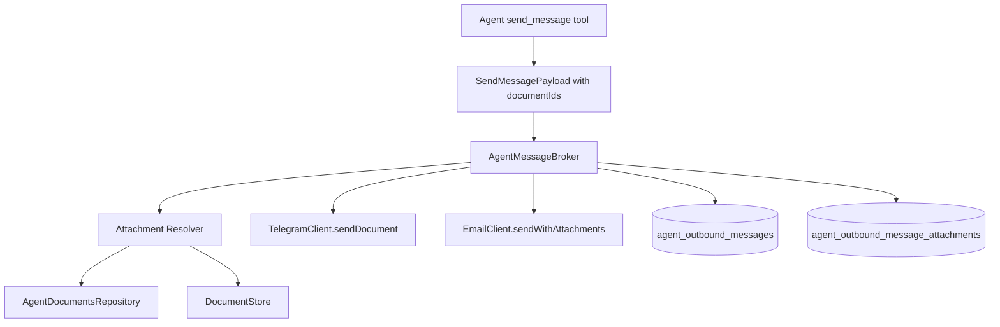

# Plan: Agent Outbound Message Attachments

**Status:** draft  
**Created:** 2026-07-13  
**Feature ID:** 056-agent-outbound-message-attachments

## Problem

Agents can currently send only text messages to users.

Current state:
- `send_message` accepts `subject`, `body`, `messageClass`, `emailDelivery`, `contextRef`
- Telegram delivery uses `sendMessage` only
- Email delivery uses SES `Simple` content only
- There is no way for an agent to attach a PDF, DOCX, or text document to an outbound Telegram message or email

This is a gap now that the platform supports inbound agent documents and shared document storage.

## Goal

Allow an agent to send a Telegram message or email with a document attachment.

V1 should support:
- existing stored documents already known to the platform
- PDF, DOCX, and plain text attachments
- Telegram document delivery
- email attachment delivery
- auditability of what was sent

V1 should not require the agent to generate raw binary payloads itself.

## Scope

### In scope

- Extend outbound agent messaging so an agent can reference one or more stored documents as attachments
- Send documents through Telegram Bot API using document-send endpoints
- Send documents through email using MIME attachments
- Reuse existing `DocumentStore` and `agent_documents` metadata where possible
- Persist attachment metadata in outbound message audit trail
- Validate attachment ownership and access at broker time

### Out of scope

- Arbitrary agent-generated binary attachments from raw bytes
- Image-specific rendering flows
- Inline preview in email clients
- Multi-part upload from the agent runtime
- General file sharing outside `send_message`

## Product Decisions

### D1: V1 attaches existing stored documents, not ad hoc binary blobs

The agent should reference documents the platform already stores.

Recommended mechanism:
- extend `send_message` with `documentIds?: string[]`
- broker resolves those IDs through platform storage and enforces ownership

This avoids:
- binary payloads crossing the runtime message bus
- unbounded memory use
- ad hoc serialization of attachments in Redis envelopes

### D2: Platform-owned delivery remains the control point

The agent asks for attachments.
The platform decides:
- whether the documents exist
- whether they belong to that agent/user context
- whether Telegram/email delivery is configured
- whether attachment count/size limits are respected

### D3: Telegram and email share the same attachment-resolution pipeline

Both delivery channels should use one broker-side resolution pipeline:
1. validate requested `documentIds`
2. load metadata from `agent_documents`
3. load blobs from `DocumentStore`
4. apply delivery-specific limits/formatting
5. send through Telegram and/or email adapters
6. persist delivery outcome

### D4: V1 should send originals, not extracted companions, unless explicitly chosen

For user-facing outbound delivery, the default should be the original file:
- `.pdf` stays `.pdf`
- `.docx` stays `.docx`
- text stays text/plain attachment

Extracted `.txt` companions are workspace/runtime conveniences, not the primary user-facing attachment by default.

### D5: V1 should cap attachment count and total size conservatively

Recommended defaults:
- max 3 attachments per outbound message
- max 10 MiB per attachment
- max 20 MiB total email payload before encoding overhead
- Telegram should follow the lower of platform cap and Bot API practical cap

These should ultimately come from operator config, but can start with explicit constants if needed.

## Current Implementation Constraints

### 1. `send_message` payload is text-only

File: `packages/domain/src/agent-protocol.ts`

`SendMessagePayloadSchema` currently contains:
- `subject`
- `body`
- `contextRef`
- `messageClass`
- `emailDelivery`

There is no attachment field.

### 2. Telegram adapter is `sendMessage`-only

File: `apps/worker/src/alerting/telegram-client.ts`

`TelegramClient` currently exposes:
- `sendAlert()`
- `sendText()`
- `setWebhook()`

It does not implement `sendDocument`.

### 3. Email adapter is `Simple`-content only

File: `apps/worker/src/alerting/ses-email-client.ts`

`SesEmailClient` currently uses `SendEmailCommand` with `Content.Simple`, which does not model file attachments.
A proper attachment flow will require raw MIME content.

### 4. Broker does not resolve documents for outbound sends

File: `apps/worker/src/agents/agent-message-broker.ts`

`handleSendMessage()` currently:
- persists outbound message row
- sends Telegram text if configured
- runs email fanout if allowed

It does not consult `AgentDocumentsRepository` or `DocumentStore`.

### 5. Outbound audit trail does not store attachment metadata

Existing outbound message persistence tracks message delivery metadata, but not attachment references.
A v1 needs explicit audit fields or a companion table.

## Proposed Architecture



## Data Model

### Option A: Companion attachment table

Recommended new table:

```ts
agent_outbound_message_attachments {
  id: text pk,
  outboundMessageId: text not null,
  documentId: text null,
  filename: text not null,
  mimeType: text not null,
  sizeBytes: integer not null,
  storeKey: text not null,
  channel: 'telegram' | 'email',
  deliveryStatus: 'pending' | 'sent' | 'failed' | 'skipped',
  deliveryRef: text | null,
  deliveryError: text | null,
  createdAt: timestamptz not null
}
```

Why a companion table:
- avoids overloading `agent_outbound_messages`
- supports per-attachment delivery outcome
- allows one message to fan out across multiple channels and attachments

### Option B: JSON column on `agent_outbound_messages`

A JSON field is faster to ship but weaker for querying and auditing.
Prefer Option A unless delivery complexity is intentionally deferred.

## Domain / Tool Contract

### Extend `SendMessagePayloadSchema`

File: `packages/domain/src/agent-protocol.ts`

Recommended addition:

```ts
documentIds: z.array(z.string().min(1)).max(3).optional(),
```

V1 behavior:
- omitted or empty: current text-only behavior
- present: broker resolves attachments and sends them where possible

### Tool description update

File: `apps/worker/src/tools/messaging.ts`

Update `send_message` tool schema and description to explain:
- `documentIds` references existing platform-stored documents
- body remains required
- email fanout remains policy-gated
- attachments are best-effort per channel

## Delivery Adapters

### Telegram

File: `apps/worker/src/alerting/telegram-client.ts`

Add:

```ts
sendDocument(params: {
  chatId: string;
  filename: string;
  mimeType: string;
  body: Buffer;
  caption?: string;
  replyMarkup?: TelegramReplyMarkup;
}): Promise<Result<TelegramSendResult, { code: string; message: string }>>
```

Implementation notes:
- use Bot API `sendDocument`
- send multipart/form-data
- body becomes file payload
- caption should use the outbound text body or a shortened summary
- likely send text first, then each attachment, or use first attachment caption + follow-up text

Recommended v1 Telegram behavior:
- if attachments present, send the text body as the caption on the first document when possible
- if multiple attachments or caption length constraints apply, send the text body separately and attach documents after

### Email

Files:
- `apps/worker/src/alerting/email-client.ts`
- `apps/worker/src/alerting/ses-email-client.ts`

Extend the provider-neutral port:

```ts
interface EmailAttachment {
  filename: string;
  contentType: string;
  body: Buffer;
}

interface EmailMessage {
  to: string;
  subject: string;
  text: string;
  html?: string;
  attachments?: EmailAttachment[];
}
```

SES implementation notes:
- switch from `Content.Simple` to raw MIME when attachments exist
- preserve current simple path for no-attachment emails
- generate `multipart/mixed` with text/plain and optional text/html alternatives

## Broker Flow

### `handleSendMessage()` changes

File: `apps/worker/src/agents/agent-message-broker.ts`

New flow:
1. load agent + active session as today
2. persist outbound message row as today
3. if `documentIds` present:
   - resolve docs via `AgentDocumentsRepository`
   - ensure docs belong to the agent or the same owner and are not deleted
   - enforce attachment count/size/type limits
   - read blobs from `DocumentStore`
   - persist pending attachment audit rows
4. Telegram delivery:
   - send text-only if no attachments
   - if attachments exist, call `sendDocument` per file and mark audit rows accordingly
5. Email fanout:
   - include attachments in email send when `emailDelivery === 'if_allowed'` and policy allows
6. log and persist partial failures without dropping the entire outbound message record

### Attachment ownership rule

Recommended v1 rule:
- the agent may only attach documents already attached to itself (`agent_documents.agentId === agent.id`)

Do not allow free attachment of unrelated artifacts or user-global documents in v1.

## Suggested Supporting Services

### `OutboundAttachmentResolver`

Recommended new worker service:

```ts
class OutboundAttachmentResolver {
  constructor(
    private readonly documentsRepo: AgentDocumentsRepository,
    private readonly documentStore: DocumentStore,
  ) {}

  async resolveForAgent(agentId: string, documentIds: string[]): Promise<Result<ResolvedAttachment[], AttachmentResolveError>>
}
```

Responsibilities:
- fetch metadata
- enforce ownership
- read blobs
- normalize into `filename`, `mimeType`, `sizeBytes`, `body`, `documentId`, `storeKey`

This keeps `AgentMessageBroker` from becoming a monolith.

## Rollout Order

1. Add DB support for outbound attachment audit (`agent_outbound_message_attachments` or equivalent)
2. Extend `SendMessagePayloadSchema` with `documentIds`
3. Update `send_message` tool schema/description
4. Add `OutboundAttachmentResolver`
5. Extend `TelegramClient` with `sendDocument`
6. Extend `EmailClient` / `SesEmailClient` with attachment support
7. Update `AgentMessageBroker.handleSendMessage()` to resolve and send attachments
8. Add tests for text-only backward compatibility
9. Add tests for Telegram attachment delivery
10. Add tests for email attachment delivery
11. Add observability and limits

## Testing Plan

### Domain / broker

- `send_message` without `documentIds` preserves current behavior
- invalid `documentIds` rejected clearly
- documents attached to a different agent are rejected
- deleted documents are rejected
- oversize or over-count attachment sets are rejected

### Telegram

- single PDF attachment sends successfully
- multiple attachments send in sequence
- text body preserved as caption or separate text message
- Telegram API failure marks attachment rows failed without losing outbound message audit

### Email

- email without attachments still uses current path
- email with one attachment produces valid MIME
- email with multiple attachments produces valid multipart/mixed
- SES failure is reported cleanly

### Integration

- agent uploads a document, then later sends it back to user
- agent sends text-only message after attachment feature lands
- partial channel failure: Telegram succeeds, email fails

## Risks

1. **Email MIME generation is the hardest part.** SES simple-send does not cover attachments; raw MIME correctness matters.
2. **Telegram UX can be clumsy for multiple files.** Caption and ordering behavior should be explicit.
3. **Attachment audit complexity can grow quickly.** Prefer a companion table early.
4. **Large files can blow delivery limits.** Limits must be enforced before attempting send.
5. **Policy ambiguity:** whether attachments should be allowed for routine messages vs alerts only.

## Open Questions

1. Should v1 allow attaching only `agent_documents`, or also published artifacts if their content is file-backed?
2. Should email attachments require `emailDelivery: 'if_allowed'`, or should attachments imply email only when explicitly requested?
3. Should Telegram send the text body as a standalone message plus attachments, or caption the first document?
4. Do we want user-visible confirmation in the UI that an agent sent attachments, or is audit-only enough for v1?

## Recommendation

Implement a narrow v1 where agents can attach previously stored agent documents by `documentId`.

That gives us:
- simple agent API surface (`documentIds` on `send_message`)
- reuse of the existing document storage pipeline
- clear ownership checks
- no binary payloads on the runtime bus
- a clean path to richer outbound file sharing later

A good v1 should support:
- Telegram `sendDocument`
- email raw MIME attachments
- per-attachment audit rows
- conservative limits
- full backward compatibility for existing text-only `send_message`
