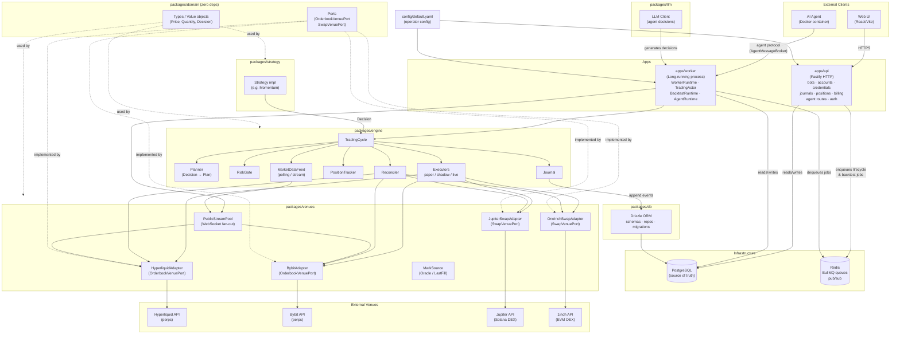

# System Architecture

## Overview

An agentic platform which offers AI agents as a service (AaaS). Also uses skills to give agents expertise. Users describe what they want to accomplish; AI agents handle execution continuously within defined constraints.

## Package Layers

| Layer | Package | Role |
|---|---|---|
| Domain | `packages/domain` | Zero-dep types, ports, value objects — the shared language |
| Engine | `packages/engine` | Pure business logic — trading cycle, risk gate, executors, reconciler |
| Venues | `packages/venues` | Venue adapters, WebSocket stream pool, mark sources |
| Strategy | `packages/strategy` | Strategy implementations emitting `Decision` objects |
| DB | `packages/db` | Drizzle ORM — schema, repos, migrations |
| Worker | `apps/worker` | Long-running runtime: actors, agent runtime, backtest runtime |
| API | `apps/api` | HTTP surface — CRUD, auth, billing; enqueues BullMQ lifecycle jobs |
| Web | `apps/web` | React/Vite frontend |

**Dependency rule:** `domain` ← `engine` ← `strategy` / `venues` / `db` ← `apps/*`

Nothing in `engine` imports from `venues` or `db`; all cross-boundary communication goes through ports defined in `domain`.
