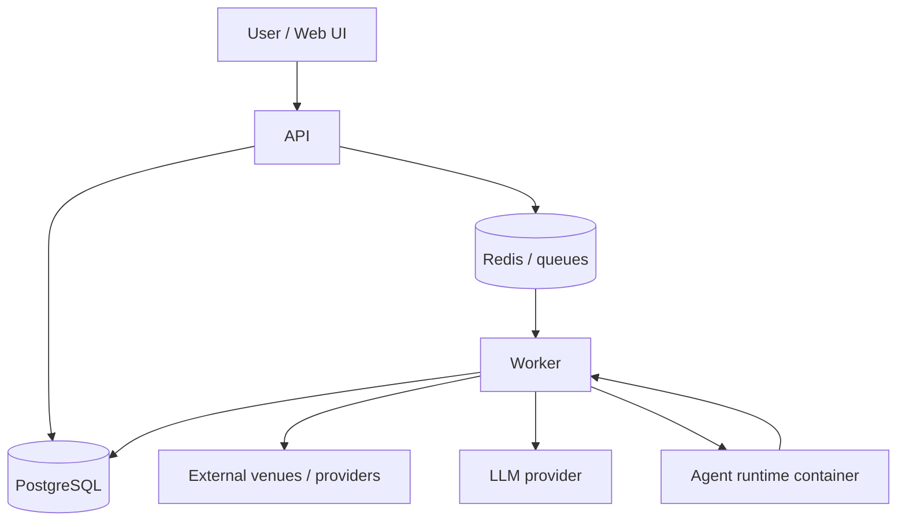

# System Architecture

## Overview

OpenAIdom offers AI agents as a service: users describe what they want, agents run continuously, and the platform handles execution, infrastructure, and persistence.

## Main Pieces

| Layer | Role |
|---|---|
| Web | User-facing UI for creating, monitoring, and managing agents |
| API | HTTP surface for auth, CRUD, billing, and orchestration requests |
| Worker | Long-running runtime that executes agents, backtests, and lifecycle jobs |
| Domain / Engine | Shared types and core execution logic |
| Venues / Strategy / LLM | Integrations that provide market access, decision-making, and execution support |
| DB / Redis | Persistence, queues, and event transport |

## How It Fits Together

1. The Web app talks to the API over HTTP.
2. The API reads and writes PostgreSQL, and places asynchronous work onto Redis-backed queues.
3. The Worker consumes queued jobs, loads state from PostgreSQL, and runs the relevant runtime.
4. The Worker uses domain logic plus venue, strategy, and LLM integrations to produce actions.
5. Agent runtimes communicate back to the Worker so the platform can observe and manage them.

## Detail Lives Elsewhere

This page is intentionally high level. Deeper runtime boundaries, agent messaging, and transport details belong in the specialized docs under [docs/tech/agents/](../agents) and the ADRs under [docs/tech/architecture/adrs/](./adrs).

Additional architecture documents:

- [Market Data Architecture](./market-data.md) — current-state source of truth for provider wiring, source selection, caching, and degradation behavior
- [Security Architecture](./security.md) — threat model, trust boundaries, defense-in-depth principles, and mitigation catalogue
