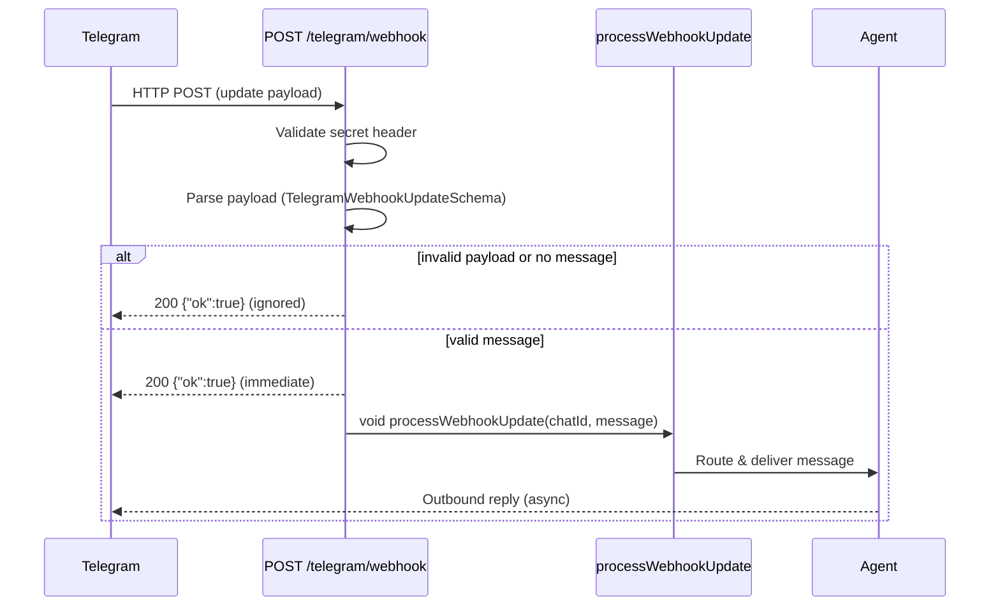

# Telegram Local Testing

How to validate inbound Telegram webhook behavior on localhost. Two testing levels are available: **tunnel** (real Telegram delivery through ngrok) and **mock** (fast local ingress without Telegram).

## Overview

Telegram requires a public HTTPS URL via `setWebhook` before it delivers updates. On localhost there is no public HTTPS endpoint, so real Telegram traffic cannot reach `POST /telegram/webhook` without a tunnel.

| Level | What it tests | Speed | Requires ngrok | Real Telegram delivery |
|---|---|---|---|---|
| **Tunnel** | Full end-to-end: registration → delivery → routing → outbound reply | Slow (manual message) | Yes | Yes |
| **Mock** | Ingress path: auth, payload parsing, command parsing, async dispatch handoff | Fast (scripted) | No | No — but outbound sends may still fire |

Use mock mode for fast ingress-path iteration (auth, schema, command parsing). Use tunnel mode when you need to validate real Telegram transport, webhook registration, or genuine payload delivery.

## Prerequisites

Both modes require:

- Docker running (`docker compose up -d` — api on port 3000 + worker)
- `curl` and `jq` installed
- `TELEGRAM_WEBHOOK_SECRET` configured in the app's runtime config (pass it via env or config YAML)
- A user linked to the target Telegram chat in DB (for routable `/to` commands)

Tunnel mode additionally requires:

- `ngrok` installed ([ngrok.com/download](https://ngrok.com/download))
- `TELEGRAM_BOT_TOKEN` in your env file

## Level 1: Tunnel Testing

Real Telegram delivery through a public HTTPS tunnel to `localhost:3000`.

### Usage

```bash
scripts/shell/tests/setup-local-telegram-webhook.sh --env-file .env.ops.dev
```

The script is a **one-shot setup helper**, not a long-running watcher. It establishes the tunnel, registers the webhook with Telegram, and exits.

### What it does

1. Loads `TELEGRAM_BOT_TOKEN` and `TELEGRAM_WEBHOOK_SECRET` from the env file.
2. Starts or reuses an `ngrok` tunnel to `localhost:3000`.
3. Reads the public HTTPS URL from ngrok's local status API (`localhost:4040/api/tunnels`).
4. Calls `deleteWebhook` then `setWebhook` on the Telegram Bot API with the tunnel URL and secret token.
5. Verifies registration via `getWebhookInfo` and confirms the URL matches.
6. Prints a warning if `TELEGRAM_WEBHOOK_URL` in your env does not match the registered tunnel URL.
7. Prints the next manual step: send a Telegram message to the bot.

Exit codes: `0` = success, `1` = failure, `2` = missing prerequisites.

### Stopping the tunnel

```bash
scripts/shell/tests/setup-local-telegram-webhook.sh --stop
```

Stops the ngrok child process started by a prior invocation (tracked via PID file at `/tmp/setup-local-telegram-webhook-ngrok.pid`).

### Caveats

**Worker restart overwrites webhook registration.** If `TELEGRAM_WEBHOOK_URL` is set in your local config (either via env or config YAML) and differs from the tunnel URL, the next worker restart will call `setWebhook` with the configured URL, overwriting your tunnel registration. To prevent this:

- Unset `TELEGRAM_WEBHOOK_URL` in local env, or
- Set it to match the tunnel URL (impractical since ngrok URLs change per session)

The setup script warns when it detects a mismatch.

**ngrok free tier limitations.** The free tier provides a single tunnel with a random subdomain that changes on restart. This is sufficient for local testing — just re-run the setup script if you restart ngrok.

**Only ngrok is supported.** `cloudflared` support is not yet implemented.

### Verification

After the script completes successfully, send a real Telegram message to the bot (e.g., `/to MyAgent check BTC price`). If the user is bound to the chat in DB, the agent should reply in Telegram.

## Level 2: Mock Testing

Fast local ingress tests that POST sample Telegram updates directly to `http://localhost:3000/telegram/webhook` — no tunnel, no Telegram Bot API involvement.

### Usage

```bash
# Single message
scripts/test-slash-commands.sh --message-text "Hello from mock" --chat-id 123456789

# Single message with custom env
scripts/test-slash-commands.sh --env-file .env.ops.dev --message-text "Hello"

# Override just the secret and chat ID
scripts/test-slash-commands.sh --webhook-secret my-secret --chat-id 123 --message-text "hi"

# Target a remote API
scripts/test-slash-commands.sh --api-base https://staging.example.com --message-text "ping"

# Negative-path: wrong secret (expect 401)
scripts/test-slash-commands.sh --message-text "test" --wrong-secret

# Full batch test suite (no --message-text)
scripts/test-slash-commands.sh
```

### What it exercises

| Path | How |
|---|---|
| Auth header | `X-Telegram-Bot-Api-Secret-Token` validated against configured `webhookSecret` |
| Payload parsing | `TelegramWebhookUpdateSchema.safeParse` on the jq-built payload |
| Command parsing | Message text extraction and slash-command detection |
| Async dispatch | `processWebhookUpdate` handoff (fire-and-forget, confirmed by secondary evidence) |

### Response interpretation

| Status | Body | Meaning |
|---|---|---|
| `200` | `{"ok":true}` | Payload accepted or intentionally ignored (e.g., non-text message). Async routing may still fail — check Telegram for the reply. |
| `401` | `{"error":"unauthorized"}` | Webhook secret mismatch. The `X-Telegram-Bot-Api-Secret-Token` header did not match the configured `webhookSecret`. |
| `501` | `{"error":"not_configured"}` | `botToken` or `webhookSecret` is missing from the app's runtime config. |

### IMPORTANT CAVEAT: Mock mode can trigger real outbound Telegram API sends

A `200` response means the payload was accepted by the ingress handler. If the message is routable to a bound chat, `processWebhookUpdate` will fire real outbound Telegram Bot API calls — the agent will reply in Telegram just as it would with a real message.

This means:

- Mock mode is **not** fully offline. It bypasses Telegram _inbound_ delivery but does not block outbound sends.
- If you send `/to MyAgent buy BTC` with a real chat ID bound to a live agent, the agent **will** attempt to trade.

To avoid unintended side effects, use a chat ID that is not bound to any agent, or point `--api-base` at a non-production environment.

### Secondary evidence for async routing

Since `POST /telegram/webhook` acknowledges immediately (see [Webhook Contract](#webhook-contract)), a `200` only confirms ingress acceptance. To verify async routing succeeded, check:

1. **Telegram app** — the bot should reply if the message routed successfully.
2. **API logs** — look for `processWebhookUpdate` warnings or errors (e.g., `"Telegram webhook async processing failed"`).
3. **Downstream state** — if the command should mutate state (e.g., `/to MyAgent buy BTC`), check the trading instance or journal for the expected side effect.

## Webhook Contract

`POST /telegram/webhook` follows an **acknowledge-immediately, process-asynchronously** pattern:



Key points:

- The HTTP response (`200`/`401`/`501`) only speaks to **ingress validation**. It does not confirm routing or delivery.
- `processWebhookUpdate` runs in a fire-and-forget promise — errors are logged as warnings, not returned to the caller.
- Telegram expects a response within a tight timeout. The async pattern prevents slow DB or agent processing from causing Telegram retries.

### Verification checklist

After receiving a `200`:

- [ ] Check Telegram for the bot's reply.
- [ ] Check API logs for `processWebhookUpdate` warnings.
- [ ] If the command targets an agent, check the agent's journal or trading state.

## Troubleshooting

### "ngrok not found"

Install ngrok: `brew install ngrok` or download from [ngrok.com/download](https://ngrok.com/download).

### "401 unauthorized"

The `X-Telegram-Bot-Api-Secret-Token` header does not match the `webhookSecret` in the app config.

- Check that `TELEGRAM_WEBHOOK_SECRET` is set in your env file.
- In mock mode, use `--webhook-secret` to match the configured value, or `--wrong-secret` to deliberately test the auth rejection path.
- In tunnel mode, the setup script reads `TELEGRAM_WEBHOOK_SECRET` from the env file and registers it with Telegram — both sides should match.

### "501 not configured"

The app's `botToken` or `webhookSecret` is missing from runtime config. Verify your config provides both values (either via operator config YAML or env vars).

### "Worker overwrote my tunnel webhook"

The worker registers the webhook on startup when `TELEGRAM_WEBHOOK_URL` is set. If that URL differs from your ngrok tunnel URL, the worker overwrites the tunnel registration.

**Fix:** Unset `TELEGRAM_WEBHOOK_URL` in your local env/config, or set it to an empty/unset value so the worker skips webhook registration. The setup script prints a warning when it detects a mismatch.

### "No response in Telegram"

Even with a `200` from the webhook endpoint, several things can prevent a reply:

- **No chat binding exists.** The Telegram chat must be linked to a user in the `user_chats` table. Check via: `SELECT * FROM user_chats WHERE chat_id = '<your-chat-id>';`
- **Agent is not running.** Check the worker logs or agent status.
- **Routing failed.** Check API logs for `processWebhookUpdate` warnings.
- **Outbound Telegram API error.** The bot may be blocked, the chat may not exist, or the Bot API may have returned an error. Check API logs for Telegram send failures.

### "ngrok tunnel not ready"

If the setup script times out waiting for ngrok:

- Ensure nothing else is using port 4040 (ngrok's status API).
- Check that `localhost:3000` is reachable (`curl http://localhost:3000/health`).
- Kill any stale ngrok processes: `pkill ngrok` then re-run the setup script.
